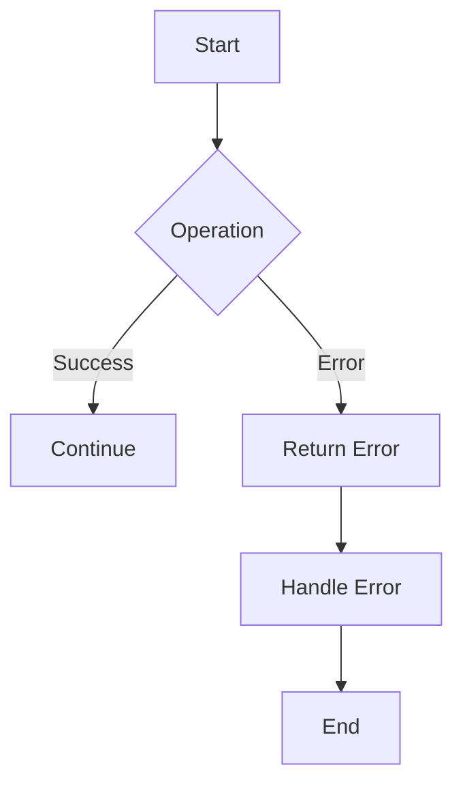

## 5.5. Error Handling Idioms

Error handling is a critical aspect of software development, and Rust provides a robust system for managing errors through its type system. In this section, we'll explore Rust's idiomatic error handling patterns, focusing on the use of `Result` and `Option`, the `?` operator, combinators, and custom error types. We'll also discuss when to use `panic!` and how to leverage external crates like `thiserror` for more sophisticated error management.

### Understanding `Result` and `Option`

Rust's approach to error handling is centered around two fundamental types: `Result` and `Option`. These types provide a way to handle errors and optional values without resorting to exceptions, which are common in other languages.

#### The `Result` Type

The `Result` type is used for functions that can return an error. It is defined as:

```rust
enum Result<T, E> {
    Ok(T),
    Err(E),
}
```

- `Ok(T)`: Represents a successful outcome, containing a value of type `T`.
- `Err(E)`: Represents an error, containing an error value of type `E`.

#### The `Option` Type

The `Option` type is used for values that may or may not be present. It is defined as:

```rust
enum Option<T> {
    Some(T),
    None,
}
```

- `Some(T)`: Represents a value of type `T`.
- `None`: Represents the absence of a value.

### Early Returns with the `?` Operator

The `?` operator is a powerful tool in Rust's error handling arsenal. It allows for early returns of errors, simplifying code that deals with multiple potential error points.

#### Using the `?` Operator

When a function returns a `Result`, you can use the `?` operator to propagate errors upwards. If the `Result` is `Ok`, the value is extracted; if it's `Err`, the error is returned from the function.

```rust
fn read_file(path: &str) -> Result<String, std::io::Error> {
    let mut file = std::fs::File::open(path)?;
    let mut contents = String::new();
    file.read_to_string(&mut contents)?;
    Ok(contents)
}
```

In this example, the `?` operator is used to handle potential errors from `File::open` and `read_to_string`, allowing the function to return early if an error occurs.

### Combinators: `map`, `and_then`, and More

Rust provides several combinators for working with `Result` and `Option`, allowing for more expressive and concise code.

#### The `map` Combinator

The `map` combinator is used to transform the `Ok` value of a `Result` or the `Some` value of an `Option`.

```rust
let result: Result<i32, _> = Ok(2);
let doubled = result.map(|x| x * 2);
```

#### The `and_then` Combinator

The `and_then` combinator is used for chaining operations that return a `Result` or `Option`.

```rust
fn parse_number(s: &str) -> Result<i32, std::num::ParseIntError> {
    s.parse::<i32>()
}

let result = parse_number("42").and_then(|n| Ok(n * 2));
```

### Creating and Using Custom Error Types

For more complex applications, defining custom error types can provide better error handling and reporting.

#### Defining Custom Error Types

You can define custom error types using enums or structs. The `thiserror` crate simplifies this process by providing a convenient macro for deriving error traits.

```rust
use thiserror::Error;

#[derive(Error, Debug)]
pub enum MyError {
    #[error("I/O error")]
    Io(#[from] std::io::Error),
    #[error("Parse error")]
    Parse(#[from] std::num::ParseIntError),
}
```

#### Using Custom Error Types

Custom error types can be used in functions that return `Result`.

```rust
fn read_and_parse_file(path: &str) -> Result<i32, MyError> {
    let contents = std::fs::read_to_string(path)?;
    let number: i32 = contents.trim().parse()?;
    Ok(number)
}
```

### Guidelines for Using `panic!`

While `Result` and `Option` are used for recoverable errors, `panic!` is used for unrecoverable errors. Use `panic!` sparingly, typically in scenarios where continuing execution would lead to incorrect behavior or data corruption.

#### When to Use `panic!`

- **Invariants**: When an invariant is violated, and the program cannot continue safely.
- **Prototypes**: During prototyping, where error handling is not yet implemented.

### Real-World Error Handling Examples

Let's look at a real-world example of error handling in a file processing application.

```rust
use std::fs::File;
use std::io::{self, Read};
use thiserror::Error;

#[derive(Error, Debug)]
pub enum FileError {
    #[error("I/O error")]
    Io(#[from] io::Error),
    #[error("File not found")]
    NotFound,
}

fn read_file(path: &str) -> Result<String, FileError> {
    let mut file = File::open(path).map_err(|e| {
        if e.kind() == io::ErrorKind::NotFound {
            FileError::NotFound
        } else {
            FileError::Io(e)
        }
    })?;
    let mut contents = String::new();
    file.read_to_string(&mut contents)?;
    Ok(contents)
}

fn main() {
    match read_file("example.txt") {
        Ok(contents) => println!("File contents: {}", contents),
        Err(e) => eprintln!("Error reading file: {}", e),
    }
}
```

### Try It Yourself

Experiment with the code examples by modifying the file paths or introducing intentional errors to see how the error handling behaves. Try creating your own custom error types and using combinators to chain operations.

### Visualizing Rust's Error Handling Flow

To better understand the flow of error handling in Rust, let's visualize it using a flowchart.



This flowchart represents the typical flow of operations in Rust, where each operation can either succeed and continue or fail and return an error.

### References and Further Reading

- [Rust Error Handling](https://doc.rust-lang.org/book/ch09-00-error-handling.html)
- [thiserror Crate](https://crates.io/crates/thiserror)
- [Rust Combinators](https://doc.rust-lang.org/std/result/enum.Result.html#method.map)

### Knowledge Check

- What are the primary types used for error handling in Rust?
- How does the `?` operator simplify error handling?
- When should you use `panic!` instead of `Result` or `Option`?
- How can custom error types improve error handling in Rust?

### Embrace the Journey

Remember, mastering error handling in Rust is a journey. As you continue to explore and experiment, you'll develop a deeper understanding of how to write robust and maintainable code. Keep pushing the boundaries, stay curious, and enjoy the process!

## Quiz Time!



### What is the primary purpose of the `Result` type in Rust?

- [x] To handle operations that can succeed or fail
- [ ] To represent optional values
- [ ] To manage memory allocation
- [ ] To define custom data structures

> **Explanation:** The `Result` type is used to handle operations that can either succeed (returning an `Ok` value) or fail (returning an `Err` value).

### How does the `?` operator help in error handling?

- [x] It propagates errors upwards, simplifying code
- [ ] It suppresses errors
- [ ] It converts errors into warnings
- [ ] It logs errors to a file

> **Explanation:** The `?` operator is used to propagate errors upwards, allowing functions to return early if an error occurs, thus simplifying error handling code.

### Which crate is commonly used for creating custom error types in Rust?

- [x] thiserror
- [ ] serde
- [ ] tokio
- [ ] clap

> **Explanation:** The `thiserror` crate is commonly used for creating custom error types in Rust, providing a convenient macro for deriving error traits.

### When should you use `panic!` in Rust?

- [x] When an invariant is violated and the program cannot continue safely
- [ ] For all recoverable errors
- [ ] To handle optional values
- [ ] To manage memory allocation

> **Explanation:** `panic!` should be used when an invariant is violated and the program cannot continue safely, indicating an unrecoverable error.

### What does the `map` combinator do?

- [x] Transforms the `Ok` value of a `Result`
- [ ] Transforms the `Err` value of a `Result`
- [ ] Converts a `Result` into an `Option`
- [ ] Logs errors to a file

> **Explanation:** The `map` combinator is used to transform the `Ok` value of a `Result`, applying a function to it.

### What is the purpose of the `Option` type in Rust?

- [x] To represent values that may or may not be present
- [ ] To handle operations that can succeed or fail
- [ ] To manage memory allocation
- [ ] To define custom data structures

> **Explanation:** The `Option` type is used to represent values that may or may not be present, with `Some` indicating a value and `None` indicating the absence of a value.

### How can you chain operations that return a `Result`?

- [x] Using the `and_then` combinator
- [ ] Using the `or_else` combinator
- [ ] Using the `unwrap` method
- [ ] Using the `expect` method

> **Explanation:** The `and_then` combinator is used to chain operations that return a `Result`, allowing for sequential processing of operations that may fail.

### What is a common use case for the `panic!` macro?

- [x] Prototyping where error handling is not yet implemented
- [ ] Handling optional values
- [ ] Managing memory allocation
- [ ] Defining custom data structures

> **Explanation:** During prototyping, `panic!` can be used where error handling is not yet implemented, allowing for quick development without detailed error management.

### What is the benefit of using custom error types?

- [x] They provide better error handling and reporting
- [ ] They suppress errors
- [ ] They convert errors into warnings
- [ ] They log errors to a file

> **Explanation:** Custom error types provide better error handling and reporting by allowing developers to define specific error cases and messages.

### True or False: The `?` operator can only be used with the `Result` type.

- [ ] True
- [x] False

> **Explanation:** The `?` operator can be used with both `Result` and `Option` types, propagating errors or the absence of values upwards.


