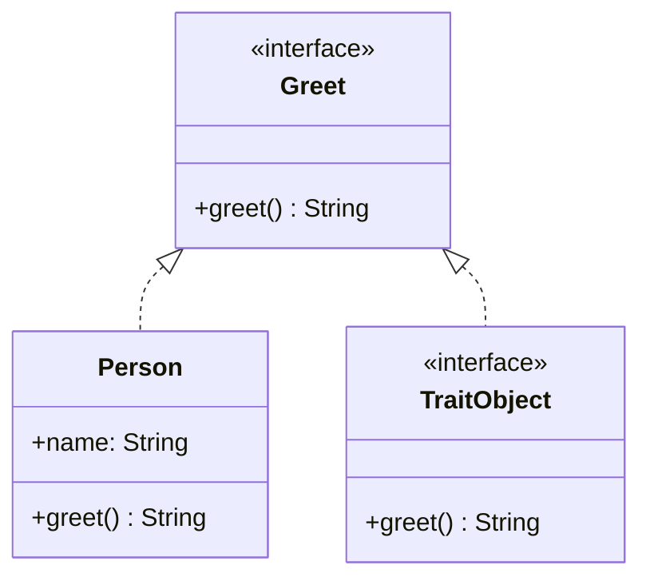

## 5.6. Implementing Traits and Trait Objects

In Rust, traits and trait objects are fundamental concepts that enable polymorphism, a key feature in many programming languages. This section will guide you through the process of defining and implementing traits, and how to use trait objects to achieve dynamic dispatch. We'll explore the differences between using trait objects and generics, and discuss performance considerations and limitations.

### Understanding Traits in Rust

Traits in Rust are akin to interfaces in other programming languages. They define a set of methods that types can implement. Traits are a powerful way to define shared behavior across different types without requiring inheritance.

#### Defining Traits

To define a trait in Rust, use the `trait` keyword followed by the trait name and a block containing method signatures. Here's a simple example:

```rust
trait Greet {
    fn greet(&self) -> String;
}
```

In this example, the `Greet` trait defines a single method `greet`, which returns a `String`. Any type implementing this trait must provide a concrete implementation of this method.

#### Implementing Traits

To implement a trait for a specific type, use the `impl` keyword followed by the trait name for the type. Here's how you can implement the `Greet` trait for a `struct`:

```rust
struct Person {
    name: String,
}

impl Greet for Person {
    fn greet(&self) -> String {
        format!("Hello, my name is {}!", self.name)
    }
}
```

In this example, the `Person` struct implements the `Greet` trait by providing a specific implementation of the `greet` method.

### Trait Objects and Dynamic Dispatch

Trait objects allow for dynamic dispatch, enabling polymorphism in Rust. They are created using the `dyn` keyword followed by a trait. Unlike static dispatch, where the method to call is determined at compile time, dynamic dispatch determines the method at runtime.

#### Creating Trait Objects

To create a trait object, you need a reference or a smart pointer to a type implementing the trait. Here's an example using a trait object:

```rust
fn greet_person(person: &dyn Greet) {
    println!("{}", person.greet());
}

let person = Person { name: String::from("Alice") };
greet_person(&person);
```

In this example, `greet_person` takes a reference to a `dyn Greet`, allowing it to accept any type implementing the `Greet` trait.

#### When to Use Trait Objects vs. Generics

Trait objects and generics both enable polymorphism, but they have different use cases:

- **Trait Objects**: Use when you need dynamic dispatch and don't know the concrete type at compile time. They are useful when you want to store different types in a collection or pass them to a function.
- **Generics**: Use when you want static dispatch and know the concrete type at compile time. Generics are more performant because they avoid the overhead of dynamic dispatch.

Here's a comparison of using trait objects and generics:

```rust
// Using Generics
fn greet_generic<T: Greet>(person: &T) {
    println!("{}", person.greet());
}

// Using Trait Objects
fn greet_trait_object(person: &dyn Greet) {
    println!("{}", person.greet());
}
```

### Performance Considerations

Trait objects introduce a level of indirection due to dynamic dispatch, which can impact performance. The trade-off is flexibility, as they allow for more dynamic behavior. When performance is critical, prefer generics for static dispatch.

### Limitations of Trait Objects

Trait objects have some limitations:

- **No Sized Types**: Trait objects are unsized, meaning they cannot be used directly in places where a sized type is required.
- **No Associated Types or Const Generics**: Trait objects cannot use associated types or const generics.
- **Limited Method Visibility**: Only methods defined in the trait can be called on a trait object.

### Visualizing Trait Objects and Dynamic Dispatch

To better understand how trait objects work, let's visualize the relationship between traits, types, and trait objects.



In this diagram, `Greet` is a trait, `Person` is a type implementing `Greet`, and `TraitObject` represents the trait object that can dynamically dispatch the `greet` method.

### Try It Yourself

Experiment with the code examples provided. Try implementing additional methods in the `Greet` trait or create new types that implement the trait. Consider using both trait objects and generics to see the differences in behavior and performance.

### Key Takeaways

- **Traits** define shared behavior across types.
- **Trait Objects** enable dynamic dispatch, allowing for polymorphism.
- **Generics** provide static dispatch, offering better performance.
- **Performance** considerations are crucial when deciding between trait objects and generics.
- **Limitations** of trait objects include unsized types and restricted method visibility.

### Further Reading

For more information on traits and trait objects, consider exploring the following resources:

- [Rust Book - Traits](https://doc.rust-lang.org/book/ch10-02-traits.html)
- [Rust Reference - Trait Objects](https://doc.rust-lang.org/reference/types/trait-object.html)

## Quiz Time!



### What is a trait in Rust?

- [x] A way to define shared behavior across types
- [ ] A type of struct
- [ ] A function in Rust
- [ ] A module in Rust

> **Explanation:** Traits in Rust are used to define shared behavior across different types, similar to interfaces in other languages.

### How do you create a trait object in Rust?

- [x] By using the `dyn` keyword followed by a trait
- [ ] By using the `impl` keyword
- [ ] By using the `struct` keyword
- [ ] By using the `enum` keyword

> **Explanation:** Trait objects are created using the `dyn` keyword followed by a trait, allowing for dynamic dispatch.

### When should you use generics over trait objects?

- [x] When you want static dispatch and know the concrete type at compile time
- [ ] When you need dynamic dispatch
- [ ] When you want to store different types in a collection
- [ ] When you want to pass different types to a function

> **Explanation:** Generics should be used when you want static dispatch and know the concrete type at compile time, as they offer better performance.

### What is a limitation of trait objects?

- [x] They cannot use associated types or const generics
- [ ] They cannot be used in functions
- [ ] They cannot be implemented for structs
- [ ] They cannot be used with enums

> **Explanation:** Trait objects cannot use associated types or const generics, which is a limitation compared to generics.

### What is dynamic dispatch?

- [x] Determining the method to call at runtime
- [ ] Determining the method to call at compile time
- [ ] A way to define shared behavior across types
- [ ] A type of struct in Rust

> **Explanation:** Dynamic dispatch refers to determining the method to call at runtime, which is enabled by trait objects.

### Which keyword is used to define a trait in Rust?

- [x] `trait`
- [ ] `impl`
- [ ] `struct`
- [ ] `enum`

> **Explanation:** The `trait` keyword is used to define a trait in Rust.

### What is the main advantage of using trait objects?

- [x] They allow for dynamic dispatch and polymorphism
- [ ] They provide better performance than generics
- [ ] They are easier to implement than structs
- [ ] They allow for static dispatch

> **Explanation:** The main advantage of trait objects is that they allow for dynamic dispatch and polymorphism.

### Can trait objects be used with sized types?

- [ ] Yes
- [x] No

> **Explanation:** Trait objects are unsized, meaning they cannot be used directly in places where a sized type is required.

### What is the purpose of the `impl` keyword in Rust?

- [x] To implement a trait for a specific type
- [ ] To define a trait
- [ ] To create a struct
- [ ] To create an enum

> **Explanation:** The `impl` keyword is used to implement a trait for a specific type in Rust.

### True or False: Trait objects can use associated types.

- [ ] True
- [x] False

> **Explanation:** Trait objects cannot use associated types, which is a limitation compared to generics.



Remember, mastering traits and trait objects is a journey. Keep experimenting, stay curious, and enjoy the process of learning Rust's powerful type system!
