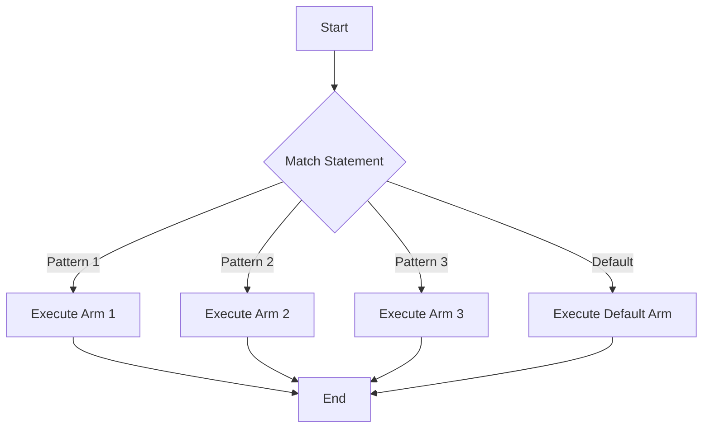

## 5.8. Advanced Pattern Matching Techniques

Pattern matching in Rust is a powerful feature that allows developers to write concise and expressive code. It is a cornerstone of idiomatic Rust, enabling developers to handle complex data structures and control flow with ease. In this section, we will delve into advanced pattern matching techniques, exploring how they can simplify code and enhance readability.

### Introduction to Pattern Matching

Before diving into advanced techniques, let's review the basics of pattern matching in Rust. The `match` statement is the primary tool for pattern matching, allowing you to compare a value against a series of patterns and execute code based on which pattern matches.

```rust
fn main() {
    let number = 7;

    match number {
        1 => println!("One"),
        2 | 3 | 5 | 7 | 11 => println!("This is a prime number"),
        13..=19 => println!("A teen number"),
        _ => println!("Something else"),
    }
}
```

In this example, the `match` statement checks the value of `number` against several patterns. The `|` operator allows for matching multiple patterns, while the `..=` syntax is used for range matching. The `_` pattern acts as a catch-all, matching any value not covered by previous patterns.

### Advanced Pattern Matching Techniques

#### Pattern Guards

Pattern guards provide additional conditions for a pattern to match. They are specified using the `if` keyword after a pattern.

```rust
fn main() {
    let number = Some(4);

    match number {
        Some(x) if x < 5 => println!("Less than five: {}", x),
        Some(x) => println!("Greater than or equal to five: {}", x),
        None => println!("No value"),
    }
}
```

In this example, the pattern `Some(x) if x < 5` matches only if the value inside the `Some` is less than 5. Pattern guards are useful for adding complex conditions to your match arms.

#### Bindings

Bindings allow you to capture matched values for use within the match arm. This is done using the `@` syntax.

```rust
fn main() {
    let message = Some("Hello");

    match message {
        Some(m @ "Hello") => println!("Greeting: {}", m),
        Some(m) => println!("Other message: {}", m),
        None => println!("No message"),
    }
}
```

Here, `m @ "Hello"` binds the value to `m` if it matches "Hello". This allows you to use the matched value within the match arm.

#### Nested Patterns

Nested patterns allow you to match complex data structures by combining multiple patterns.

```rust
struct Point {
    x: i32,
    y: i32,
}

fn main() {
    let point = Point { x: 0, y: 7 };

    match point {
        Point { x: 0, y } => println!("On the y-axis at {}", y),
        Point { x, y: 0 } => println!("On the x-axis at {}", x),
        Point { x, y } => println!("At ({}, {})", x, y),
    }
}
```

In this example, we match a `Point` struct using nested patterns to destructure its fields. This technique is particularly useful for handling complex data structures.

### Control Flow with `if let` and `while let`

#### `if let`

The `if let` construct is a more concise way to handle a single pattern match, especially when you only care about one specific pattern.

```rust
fn main() {
    let favorite_color: Option<&str> = Some("blue");

    if let Some(color) = favorite_color {
        println!("Your favorite color is {}", color);
    }
}
```

Here, `if let` is used to match the `Some` variant of an `Option`, allowing you to execute code only when the pattern matches.

#### `while let`

The `while let` construct is similar to `if let`, but it repeatedly matches a pattern in a loop until the pattern no longer matches.

```rust
fn main() {
    let mut stack = vec![1, 2, 3];

    while let Some(top) = stack.pop() {
        println!("{}", top);
    }
}
```

In this example, `while let` is used to pop elements from a vector until it is empty.

### The `matches!` Macro

The `matches!` macro is a convenient way to check if a value matches a pattern, returning a boolean result.

```rust
fn main() {
    let number = 4;

    if matches!(number, 1 | 2 | 3 | 4 | 5) {
        println!("The number is between 1 and 5");
    }
}
```

This macro simplifies pattern matching when you only need to check for a match without executing code for each pattern.

### Real-World Use Cases

Advanced pattern matching techniques are particularly effective in scenarios involving complex data structures, such as parsing data formats, handling nested configurations, or implementing interpreters for domain-specific languages.

For instance, consider a configuration parser that needs to handle various nested structures. Using nested patterns and guards, you can elegantly destructure and validate the configuration in a single `match` statement.

### Visualizing Pattern Matching

To better understand how pattern matching works, let's visualize the flow of a `match` statement using a flowchart.



This flowchart illustrates how a `match` statement evaluates each pattern in sequence, executing the corresponding arm when a match is found.

### Try It Yourself

Experiment with the code examples provided in this section. Try modifying the patterns, adding guards, or using different data structures. This hands-on approach will deepen your understanding of advanced pattern matching techniques.

### Key Takeaways

- Pattern matching in Rust is a powerful tool for handling complex data structures and control flow.
- Advanced techniques like pattern guards, bindings, and nested patterns enhance the expressiveness of your code.
- Constructs like `if let`, `while let`, and the `matches!` macro provide concise alternatives for specific pattern matching scenarios.
- Real-world applications of advanced pattern matching include parsing, configuration handling, and implementing interpreters.

### References and Further Reading

- [Rust Documentation on Pattern Matching](https://doc.rust-lang.org/book/ch18-00-patterns.html)
- [Rust by Example: Pattern Matching](https://doc.rust-lang.org/rust-by-example/flow_control/match.html)
- [The Rust Programming Language: Patterns](https://doc.rust-lang.org/book/ch18-00-patterns.html)

## Quiz Time!



### What is a pattern guard in Rust?

- [x] A condition added to a pattern to refine its matching criteria
- [ ] A way to bind values in a pattern
- [ ] A method to match multiple patterns at once
- [ ] A feature to handle default cases in pattern matching

> **Explanation:** A pattern guard is a condition added to a pattern to refine its matching criteria, using the `if` keyword.

### How do you bind a value in a pattern match?

- [x] Using the `@` syntax
- [ ] Using the `&` syntax
- [ ] Using the `*` syntax
- [ ] Using the `#` syntax

> **Explanation:** The `@` syntax is used to bind a value in a pattern match, allowing you to capture and use the matched value.

### What does the `matches!` macro return?

- [x] A boolean indicating if the pattern matches
- [ ] The matched value
- [ ] The index of the matched pattern
- [ ] An error if the pattern does not match

> **Explanation:** The `matches!` macro returns a boolean indicating whether the pattern matches the value.

### Which construct is used for concise single-pattern matching?

- [x] `if let`
- [ ] `while let`
- [ ] `match`
- [ ] `for`

> **Explanation:** `if let` is used for concise single-pattern matching when you only care about one specific pattern.

### What is the purpose of nested patterns?

- [x] To match complex data structures by combining multiple patterns
- [ ] To handle default cases in pattern matching
- [ ] To bind values in a pattern
- [ ] To add conditions to a pattern

> **Explanation:** Nested patterns allow you to match complex data structures by combining multiple patterns.

### How can you repeatedly match a pattern in a loop?

- [x] Using `while let`
- [ ] Using `if let`
- [ ] Using `match`
- [ ] Using `loop`

> **Explanation:** `while let` is used to repeatedly match a pattern in a loop until the pattern no longer matches.

### What is the `_` pattern used for?

- [x] To match any value not covered by previous patterns
- [ ] To bind a value in a pattern
- [ ] To add a condition to a pattern
- [ ] To match multiple patterns at once

> **Explanation:** The `_` pattern acts as a catch-all, matching any value not covered by previous patterns.

### Which of the following is an example of a pattern guard?

- [x] `Some(x) if x < 5`
- [ ] `Some(x) @ "Hello"`
- [ ] `Point { x: 0, y }`
- [ ] `matches!(number, 1 | 2 | 3)`

> **Explanation:** `Some(x) if x < 5` is an example of a pattern guard, where the condition `x < 5` refines the match.

### What is the benefit of using the `matches!` macro?

- [x] It provides a concise way to check if a value matches a pattern
- [ ] It allows for binding values in a pattern
- [ ] It simplifies nested pattern matching
- [ ] It adds conditions to a pattern

> **Explanation:** The `matches!` macro provides a concise way to check if a value matches a pattern, returning a boolean result.

### True or False: Pattern matching can only be used with primitive data types.

- [ ] True
- [x] False

> **Explanation:** False. Pattern matching in Rust can be used with complex data structures, such as structs and enums, not just primitive data types.



Remember, mastering pattern matching in Rust is a journey. Keep experimenting, stay curious, and enjoy the process of writing more expressive and efficient code!
