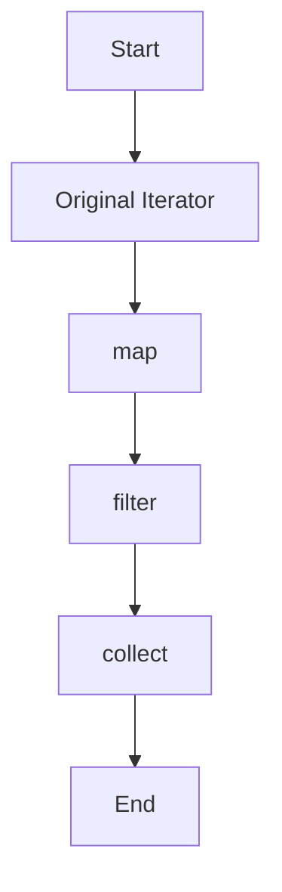

## 5.9. Implementing Iterators and the `Iterator` Trait

Iterators are a fundamental concept in Rust, providing a powerful and flexible way to process sequences of data. By implementing the `Iterator` trait, you can create custom iterators that integrate seamlessly with Rust's iterator adapters and methods, enabling functional-style data processing. In this section, we will explore the `Iterator` trait, demonstrate how to implement it for custom types, and introduce common iterator adapters like `map`, `filter`, and `collect`.

### Understanding the `Iterator` Trait

The `Iterator` trait in Rust is a core component of the language's standard library, designed to provide a consistent interface for iterating over collections. It defines a single required method, `next`, which returns an `Option` type. This method is responsible for yielding elements one at a time, returning `Some(item)` for each element and `None` when the iteration is complete.

```rust
pub trait Iterator {
    type Item;
    fn next(&mut self) -> Option<Self::Item>;
    // Additional methods provided by default
}
```

#### Importance of the `Iterator` Trait

The `Iterator` trait is crucial for several reasons:

- **Consistency**: It provides a uniform interface for iterating over various data structures.
- **Flexibility**: It allows for the creation of custom iterators tailored to specific needs.
- **Integration**: It enables the use of iterator adapters and methods, facilitating functional-style programming.

### Implementing the `Iterator` Trait for Custom Types

To implement the `Iterator` trait for a custom type, you need to define the `Item` type and implement the `next` method. Let's start with a simple example: a counter that yields numbers from 1 to 5.

```rust
struct Counter {
    count: u32,
}

impl Counter {
    fn new() -> Counter {
        Counter { count: 0 }
    }
}

impl Iterator for Counter {
    type Item = u32;

    fn next(&mut self) -> Option<Self::Item> {
        self.count += 1;
        if self.count <= 5 {
            Some(self.count)
        } else {
            None
        }
    }
}

fn main() {
    let mut counter = Counter::new();
    while let Some(number) = counter.next() {
        println!("{}", number);
    }
}
```

In this example, the `Counter` struct maintains a count, and the `next` method increments the count and returns it until it exceeds 5, at which point it returns `None`.

### Creating Complex Iterators

Custom iterators can be more complex, involving additional logic or state. Consider a Fibonacci sequence iterator, which generates an infinite sequence of Fibonacci numbers.

```rust
struct Fibonacci {
    curr: u32,
    next: u32,
}

impl Fibonacci {
    fn new() -> Fibonacci {
        Fibonacci { curr: 0, next: 1 }
    }
}

impl Iterator for Fibonacci {
    type Item = u32;

    fn next(&mut self) -> Option<Self::Item> {
        let new_next = self.curr + self.next;
        self.curr = self.next;
        self.next = new_next;
        Some(self.curr)
    }
}

fn main() {
    let fibonacci = Fibonacci::new();
    for number in fibonacci.take(10) {
        println!("{}", number);
    }
}
```

Here, the `Fibonacci` iterator maintains two state variables, `curr` and `next`, to generate the sequence. The `take` method is used to limit the output to the first 10 numbers.

### Common Iterator Adapters

Rust's standard library provides a variety of iterator adapters that transform or filter the elements of an iterator. These adapters enable functional-style programming by allowing you to chain operations in a concise and expressive manner.

#### The `map` Adapter

The `map` adapter applies a function to each element of an iterator, producing a new iterator with the transformed elements.

```rust
fn main() {
    let numbers = vec![1, 2, 3, 4, 5];
    let doubled: Vec<_> = numbers.iter().map(|x| x * 2).collect();
    println!("{:?}", doubled);
}
```

In this example, `map` is used to double each number in the vector.

#### The `filter` Adapter

The `filter` adapter creates a new iterator that only includes elements satisfying a specified predicate.

```rust
fn main() {
    let numbers = vec![1, 2, 3, 4, 5];
    let even_numbers: Vec<_> = numbers.iter().filter(|&&x| x % 2 == 0).collect();
    println!("{:?}", even_numbers);
}
```

Here, `filter` is used to select only the even numbers from the vector.

#### The `collect` Method

The `collect` method consumes an iterator and collects its elements into a collection, such as a vector or a hash map.

```rust
fn main() {
    let numbers = vec![1, 2, 3, 4, 5];
    let squares: Vec<_> = numbers.iter().map(|x| x * x).collect();
    println!("{:?}", squares);
}
```

In this example, `collect` is used to gather the squared numbers into a vector.

### Benefits of Iterators in Functional-Style Code

Iterators play a crucial role in writing functional-style code in Rust. They promote immutability and composability, allowing you to build complex data processing pipelines with minimal boilerplate. By chaining iterator adapters, you can express complex transformations in a clear and concise manner.

### Visualizing Iterator Flow

To better understand how iterators work, let's visualize the flow of data through a series of iterator adapters.



This diagram illustrates the flow of data through a sequence of iterator adapters, starting with an original iterator, applying a `map` transformation, filtering elements, and finally collecting the results.

### Try It Yourself

Experiment with the code examples provided in this section. Try modifying the `Counter` or `Fibonacci` iterators to change their behavior. Use different iterator adapters to transform and filter data in new ways. By experimenting with iterators, you'll gain a deeper understanding of their power and flexibility.

### Knowledge Check

- What is the purpose of the `Iterator` trait in Rust?
- How do you implement the `Iterator` trait for a custom type?
- What is the role of the `next` method in an iterator?
- How can you use the `map` adapter to transform data?
- What is the difference between `filter` and `map`?

### Summary

In this section, we've explored the `Iterator` trait in Rust and demonstrated how to implement it for custom types. We've introduced common iterator adapters like `map`, `filter`, and `collect`, highlighting their role in functional-style programming. By leveraging iterators, you can write concise and expressive code that processes data efficiently.

Remember, this is just the beginning. As you progress, you'll discover more advanced iterator patterns and techniques. Keep experimenting, stay curious, and enjoy the journey!

## Quiz Time!



### What is the primary method required by the `Iterator` trait?

- [x] `next`
- [ ] `map`
- [ ] `filter`
- [ ] `collect`

> **Explanation:** The `next` method is the primary method required by the `Iterator` trait, responsible for yielding elements one at a time.

### How do you define the type of elements an iterator will yield?

- [x] By specifying the `Item` associated type in the `Iterator` trait implementation.
- [ ] By using a generic type parameter.
- [ ] By defining a method in the iterator.
- [ ] By using a macro.

> **Explanation:** The `Item` associated type in the `Iterator` trait implementation defines the type of elements the iterator will yield.

### Which iterator adapter applies a function to each element of an iterator?

- [x] `map`
- [ ] `filter`
- [ ] `collect`
- [ ] `take`

> **Explanation:** The `map` adapter applies a function to each element of an iterator, producing a new iterator with the transformed elements.

### What does the `filter` adapter do?

- [x] It creates a new iterator that only includes elements satisfying a specified predicate.
- [ ] It applies a function to each element of an iterator.
- [ ] It collects elements into a collection.
- [ ] It limits the number of elements in an iterator.

> **Explanation:** The `filter` adapter creates a new iterator that only includes elements satisfying a specified predicate.

### How can you collect elements from an iterator into a collection?

- [x] By using the `collect` method.
- [ ] By using the `map` method.
- [ ] By using the `filter` method.
- [ ] By using the `next` method.

> **Explanation:** The `collect` method consumes an iterator and collects its elements into a collection, such as a vector or a hash map.

### What is the purpose of the `take` method in an iterator?

- [x] To limit the number of elements in an iterator.
- [ ] To apply a function to each element.
- [ ] To filter elements based on a predicate.
- [ ] To collect elements into a collection.

> **Explanation:** The `take` method is used to limit the number of elements in an iterator.

### Which of the following is a benefit of using iterators in Rust?

- [x] They promote immutability and composability.
- [ ] They require more boilerplate code.
- [ ] They are less efficient than loops.
- [ ] They are only used for collections.

> **Explanation:** Iterators promote immutability and composability, allowing you to build complex data processing pipelines with minimal boilerplate.

### What does the `next` method return when the iteration is complete?

- [x] `None`
- [ ] `Some(item)`
- [ ] `Err`
- [ ] `Ok`

> **Explanation:** The `next` method returns `None` when the iteration is complete.

### How can you create an infinite iterator in Rust?

- [x] By implementing the `next` method to always return `Some(item)`.
- [ ] By using the `collect` method.
- [ ] By using the `filter` method.
- [ ] By using the `map` method.

> **Explanation:** An infinite iterator can be created by implementing the `next` method to always return `Some(item)`.

### True or False: The `Iterator` trait can only be implemented for collections.

- [ ] True
- [x] False

> **Explanation:** The `Iterator` trait can be implemented for any type, not just collections, allowing for custom iteration logic.




