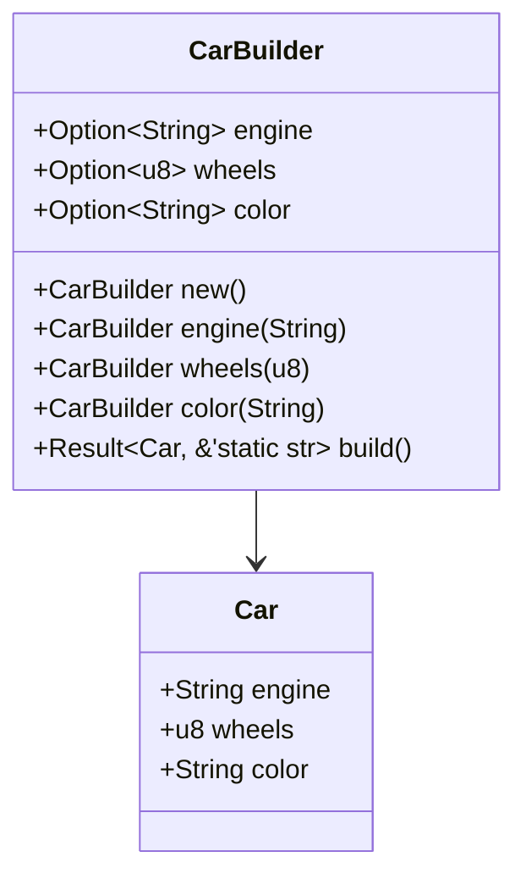
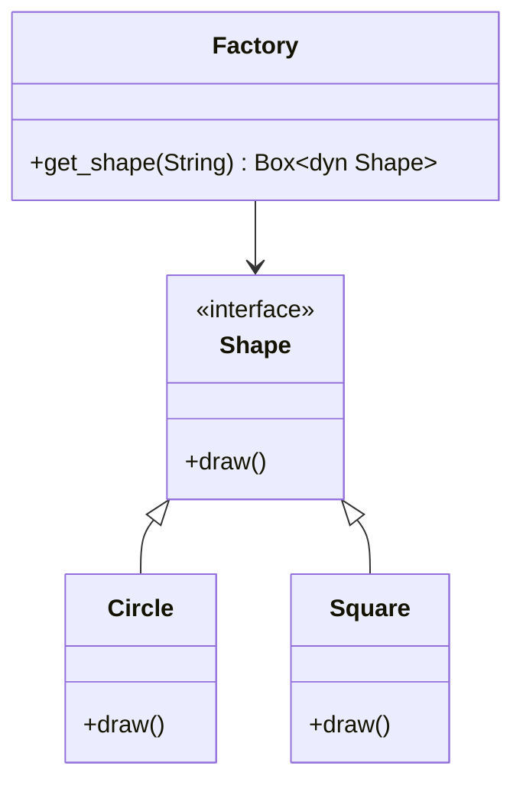

## 6.1. Overview of Creational Patterns in Rust

In the realm of software design, creational design patterns play a pivotal role in managing object creation mechanisms. These patterns provide solutions to instantiate objects in a manner suitable to the situation, often involving complex creation logic that is abstracted away from the client code. In Rust, the implementation of creational patterns is influenced by its unique features such as ownership, borrowing, and traits. This section provides an in-depth overview of creational design patterns, their importance in software design, and how Rust's features shape their implementation.

### What Are Creational Design Patterns?

Creational design patterns are a category of design patterns that deal with object creation mechanisms. They aim to create objects in a way that is suitable for the situation, often providing flexibility and decoupling in the code. The primary goal is to abstract the instantiation process, allowing the system to be more independent of how its objects are created, composed, and represented.

#### Key Creational Patterns

1. **Builder Pattern**: Facilitates the construction of complex objects step by step.
2. **Factory Method Pattern**: Defines an interface for creating an object, but lets subclasses alter the type of objects that will be created.
3. **Abstract Factory Pattern**: Provides an interface for creating families of related or dependent objects without specifying their concrete classes.
4. **Singleton Pattern**: Ensures a class has only one instance and provides a global point of access to it.
5. **Prototype Pattern**: Creates new objects by copying an existing object, known as the prototype.
6. **Object Pool Pattern**: Manages a pool of reusable objects to minimize the cost of object creation.

### Importance of Creational Patterns in Software Design

Creational patterns are crucial in software design for several reasons:

- **Encapsulation of Creation Logic**: They encapsulate the logic involved in object creation, making the codebase cleaner and more maintainable.
- **Flexibility and Reusability**: By abstracting the instantiation process, they allow for greater flexibility and reusability of code.
- **Decoupling**: They help decouple the client code from the specifics of object creation, promoting a more modular and scalable architecture.
- **Efficiency**: Some patterns, like the Object Pool, can significantly improve performance by reusing objects instead of creating new ones.

### Rust's Unique Features and Their Influence on Creational Patterns

Rust's unique features, such as ownership, borrowing, and traits, significantly influence the implementation of creational patterns. Let's explore how these features shape the design and implementation of these patterns.

#### Ownership and Borrowing

Rust's ownership model ensures memory safety without a garbage collector. This model influences how objects are created and managed:

- **Ownership**: In Rust, each value has a single owner, and when the owner goes out of scope, the value is dropped. This affects how objects are instantiated and managed, particularly in patterns like Singleton, where a single instance must be maintained.
- **Borrowing**: Rust allows references to data without transferring ownership, which is crucial in patterns like Builder, where multiple steps may need to access and modify the object being constructed.

#### Traits and Trait Objects

Traits in Rust provide a way to define shared behavior across different types, similar to interfaces in other languages:

- **Traits**: They allow for polymorphism, enabling patterns like Factory Method and Abstract Factory to define interfaces for object creation.
- **Trait Objects**: These enable dynamic dispatch, allowing for more flexible and extensible designs in creational patterns.

### Implementing Creational Patterns in Rust

Let's delve into how some of these patterns can be implemented in Rust, considering its unique features.

#### Builder Pattern

The Builder pattern is particularly useful in Rust for constructing complex objects. It allows for step-by-step construction and can leverage Rust's ownership and borrowing to ensure safety and correctness.

```rust
struct Car {
    engine: String,
    wheels: u8,
    color: String,
}

struct CarBuilder {
    engine: Option<String>,
    wheels: Option<u8>,
    color: Option<String>,
}

impl CarBuilder {
    fn new() -> Self {
        CarBuilder {
            engine: None,
            wheels: None,
            color: None,
        }
    }

    fn engine(mut self, engine: &str) -> Self {
        self.engine = Some(engine.to_string());
        self
    }

    fn wheels(mut self, wheels: u8) -> Self {
        self.wheels = Some(wheels);
        self
    }

    fn color(mut self, color: &str) -> Self {
        self.color = Some(color.to_string());
        self
    }

    fn build(self) -> Result<Car, &'static str> {
        if self.engine.is_none() || self.wheels.is_none() || self.color.is_none() {
            return Err("Missing fields");
        }
        Ok(Car {
            engine: self.engine.unwrap(),
            wheels: self.wheels.unwrap(),
            color: self.color.unwrap(),
        })
    }
}

fn main() {
    let car = CarBuilder::new()
        .engine("V8")
        .wheels(4)
        .color("Red")
        .build();

    match car {
        Ok(car) => println!("Car built: {} engine, {} wheels, {} color", car.engine, car.wheels, car.color),
        Err(e) => println!("Failed to build car: {}", e),
    }
}
```

**Key Points**:
- The `CarBuilder` struct uses optional fields to allow for flexible construction.
- The `build` method checks for completeness and returns a `Result`, ensuring safe construction.

#### Factory Method Pattern

The Factory Method pattern in Rust can be implemented using traits to define a common interface for object creation.

```rust
trait Shape {
    fn draw(&self);
}

struct Circle;
struct Square;

impl Shape for Circle {
    fn draw(&self) {
        println!("Drawing a Circle");
    }
}

impl Shape for Square {
    fn draw(&self) {
        println!("Drawing a Square");
    }
}

fn get_shape(shape_type: &str) -> Box<dyn Shape> {
    match shape_type {
        "circle" => Box::new(Circle),
        "square" => Box::new(Square),
        _ => panic!("Unknown shape type"),
    }
}

fn main() {
    let shape = get_shape("circle");
    shape.draw();
}
```

**Key Points**:
- The `Shape` trait defines a common interface for different shapes.
- The `get_shape` function acts as a factory method, returning a `Box<dyn Shape>` to allow for dynamic dispatch.

### Visualizing Creational Patterns in Rust

To better understand the relationships and flow of creational patterns, let's visualize them using Mermaid.js diagrams.

#### Builder Pattern Diagram



**Diagram Description**: This diagram illustrates the `CarBuilder` class, which constructs a `Car` object through a series of method calls.

#### Factory Method Pattern Diagram



**Diagram Description**: This diagram shows the `Shape` interface and its implementations (`Circle` and `Square`), along with the `Factory` class that provides the `get_shape` method.

### Setting the Stage for Detailed Exploration

This overview has introduced the fundamental concepts of creational design patterns and their significance in Rust. As we proceed, we will explore each pattern in detail, examining their implementation, use cases, and how Rust's unique features can be leveraged to enhance their design.

### Knowledge Check

Before we move on, let's reinforce our understanding with a few questions:

- How do creational patterns improve code flexibility and maintainability?
- What role do Rust's ownership and borrowing play in implementing creational patterns?
- How can traits be used to implement the Factory Method pattern in Rust?

### Embrace the Journey

Remember, this is just the beginning. As we delve deeper into each creational pattern, you'll gain a richer understanding of how to leverage Rust's features to write efficient, safe, and maintainable code. Keep experimenting, stay curious, and enjoy the journey!

## Quiz Time!



### What is the primary goal of creational design patterns?

- [x] To abstract the instantiation process
- [ ] To improve runtime performance
- [ ] To simplify user interfaces
- [ ] To enhance security

> **Explanation:** Creational design patterns aim to abstract the instantiation process, allowing the system to be more independent of how its objects are created, composed, and represented.

### Which Rust feature ensures memory safety without a garbage collector?

- [x] Ownership
- [ ] Traits
- [ ] Pattern Matching
- [ ] Modules

> **Explanation:** Rust's ownership model ensures memory safety without the need for a garbage collector.

### How does the Builder pattern benefit from Rust's borrowing feature?

- [x] It allows multiple steps to access and modify the object being constructed safely.
- [ ] It prevents any modifications to the object.
- [ ] It simplifies the object creation process.
- [ ] It enhances the performance of the program.

> **Explanation:** Borrowing in Rust allows multiple steps to access and modify the object being constructed safely, which is beneficial in the Builder pattern.

### What is the role of traits in the Factory Method pattern?

- [x] They define a common interface for object creation.
- [ ] They manage memory allocation.
- [ ] They simplify error handling.
- [ ] They enhance performance.

> **Explanation:** Traits in Rust define a common interface for object creation, which is essential in implementing the Factory Method pattern.

### Which pattern ensures a class has only one instance?

- [x] Singleton Pattern
- [ ] Builder Pattern
- [ ] Factory Method Pattern
- [ ] Prototype Pattern

> **Explanation:** The Singleton Pattern ensures a class has only one instance and provides a global point of access to it.

### What does the Object Pool pattern aim to minimize?

- [x] The cost of object creation
- [ ] The complexity of code
- [ ] The number of classes
- [ ] The use of memory

> **Explanation:** The Object Pool pattern manages a pool of reusable objects to minimize the cost of object creation.

### How does Rust's ownership model affect the Singleton pattern?

- [x] It influences how a single instance is maintained.
- [ ] It simplifies the implementation.
- [ ] It enhances performance.
- [ ] It prevents any modifications to the instance.

> **Explanation:** Rust's ownership model affects how a single instance is maintained in the Singleton pattern.

### What is the benefit of using trait objects in Rust?

- [x] They allow for dynamic dispatch and more flexible designs.
- [ ] They improve compile-time performance.
- [ ] They simplify memory management.
- [ ] They enhance security.

> **Explanation:** Trait objects in Rust allow for dynamic dispatch, enabling more flexible and extensible designs.

### Which pattern involves copying an existing object to create new ones?

- [x] Prototype Pattern
- [ ] Builder Pattern
- [ ] Factory Method Pattern
- [ ] Singleton Pattern

> **Explanation:** The Prototype Pattern creates new objects by copying an existing object, known as the prototype.

### True or False: Creational patterns only focus on improving performance.

- [ ] True
- [x] False

> **Explanation:** Creational patterns focus on abstracting the instantiation process, improving flexibility, reusability, and decoupling, not solely on performance.


