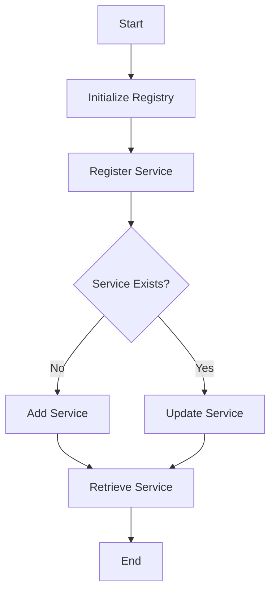

## 6.10. Registry Pattern with Static Variables

The Registry Pattern is a design pattern used to manage and track objects or services within an application. In Rust, this pattern is often implemented using static variables or global state, allowing for efficient access and management of shared resources. This section will delve into the intricacies of the Registry Pattern, its implementation in Rust, and the considerations necessary for maintaining thread safety and avoiding common pitfalls.

### What is the Registry Pattern?

The Registry Pattern is a structural design pattern that provides a centralized location to store and retrieve objects or services. It acts as a global repository, allowing different parts of an application to access shared resources without needing to pass them explicitly. This pattern is particularly useful in scenarios where objects need to be accessed frequently and consistently across various components of an application.

#### Common Applications

- **Service Locators**: Centralizing access to services like logging, configuration, or database connections.
- **Plugin Management**: Keeping track of dynamically loaded plugins or modules.
- **Configuration Management**: Storing application-wide configuration settings.
- **Resource Management**: Managing shared resources like thread pools or connection pools.

### Implementing the Registry Pattern in Rust

In Rust, implementing the Registry Pattern typically involves using static variables or lazy initialization to manage the lifecycle of the objects stored in the registry. Let's explore how to achieve this with practical examples.

#### Using Static Variables

Static variables in Rust are variables that have a fixed memory location and are initialized only once. They are ideal for implementing a registry as they provide a consistent and accessible location for storing shared resources.

```rust
use std::collections::HashMap;
use std::sync::{Arc, Mutex};
use lazy_static::lazy_static;

// Define a type alias for the registry
type Registry = Arc<Mutex<HashMap<String, String>>>;

// Initialize the registry as a static variable
lazy_static! {
    static ref REGISTRY: Registry = Arc::new(Mutex::new(HashMap::new()));
}

// Function to register a new service
fn register_service(name: &str, service: &str) {
    let mut registry = REGISTRY.lock().unwrap();
    registry.insert(name.to_string(), service.to_string());
}

// Function to retrieve a service
fn get_service(name: &str) -> Option<String> {
    let registry = REGISTRY.lock().unwrap();
    registry.get(name).cloned()
}

fn main() {
    // Register services
    register_service("database", "PostgreSQL");
    register_service("cache", "Redis");

    // Retrieve and print services
    if let Some(service) = get_service("database") {
        println!("Database service: {}", service);
    }
    if let Some(service) = get_service("cache") {
        println!("Cache service: {}", service);
    }
}
```

In this example, we use the `lazy_static` crate to initialize a static `REGISTRY` variable, which is a thread-safe `HashMap` wrapped in an `Arc<Mutex<>>`. This allows multiple threads to access and modify the registry safely.

#### Lazy Initialization

Lazy initialization is a technique where the initialization of a resource is deferred until it is actually needed. This can be particularly useful in scenarios where the cost of initialization is high, or the resource may not be needed in every execution path.

```rust
use std::collections::HashMap;
use std::sync::{Arc, Mutex, Once};

struct LazyRegistry {
    registry: Arc<Mutex<HashMap<String, String>>>,
    init: Once,
}

impl LazyRegistry {
    fn new() -> Self {
        LazyRegistry {
            registry: Arc::new(Mutex::new(HashMap::new())),
            init: Once::new(),
        }
    }

    fn initialize(&self) {
        self.init.call_once(|| {
            let mut registry = self.registry.lock().unwrap();
            registry.insert("default_service".to_string(), "Initialized".to_string());
            println!("Registry initialized");
        });
    }

    fn register_service(&self, name: &str, service: &str) {
        self.initialize();
        let mut registry = self.registry.lock().unwrap();
        registry.insert(name.to_string(), service.to_string());
    }

    fn get_service(&self, name: &str) -> Option<String> {
        self.initialize();
        let registry = self.registry.lock().unwrap();
        registry.get(name).cloned()
    }
}

fn main() {
    let registry = LazyRegistry::new();

    // Register services
    registry.register_service("database", "PostgreSQL");
    registry.register_service("cache", "Redis");

    // Retrieve and print services
    if let Some(service) = registry.get_service("database") {
        println!("Database service: {}", service);
    }
    if let Some(service) = registry.get_service("cache") {
        println!("Cache service: {}", service);
    }
}
```

In this example, we use the `Once` type to ensure that the registry is initialized only once, even if accessed from multiple threads. The `initialize` method is called before any operations on the registry to ensure it is ready for use.

### Thread Safety and Synchronization

When implementing the Registry Pattern in Rust, thread safety is a critical consideration. Rust's ownership model and concurrency primitives, such as `Mutex` and `Arc`, provide powerful tools for ensuring safe concurrent access to shared resources.

#### Key Considerations

- **Use `Mutex` for Mutability**: Wrap mutable data in a `Mutex` to ensure that only one thread can access it at a time.
- **Use `Arc` for Shared Ownership**: Use `Arc` to allow multiple threads to own a reference to the registry.
- **Avoid Deadlocks**: Be mindful of the order in which locks are acquired to prevent deadlocks.

### Potential Downsides and Mitigation Strategies

While the Registry Pattern offers many benefits, it also introduces potential downsides, particularly related to global mutable state.

#### Downsides

- **Global Mutable State**: Can lead to unpredictable behavior and make testing difficult.
- **Tight Coupling**: Components may become tightly coupled to the registry, reducing modularity.
- **Initialization Order**: Ensuring the registry is initialized before use can be challenging.

#### Mitigation Strategies

- **Encapsulation**: Encapsulate the registry logic within a module to limit its scope and impact.
- **Dependency Injection**: Use dependency injection to pass the registry to components that need it, reducing coupling.
- **Testing**: Use mock registries in tests to isolate components and ensure predictable behavior.

### Rust Unique Features

Rust's unique features, such as its ownership model and concurrency primitives, make it particularly well-suited for implementing the Registry Pattern safely and efficiently. The language's emphasis on safety and performance ensures that registries can be implemented without sacrificing reliability or speed.

### Differences and Similarities

The Registry Pattern is often confused with the Singleton Pattern, as both involve managing a single instance of a resource. However, the Registry Pattern is more flexible, allowing for multiple objects or services to be managed, whereas the Singleton Pattern focuses on a single instance.

### Try It Yourself

Experiment with the provided code examples by modifying the services registered in the registry or adding new methods to manage additional types of resources. Consider implementing a registry for a different use case, such as managing configuration settings or plugins.

### Visualizing the Registry Pattern

To better understand the Registry Pattern, let's visualize the flow of registering and retrieving services using a Mermaid.js diagram.



This diagram illustrates the process of initializing the registry, registering a service, checking if the service already exists, and retrieving the service.

### References and Links

For further reading on the Registry Pattern and its applications in Rust, consider exploring the following resources:

- [Rust Book](https://doc.rust-lang.org/book/)
- [Rust by Example](https://doc.rust-lang.org/rust-by-example/)
- [Lazy Static Crate Documentation](https://docs.rs/lazy_static/1.4.0/lazy_static/)

### Knowledge Check

Before moving on, take a moment to reflect on what you've learned. Consider the following questions:

- How does the Registry Pattern differ from the Singleton Pattern?
- What are the benefits of using static variables in a registry?
- How can you ensure thread safety when implementing a registry in Rust?

### Embrace the Journey

Remember, mastering design patterns is a journey. As you continue to explore Rust and its powerful features, you'll discover new ways to apply these patterns to create efficient, reliable, and maintainable applications. Keep experimenting, stay curious, and enjoy the journey!

## Quiz Time!



### What is the primary purpose of the Registry Pattern?

- [x] To provide a centralized location for storing and retrieving objects or services.
- [ ] To ensure only one instance of a class is created.
- [ ] To manage the lifecycle of objects.
- [ ] To encapsulate object creation logic.

> **Explanation:** The Registry Pattern provides a centralized location for storing and retrieving objects or services, making them accessible across different parts of an application.

### How does Rust's ownership model contribute to thread safety in the Registry Pattern?

- [x] By ensuring that only one thread can access mutable data at a time.
- [ ] By allowing multiple threads to access data without restrictions.
- [ ] By preventing data from being shared between threads.
- [ ] By eliminating the need for synchronization primitives.

> **Explanation:** Rust's ownership model, combined with concurrency primitives like `Mutex` and `Arc`, ensures that only one thread can access mutable data at a time, contributing to thread safety.

### What is a potential downside of using the Registry Pattern?

- [x] It can lead to global mutable state.
- [ ] It makes testing easier.
- [ ] It reduces coupling between components.
- [ ] It simplifies initialization order.

> **Explanation:** The Registry Pattern can lead to global mutable state, which can introduce unpredictability and make testing more challenging.

### Which Rust feature is commonly used for lazy initialization in the Registry Pattern?

- [x] `Once`
- [ ] `Rc`
- [ ] `Cell`
- [ ] `RefCell`

> **Explanation:** The `Once` type is commonly used for lazy initialization, ensuring that a resource is initialized only once, even in a concurrent context.

### How can you mitigate the tight coupling introduced by the Registry Pattern?

- [x] By using dependency injection.
- [ ] By increasing global state.
- [ ] By avoiding encapsulation.
- [ ] By reducing modularity.

> **Explanation:** Dependency injection can help mitigate the tight coupling introduced by the Registry Pattern by allowing components to receive the registry as a dependency rather than accessing it directly.

### What is the role of `Arc` in a thread-safe registry implementation?

- [x] To allow multiple threads to own a reference to the registry.
- [ ] To provide mutable access to the registry.
- [ ] To ensure only one thread can access the registry.
- [ ] To eliminate the need for locking.

> **Explanation:** `Arc` (Atomic Reference Counting) allows multiple threads to own a reference to the registry, enabling shared ownership in a thread-safe manner.

### What is the difference between the Registry Pattern and the Singleton Pattern?

- [x] The Registry Pattern manages multiple objects, while the Singleton Pattern focuses on a single instance.
- [ ] The Registry Pattern ensures only one instance of a class is created.
- [ ] The Singleton Pattern provides a centralized location for objects.
- [ ] The Registry Pattern is less flexible than the Singleton Pattern.

> **Explanation:** The Registry Pattern manages multiple objects or services, whereas the Singleton Pattern focuses on ensuring only one instance of a class is created.

### What is a common use case for the Registry Pattern?

- [x] Service Locators
- [ ] Object Factories
- [ ] Singleton Management
- [ ] Encapsulation

> **Explanation:** Service Locators are a common use case for the Registry Pattern, as they centralize access to services like logging or configuration.

### How can you avoid deadlocks when using `Mutex` in a registry?

- [x] By being mindful of the order in which locks are acquired.
- [ ] By avoiding the use of `Mutex`.
- [ ] By using `Rc` instead of `Arc`.
- [ ] By increasing the number of locks.

> **Explanation:** Avoiding deadlocks involves being mindful of the order in which locks are acquired, ensuring that multiple locks are acquired in a consistent order.

### True or False: The Registry Pattern is only applicable in single-threaded applications.

- [ ] True
- [x] False

> **Explanation:** False. The Registry Pattern can be applied in both single-threaded and multi-threaded applications, with appropriate synchronization mechanisms for thread safety.


