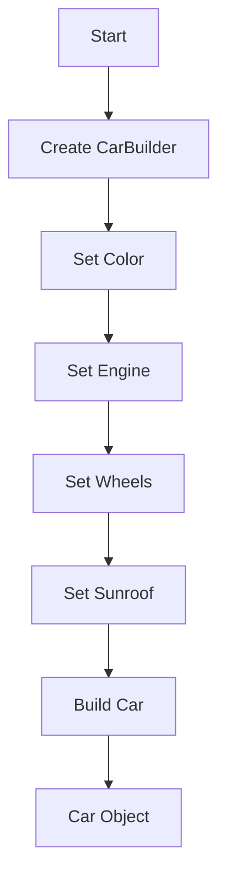

## 6.2. Builder Pattern with Ownership and Borrowing

In this section, we delve into the Builder Pattern in Rust, focusing on how it leverages Rust's unique features of ownership and borrowing to construct complex objects efficiently. This pattern is particularly useful when dealing with objects that require multiple initialization steps or when the construction process involves several optional parameters.

### What is the Builder Pattern?

The Builder Pattern is a creational design pattern that provides a flexible solution to constructing complex objects. It separates the construction of an object from its representation, allowing the same construction process to create different representations. This pattern is particularly useful when an object needs to be constructed in multiple steps or when there are numerous optional parameters.

#### Intent

The primary intent of the Builder Pattern is to:
- Simplify the construction of complex objects.
- Allow for step-by-step construction.
- Enable the construction of different representations of an object using the same process.

### Designing a Builder in Rust

In Rust, the Builder Pattern can be implemented in a way that takes full advantage of the language's ownership and borrowing system. This ensures that the constructed objects are safe, efficient, and adhere to Rust's strict memory management rules.

#### Key Concepts

1. **Ownership and Borrowing**: Rust's ownership model ensures memory safety without a garbage collector. Builders can be designed to either take ownership of their components or borrow them, depending on the use case.

2. **Method Chaining**: Builders often use method chaining to provide a fluent interface for setting properties. This is achieved by returning `self` from each method.

3. **Consuming vs. Borrowing**: Builders can either consume their components (taking ownership) or borrow them. Consuming is useful when the builder needs to take full control of its components, while borrowing is useful for temporary access.

#### Example: Building a `Car` Object

Let's consider an example where we want to build a `Car` object with various optional features.

```rust
#[derive(Debug)]
struct Car {
    color: String,
    engine: String,
    wheels: u8,
    sunroof: bool,
}

struct CarBuilder {
    color: Option<String>,
    engine: Option<String>,
    wheels: Option<u8>,
    sunroof: Option<bool>,
}

impl CarBuilder {
    fn new() -> Self {
        CarBuilder {
            color: None,
            engine: None,
            wheels: None,
            sunroof: None,
        }
    }

    fn color(mut self, color: &str) -> Self {
        self.color = Some(color.to_string());
        self
    }

    fn engine(mut self, engine: &str) -> Self {
        self.engine = Some(engine.to_string());
        self
    }

    fn wheels(mut self, wheels: u8) -> Self {
        self.wheels = Some(wheels);
        self
    }

    fn sunroof(mut self, sunroof: bool) -> Self {
        self.sunroof = Some(sunroof);
        self
    }

    fn build(self) -> Result<Car, &'static str> {
        Ok(Car {
            color: self.color.ok_or("Color is required")?,
            engine: self.engine.ok_or("Engine is required")?,
            wheels: self.wheels.ok_or("Wheels are required")?,
            sunroof: self.sunroof.unwrap_or(false),
        })
    }
}

fn main() {
    let car = CarBuilder::new()
        .color("Red")
        .engine("V8")
        .wheels(4)
        .sunroof(true)
        .build();

    match car {
        Ok(car) => println!("Built car: {:?}", car),
        Err(e) => println!("Error building car: {}", e),
    }
}
```

### Consuming vs. Borrowing

In the above example, the builder takes ownership of its components. This is evident in the method signatures, where `self` is taken by value (i.e., `mut self`). This approach ensures that once the builder is used to create a `Car`, it cannot be used again, preventing accidental reuse.

Alternatively, if we wanted to borrow components instead of taking ownership, we could modify the builder methods to take `&mut self` and store references instead of owned values. This would allow the builder to be reused, but it would require careful management of lifetimes.

### Advantages in Rust

The Builder Pattern in Rust offers several advantages:

- **Immutability**: Once a `Car` is built, it is immutable. This ensures thread safety and prevents accidental modifications.
- **Thread Safety**: By leveraging Rust's ownership model, builders can be designed to be thread-safe, allowing for concurrent construction of objects.
- **Flexibility**: The pattern allows for flexible construction of objects with optional parameters, making it easy to extend and modify.

### Visualizing the Builder Pattern

Below is a diagram illustrating the flow of constructing a `Car` object using the Builder Pattern in Rust.



### Try It Yourself

Experiment with the code by adding new features to the `Car` object, such as `gps` or `stereo`. Modify the builder to include these features and observe how the pattern scales with additional complexity.

### Knowledge Check

- What are the benefits of using the Builder Pattern in Rust?
- How does ownership affect the design of a builder?
- What are the trade-offs between consuming and borrowing in a builder?

### Key Takeaways

- The Builder Pattern is ideal for constructing complex objects with multiple optional parameters.
- Rust's ownership and borrowing system enhances the safety and efficiency of builders.
- Method chaining provides a fluent interface for setting properties.
- Consuming components ensures that builders are used safely and cannot be reused accidentally.

### Embrace the Journey

Remember, this is just the beginning. As you progress, you'll build more complex and interactive applications using Rust's powerful features. Keep experimenting, stay curious, and enjoy the journey!

## Quiz Time!



### What is the primary intent of the Builder Pattern?

- [x] To simplify the construction of complex objects
- [ ] To enforce strict type checking
- [ ] To improve runtime performance
- [ ] To reduce code duplication

> **Explanation:** The Builder Pattern is designed to simplify the construction of complex objects by separating the construction process from the representation.

### In Rust, what does the Builder Pattern leverage to ensure safety?

- [x] Ownership and Borrowing
- [ ] Dynamic Typing
- [ ] Garbage Collection
- [ ] Reflection

> **Explanation:** Rust's ownership and borrowing system ensures memory safety without a garbage collector, making it ideal for implementing the Builder Pattern.

### What is method chaining in the context of the Builder Pattern?

- [x] Returning `self` from each method to allow fluent interface
- [ ] Using recursive functions to build objects
- [ ] Creating a linked list of methods
- [ ] Implementing methods in a separate module

> **Explanation:** Method chaining involves returning `self` from each method, allowing a fluent interface for setting properties.

### What is the advantage of consuming components in a builder?

- [x] Prevents accidental reuse of the builder
- [ ] Allows for dynamic memory allocation
- [ ] Enables runtime type checking
- [ ] Supports garbage collection

> **Explanation:** Consuming components ensures that once a builder is used, it cannot be reused, preventing accidental reuse.

### How can a builder be reused in Rust?

- [x] By borrowing components instead of taking ownership
- [ ] By using global variables
- [ ] By implementing a destructor
- [ ] By using dynamic dispatch

> **Explanation:** Borrowing components allows a builder to be reused, but requires careful management of lifetimes.

### What is a key advantage of the Builder Pattern in Rust?

- [x] Immutability of the constructed object
- [ ] Dynamic typing
- [ ] Automatic garbage collection
- [ ] Reflection capabilities

> **Explanation:** The Builder Pattern ensures that once an object is built, it is immutable, enhancing thread safety.

### Which Rust feature enhances the safety of builders?

- [x] Ownership model
- [ ] Dynamic dispatch
- [ ] Reflection
- [ ] Garbage collection

> **Explanation:** Rust's ownership model ensures memory safety, making builders safe and efficient.

### What does the `build` method in a builder typically return?

- [x] The constructed object or an error
- [ ] A reference to the builder
- [ ] A closure
- [ ] A trait object

> **Explanation:** The `build` method typically returns the constructed object or an error if construction fails.

### Which of the following is NOT a benefit of the Builder Pattern?

- [ ] Simplifies object construction
- [ ] Allows for step-by-step construction
- [x] Enforces compile-time polymorphism
- [ ] Enables construction of different representations

> **Explanation:** The Builder Pattern does not enforce compile-time polymorphism; it focuses on simplifying object construction.

### True or False: The Builder Pattern in Rust can be designed to be thread-safe.

- [x] True
- [ ] False

> **Explanation:** By leveraging Rust's ownership model, builders can be designed to be thread-safe, allowing for concurrent construction of objects.


