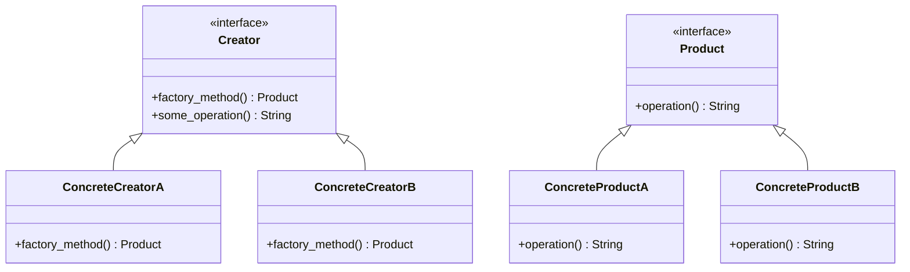

## 6.3. Factory Method Pattern Using Traits

In the world of software design patterns, the Factory Method pattern stands out as a powerful tool for creating objects while abstracting the instantiation process. In Rust, we can leverage traits to implement this pattern, providing a flexible and decoupled way to manage object creation. This section will guide you through understanding and implementing the Factory Method pattern using traits in Rust.

### What is the Factory Method Pattern?

The Factory Method pattern is a creational design pattern that defines an interface for creating an object but allows subclasses to alter the type of objects that will be created. This pattern promotes loose coupling by eliminating the need for clients to instantiate objects directly, instead relying on a factory method to handle the creation.

#### Intent

- **Define an interface for creating an object**, but let subclasses decide which class to instantiate.
- **Promote loose coupling** by delegating the instantiation process to subclasses or specific methods.
- **Enhance flexibility** by allowing the code to work with interfaces rather than concrete implementations.

### Using Traits to Define Creation Methods

In Rust, traits are a powerful feature that can be used to define shared behavior across different types. By using traits, we can define a common interface for our factory methods, allowing different implementations to create various types of objects.

#### Defining a Trait for the Factory Method

Let's start by defining a trait that represents our factory method. This trait will declare a method for creating objects, which can be implemented by different types to produce various products.

```rust
trait Product {
    fn operation(&self) -> String;
}

trait Creator {
    fn factory_method(&self) -> Box<dyn Product>;

    fn some_operation(&self) -> String {
        let product = self.factory_method();
        format!("Creator: The same creator's code has just worked with {}", product.operation())
    }
}
```

In this example, we have two traits: `Product` and `Creator`. The `Product` trait defines the interface for the products that will be created, while the `Creator` trait includes the `factory_method` for creating products and a `some_operation` method that uses the product.

### Implementing the Factory Method with Different Products

Now that we have our traits defined, let's implement the Factory Method pattern with different products. We'll create two concrete products and two creators that produce these products.

#### Concrete Products

```rust
struct ConcreteProductA;

impl Product for ConcreteProductA {
    fn operation(&self) -> String {
        String::from("Result of ConcreteProductA")
    }
}

struct ConcreteProductB;

impl Product for ConcreteProductB {
    fn operation(&self) -> String {
        String::from("Result of ConcreteProductB")
    }
}
```

Here, `ConcreteProductA` and `ConcreteProductB` are two different implementations of the `Product` trait. Each provides its own version of the `operation` method.

#### Concrete Creators

```rust
struct ConcreteCreatorA;

impl Creator for ConcreteCreatorA {
    fn factory_method(&self) -> Box<dyn Product> {
        Box::new(ConcreteProductA)
    }
}

struct ConcreteCreatorB;

impl Creator for ConcreteCreatorB {
    fn factory_method(&self) -> Box<dyn Product> {
        Box::new(ConcreteProductB)
    }
}
```

`ConcreteCreatorA` and `ConcreteCreatorB` implement the `Creator` trait. Each provides its own implementation of the `factory_method`, returning a different product.

### Using Trait Objects for Dynamic Dispatch

In Rust, trait objects allow for dynamic dispatch, enabling us to work with different types through a common interface. This is particularly useful in the Factory Method pattern when we want to handle different products polymorphically.

#### Example with Dynamic Dispatch

```rust
fn main() {
    let creator_a: Box<dyn Creator> = Box::new(ConcreteCreatorA);
    let creator_b: Box<dyn Creator> = Box::new(ConcreteCreatorB);

    println!("{}", creator_a.some_operation());
    println!("{}", creator_b.some_operation());
}
```

In this example, we use trait objects (`Box<dyn Creator>`) to store instances of `ConcreteCreatorA` and `ConcreteCreatorB`. This allows us to call `some_operation` on each creator, demonstrating polymorphic behavior.

### Benefits of Using the Factory Method Pattern

The Factory Method pattern offers several benefits, especially when implemented using traits in Rust:

- **Decoupling**: By abstracting the instantiation process, the Factory Method pattern decouples the code that uses the objects from the code that creates them.
- **Flexibility**: New product types can be added without modifying existing code, enhancing the flexibility of the system.
- **Polymorphism**: Using traits and trait objects, the Factory Method pattern supports polymorphic behavior, allowing different products to be used interchangeably.

### Design Considerations

When implementing the Factory Method pattern in Rust, consider the following:

- **Performance**: Using trait objects and dynamic dispatch can introduce a slight performance overhead. Consider whether this trade-off is acceptable for your use case.
- **Complexity**: The Factory Method pattern can add complexity to your codebase. Ensure that the benefits of decoupling and flexibility outweigh the added complexity.
- **Rust-Specific Features**: Leverage Rust's ownership and borrowing system to manage resources efficiently, even when using dynamic dispatch.

### Rust Unique Features

Rust's unique features, such as ownership, borrowing, and lifetimes, play a crucial role in implementing the Factory Method pattern. These features ensure memory safety and prevent common errors like null pointer dereferencing and data races.

### Differences and Similarities with Other Patterns

The Factory Method pattern is often confused with the Abstract Factory pattern. While both involve creating objects, the Factory Method pattern focuses on defining a single method for object creation, whereas the Abstract Factory pattern involves creating families of related objects.

### Try It Yourself

To deepen your understanding of the Factory Method pattern using traits in Rust, try modifying the code examples provided:

- **Add a new product type**: Implement a new product and creator, and see how easily they integrate with the existing system.
- **Experiment with trait objects**: Try using different types of trait objects and observe how they affect the behavior of the system.

### Visualizing the Factory Method Pattern

To better understand the Factory Method pattern, let's visualize the relationships between the components using a class diagram.



This diagram illustrates the structure of the Factory Method pattern, showing the relationships between the `Creator`, `Product`, and their concrete implementations.

### Summary

The Factory Method pattern is a powerful tool for managing object creation in a flexible and decoupled manner. By leveraging traits in Rust, we can define interfaces for object creation, allowing different implementations to produce various products. This pattern enhances flexibility, supports polymorphism, and promotes loose coupling, making it a valuable addition to any Rust developer's toolkit.

### References and Further Reading

- [Rust Programming Language](https://www.rust-lang.org/)
- [Design Patterns: Elements of Reusable Object-Oriented Software](https://en.wikipedia.org/wiki/Design_Patterns)
- [Rust Traits and Trait Objects](https://doc.rust-lang.org/book/ch10-02-traits.html)

## Quiz Time!



### What is the primary purpose of the Factory Method pattern?

- [x] To define an interface for creating an object, allowing subclasses to decide which class to instantiate.
- [ ] To provide a single class that creates all objects.
- [ ] To enforce a strict hierarchy of object creation.
- [ ] To eliminate the need for object creation altogether.

> **Explanation:** The Factory Method pattern defines an interface for creating an object, but lets subclasses decide which class to instantiate, promoting flexibility and decoupling.

### How are traits used in the Factory Method pattern in Rust?

- [x] Traits define a common interface for factory methods.
- [ ] Traits are used to store data for object creation.
- [ ] Traits replace the need for concrete classes.
- [ ] Traits are not used in the Factory Method pattern.

> **Explanation:** In Rust, traits define a common interface for factory methods, allowing different implementations to create various types of objects.

### What is a benefit of using trait objects in the Factory Method pattern?

- [x] They allow for dynamic dispatch and polymorphic behavior.
- [ ] They eliminate the need for memory management.
- [ ] They improve compile-time performance.
- [ ] They enforce strict type checking.

> **Explanation:** Trait objects enable dynamic dispatch, allowing different types to be used polymorphically through a common interface.

### Which of the following is a concrete product in the provided example?

- [x] ConcreteProductA
- [ ] Creator
- [ ] Product
- [ ] ConcreteCreatorA

> **Explanation:** `ConcreteProductA` is a concrete implementation of the `Product` trait, representing a specific product type.

### What is a potential drawback of using dynamic dispatch in Rust?

- [x] It can introduce a slight performance overhead.
- [ ] It eliminates the need for lifetimes.
- [ ] It prevents polymorphic behavior.
- [ ] It enforces strict compile-time checks.

> **Explanation:** Dynamic dispatch can introduce a slight performance overhead due to runtime type resolution.

### How does the Factory Method pattern promote loose coupling?

- [x] By abstracting the instantiation process, separating object creation from usage.
- [ ] By enforcing strict type hierarchies.
- [ ] By eliminating the need for interfaces.
- [ ] By requiring all objects to be created in a single class.

> **Explanation:** The Factory Method pattern promotes loose coupling by abstracting the instantiation process, allowing the code to work with interfaces rather than concrete implementations.

### What is the role of the `some_operation` method in the `Creator` trait?

- [x] To demonstrate how the factory method can be used within the creator.
- [ ] To create a new product.
- [ ] To store data for the product.
- [ ] To replace the factory method.

> **Explanation:** The `some_operation` method demonstrates how the factory method can be used within the creator, showcasing the interaction with the created product.

### Which pattern is often confused with the Factory Method pattern?

- [x] Abstract Factory pattern
- [ ] Singleton pattern
- [ ] Observer pattern
- [ ] Strategy pattern

> **Explanation:** The Factory Method pattern is often confused with the Abstract Factory pattern, as both involve creating objects but differ in scope and intent.

### What is a key feature of Rust that supports the Factory Method pattern?

- [x] Ownership and borrowing system
- [ ] Lack of garbage collection
- [ ] Automatic memory management
- [ ] Built-in support for inheritance

> **Explanation:** Rust's ownership and borrowing system ensures memory safety and efficient resource management, supporting the implementation of design patterns like the Factory Method.

### True or False: The Factory Method pattern can only be used with static dispatch in Rust.

- [ ] True
- [x] False

> **Explanation:** The Factory Method pattern can be used with both static and dynamic dispatch in Rust, depending on the use of trait objects.



Remember, this is just the beginning. As you progress, you'll build more complex and interactive systems using the Factory Method pattern in Rust. Keep experimenting, stay curious, and enjoy the journey!
