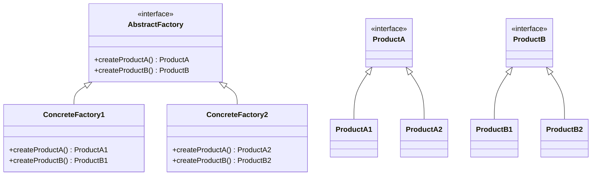

## 6.4. Abstract Factory Pattern

The Abstract Factory Pattern is a creational design pattern that provides an interface for creating families of related or dependent objects without specifying their concrete classes. This pattern is particularly useful when a system needs to be independent of how its objects are created, composed, and represented. In Rust, we can leverage traits to represent abstract factories and manage the creation of related objects.

### Intent

The primary intent of the Abstract Factory Pattern is to encapsulate a group of individual factories that have a common theme. It provides a way to create a family of related objects without needing to specify their concrete classes. This pattern is beneficial in maintaining consistency among products and ensuring that the system remains flexible and scalable.

### Key Participants

1. **Abstract Factory**: Declares an interface for operations that create abstract product objects.
2. **Concrete Factory**: Implements the operations to create concrete product objects.
3. **Abstract Product**: Declares an interface for a type of product object.
4. **Concrete Product**: Defines a product object to be created by the corresponding concrete factory; implements the Abstract Product interface.
5. **Client**: Uses only interfaces declared by Abstract Factory and Abstract Product classes.

### Diagrams

To better understand the Abstract Factory Pattern, let's visualize it using a class diagram:



### Implementing Abstract Factory in Rust

In Rust, we can represent the Abstract Factory pattern using traits to define the interfaces for our factories and products. Let's walk through an example to illustrate this concept.

#### Step 1: Define Abstract Products

First, we define traits for our abstract products. These traits will declare the interfaces for the products that our factories will create.

```rust
// Abstract Product A
trait ProductA {
    fn operation_a(&self) -> String;
}

// Abstract Product B
trait ProductB {
    fn operation_b(&self) -> String;
}
```

#### Step 2: Implement Concrete Products

Next, we implement concrete products that conform to the abstract product interfaces.

```rust
// Concrete Product A1
struct ProductA1;

impl ProductA for ProductA1 {
    fn operation_a(&self) -> String {
        String::from("Result of ProductA1")
    }
}

// Concrete Product A2
struct ProductA2;

impl ProductA for ProductA2 {
    fn operation_a(&self) -> String {
        String::from("Result of ProductA2")
    }
}

// Concrete Product B1
struct ProductB1;

impl ProductB for ProductB1 {
    fn operation_b(&self) -> String {
        String::from("Result of ProductB1")
    }
}

// Concrete Product B2
struct ProductB2;

impl ProductB for ProductB2 {
    fn operation_b(&self) -> String {
        String::from("Result of ProductB2")
    }
}
```

#### Step 3: Define Abstract Factory

We define a trait for the abstract factory, which will declare methods for creating abstract products.

```rust
trait AbstractFactory {
    fn create_product_a(&self) -> Box<dyn ProductA>;
    fn create_product_b(&self) -> Box<dyn ProductB>;
}
```

#### Step 4: Implement Concrete Factories

Concrete factories implement the abstract factory interface and are responsible for creating specific concrete products.

```rust
// Concrete Factory 1
struct ConcreteFactory1;

impl AbstractFactory for ConcreteFactory1 {
    fn create_product_a(&self) -> Box<dyn ProductA> {
        Box::new(ProductA1)
    }

    fn create_product_b(&self) -> Box<dyn ProductB> {
        Box::new(ProductB1)
    }
}

// Concrete Factory 2
struct ConcreteFactory2;

impl AbstractFactory for ConcreteFactory2 {
    fn create_product_a(&self) -> Box<dyn ProductA> {
        Box::new(ProductA2)
    }

    fn create_product_b(&self) -> Box<dyn ProductB> {
        Box::new(ProductB2)
    }
}
```

#### Step 5: Client Code

The client code interacts with the factory and products through their abstract interfaces, ensuring that it remains decoupled from the concrete implementations.

```rust
fn client_code(factory: &dyn AbstractFactory) {
    let product_a = factory.create_product_a();
    let product_b = factory.create_product_b();

    println!("{}", product_a.operation_a());
    println!("{}", product_b.operation_b());
}

fn main() {
    let factory1 = ConcreteFactory1;
    client_code(&factory1);

    let factory2 = ConcreteFactory2;
    client_code(&factory2);
}
```

### Managing Lifetime and Ownership

In Rust, managing lifetime and ownership is crucial to ensure memory safety. In the Abstract Factory Pattern, we use `Box<dyn Trait>` to handle dynamic dispatch and ownership of the created products. This approach allows us to store objects of different types that implement the same trait in a single collection.

### Maintaining Consistency Among Products

The Abstract Factory Pattern ensures that products created by a factory are compatible with each other. This is particularly important in systems where products need to work together seamlessly. By encapsulating the creation logic within factories, we maintain consistency and avoid mismatches between products.

### Rust Unique Features

Rust's ownership model and trait system provide a robust foundation for implementing the Abstract Factory Pattern. The use of traits allows us to define flexible interfaces, while ownership and borrowing rules ensure memory safety and prevent common errors such as null pointer dereferencing.

### Differences and Similarities

The Abstract Factory Pattern is often confused with the Factory Method Pattern. While both patterns deal with object creation, the Abstract Factory Pattern focuses on creating families of related objects, whereas the Factory Method Pattern deals with creating a single product.

### Try It Yourself

To deepen your understanding, try modifying the code examples:

- Add a new product type and update the factories to support it.
- Implement a new concrete factory that creates a different combination of products.
- Experiment with different ways to manage ownership and lifetimes.

### Knowledge Check

- What is the primary intent of the Abstract Factory Pattern?
- How does Rust's trait system facilitate the implementation of the Abstract Factory Pattern?
- Why is it important to maintain consistency among products in the Abstract Factory Pattern?
- How does the Abstract Factory Pattern differ from the Factory Method Pattern?

### Embrace the Journey

Remember, mastering design patterns is a journey. As you continue to explore and implement these patterns in Rust, you'll gain a deeper understanding of how to build flexible, scalable, and maintainable systems. Keep experimenting, stay curious, and enjoy the journey!

## Quiz Time!



### What is the primary intent of the Abstract Factory Pattern?

- [x] To create families of related objects without specifying their concrete classes.
- [ ] To create a single object with a specific interface.
- [ ] To provide a way to access elements of an aggregate object sequentially.
- [ ] To define an interface for creating an object, but let subclasses alter the type of objects that will be created.

> **Explanation:** The Abstract Factory Pattern is designed to create families of related objects without specifying their concrete classes.

### How does Rust's trait system facilitate the implementation of the Abstract Factory Pattern?

- [x] By allowing the definition of flexible interfaces for products and factories.
- [ ] By enforcing strict type hierarchies.
- [ ] By providing automatic memory management.
- [ ] By allowing multiple inheritance.

> **Explanation:** Rust's trait system allows for the definition of flexible interfaces, which is essential for implementing the Abstract Factory Pattern.

### Why is it important to maintain consistency among products in the Abstract Factory Pattern?

- [x] To ensure that products created by a factory are compatible with each other.
- [ ] To reduce the number of classes in the system.
- [ ] To simplify the client code.
- [ ] To allow for dynamic type checking.

> **Explanation:** Maintaining consistency among products ensures that they are compatible and can work together seamlessly.

### How does the Abstract Factory Pattern differ from the Factory Method Pattern?

- [x] The Abstract Factory Pattern focuses on creating families of related objects, while the Factory Method Pattern deals with creating a single product.
- [ ] The Abstract Factory Pattern is used for creating a single object, while the Factory Method Pattern creates families of objects.
- [ ] The Abstract Factory Pattern is more flexible than the Factory Method Pattern.
- [ ] The Factory Method Pattern is a subset of the Abstract Factory Pattern.

> **Explanation:** The Abstract Factory Pattern is about creating families of related objects, whereas the Factory Method Pattern focuses on creating a single product.

### What is a key benefit of using `Box<dyn Trait>` in the Abstract Factory Pattern?

- [x] It allows for dynamic dispatch and ownership of created products.
- [ ] It enforces compile-time type checking.
- [ ] It reduces memory usage.
- [ ] It simplifies the implementation of concrete factories.

> **Explanation:** `Box<dyn Trait>` allows for dynamic dispatch and ownership, which is crucial for managing different types of products in the Abstract Factory Pattern.

### Which of the following is a key participant in the Abstract Factory Pattern?

- [x] Abstract Factory
- [ ] Singleton
- [ ] Observer
- [ ] Adapter

> **Explanation:** The Abstract Factory is a key participant in the Abstract Factory Pattern, responsible for declaring interfaces for creating abstract product objects.

### What role does the client play in the Abstract Factory Pattern?

- [x] It uses interfaces declared by Abstract Factory and Abstract Product classes.
- [ ] It creates concrete products directly.
- [ ] It defines the interfaces for products.
- [ ] It implements the operations to create concrete product objects.

> **Explanation:** The client uses interfaces declared by Abstract Factory and Abstract Product classes, ensuring decoupling from concrete implementations.

### How can you extend the Abstract Factory Pattern in Rust?

- [x] By adding new product types and updating factories to support them.
- [ ] By removing existing product types.
- [ ] By hardcoding product creation logic.
- [ ] By using global variables for product instances.

> **Explanation:** You can extend the Abstract Factory Pattern by adding new product types and updating factories to support them, maintaining flexibility and scalability.

### What is a common misconception about the Abstract Factory Pattern?

- [x] That it is the same as the Factory Method Pattern.
- [ ] That it cannot be implemented in Rust.
- [ ] That it is only useful for large systems.
- [ ] That it requires dynamic typing.

> **Explanation:** A common misconception is that the Abstract Factory Pattern is the same as the Factory Method Pattern, but they serve different purposes.

### True or False: The Abstract Factory Pattern can be used to ensure that products created by different factories are interchangeable.

- [x] True
- [ ] False

> **Explanation:** The Abstract Factory Pattern can be used to ensure that products created by different factories are interchangeable, as they adhere to the same interfaces.


