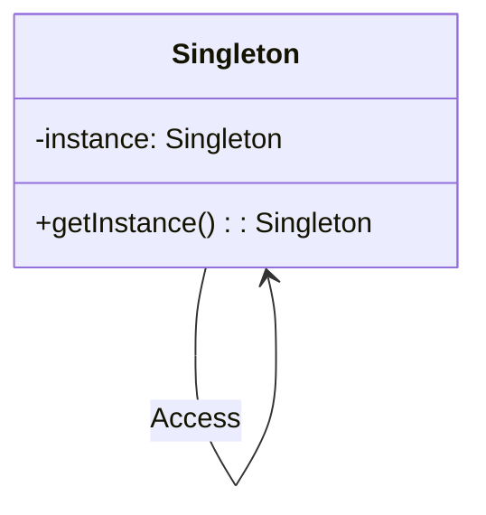

## 6.5. Singleton Pattern and Global State Management

In this section, we delve into the Singleton pattern, a creational design pattern that ensures a class has only one instance and provides a global point of access to it. We'll explore how this pattern can be implemented in Rust, considering the language's unique features and emphasis on safety and concurrency. We'll also discuss managing global state safely in Rust, using tools like `lazy_static` and `once_cell`.

### Singleton Pattern: An Overview

#### Definition and Intent

The Singleton pattern restricts the instantiation of a class to a single object. This is useful when exactly one object is needed to coordinate actions across the system. Common use cases include configuration objects, logging services, and hardware interface management.

#### Key Participants

- **Singleton Class**: The class that is restricted to a single instance.
- **Instance**: The single instance of the Singleton class.
- **Access Method**: A method to provide access to the instance.

#### Applicability

Use the Singleton pattern when:
- A single instance of a class is required across different parts of a program.
- You need to control access to shared resources.
- You want to enforce a single point of access to a service or resource.

### Challenges of Implementing Singleton in Rust

Rust's ownership model and emphasis on safety and concurrency present unique challenges for implementing the Singleton pattern. The language's strict borrowing rules and lack of a traditional garbage collector mean that global mutable state must be handled with care to avoid data races and ensure thread safety.

#### Thread Safety and Global Mutable State

In Rust, global mutable state can lead to data races if accessed concurrently without proper synchronization. Rust provides several tools to manage this safely, such as `Mutex`, `RwLock`, and atomic types. However, these tools must be used judiciously to maintain performance and avoid deadlocks.

### Implementing Singleton in Rust

Let's explore how to implement a Singleton in Rust using different approaches, focusing on thread safety and global state management.

#### Using `lazy_static`

The `lazy_static` crate allows for the creation of lazily evaluated static variables. This is useful for implementing Singletons, as it ensures that the instance is created only once and is accessible globally.

```rust
use lazy_static::lazy_static;
use std::sync::Mutex;

// Define a struct for the Singleton
struct Logger {
    // Fields for the Logger
}

impl Logger {
    fn log(&self, message: &str) {
        println!("{}", message);
    }
}

// Use lazy_static to create a global instance
lazy_static! {
    static ref LOGGER: Mutex<Logger> = Mutex::new(Logger {});
}

fn main() {
    // Access the Singleton instance
    let logger = LOGGER.lock().unwrap();
    logger.log("This is a log message.");
}
```

**Key Points:**
- `lazy_static!` ensures that the `LOGGER` is initialized only once.
- `Mutex` is used to ensure thread-safe access to the `LOGGER`.

#### Using `OnceCell`

The `once_cell` crate provides a more modern approach to lazy initialization. It offers `OnceCell` and `Lazy` types, which can be used to implement Singletons.

```rust
use once_cell::sync::Lazy;
use std::sync::Mutex;

// Define a struct for the Singleton
struct Config {
    // Configuration fields
}

impl Config {
    fn new() -> Self {
        Config {
            // Initialize fields
        }
    }
}

// Use Lazy to create a global instance
static CONFIG: Lazy<Mutex<Config>> = Lazy::new(|| Mutex::new(Config::new()));

fn main() {
    // Access the Singleton instance
    let config = CONFIG.lock().unwrap();
    // Use the config
}
```

**Key Points:**
- `Lazy` provides a convenient way to initialize the `CONFIG` only once.
- `Mutex` ensures that access to the `CONFIG` is thread-safe.

### Implications on Thread Safety and Global Mutable State

When implementing Singletons in Rust, it's crucial to consider the implications on thread safety and global mutable state. Rust's ownership model helps prevent data races, but developers must still be cautious when dealing with shared state.

#### Alternatives to the Singleton Pattern in Rust

While the Singleton pattern can be useful, it may not always be the best choice in Rust. Consider the following alternatives:

- **Dependency Injection**: Instead of relying on a global instance, pass dependencies explicitly to functions or structs. This approach improves testability and reduces coupling.
- **Module-Level State**: Use module-level state with functions to encapsulate shared state without exposing it globally.
- **Actor Model**: Use the actor model to manage state and concurrency, where each actor maintains its own state and communicates with others via message passing.

### Rust Unique Features

Rust's unique features, such as ownership, borrowing, and lifetimes, play a significant role in implementing and managing Singletons and global state. These features help ensure memory safety and prevent common concurrency issues.

### Differences and Similarities with Other Languages

In languages like Java or C++, Singletons are often implemented using static variables or methods. Rust's approach, using crates like `lazy_static` and `once_cell`, emphasizes safety and concurrency, aligning with the language's core principles.

### Design Considerations

When deciding to use the Singleton pattern in Rust, consider the following:

- **Thread Safety**: Ensure that the Singleton is accessed in a thread-safe manner.
- **Global State Management**: Be cautious of global mutable state and its implications on concurrency.
- **Alternatives**: Evaluate whether a Singleton is the best solution or if other patterns, such as dependency injection, are more suitable.

### Try It Yourself

Experiment with the code examples provided. Try modifying the `Logger` or `Config` structs to add more functionality. Consider implementing a Singleton using different synchronization primitives, such as `RwLock` or atomic types.

### Visualizing Singleton Pattern in Rust



**Diagram Description:** This class diagram represents the Singleton pattern, where a single instance of the `Singleton` class is accessed globally.

### References and Links

- [lazy_static crate](https://crates.io/crates/lazy_static)
- [once_cell crate](https://crates.io/crates/once_cell)
- [Rust Book - Concurrency](https://doc.rust-lang.org/book/ch16-00-concurrency.html)

### Knowledge Check

- What are the key participants in the Singleton pattern?
- How does Rust's ownership model affect Singleton implementation?
- What are some alternatives to the Singleton pattern in Rust?

### Embrace the Journey

Remember, mastering design patterns in Rust is a journey. As you explore different patterns and techniques, you'll gain a deeper understanding of Rust's capabilities and how to leverage them effectively. Keep experimenting, stay curious, and enjoy the process!

## Quiz Time!



### What is the primary purpose of the Singleton pattern?

- [x] To ensure a class has only one instance and provide a global point of access to it.
- [ ] To allow multiple instances of a class to be created.
- [ ] To facilitate inheritance and polymorphism.
- [ ] To encapsulate a group of related classes.

> **Explanation:** The Singleton pattern ensures that a class has only one instance and provides a global point of access to it.

### Which crate is commonly used in Rust to implement a Singleton pattern with lazy initialization?

- [x] `lazy_static`
- [ ] `serde`
- [ ] `tokio`
- [ ] `hyper`

> **Explanation:** The `lazy_static` crate is commonly used for lazy initialization of static variables in Rust.

### What is a key challenge when implementing a Singleton in Rust?

- [x] Ensuring thread safety and managing global mutable state.
- [ ] Implementing inheritance and polymorphism.
- [ ] Handling dynamic memory allocation.
- [ ] Supporting multiple inheritance.

> **Explanation:** Ensuring thread safety and managing global mutable state are key challenges when implementing a Singleton in Rust.

### Which synchronization primitive is used in the provided `lazy_static` example to ensure thread safety?

- [x] `Mutex`
- [ ] `RwLock`
- [ ] `AtomicUsize`
- [ ] `Arc`

> **Explanation:** `Mutex` is used in the `lazy_static` example to ensure thread-safe access to the Singleton instance.

### What is an alternative to the Singleton pattern in Rust?

- [x] Dependency Injection
- [ ] Multiple Inheritance
- [ ] Singleton Inheritance
- [ ] Global Variables

> **Explanation:** Dependency Injection is an alternative to the Singleton pattern, allowing dependencies to be passed explicitly.

### Which crate provides `OnceCell` and `Lazy` types for lazy initialization in Rust?

- [x] `once_cell`
- [ ] `serde`
- [ ] `tokio`
- [ ] `hyper`

> **Explanation:** The `once_cell` crate provides `OnceCell` and `Lazy` types for lazy initialization in Rust.

### What is a potential drawback of using global mutable state in Rust?

- [x] It can lead to data races if accessed concurrently without proper synchronization.
- [ ] It simplifies code readability and maintainability.
- [ ] It enhances performance by reducing memory usage.
- [ ] It allows for easy debugging and testing.

> **Explanation:** Global mutable state can lead to data races if accessed concurrently without proper synchronization.

### How does Rust's ownership model help prevent data races?

- [x] By enforcing strict borrowing rules and ensuring memory safety.
- [ ] By allowing multiple mutable references to the same data.
- [ ] By providing a garbage collector to manage memory.
- [ ] By supporting dynamic typing and reflection.

> **Explanation:** Rust's ownership model enforces strict borrowing rules and ensures memory safety, helping to prevent data races.

### What is the role of the `Mutex` in the Singleton pattern implementation?

- [x] To ensure thread-safe access to the Singleton instance.
- [ ] To provide a global point of access to the Singleton.
- [ ] To initialize the Singleton instance lazily.
- [ ] To manage memory allocation for the Singleton.

> **Explanation:** `Mutex` ensures thread-safe access to the Singleton instance by allowing only one thread to access the data at a time.

### True or False: The Singleton pattern is always the best choice for managing global state in Rust.

- [ ] True
- [x] False

> **Explanation:** The Singleton pattern is not always the best choice for managing global state in Rust. Alternatives like dependency injection may be more suitable in certain scenarios.


