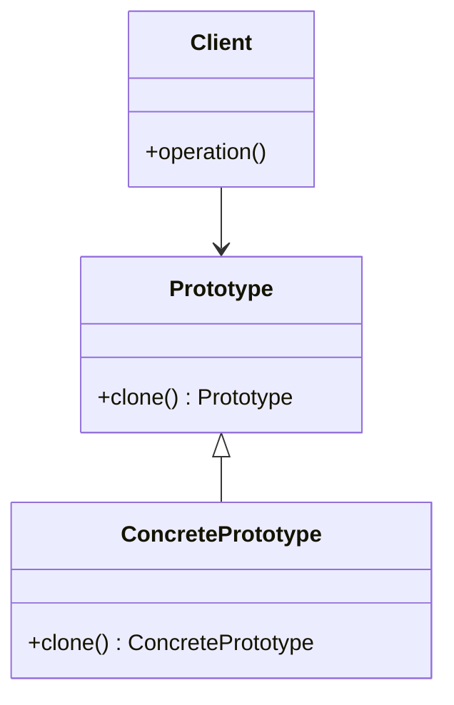

## 6.6. Prototype Pattern with Cloning

In the realm of software design patterns, the Prototype Pattern stands out as a powerful tool for creating new objects by copying existing ones. This pattern is particularly useful in Rust, where the `Clone` trait plays a pivotal role in facilitating object cloning. In this section, we will delve into the intricacies of the Prototype Pattern, explore how the `Clone` trait is used in Rust, and provide practical examples to illustrate its implementation. We will also discuss the nuances of deep versus shallow copies and highlight scenarios where the Prototype Pattern is beneficial in Rust.

### Understanding the Prototype Pattern

The Prototype Pattern is a creational design pattern that allows for the creation of new objects by copying an existing object, known as the prototype. This pattern is particularly useful when the cost of creating a new instance of an object is more expensive than copying an existing one. It is also beneficial when the system should be independent of how its objects are created, composed, and represented.

#### Key Participants

- **Prototype**: An interface or abstract class that defines the method for cloning itself.
- **Concrete Prototype**: A class that implements the prototype interface and defines the method for cloning itself.
- **Client**: The class that creates a new object by requesting a prototype to clone itself.

### The Role of the `Clone` Trait in Rust

In Rust, the `Clone` trait is used to create a copy of an object. This trait is essential for implementing the Prototype Pattern, as it provides a standard way to duplicate objects. The `Clone` trait requires the implementation of the `clone` method, which returns a copy of the object.

```rust
pub trait Clone {
    fn clone(&self) -> Self;
}
```

The `Clone` trait is distinct from the `Copy` trait in Rust. While `Copy` is used for types that can be duplicated by simply copying bits (like integers), `Clone` is more flexible and can be used for complex types that require custom logic to duplicate.

### Implementing the Prototype Pattern in Rust

Let's explore how to implement the Prototype Pattern in Rust using the `Clone` trait. We'll start with a simple example and then move on to more complex scenarios.

#### Simple Example

Consider a `Shape` trait that represents a geometric shape. We'll implement a `Circle` struct that can be cloned using the Prototype Pattern.

```rust
#[derive(Clone)]
struct Circle {
    radius: f64,
}

impl Circle {
    fn new(radius: f64) -> Self {
        Circle { radius }
    }
}

fn main() {
    let original_circle = Circle::new(5.0);
    let cloned_circle = original_circle.clone();

    println!("Original Circle Radius: {}", original_circle.radius);
    println!("Cloned Circle Radius: {}", cloned_circle.radius);
}
```

In this example, the `Circle` struct derives the `Clone` trait, allowing us to create a copy of an existing `Circle` instance using the `clone` method.

#### Complex Example with Deep and Shallow Copies

In more complex scenarios, you may need to decide between deep and shallow copies. A shallow copy duplicates the object's top-level structure, while a deep copy duplicates all nested objects.

Consider a `Document` struct that contains a vector of `Page` structs. We'll implement both shallow and deep cloning for this example.

```rust
#[derive(Clone)]
struct Page {
    content: String,
}

#[derive(Clone)]
struct Document {
    pages: Vec<Page>,
}

impl Document {
    fn new(pages: Vec<Page>) -> Self {
        Document { pages }
    }

    fn shallow_clone(&self) -> Self {
        self.clone() // Shallow copy
    }

    fn deep_clone(&self) -> Self {
        let pages = self.pages.iter().map(|page| Page {
            content: page.content.clone(),
        }).collect();
        Document { pages }
    }
}

fn main() {
    let page1 = Page { content: String::from("Page 1 content") };
    let page2 = Page { content: String::from("Page 2 content") };
    let original_document = Document::new(vec![page1, page2]);

    let shallow_cloned_document = original_document.shallow_clone();
    let deep_cloned_document = original_document.deep_clone();

    println!("Original Document Pages: {:?}", original_document.pages.len());
    println!("Shallow Cloned Document Pages: {:?}", shallow_cloned_document.pages.len());
    println!("Deep Cloned Document Pages: {:?}", deep_cloned_document.pages.len());
}
```

In this example, the `shallow_clone` method uses the `clone` method provided by the `Clone` trait, resulting in a shallow copy. The `deep_clone` method manually clones each `Page`, resulting in a deep copy.

### Visualizing the Prototype Pattern

To better understand the Prototype Pattern, let's visualize the process of cloning an object using a class diagram.



In this diagram, the `Prototype` interface defines the `clone` method, which is implemented by the `ConcretePrototype` class. The `Client` class interacts with the `Prototype` to create new objects.

### Considerations for Deep vs. Shallow Copies

When implementing the Prototype Pattern, it's important to consider whether a deep or shallow copy is appropriate for your use case. Here are some considerations:

- **Shallow Copy**: Use a shallow copy when the object's nested structures do not need to be duplicated. This is more efficient in terms of memory and performance.
- **Deep Copy**: Use a deep copy when the object's nested structures must be duplicated to ensure independence from the original object. This is necessary when modifications to the cloned object should not affect the original.

### Scenarios Where the Prototype Pattern is Beneficial

The Prototype Pattern is particularly useful in the following scenarios:

- **Performance Optimization**: When creating a new object is expensive, cloning an existing object can be more efficient.
- **Decoupling Object Creation**: The Prototype Pattern decouples the client from the specifics of object creation, allowing for greater flexibility and maintainability.
- **Dynamic Object Creation**: When the types of objects to be created are determined at runtime, the Prototype Pattern provides a flexible solution.

### Rust's Unique Features and the Prototype Pattern

Rust's ownership model and the `Clone` trait provide unique advantages when implementing the Prototype Pattern. The `Clone` trait ensures that objects are duplicated safely, respecting Rust's strict ownership and borrowing rules. This reduces the risk of memory safety issues and ensures that cloned objects are independent of the original.

### Differences and Similarities with Other Patterns

The Prototype Pattern is often compared to the Factory Method Pattern. While both patterns are used for object creation, the Prototype Pattern focuses on cloning existing objects, whereas the Factory Method Pattern involves creating new instances through a factory interface.

### Try It Yourself

To deepen your understanding of the Prototype Pattern in Rust, try modifying the examples provided:

1. **Add More Fields**: Extend the `Circle` and `Document` structs with additional fields and implement custom cloning logic.
2. **Experiment with Ownership**: Modify the examples to explore how Rust's ownership model affects cloning.
3. **Implement a Prototype Registry**: Create a registry of prototypes and implement a mechanism to clone objects from the registry.

### Summary

The Prototype Pattern is a powerful tool for creating new objects by cloning existing ones. In Rust, the `Clone` trait facilitates this process, providing a standard way to duplicate objects. By understanding the nuances of deep and shallow copies and leveraging Rust's unique features, you can effectively implement the Prototype Pattern in your applications.

Remember, this is just the beginning. As you progress, you'll build more complex and interactive applications using the Prototype Pattern. Keep experimenting, stay curious, and enjoy the journey!

## Quiz Time!



### What is the primary purpose of the Prototype Pattern?

- [x] To create new objects by copying existing ones
- [ ] To define an interface for creating objects
- [ ] To separate object construction from representation
- [ ] To provide a way to access elements of an aggregate object sequentially

> **Explanation:** The Prototype Pattern is used to create new objects by copying existing ones, which is its primary purpose.

### Which Rust trait is essential for implementing the Prototype Pattern?

- [ ] Copy
- [x] Clone
- [ ] Debug
- [ ] PartialEq

> **Explanation:** The `Clone` trait is essential for implementing the Prototype Pattern in Rust, as it provides the method for duplicating objects.

### What is the difference between a deep copy and a shallow copy?

- [x] A deep copy duplicates all nested objects, while a shallow copy duplicates only the top-level structure.
- [ ] A shallow copy duplicates all nested objects, while a deep copy duplicates only the top-level structure.
- [ ] Both deep and shallow copies duplicate all nested objects.
- [ ] Both deep and shallow copies duplicate only the top-level structure.

> **Explanation:** A deep copy duplicates all nested objects, ensuring complete independence from the original, while a shallow copy duplicates only the top-level structure.

### In which scenario is the Prototype Pattern particularly useful?

- [x] When creating a new object is expensive
- [ ] When objects need to be accessed sequentially
- [ ] When objects need to be composed in a tree structure
- [ ] When objects need to be created through a factory interface

> **Explanation:** The Prototype Pattern is particularly useful when creating a new object is expensive, as it allows for efficient cloning of existing objects.

### How does Rust's ownership model benefit the Prototype Pattern?

- [x] It ensures memory safety and independence of cloned objects
- [ ] It allows for automatic garbage collection
- [ ] It simplifies the implementation of the `Clone` trait
- [ ] It provides a way to access elements of an aggregate object sequentially

> **Explanation:** Rust's ownership model ensures memory safety and independence of cloned objects, which is beneficial for the Prototype Pattern.

### What is the role of the `Client` in the Prototype Pattern?

- [x] To create new objects by requesting a prototype to clone itself
- [ ] To define the method for cloning itself
- [ ] To implement the prototype interface
- [ ] To provide a way to access elements of an aggregate object sequentially

> **Explanation:** The `Client` in the Prototype Pattern creates new objects by requesting a prototype to clone itself.

### Which of the following is a key participant in the Prototype Pattern?

- [x] Concrete Prototype
- [ ] Abstract Factory
- [ ] Iterator
- [ ] Composite

> **Explanation:** The `Concrete Prototype` is a key participant in the Prototype Pattern, as it implements the prototype interface and defines the method for cloning itself.

### What is the primary difference between the Prototype Pattern and the Factory Method Pattern?

- [x] The Prototype Pattern focuses on cloning existing objects, while the Factory Method Pattern involves creating new instances through a factory interface.
- [ ] The Factory Method Pattern focuses on cloning existing objects, while the Prototype Pattern involves creating new instances through a factory interface.
- [ ] Both patterns focus on cloning existing objects.
- [ ] Both patterns involve creating new instances through a factory interface.

> **Explanation:** The primary difference is that the Prototype Pattern focuses on cloning existing objects, while the Factory Method Pattern involves creating new instances through a factory interface.

### Which method is required to be implemented for the `Clone` trait?

- [x] clone
- [ ] copy
- [ ] debug
- [ ] partial_eq

> **Explanation:** The `clone` method is required to be implemented for the `Clone` trait, as it provides the functionality to duplicate objects.

### True or False: The `Copy` trait can be used interchangeably with the `Clone` trait for implementing the Prototype Pattern.

- [ ] True
- [x] False

> **Explanation:** False. The `Copy` trait is not interchangeable with the `Clone` trait for implementing the Prototype Pattern, as `Copy` is used for types that can be duplicated by simply copying bits, whereas `Clone` is more flexible and can be used for complex types.


