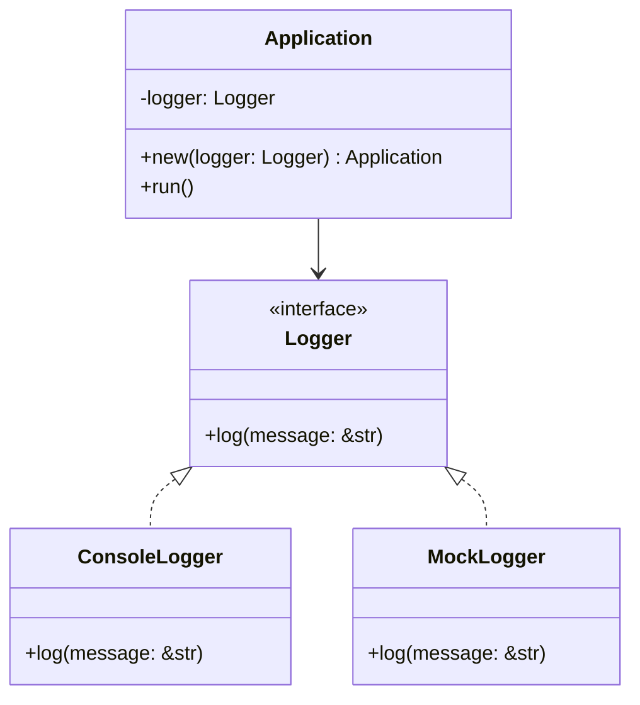

## 6.7. Dependency Injection via Traits and Generics

In this section, we will delve into the concept of Dependency Injection (DI) in Rust, focusing on how traits and generics can be leveraged to achieve a flexible and testable codebase. Dependency Injection is a design pattern that helps in decoupling components, making your code more modular and easier to maintain. Let's explore how Rust's unique features can be utilized to implement DI effectively.

### Understanding Dependency Injection

**Dependency Injection** is a design pattern used to achieve Inversion of Control (IoC) between classes and their dependencies. Instead of a class creating its dependencies, they are provided to the class, usually through constructors or setters. This approach offers several benefits:

- **Decoupling**: By injecting dependencies, you decouple the implementation from the interface, allowing for more flexible code.
- **Testability**: It becomes easier to test components in isolation by injecting mock dependencies.
- **Maintainability**: Changes in dependencies do not require changes in the dependent class, promoting easier maintenance.

### Traits as Interfaces for Dependencies

In Rust, traits serve as a powerful tool to define interfaces for dependencies. A trait can specify a set of methods that a type must implement, allowing different implementations to be swapped in and out as needed.

```rust
trait Logger {
    fn log(&self, message: &str);
}

struct ConsoleLogger;

impl Logger for ConsoleLogger {
    fn log(&self, message: &str) {
        println!("Console: {}", message);
    }
}
```

In this example, the `Logger` trait defines a `log` method. The `ConsoleLogger` struct implements this trait, providing a concrete implementation of the `log` method.

### Using Generics and Trait Bounds for Dependency Injection

Generics in Rust allow you to write flexible and reusable code. When combined with trait bounds, they enable you to inject dependencies that conform to a specific interface.

```rust
struct Application<T: Logger> {
    logger: T,
}

impl<T: Logger> Application<T> {
    fn new(logger: T) -> Self {
        Application { logger }
    }

    fn run(&self) {
        self.logger.log("Application is running");
    }
}
```

Here, the `Application` struct is generic over `T`, where `T` must implement the `Logger` trait. This allows any type that implements `Logger` to be injected into `Application`.

### Managing Lifetimes and Ownership in Dependency Injection

Rust's ownership model ensures memory safety without a garbage collector, which can complicate dependency injection. It's crucial to manage lifetimes and ownership correctly to avoid issues like dangling references or memory leaks.

#### Lifetime Annotations

When dealing with references in DI, you may need to use lifetime annotations to specify how long references should be valid.

```rust
struct Application<'a, T: Logger> {
    logger: &'a T,
}

impl<'a, T: Logger> Application<'a, T> {
    fn new(logger: &'a T) -> Self {
        Application { logger }
    }

    fn run(&self) {
        self.logger.log("Application is running");
    }
}
```

In this example, the `Application` struct holds a reference to a `Logger`, and the lifetime `'a` ensures that the reference remains valid for the duration of the `Application` instance.

#### Ownership and Borrowing

When injecting dependencies, you can choose between owning the dependency or borrowing it. Owning a dependency can be useful when the injected component needs to manage the lifecycle of the dependency.

```rust
struct Application<T: Logger> {
    logger: Box<T>,
}

impl<T: Logger> Application<T> {
    fn new(logger: Box<T>) -> Self {
        Application { logger }
    }

    fn run(&self) {
        self.logger.log("Application is running");
    }
}
```

In this case, `Application` owns the `Logger` instance, which is stored in a `Box`, allowing for dynamic dispatch if needed.

### Impact on Code Modularity and Unit Testing

Dependency Injection significantly enhances code modularity by decoupling components. This decoupling makes it easier to swap out implementations without affecting the rest of the codebase. Additionally, DI facilitates unit testing by allowing mock implementations to be injected during tests.

#### Unit Testing with Mock Dependencies

```rust
struct MockLogger;

impl Logger for MockLogger {
    fn log(&self, message: &str) {
        println!("Mock: {}", message);
    }
}

#[cfg(test)]
mod tests {
    use super::*;

    #[test]
    fn test_application_run() {
        let logger = MockLogger;
        let app = Application::new(logger);
        app.run();
    }
}
```

In this test, we use `MockLogger` to verify the behavior of `Application` without relying on a real logger. This approach makes tests more reliable and faster.

### Visualizing Dependency Injection in Rust

Let's visualize how Dependency Injection works in Rust using a class diagram.



**Diagram Description**: This class diagram illustrates the relationship between the `Logger` trait and its implementations (`ConsoleLogger` and `MockLogger`). The `Application` class depends on the `Logger` interface, allowing for flexible dependency injection.

### Try It Yourself

To deepen your understanding, try modifying the code examples:

- Implement a `FileLogger` that writes logs to a file and inject it into the `Application`.
- Experiment with different lifetime annotations to see how they affect the code.
- Create a test that verifies the behavior of `Application` using a `FileLogger`.

### Conclusion

Dependency Injection via traits and generics in Rust provides a powerful mechanism to decouple components, enhance modularity, and improve testability. By leveraging Rust's unique features, such as traits, generics, and ownership, you can implement DI effectively in your projects. Remember, this is just the beginning. As you progress, you'll discover more advanced techniques and patterns to refine your Rust applications. Keep experimenting, stay curious, and enjoy the journey!

## Quiz Time!



### What is the primary benefit of using Dependency Injection?

- [x] Decoupling components
- [ ] Increasing code complexity
- [ ] Reducing code readability
- [ ] Decreasing testability

> **Explanation:** Dependency Injection helps in decoupling components, making the code more flexible and easier to maintain.

### How do traits in Rust help with Dependency Injection?

- [x] They define interfaces for dependencies
- [ ] They increase code execution speed
- [ ] They provide memory safety
- [ ] They simplify syntax

> **Explanation:** Traits define interfaces for dependencies, allowing different implementations to be injected.

### What is the role of generics in Dependency Injection in Rust?

- [x] They allow for flexible and reusable code
- [ ] They enforce strict type checking
- [ ] They simplify error handling
- [ ] They reduce memory usage

> **Explanation:** Generics enable flexible and reusable code by allowing different types to be injected as dependencies.

### What is the purpose of lifetime annotations in Rust?

- [x] To specify how long references should be valid
- [ ] To improve code readability
- [ ] To increase execution speed
- [ ] To simplify syntax

> **Explanation:** Lifetime annotations specify how long references should be valid, ensuring memory safety.

### How does Dependency Injection improve testability?

- [x] By allowing mock dependencies to be injected
- [ ] By reducing code complexity
- [ ] By increasing code execution speed
- [ ] By simplifying syntax

> **Explanation:** Dependency Injection allows mock dependencies to be injected, making it easier to test components in isolation.

### What is the advantage of using Box<T> for dependency injection?

- [x] It allows for dynamic dispatch
- [ ] It increases code readability
- [ ] It simplifies syntax
- [ ] It reduces memory usage

> **Explanation:** Using `Box<T>` allows for dynamic dispatch, enabling more flexible dependency management.

### Which of the following is a common use case for Dependency Injection?

- [x] Unit testing
- [ ] Increasing code complexity
- [ ] Reducing code readability
- [ ] Decreasing testability

> **Explanation:** Dependency Injection is commonly used to facilitate unit testing by allowing mock dependencies.

### What is the impact of Dependency Injection on code modularity?

- [x] It enhances modularity by decoupling components
- [ ] It reduces modularity by coupling components
- [ ] It has no impact on modularity
- [ ] It decreases code readability

> **Explanation:** Dependency Injection enhances modularity by decoupling components, making the code more flexible.

### True or False: Dependency Injection can only be implemented using traits in Rust.

- [x] False
- [ ] True

> **Explanation:** While traits are a common way to implement Dependency Injection, other methods such as closures can also be used.

### Which of the following is NOT a benefit of Dependency Injection?

- [ ] Decoupling components
- [ ] Enhancing testability
- [ ] Improving maintainability
- [x] Increasing code complexity

> **Explanation:** Dependency Injection aims to reduce code complexity by decoupling components and enhancing testability and maintainability.


