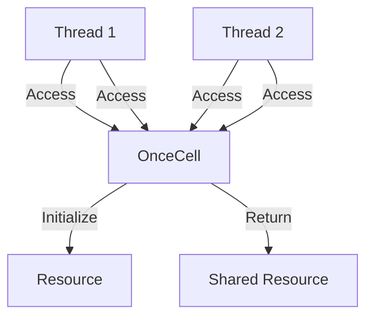

## 6.8. Lazy Initialization and the `OnceCell`

Lazy initialization is a powerful design pattern that defers the creation of an object until it is needed. This approach can lead to significant improvements in performance and resource management, particularly in systems programming where resource constraints are a common concern. In Rust, lazy initialization is elegantly handled using the `OnceCell` and `Lazy` types, which provide a safe and efficient way to initialize data only once and share it across threads.

### Understanding Lazy Initialization

Lazy initialization is a technique where the initialization of a resource is delayed until it is first accessed. This can be particularly useful in scenarios where:

- **Resource-Intensive Initialization**: The initialization process is costly in terms of time or computational resources.
- **Conditional Initialization**: The resource may not be needed in every execution path.
- **Improved Startup Time**: Deferring initialization can lead to faster startup times for applications.

By using lazy initialization, we can optimize resource usage and improve the overall performance of our applications.

### Introducing `OnceCell` and `Lazy`

Rust provides the `once_cell` crate, which includes the `OnceCell` and `Lazy` types. These types are designed to facilitate lazy initialization in a thread-safe manner.

- **`OnceCell`**: A cell that can be written to only once. It provides a way to initialize a value once and share it across threads safely.
- **`Lazy`**: A wrapper around `OnceCell` that automatically initializes the value on first access.

Both `OnceCell` and `Lazy` ensure that the initialization code is executed only once, even in the presence of multiple threads.

### Using `OnceCell` for Lazy Initialization

The `OnceCell` type is a versatile tool for lazy initialization. It allows you to initialize a value once and then access it safely from multiple threads. Here's how you can use `OnceCell`:

```rust
use once_cell::sync::OnceCell;
use std::thread;

static CONFIG: OnceCell<String> = OnceCell::new();

fn get_config() -> &'static String {
    CONFIG.get_or_init(|| {
        println!("Initializing configuration...");
        "Configuration Data".to_string()
    })
}

fn main() {
    let handles: Vec<_> = (0..5).map(|_| {
        thread::spawn(|| {
            println!("Config: {}", get_config());
        })
    }).collect();

    for handle in handles {
        handle.join().unwrap();
    }
}
```

**Explanation**:
- We define a static `OnceCell` named `CONFIG`.
- The `get_config` function initializes the `CONFIG` only once, printing a message to indicate initialization.
- Multiple threads access the configuration, but the initialization occurs only once.

### Using `Lazy` for Simplified Lazy Initialization

The `Lazy` type is a convenient wrapper around `OnceCell` that automatically handles initialization. It is particularly useful for static or global resources:

```rust
use once_cell::sync::Lazy;
use std::collections::HashMap;

static SETTINGS: Lazy<HashMap<String, String>> = Lazy::new(|| {
    println!("Loading settings...");
    let mut map = HashMap::new();
    map.insert("theme".to_string(), "dark".to_string());
    map.insert("language".to_string(), "en".to_string());
    map
});

fn main() {
    println!("Theme: {}", SETTINGS.get("theme").unwrap());
    println!("Language: {}", SETTINGS.get("language").unwrap());
}
```

**Explanation**:
- We define a static `Lazy` named `SETTINGS`.
- The initialization function is executed the first time `SETTINGS` is accessed.
- The `Lazy` type simplifies the code by handling the initialization logic internally.

### Thread Safety and Synchronization

Both `OnceCell` and `Lazy` are designed to be thread-safe. They ensure that the initialization code is executed only once, even when accessed from multiple threads. This is achieved through internal synchronization mechanisms that prevent race conditions.

#### Visualizing Thread Safety with `OnceCell`



**Diagram Explanation**:
- Multiple threads attempt to access the `OnceCell`.
- The `OnceCell` ensures that the resource is initialized only once.
- Once initialized, the shared resource is returned to all threads.

### Benefits of Lazy Initialization

Lazy initialization offers several benefits:

- **Improved Startup Time**: By deferring initialization, applications can start faster.
- **Resource Efficiency**: Resources are allocated only when needed, reducing unnecessary overhead.
- **Simplified Code**: The `Lazy` type simplifies the implementation of lazy initialization, reducing boilerplate code.

### Practical Considerations

When using lazy initialization, consider the following:

- **Initialization Cost**: Ensure that the initialization logic is not too costly or blocking, as it can delay the first access.
- **Error Handling**: Handle potential errors during initialization gracefully.
- **Thread Safety**: Use `OnceCell` and `Lazy` to ensure thread-safe access to shared resources.

### Try It Yourself

Experiment with the provided code examples by modifying the initialization logic or adding additional threads. Observe how the `OnceCell` and `Lazy` types handle concurrent access and initialization.

### External Resources

For more information on the `once_cell` crate, visit the [official documentation](https://crates.io/crates/once_cell).

### Summary

Lazy initialization is a valuable technique for optimizing resource management and performance in Rust applications. By leveraging the `OnceCell` and `Lazy` types, developers can implement lazy initialization safely and efficiently. These tools provide a robust solution for managing static and global resources, ensuring that they are initialized only when needed.

## Quiz Time!



### What is lazy initialization?

- [x] A technique that defers the creation of an object until it is needed.
- [ ] A method to initialize all objects at the start of a program.
- [ ] A process to initialize objects in parallel.
- [ ] A technique to initialize objects in a random order.

> **Explanation:** Lazy initialization defers the creation of an object until it is needed, optimizing resource usage.

### What is the purpose of `OnceCell` in Rust?

- [x] To initialize a value once and share it across threads safely.
- [ ] To initialize a value multiple times in different threads.
- [ ] To provide a mutable reference to a value.
- [ ] To initialize values in a non-thread-safe manner.

> **Explanation:** `OnceCell` is used to initialize a value once and share it safely across threads.

### How does `Lazy` simplify lazy initialization?

- [x] By automatically handling initialization on first access.
- [ ] By requiring manual initialization in each thread.
- [ ] By providing mutable access to the initialized value.
- [ ] By initializing values in a random order.

> **Explanation:** `Lazy` simplifies lazy initialization by automatically handling the initialization logic on first access.

### What is a key benefit of lazy initialization?

- [x] Improved startup time.
- [ ] Increased memory usage.
- [ ] Slower execution speed.
- [ ] Reduced code readability.

> **Explanation:** Lazy initialization can improve startup time by deferring resource allocation until needed.

### Which crate provides `OnceCell` and `Lazy` types?

- [x] `once_cell`
- [ ] `lazy_static`
- [ ] `std::sync`
- [ ] `tokio`

> **Explanation:** The `once_cell` crate provides the `OnceCell` and `Lazy` types for lazy initialization.

### What is a potential drawback of lazy initialization?

- [x] Delayed first access due to initialization cost.
- [ ] Increased memory usage.
- [ ] Reduced code readability.
- [ ] Increased startup time.

> **Explanation:** Lazy initialization can delay the first access if the initialization logic is costly.

### How does `OnceCell` ensure thread safety?

- [x] Through internal synchronization mechanisms.
- [ ] By providing mutable access to the value.
- [ ] By initializing values in parallel.
- [ ] By requiring manual synchronization.

> **Explanation:** `OnceCell` uses internal synchronization mechanisms to ensure thread safety.

### What should be considered when using lazy initialization?

- [x] Initialization cost and error handling.
- [ ] The number of threads accessing the value.
- [ ] The size of the initialized value.
- [ ] The order of initialization.

> **Explanation:** Consider the initialization cost and handle potential errors gracefully when using lazy initialization.

### Can `Lazy` be used for non-static resources?

- [x] True
- [ ] False

> **Explanation:** `Lazy` can be used for both static and non-static resources, though it is commonly used for static ones.

### What is the main advantage of using `Lazy` over `OnceCell`?

- [x] Simplified code with automatic initialization.
- [ ] Increased performance.
- [ ] Reduced memory usage.
- [ ] Enhanced error handling.

> **Explanation:** `Lazy` provides simplified code by automatically handling initialization, reducing boilerplate.



Remember, mastering lazy initialization in Rust is just the beginning. As you continue to explore Rust's powerful features, you'll discover even more ways to optimize your code and improve performance. Keep experimenting, stay curious, and enjoy the journey!
