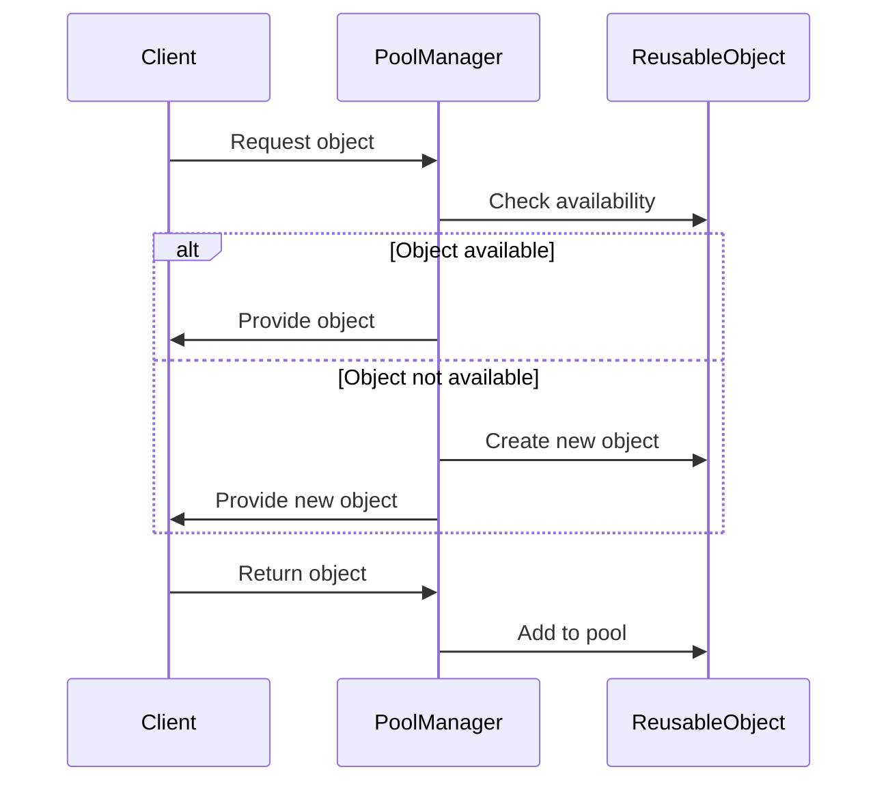

## 6.9. Object Pool Pattern

In the world of software design patterns, the Object Pool pattern stands out as a powerful technique for optimizing resource management. This pattern is particularly useful in scenarios where object creation is costly, either in terms of time or system resources. By reusing objects from a pool, we can significantly enhance performance and reduce the overhead associated with frequent object instantiation and destruction.

### Intent

The Object Pool pattern aims to manage a set of initialized objects that are kept ready to use, rather than being created and destroyed on demand. This is especially beneficial for objects that are expensive to create, such as database connections, thread pools, or large data structures.

### Key Participants

- **Pool Manager**: Manages the lifecycle of objects within the pool, handling allocation and deallocation.
- **Reusable Object**: The object that is managed by the pool and reused by clients.
- **Client**: The entity that requests and returns objects to the pool.

### Advantages of the Object Pool Pattern

- **Performance Improvement**: By reusing objects, the pattern reduces the overhead of object creation and destruction.
- **Resource Management**: Helps in managing limited resources, such as database connections or network sockets.
- **Predictable Performance**: Reduces the variability in response times by avoiding the need for frequent object creation.

### Implementing a Thread-Safe Object Pool in Rust

Rust's ownership and borrowing model, along with its powerful concurrency primitives, make it an excellent choice for implementing a thread-safe object pool. Let's explore how we can achieve this using Rust's synchronization primitives like `Mutex` and `RwLock`.

#### Step-by-Step Implementation

1. **Define the Object Pool Structure**: We'll start by defining a structure to represent our object pool. This structure will hold a vector of reusable objects and a `Mutex` to ensure thread safety.

```rust
use std::sync::{Arc, Mutex};

struct ObjectPool<T> {
    pool: Arc<Mutex<Vec<T>>>,
}

impl<T> ObjectPool<T> {
    fn new() -> Self {
        ObjectPool {
            pool: Arc::new(Mutex::new(Vec::new())),
        }
    }

    fn get(&self) -> Option<T> {
        let mut pool = self.pool.lock().unwrap();
        pool.pop()
    }

    fn return_to_pool(&self, obj: T) {
        let mut pool = self.pool.lock().unwrap();
        pool.push(obj);
    }
}
```

2. **Create and Manage Objects**: The `get` method retrieves an object from the pool, while the `return_to_pool` method returns an object back to the pool. The use of `Mutex` ensures that these operations are thread-safe.

3. **Ownership and Borrowing**: In Rust, ownership and borrowing are crucial concepts that affect how we manage objects in the pool. The pool takes ownership of objects when they are returned and relinquishes ownership when they are retrieved.

4. **Using the Object Pool**: Let's see how we can use this object pool in a multi-threaded context.

```rust
use std::thread;

fn main() {
    let pool = ObjectPool::new();

    // Simulate adding objects to the pool
    for i in 0..10 {
        pool.return_to_pool(i);
    }

    let handles: Vec<_> = (0..5).map(|_| {
        let pool = pool.clone();
        thread::spawn(move || {
            if let Some(obj) = pool.get() {
                println!("Got object: {}", obj);
                pool.return_to_pool(obj);
            }
        })
    }).collect();

    for handle in handles {
        handle.join().unwrap();
    }
}
```

In this example, we create a pool of integers and spawn multiple threads to retrieve and return objects to the pool. The use of `Arc` allows us to share the pool across threads safely.

### Visualizing the Object Pool Pattern

To better understand the flow of the Object Pool pattern, let's visualize it using a sequence diagram.



This diagram illustrates the interaction between the client, pool manager, and reusable objects. The pool manager checks for available objects and provides them to the client, creating new ones if necessary.

### Design Considerations

- **Thread Safety**: Ensure that the pool is thread-safe, especially in multi-threaded applications. Use synchronization primitives like `Mutex` or `RwLock`.
- **Object Lifecycle**: Consider the lifecycle of objects in the pool. Decide when objects should be created, reused, or destroyed.
- **Pool Size**: Determine the optimal size of the pool based on the application's requirements and resource constraints.

### Rust Unique Features

Rust's ownership model and concurrency primitives make it uniquely suited for implementing the Object Pool pattern. The language's emphasis on safety and performance ensures that object pools are both efficient and reliable.

### Differences and Similarities

The Object Pool pattern is often confused with the Flyweight pattern. While both aim to optimize resource usage, the Flyweight pattern focuses on sharing immutable state, whereas the Object Pool pattern manages reusable objects.

### Use Cases

- **Database Connections**: Managing a pool of database connections to reduce the overhead of establishing connections.
- **Thread Pools**: Reusing threads to handle tasks efficiently.
- **Network Sockets**: Managing a pool of network sockets for high-performance networking applications.

### Try It Yourself

Experiment with the object pool implementation by modifying the pool size or the type of objects it manages. Try using different synchronization primitives to see how they affect performance.

### Key Takeaways

- The Object Pool pattern is a powerful tool for optimizing resource management.
- Rust's ownership and concurrency features make it an excellent choice for implementing thread-safe object pools.
- Consider the lifecycle and size of the pool based on your application's needs.

## Quiz Time!



### What is the primary goal of the Object Pool pattern?

- [x] To manage a set of initialized objects that are kept ready to use.
- [ ] To create new objects on demand.
- [ ] To share immutable state across objects.
- [ ] To reduce the number of classes in a program.

> **Explanation:** The Object Pool pattern aims to manage a set of initialized objects that are kept ready to use, rather than being created and destroyed on demand.

### Which Rust feature is crucial for implementing a thread-safe object pool?

- [x] Synchronization primitives like `Mutex` or `RwLock`.
- [ ] The `Drop` trait.
- [ ] The `Copy` trait.
- [ ] The `Clone` trait.

> **Explanation:** Synchronization primitives like `Mutex` or `RwLock` are crucial for ensuring thread safety in a multi-threaded environment.

### How does Rust's ownership model affect object pooling?

- [x] The pool takes ownership of objects when they are returned and relinquishes ownership when they are retrieved.
- [ ] Objects in the pool are always borrowed.
- [ ] Ownership does not affect object pooling.
- [ ] Objects in the pool are always cloned.

> **Explanation:** In Rust, the pool takes ownership of objects when they are returned and relinquishes ownership when they are retrieved, ensuring safe memory management.

### What is a common use case for the Object Pool pattern?

- [x] Managing a pool of database connections.
- [ ] Implementing a user interface.
- [ ] Creating a new class hierarchy.
- [ ] Sharing immutable state.

> **Explanation:** A common use case for the Object Pool pattern is managing a pool of database connections to reduce the overhead of establishing connections.

### Which diagram best represents the Object Pool pattern?

- [x] Sequence diagram showing interaction between client, pool manager, and reusable objects.
- [ ] Class diagram showing inheritance hierarchy.
- [ ] State diagram showing object states.
- [ ] Activity diagram showing process flow.

> **Explanation:** A sequence diagram showing interaction between client, pool manager, and reusable objects best represents the Object Pool pattern.

### What is the difference between the Object Pool and Flyweight patterns?

- [x] Object Pool manages reusable objects, while Flyweight shares immutable state.
- [ ] Object Pool shares immutable state, while Flyweight manages reusable objects.
- [ ] Both patterns manage reusable objects.
- [ ] Both patterns share immutable state.

> **Explanation:** The Object Pool pattern manages reusable objects, while the Flyweight pattern focuses on sharing immutable state.

### What should be considered when determining the size of an object pool?

- [x] The application's requirements and resource constraints.
- [ ] The number of classes in the program.
- [ ] The number of methods in the program.
- [ ] The number of threads in the program.

> **Explanation:** The size of an object pool should be determined based on the application's requirements and resource constraints.

### How can you experiment with the object pool implementation?

- [x] Modify the pool size or the type of objects it manages.
- [ ] Change the programming language.
- [ ] Remove synchronization primitives.
- [ ] Increase the number of classes.

> **Explanation:** Experiment with the object pool implementation by modifying the pool size or the type of objects it manages.

### What is a key advantage of using the Object Pool pattern?

- [x] Performance improvement by reusing objects.
- [ ] Increased complexity in code.
- [ ] Reduced number of classes.
- [ ] Increased memory usage.

> **Explanation:** A key advantage of the Object Pool pattern is performance improvement by reusing objects, reducing the overhead of object creation and destruction.

### True or False: The Object Pool pattern is only useful for managing database connections.

- [ ] True
- [x] False

> **Explanation:** False. The Object Pool pattern is useful for managing various types of resources, such as database connections, thread pools, and network sockets.



Remember, this is just the beginning. As you progress, you'll build more complex and efficient systems using the Object Pool pattern. Keep experimenting, stay curious, and enjoy the journey!
