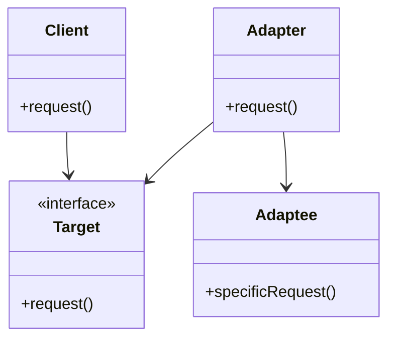

## 7.1. Adapter Pattern Using Traits and Trait Objects

In the world of software design, the Adapter Pattern is a structural design pattern that allows objects with incompatible interfaces to work together. This pattern is particularly useful when integrating new components into an existing system or when working with third-party libraries. In Rust, we can leverage traits and trait objects to implement the Adapter Pattern effectively, providing both flexibility and reusability in our code.

### Intent of the Adapter Pattern

The primary intent of the Adapter Pattern is to convert the interface of a class into another interface that clients expect. It allows classes to work together that couldn't otherwise because of incompatible interfaces. By using an adapter, we can create a bridge between two incompatible interfaces, enabling them to communicate seamlessly.

### Key Participants

- **Target Interface**: The interface that the client expects.
- **Adapter**: The class that implements the target interface and adapts the Adaptee to the Target.
- **Adaptee**: The existing interface that needs adapting.
- **Client**: The class that interacts with the Target interface.

### Visualizing the Adapter Pattern

Let's visualize the Adapter Pattern using a class diagram to understand the relationships between the components.



**Diagram Description**: In this diagram, the `Client` interacts with the `Target` interface. The `Adapter` implements the `Target` interface and adapts the `Adaptee` to the `Target`, allowing the `Client` to use the `Adaptee` through the `Adapter`.

### Implementing the Adapter Pattern in Rust

In Rust, we can use traits to define the target interface and implement adapters that conform to this interface. Let's explore how to achieve this with a practical example.

#### Defining the Target Interface with Traits

In Rust, traits are used to define shared behavior. We can define a trait to represent the target interface that the client expects.

```rust
// Define the Target trait
trait Target {
    fn request(&self) -> String;
}
```

#### Creating the Adaptee

The Adaptee is the existing interface that needs to be adapted. It has a method that is incompatible with the Target interface.

```rust
// Define the Adaptee with a specific request method
struct Adaptee;

impl Adaptee {
    fn specific_request(&self) -> String {
        "Adaptee's specific request".to_string()
    }
}
```

#### Implementing the Adapter

The Adapter implements the Target trait and adapts the Adaptee to the Target interface.

```rust
// Define the Adapter that implements the Target trait
struct Adapter {
    adaptee: Adaptee,
}

impl Adapter {
    fn new(adaptee: Adaptee) -> Self {
        Adapter { adaptee }
    }
}

impl Target for Adapter {
    fn request(&self) -> String {
        // Adapt the specific request to the target request
        format!("Adapter: {}", self.adaptee.specific_request())
    }
}
```

#### Using the Adapter

Now, let's see how the client can use the Adapter to interact with the Adaptee through the Target interface.

```rust
fn main() {
    let adaptee = Adaptee;
    let adapter = Adapter::new(adaptee);

    // Client uses the Target interface
    println!("{}", adapter.request());
}
```

**Output**:
```
Adapter: Adaptee's specific request
```

### Static vs. Dynamic Dispatch

In Rust, we have the option to use either static or dynamic dispatch when working with traits. Understanding the difference between these two is crucial when implementing the Adapter Pattern.

#### Static Dispatch

Static dispatch occurs when the compiler knows the exact type that implements the trait at compile time. This allows for inlining and optimizations, resulting in faster code execution. Static dispatch is achieved using generics.

```rust
fn use_target<T: Target>(target: T) {
    println!("{}", target.request());
}
```

#### Dynamic Dispatch

Dynamic dispatch, on the other hand, occurs when the exact type implementing the trait is not known until runtime. This is achieved using trait objects, which allow for more flexibility at the cost of some performance.

```rust
fn use_target_dyn(target: &dyn Target) {
    println!("{}", target.request());
}
```

### Benefits of Using the Adapter Pattern in Rust

- **Code Reusability**: By using traits and adapters, we can reuse existing code without modifying it.
- **Flexibility**: The Adapter Pattern allows us to integrate new components into an existing system seamlessly.
- **Decoupling**: It decouples the client from the specific implementation of the Adaptee, promoting loose coupling.

### Rust's Unique Features

Rust's powerful type system and ownership model make it an excellent choice for implementing the Adapter Pattern. Traits provide a flexible way to define interfaces, while ownership and borrowing ensure memory safety without a garbage collector.

### Differences and Similarities with Other Patterns

The Adapter Pattern is often confused with the Decorator Pattern. While both involve wrapping an object, the Adapter Pattern focuses on converting interfaces, whereas the Decorator Pattern adds additional behavior.

### Try It Yourself

To deepen your understanding, try modifying the code examples to adapt different interfaces. Experiment with both static and dynamic dispatch to see how they affect performance and flexibility.

### Knowledge Check

- What is the primary intent of the Adapter Pattern?
- How do traits help in implementing the Adapter Pattern in Rust?
- What is the difference between static and dynamic dispatch?
- How does the Adapter Pattern promote code reusability?

### Summary

The Adapter Pattern is a powerful tool in Rust for bridging incompatible interfaces. By leveraging traits and trait objects, we can create flexible and reusable code that integrates seamlessly into existing systems. Remember, this is just the beginning. As you progress, you'll discover more design patterns and techniques that will enhance your Rust programming skills. Keep experimenting, stay curious, and enjoy the journey!

## Quiz Time!



### What is the primary intent of the Adapter Pattern?

- [x] To convert the interface of a class into another interface that clients expect.
- [ ] To add new functionality to an existing class.
- [ ] To create a new interface for a class.
- [ ] To remove functionality from a class.

> **Explanation:** The Adapter Pattern is used to convert the interface of a class into another interface that clients expect, allowing incompatible interfaces to work together.

### How do traits help in implementing the Adapter Pattern in Rust?

- [x] Traits define the target interface that the adapter must implement.
- [ ] Traits provide a way to store state in the adapter.
- [ ] Traits allow for dynamic dispatch only.
- [ ] Traits are used to manage memory in the adapter.

> **Explanation:** Traits in Rust define the target interface that the adapter must implement, allowing for flexible and reusable code.

### What is the difference between static and dynamic dispatch?

- [x] Static dispatch is determined at compile time, while dynamic dispatch is determined at runtime.
- [ ] Static dispatch is slower than dynamic dispatch.
- [ ] Dynamic dispatch is determined at compile time, while static dispatch is determined at runtime.
- [ ] Static dispatch uses trait objects, while dynamic dispatch uses generics.

> **Explanation:** Static dispatch is determined at compile time and allows for optimizations, while dynamic dispatch is determined at runtime and provides more flexibility.

### How does the Adapter Pattern promote code reusability?

- [x] By allowing existing code to be reused without modification.
- [ ] By creating new interfaces for existing code.
- [ ] By adding new functionality to existing code.
- [ ] By removing unnecessary code from the system.

> **Explanation:** The Adapter Pattern allows existing code to be reused without modification by adapting it to a new interface.

### Which of the following is a key participant in the Adapter Pattern?

- [x] Target Interface
- [ ] Decorator
- [ ] Singleton
- [ ] Factory

> **Explanation:** The Target Interface is a key participant in the Adapter Pattern, representing the interface that the client expects.

### What is the role of the Adapter in the Adapter Pattern?

- [x] To implement the target interface and adapt the Adaptee to the Target.
- [ ] To provide a new interface for the Adaptee.
- [ ] To add new functionality to the Adaptee.
- [ ] To remove functionality from the Adaptee.

> **Explanation:** The Adapter implements the target interface and adapts the Adaptee to the Target, allowing the client to use the Adaptee through the Adapter.

### What is the benefit of using dynamic dispatch in the Adapter Pattern?

- [x] It provides more flexibility at runtime.
- [ ] It allows for faster code execution.
- [ ] It reduces memory usage.
- [ ] It simplifies the code structure.

> **Explanation:** Dynamic dispatch provides more flexibility at runtime, allowing for different implementations to be used interchangeably.

### In Rust, how is dynamic dispatch achieved?

- [x] Using trait objects.
- [ ] Using generics.
- [ ] Using enums.
- [ ] Using structs.

> **Explanation:** Dynamic dispatch in Rust is achieved using trait objects, which allow for runtime polymorphism.

### What is a common misconception about the Adapter Pattern?

- [x] It is often confused with the Decorator Pattern.
- [ ] It is used to add new functionality to a class.
- [ ] It is used to remove functionality from a class.
- [ ] It is used to create new interfaces for a class.

> **Explanation:** The Adapter Pattern is often confused with the Decorator Pattern, but they serve different purposes.

### True or False: The Adapter Pattern can only be used with object-oriented languages.

- [ ] True
- [x] False

> **Explanation:** The Adapter Pattern can be used in various programming paradigms, including functional and procedural, not just object-oriented languages.



Remember, the journey of mastering Rust and its design patterns is ongoing. Keep exploring, experimenting, and learning. Happy coding!
