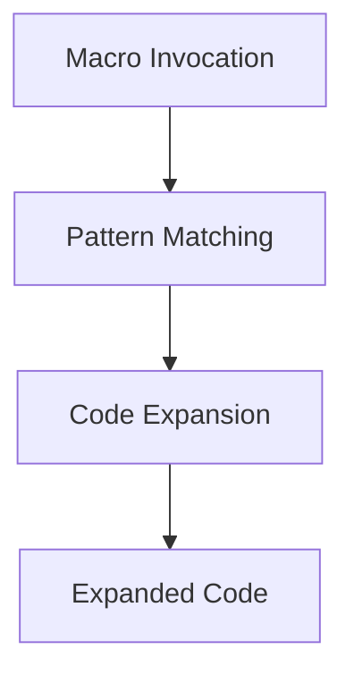

## 7.10. Extending Functionality with Macros

In the world of Rust programming, macros are a powerful tool that can significantly enhance the functionality of your code. They allow you to write code that writes other code, reducing boilerplate and enabling the addition of functionality in a declarative manner. In this section, we will delve into Rust's macro facilities, explore examples of macros that extend functionality, discuss how macros can implement structural patterns, and highlight best practices for writing and using macros.

### Introduction to Rust's Macro Facilities

Rust provides two main types of macros: **declarative macros** and **procedural macros**. Each serves different purposes and offers unique capabilities.

#### Declarative Macros (`macro_rules!`)

Declarative macros, also known as `macro_rules!`, are the most common type of macros in Rust. They allow you to define patterns that are matched against the input tokens and then expanded into code. These macros are particularly useful for reducing repetitive code and implementing domain-specific languages (DSLs).

```rust
// Example of a simple declarative macro
macro_rules! say_hello {
    () => {
        println!("Hello, world!");
    };
}

fn main() {
    say_hello!(); // Expands to println!("Hello, world!");
}
```

In this example, the `say_hello!` macro is defined to print "Hello, world!" whenever it is invoked. This is a simple demonstration of how declarative macros can encapsulate repetitive code.

#### Procedural Macros

Procedural macros are more powerful and flexible than declarative macros. They operate on the abstract syntax tree (AST) of the code, allowing for more complex transformations. Procedural macros come in three flavors: **function-like macros**, **derive macros**, and **attribute macros**.

- **Function-like macros**: These macros look like function calls but operate on the code passed to them.
- **Derive macros**: These are used to automatically implement traits for data structures.
- **Attribute macros**: These are used to modify the behavior of items, such as functions or structs.

```rust
// Example of a derive procedural macro
use serde::{Serialize, Deserialize};

#[derive(Serialize, Deserialize)]
struct Point {
    x: i32,
    y: i32,
}
```

In this example, the `Serialize` and `Deserialize` derive macros from the `serde` crate automatically generate the necessary code to serialize and deserialize the `Point` struct.

### Extending Functionality with Macros

Macros can be used to extend functionality in various ways, from generating boilerplate code to implementing complex design patterns. Let's explore some examples.

#### Deriving Traits

One of the most common uses of macros in Rust is to derive traits for structs and enums. This can save a significant amount of boilerplate code and ensure consistency across your codebase.

```rust
#[derive(Debug, Clone, PartialEq)]
struct Rectangle {
    width: u32,
    height: u32,
}
```

In this example, the `Debug`, `Clone`, and `PartialEq` traits are automatically implemented for the `Rectangle` struct, allowing it to be printed, cloned, and compared for equality without manually writing the implementations.

#### Implementing Structural Patterns

Macros can also be used to implement structural design patterns, such as the **Decorator Pattern**. This pattern allows behavior to be added to individual objects, dynamically, without affecting the behavior of other objects from the same class.

```rust
macro_rules! decorator {
    ($name:ident, $base:ty, $method:ident, $body:block) => {
        struct $name {
            base: Box<$base>,
        }

        impl $base for $name {
            fn $method(&self) {
                // Call the base method
                self.base.$method();
                // Additional behavior
                $body
            }
        }
    };
}

// Usage example
trait Component {
    fn operation(&self);
}

struct ConcreteComponent;

impl Component for ConcreteComponent {
    fn operation(&self) {
        println!("ConcreteComponent operation");
    }
}

decorator!(ConcreteDecorator, Component, operation, {
    println!("Additional behavior in ConcreteDecorator");
});

fn main() {
    let component = ConcreteComponent;
    let decorated = ConcreteDecorator { base: Box::new(component) };
    decorated.operation();
}
```

In this example, the `decorator!` macro is used to create a decorator that adds additional behavior to the `operation` method of a `Component`.

### Balancing Macro Complexity and Code Clarity

While macros can be incredibly powerful, they can also introduce complexity and reduce code clarity if not used judiciously. Here are some considerations to keep in mind:

- **Readability**: Ensure that the macro's purpose and usage are clear to anyone reading the code. Use descriptive names and provide documentation.
- **Debugging**: Macros can make debugging more challenging, as the expanded code is not always immediately visible. Use tools like `cargo expand` to view the expanded code.
- **Complexity**: Avoid overly complex macros that are difficult to understand and maintain. If a macro becomes too complex, consider whether the functionality could be achieved through other means.

### Best Practices for Writing and Using Macros

To make the most of Rust's macro system, follow these best practices:

- **Keep it simple**: Write macros that are easy to understand and use. Avoid unnecessary complexity.
- **Document your macros**: Provide clear documentation for your macros, including examples of how to use them.
- **Test your macros**: Ensure that your macros are thoroughly tested to prevent unexpected behavior.
- **Use macros judiciously**: Only use macros when they provide a clear benefit, such as reducing boilerplate or implementing a pattern that would be cumbersome to write manually.

### Visualizing Macro Expansion

To better understand how macros work, let's visualize the expansion process using a simple flowchart.



**Figure 1**: This flowchart illustrates the process of macro expansion, where a macro invocation is matched against patterns, expanded into code, and then integrated into the final program.

### Try It Yourself

To get hands-on experience with macros, try modifying the examples provided in this section. Experiment with creating your own macros to automate repetitive tasks or implement design patterns. Remember, practice is key to mastering Rust's macro system.

### Knowledge Check

Before moving on, consider these questions to reinforce your understanding:

- What are the two main types of macros in Rust?
- How can macros be used to implement design patterns?
- What are some best practices for writing and using macros?

### Conclusion

Macros are a powerful feature of Rust that can greatly enhance the functionality of your code. By understanding how to use them effectively, you can reduce boilerplate, implement complex patterns, and write more expressive and maintainable code. Remember to balance the power of macros with the need for code clarity and maintainability.

## Quiz Time!



### What are the two main types of macros in Rust?

- [x] Declarative macros and procedural macros
- [ ] Functional macros and object-oriented macros
- [ ] Static macros and dynamic macros
- [ ] Inline macros and external macros

> **Explanation:** Rust provides two main types of macros: declarative macros (`macro_rules!`) and procedural macros, each serving different purposes.

### Which of the following is a use case for procedural macros?

- [x] Automatically implementing traits for data structures
- [ ] Performing arithmetic operations
- [ ] Managing memory allocation
- [ ] Handling network communication

> **Explanation:** Procedural macros can automatically implement traits for data structures, among other complex transformations.

### What is a common use of declarative macros in Rust?

- [x] Reducing repetitive code
- [ ] Managing database connections
- [ ] Handling user input
- [ ] Performing file I/O operations

> **Explanation:** Declarative macros are often used to reduce repetitive code by defining patterns that expand into code.

### How can macros help in implementing design patterns?

- [x] By generating boilerplate code for patterns like the Decorator Pattern
- [ ] By managing runtime state
- [ ] By optimizing memory usage
- [ ] By handling concurrency

> **Explanation:** Macros can generate boilerplate code, making it easier to implement design patterns like the Decorator Pattern.

### What should be considered when using macros?

- [x] Readability and complexity
- [ ] Network latency
- [ ] Disk space
- [ ] Battery consumption

> **Explanation:** When using macros, it's important to consider readability and complexity to ensure maintainable code.

### What tool can be used to view expanded macro code?

- [x] `cargo expand`
- [ ] `rustc`
- [ ] `cargo run`
- [ ] `rustfmt`

> **Explanation:** `cargo expand` is a tool that can be used to view the expanded code generated by macros.

### What is a potential downside of using macros?

- [x] They can make debugging more challenging
- [ ] They increase memory usage
- [ ] They slow down compilation
- [ ] They reduce code readability

> **Explanation:** Macros can make debugging more challenging because the expanded code is not always immediately visible.

### What is the purpose of derive macros?

- [x] To automatically implement traits for structs and enums
- [ ] To manage memory allocation
- [ ] To handle network communication
- [ ] To perform arithmetic operations

> **Explanation:** Derive macros automatically implement traits for structs and enums, reducing boilerplate code.

### True or False: Procedural macros operate on the abstract syntax tree (AST) of the code.

- [x] True
- [ ] False

> **Explanation:** Procedural macros operate on the AST, allowing for complex code transformations.

### What is a best practice for writing macros?

- [x] Keep them simple and well-documented
- [ ] Use them for all code transformations
- [ ] Avoid using them in production code
- [ ] Write them in a separate language

> **Explanation:** Best practices for writing macros include keeping them simple and well-documented to ensure clarity and maintainability.



Remember, this is just the beginning. As you progress, you'll build more complex and interactive applications using Rust's macro system. Keep experimenting, stay curious, and enjoy the journey!

---
