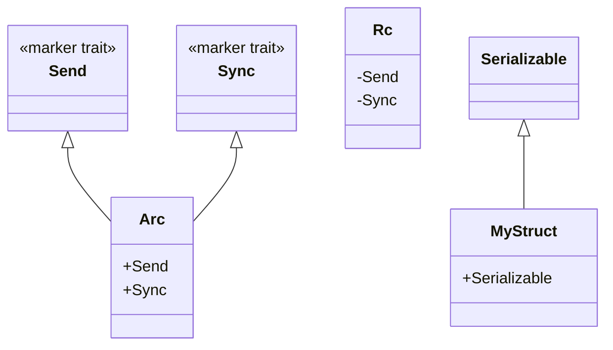

## 7.11. Marker Traits for Type Safety

In the world of Rust programming, ensuring type safety and correctness is paramount. One of the powerful tools Rust provides to achieve this is the concept of **marker traits**. Marker traits are a unique feature that allows developers to indicate specific behaviors or properties at compile time, without requiring any additional functionality to be implemented. This section will delve into what marker traits are, how they are used in Rust, and their role in enhancing type safety.

### What Are Marker Traits?

Marker traits are traits that do not have any methods or associated items. They are used to mark types with certain properties or capabilities. In Rust, marker traits are often used to convey information to the compiler about how a type can be used, particularly in the context of concurrency and memory safety.

#### Key Characteristics of Marker Traits

- **No Methods**: Marker traits do not define any methods. They serve purely as a label or tag.
- **Compile-Time Guarantees**: They provide compile-time guarantees about the types they are implemented for.
- **Type Constraints**: Marker traits can be used to enforce constraints in generic code, ensuring that only types with certain properties are used.

### Standard Marker Traits in Rust

Rust includes several standard marker traits that play a crucial role in the language's safety guarantees. Two of the most important are `Send` and `Sync`.

#### The `Send` Trait

The `Send` trait indicates that a type can be safely transferred across thread boundaries. In Rust, ownership is a key concept, and `Send` ensures that a type can be moved to another thread without causing data races.

```rust
fn is_send<T: Send>() {}

fn main() {
    // i32 is Send
    is_send::<i32>();

    // Vec<i32> is Send
    is_send::<Vec<i32>>();

    // Rc<i32> is not Send
    // is_send::<std::rc::Rc<i32>>(); // This line would cause a compile-time error
}
```

In the example above, `i32` and `Vec<i32>` are `Send`, meaning they can be safely transferred to another thread. However, `Rc<i32>` is not `Send` because `Rc` is a reference-counted pointer designed for single-threaded scenarios.

#### The `Sync` Trait

The `Sync` trait indicates that it is safe for a type to be referenced from multiple threads simultaneously. If a type `T` is `Sync`, then `&T` is `Send`, meaning that references to `T` can be shared across threads.

```rust
fn is_sync<T: Sync>() {}

fn main() {
    // i32 is Sync
    is_sync::<i32>();

    // Vec<i32> is Sync
    is_sync::<Vec<i32>>();

    // Rc<i32> is not Sync
    // is_sync::<std::rc::Rc<i32>>(); // This line would cause a compile-time error
}
```

In this example, `i32` and `Vec<i32>` are `Sync`, meaning they can be safely shared between threads. However, `Rc<i32>` is not `Sync` because it is not safe to share `Rc` across threads without additional synchronization.

### Implementing Custom Marker Traits

While Rust provides several built-in marker traits, you can also define your own to enforce specific properties or behaviors in your code. Custom marker traits can be used to signal that a type adheres to certain constraints or capabilities.

#### Example: Implementing a Custom Marker Trait

Let's create a custom marker trait called `Serializable` to indicate that a type can be serialized.

```rust
trait Serializable {}

struct MyStruct;

impl Serializable for MyStruct {}

fn requires_serializable<T: Serializable>(value: T) {
    // Function logic here
}

fn main() {
    let my_struct = MyStruct;
    requires_serializable(my_struct);
}
```

In this example, `Serializable` is a marker trait with no methods. `MyStruct` implements `Serializable`, and the function `requires_serializable` can only accept types that implement this trait.

### Enforcing Constraints in Generic Code

Marker traits are particularly useful in generic programming, where they can be used to enforce constraints on type parameters. This ensures that only types with the desired properties are used in certain contexts.

#### Example: Using Marker Traits in Generics

Consider a scenario where we want to ensure that a function can only accept types that are both `Send` and `Sync`.

```rust
fn process_data<T: Send + Sync>(data: T) {
    // Function logic here
}

fn main() {
    let data = vec![1, 2, 3];
    process_data(data);
}
```

In this example, the `process_data` function is constrained to accept only types that are both `Send` and `Sync`. This ensures that the data can be safely transferred and shared across threads.

### The Compiler's Role in Enforcing Marker Trait Guarantees

The Rust compiler plays a crucial role in enforcing the guarantees provided by marker traits. It checks the implementation of these traits at compile time, ensuring that only types with the appropriate properties are used in contexts where those properties are required.

#### Example: Compiler Enforcement

```rust
use std::rc::Rc;
use std::sync::Arc;

fn requires_send<T: Send>(value: T) {
    // Function logic here
}

fn main() {
    let rc_value = Rc::new(5);
    // requires_send(rc_value); // This line would cause a compile-time error

    let arc_value = Arc::new(5);
    requires_send(arc_value); // This is allowed
}
```

In this example, the compiler prevents the use of `Rc` in the `requires_send` function because `Rc` is not `Send`. However, `Arc` is `Send`, so it can be used safely.

### Visualizing Marker Traits

To better understand how marker traits work, let's visualize the relationship between types and marker traits using a class diagram.



**Diagram Description**: This diagram illustrates the relationship between the `Send` and `Sync` marker traits and the `Rc` and `Arc` types. It also shows a custom `Serializable` marker trait implemented by `MyStruct`.

### Try It Yourself

To solidify your understanding of marker traits, try modifying the examples above:

- Implement a custom marker trait called `Cloneable` and apply it to a struct.
- Create a function that requires a type to implement both `Cloneable` and `Serializable`.
- Experiment with different types to see how the compiler enforces marker trait constraints.

### Key Takeaways

- **Marker Traits**: Marker traits in Rust are used to indicate specific properties or capabilities of types without defining any methods.
- **Standard Marker Traits**: `Send` and `Sync` are crucial for ensuring safe concurrency in Rust.
- **Custom Marker Traits**: You can define your own marker traits to enforce specific constraints in your code.
- **Compiler Enforcement**: The Rust compiler enforces marker trait guarantees at compile time, ensuring type safety and correctness.

### References and Further Reading

- [Rust Documentation on Traits](https://doc.rust-lang.org/book/ch10-02-traits.html)
- [Rust Standard Library: Send Trait](https://doc.rust-lang.org/std/marker/trait.Send.html)
- [Rust Standard Library: Sync Trait](https://doc.rust-lang.org/std/marker/trait.Sync.html)

## Quiz Time!



### What is a marker trait in Rust?

- [x] A trait with no methods used to indicate specific properties of a type.
- [ ] A trait that defines methods for serialization.
- [ ] A trait that provides default implementations for methods.
- [ ] A trait that is used for error handling.

> **Explanation:** Marker traits do not define any methods and are used to indicate specific properties or capabilities of a type.

### Which of the following is a standard marker trait in Rust?

- [x] Send
- [ ] Clone
- [ ] Debug
- [ ] Display

> **Explanation:** `Send` is a standard marker trait in Rust, used to indicate that a type can be safely transferred across thread boundaries.

### What does the `Sync` marker trait indicate?

- [x] A type can be safely referenced from multiple threads.
- [ ] A type can be serialized.
- [ ] A type can be cloned.
- [ ] A type can be displayed.

> **Explanation:** The `Sync` marker trait indicates that a type can be safely referenced from multiple threads.

### Can you implement methods in a marker trait?

- [ ] Yes, marker traits can have methods.
- [x] No, marker traits do not have methods.
- [ ] Yes, but only default methods.
- [ ] Yes, but only in certain contexts.

> **Explanation:** Marker traits do not define any methods; they are used purely as labels or tags.

### What role does the Rust compiler play with marker traits?

- [x] It enforces the guarantees provided by marker traits at compile time.
- [ ] It generates default implementations for marker traits.
- [ ] It converts marker traits into interfaces.
- [ ] It optimizes marker traits for performance.

> **Explanation:** The Rust compiler enforces the guarantees provided by marker traits at compile time, ensuring type safety and correctness.

### Which of the following types is not `Send`?

- [ ] Vec<i32>
- [ ] Arc<i32>
- [x] Rc<i32>
- [ ] i32

> **Explanation:** `Rc<i32>` is not `Send` because it is designed for single-threaded scenarios and cannot be safely transferred across thread boundaries.

### How can you enforce that a generic type parameter implements multiple marker traits?

- [x] By specifying multiple traits in the type parameter bounds.
- [ ] By using a macro to combine traits.
- [ ] By implementing a new trait that combines them.
- [ ] By using a trait object.

> **Explanation:** You can enforce that a generic type parameter implements multiple marker traits by specifying multiple traits in the type parameter bounds.

### What is the purpose of a custom marker trait?

- [x] To signal that a type adheres to specific constraints or capabilities.
- [ ] To provide default implementations for methods.
- [ ] To optimize performance.
- [ ] To handle errors.

> **Explanation:** Custom marker traits are used to signal that a type adheres to specific constraints or capabilities.

### Can `Arc<T>` be used in a function that requires `Send`?

- [x] Yes, `Arc<T>` is `Send`.
- [ ] No, `Arc<T>` is not `Send`.
- [ ] Yes, but only if `T` is `Sync`.
- [ ] No, `Arc<T>` is `Sync` but not `Send`.

> **Explanation:** `Arc<T>` is `Send`, meaning it can be safely transferred across thread boundaries.

### Marker traits can be used to enforce constraints in which type of code?

- [x] Generic code
- [ ] Synchronous code
- [ ] Asynchronous code
- [ ] Procedural code

> **Explanation:** Marker traits can be used to enforce constraints in generic code, ensuring that only types with the desired properties are used.



Remember, this is just the beginning. As you progress, you'll discover more ways to leverage marker traits and other Rust features to write safe and efficient code. Keep experimenting, stay curious, and enjoy the journey!
