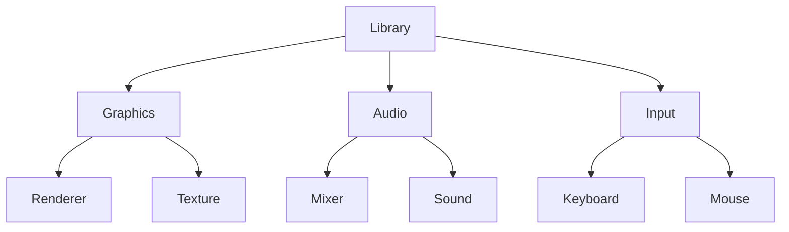

## 7.12. Module System for Encapsulation

In Rust, the module system is a powerful feature that allows developers to encapsulate implementation details and expose only what is necessary. This capability is crucial for maintaining clean interfaces and ensuring that code remains manageable and maintainable over time. In this section, we will explore how Rust's module system supports encapsulation, discuss controlling visibility with the `pub` keyword, and provide examples of organizing code to hide internal logic. We will also emphasize the importance of encapsulation for maintainability and highlight patterns for structuring modules and submodules effectively.

### Understanding Rust's Module System

Rust's module system is designed to organize code into logical units, making it easier to manage and understand. Modules can contain functions, structs, enums, constants, traits, and even other modules. By default, items within a module are private, meaning they are not accessible from outside the module. This default behavior encourages encapsulation, allowing developers to expose only the necessary parts of their code.

#### Creating Modules

Modules in Rust can be created using the `mod` keyword. A module can be defined inline within a file or in a separate file. Here's a simple example of defining a module inline:

```rust
mod math {
    pub fn add(a: i32, b: i32) -> i32 {
        a + b
    }

    fn subtract(a: i32, b: i32) -> i32 {
        a - b
    }
}

fn main() {
    let sum = math::add(5, 3);
    println!("Sum: {}", sum);
    // The following line would cause a compilation error because `subtract` is private
    // let difference = math::subtract(5, 3);
}
```

In this example, the `math` module contains two functions: `add` and `subtract`. The `add` function is marked as `pub`, making it public and accessible from outside the module, while `subtract` remains private.

#### Organizing Modules in Files

For larger projects, it's common to organize modules into separate files. Rust provides a straightforward way to do this. You can create a directory with the module's name and place a `mod.rs` file inside it, or you can use a single file with the module's name. Here's how you can structure a project with modules in separate files:

```
src/
├── main.rs
└── math/
    ├── mod.rs
    ├── add.rs
    └── subtract.rs
```

In `mod.rs`, you would declare the submodules:

```rust
pub mod add;
mod subtract;
```

And in `add.rs`, you would define the `add` function:

```rust
pub fn add(a: i32, b: i32) -> i32 {
    a + b
}
```

The `subtract.rs` file would contain the `subtract` function, which remains private to the `math` module.

### Controlling Visibility with `pub`

The `pub` keyword is used to control the visibility of items within a module. By default, items are private, but marking them with `pub` makes them accessible from outside the module. This control over visibility is a key aspect of encapsulation, allowing you to expose only the necessary parts of your code.

#### Public Structs and Enums

When you make a struct or enum public, its fields are still private by default. You need to explicitly mark each field as `pub` if you want them to be accessible:

```rust
pub struct Point {
    pub x: i32,
    pub y: i32,
}

impl Point {
    pub fn new(x: i32, y: i32) -> Self {
        Point { x, y }
    }
}
```

In this example, the `Point` struct and its fields `x` and `y` are public, allowing them to be accessed from outside the module.

#### Public Modules

You can also control the visibility of entire modules. By default, submodules are private, but you can make them public by marking them with `pub`:

```rust
pub mod geometry {
    pub mod shapes {
        pub struct Circle {
            pub radius: f64,
        }
    }
}
```

Here, both the `geometry` and `shapes` modules are public, allowing access to the `Circle` struct from outside.

### Patterns for Structuring Modules

Organizing your code into modules is not just about encapsulation; it's also about creating a logical structure that makes your codebase easier to navigate and maintain. Here are some patterns and best practices for structuring modules effectively:

#### Group Related Functionality

Group related functionality into modules to keep your code organized. For example, if you're building a graphics library, you might have modules for shapes, colors, and transformations.

#### Use Submodules for Detailed Logic

Use submodules to encapsulate detailed logic that doesn't need to be exposed at the top level. This approach helps keep your public API clean and focused.

#### Limit Public API Surface

Expose only the necessary parts of your module to limit the public API surface. This practice reduces the potential for misuse and makes it easier to change internal implementations without affecting users.

#### Use `pub(crate)` for Crate-Level Visibility

If you want to expose items within the same crate but keep them private to external crates, use `pub(crate)`. This visibility level is useful for internal APIs that are shared across modules within a crate.

### Example: Organizing a Library

Let's consider an example of organizing a library for a simple game engine. The library will have modules for graphics, audio, and input handling.

```
src/
├── lib.rs
├── graphics/
│   ├── mod.rs
│   ├── renderer.rs
│   └── texture.rs
├── audio/
│   ├── mod.rs
│   ├── mixer.rs
│   └── sound.rs
└── input/
    ├── mod.rs
    ├── keyboard.rs
    └── mouse.rs
```

In `lib.rs`, you would declare the top-level modules:

```rust
pub mod graphics;
pub mod audio;
pub mod input;
```

Each module would then declare its submodules and expose the necessary parts of its API. For example, `graphics/mod.rs` might look like this:

```rust
pub mod renderer;
pub mod texture;

pub use renderer::Renderer;
pub use texture::Texture;
```

Here, we're using `pub use` to re-export the `Renderer` and `Texture` types, making them part of the public API of the `graphics` module.

### Importance of Encapsulation for Maintainability

Encapsulation is a fundamental principle of software design that helps manage complexity and maintainability. By hiding implementation details and exposing only what is necessary, you can:

- **Reduce Complexity**: Encapsulation helps manage complexity by limiting the amount of code that needs to be understood at once.
- **Improve Maintainability**: With a clear separation between public interfaces and private implementation details, it's easier to make changes without affecting other parts of the codebase.
- **Enhance Reusability**: Encapsulated modules can be reused in different contexts without exposing their internal workings.
- **Increase Security**: By controlling access to internal data and logic, you can prevent unauthorized modifications and ensure data integrity.

### Visualizing Module Encapsulation

To better understand how modules encapsulate functionality, let's visualize a simple module hierarchy using Mermaid.js:



**Diagram Description**: This diagram represents a library with three top-level modules: Graphics, Audio, and Input. Each module contains submodules that encapsulate specific functionality, such as rendering, texture handling, sound mixing, and input processing.

### Try It Yourself

To get hands-on experience with Rust's module system, try organizing a small project into modules. Start with a simple application and break it down into logical components. Use the `pub` keyword to control visibility and experiment with different module structures. Consider the following challenges:

- Create a module for handling user input and encapsulate the logic for keyboard and mouse events.
- Implement a graphics module with submodules for rendering and texture management.
- Use `pub(crate)` to expose internal APIs within the same crate.

### References and Further Reading

- [The Rust Programming Language: Modules](https://doc.rust-lang.org/book/ch07-02-defining-modules-to-control-scope-and-privacy.html)
- [Rust By Example: Modules](https://doc.rust-lang.org/rust-by-example/mod.html)
- [Rust Reference: Visibility and Privacy](https://doc.rust-lang.org/reference/visibility-and-privacy.html)

### Knowledge Check

- How does Rust's module system support encapsulation?
- What is the default visibility of items within a module?
- How can you make a struct's fields public?
- What is the purpose of the `pub(crate)` visibility level?
- Why is encapsulation important for maintainability?

### Embrace the Journey

Remember, mastering Rust's module system is just the beginning. As you progress, you'll discover more advanced patterns and techniques for organizing your code. Keep experimenting, stay curious, and enjoy the journey!

## Quiz Time!



### What is the default visibility of items within a Rust module?

- [x] Private
- [ ] Public
- [ ] Protected
- [ ] Internal

> **Explanation:** By default, items within a Rust module are private, meaning they are not accessible from outside the module unless explicitly marked as `pub`.

### How can you make a struct's fields public in Rust?

- [x] By marking each field with the `pub` keyword
- [ ] By marking the struct with the `pub` keyword
- [ ] By placing the struct in a public module
- [ ] By using the `public` keyword

> **Explanation:** In Rust, even if a struct is public, its fields are private by default. You need to mark each field with the `pub` keyword to make them public.

### What is the purpose of the `pub(crate)` visibility level?

- [x] To expose items within the same crate but keep them private to external crates
- [ ] To make items accessible only within the module
- [ ] To make items accessible from any crate
- [ ] To restrict access to a specific function

> **Explanation:** The `pub(crate)` visibility level allows items to be accessible within the same crate but keeps them private to external crates.

### Why is encapsulation important for maintainability?

- [x] It reduces complexity and makes it easier to change internal implementations without affecting other parts of the codebase.
- [ ] It makes all code accessible to everyone.
- [ ] It allows for more complex code structures.
- [ ] It increases the number of public functions.

> **Explanation:** Encapsulation reduces complexity by limiting the amount of code that needs to be understood at once, improving maintainability by allowing changes without affecting other parts of the codebase.

### Which keyword is used to define a module in Rust?

- [x] mod
- [ ] module
- [ ] pub
- [ ] crate

> **Explanation:** The `mod` keyword is used to define a module in Rust.

### How can you organize modules in separate files in Rust?

- [x] By creating a directory with the module's name and placing a `mod.rs` file inside it
- [ ] By placing all modules in a single file
- [ ] By using the `module` keyword
- [ ] By using the `pub` keyword

> **Explanation:** In Rust, you can organize modules in separate files by creating a directory with the module's name and placing a `mod.rs` file inside it.

### What is the benefit of using submodules in Rust?

- [x] To encapsulate detailed logic that doesn't need to be exposed at the top level
- [ ] To make all functions public
- [ ] To increase the complexity of the code
- [ ] To reduce the number of files

> **Explanation:** Submodules help encapsulate detailed logic that doesn't need to be exposed at the top level, keeping the public API clean and focused.

### How can you re-export items in a Rust module?

- [x] By using `pub use`
- [ ] By using `mod use`
- [ ] By using `pub mod`
- [ ] By using `use mod`

> **Explanation:** You can re-export items in a Rust module by using `pub use`, which makes them part of the public API of the module.

### What is the purpose of the `pub` keyword in Rust?

- [x] To make items accessible from outside the module
- [ ] To make items private within the module
- [ ] To define a new module
- [ ] To create a new struct

> **Explanation:** The `pub` keyword in Rust is used to make items accessible from outside the module, controlling their visibility.

### True or False: In Rust, a public module automatically makes all its items public.

- [ ] True
- [x] False

> **Explanation:** False. In Rust, even if a module is public, its items are private by default unless explicitly marked as `pub`.


