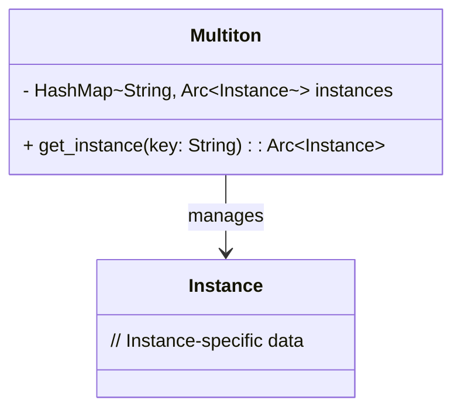

## 7.13. The Multiton Pattern

In the realm of software design patterns, the Multiton pattern is a variation of the Singleton pattern. While the Singleton pattern restricts a class to a single instance, the Multiton pattern allows for multiple instances, each identified by a unique key. This pattern is particularly useful in scenarios where you need to manage a fixed number of instances, such as managing database connections or configuration objects.

### Intent

The primary intent of the Multiton pattern is to control the number of instances of a class and provide a global point of access to them. Each instance is associated with a unique key, allowing for efficient retrieval and management.

### Key Participants

- **Multiton Class**: The class that manages instances.
- **Key**: A unique identifier for each instance.
- **Instance Map**: A data structure, typically a `HashMap`, that stores instances keyed by their unique identifiers.

### Applicability

Use the Multiton pattern when:

- You need to manage a fixed number of instances.
- Each instance is identified by a unique key.
- You want to ensure controlled access to instances.
- You require thread-safe access to instances in a concurrent environment.

### Managing Instances with `HashMap`

In Rust, the `HashMap` from the standard library is an ideal choice for managing instances in a Multiton pattern. It allows for efficient storage and retrieval of instances based on keys. Here's how you can implement a basic Multiton pattern using a `HashMap`:

```rust
use std::collections::HashMap;
use std::sync::{Arc, Mutex};

struct Multiton {
    instances: Mutex<HashMap<String, Arc<Instance>>>,
}

struct Instance {
    // Instance-specific data
}

impl Multiton {
    fn new() -> Self {
        Multiton {
            instances: Mutex::new(HashMap::new()),
        }
    }

    fn get_instance(&self, key: &str) -> Arc<Instance> {
        let mut instances = self.instances.lock().unwrap();
        instances.entry(key.to_string())
            .or_insert_with(|| Arc::new(Instance {}))
            .clone()
    }
}

fn main() {
    let multiton = Multiton::new();
    let instance1 = multiton.get_instance("instance1");
    let instance2 = multiton.get_instance("instance2");

    // Use instances as needed
}
```

### Thread-Safe Access

To ensure thread-safe access to Multiton instances, we use `Mutex` and `Arc`. The `Mutex` ensures that only one thread can access the `HashMap` at a time, preventing data races. The `Arc` (Atomic Reference Counting) allows multiple threads to hold references to the same instance.

### Initialization and Cleanup Considerations

When implementing the Multiton pattern, consider the following:

- **Lazy Initialization**: Instances should be created only when requested. This can be achieved using the `or_insert_with` method in the `HashMap`.
- **Cleanup**: If instances hold resources that need to be released, ensure proper cleanup. This can be done by implementing the `Drop` trait for the `Instance` struct.

### Rust Unique Features

Rust's ownership model and concurrency primitives make it particularly well-suited for implementing the Multiton pattern. The use of `Mutex` and `Arc` ensures that instances are accessed safely across threads, leveraging Rust's memory safety guarantees.

### Differences and Similarities

The Multiton pattern is often confused with the Singleton pattern. While both patterns control instance creation, the Multiton pattern allows for multiple instances, each identified by a key, whereas the Singleton pattern restricts to a single instance.

### Scenarios for Multiton Pattern

The Multiton pattern is appropriate in scenarios such as:

- **Configuration Management**: Managing different configurations for various environments.
- **Database Connections**: Handling multiple database connections, each identified by a unique key.
- **Resource Pools**: Managing a pool of resources, such as thread pools or connection pools.

### Visualizing the Multiton Pattern

To better understand the Multiton pattern, let's visualize it using a class diagram:



### Try It Yourself

Experiment with the Multiton pattern by modifying the code example:

- Add more instance-specific data to the `Instance` struct.
- Implement the `Drop` trait for cleanup.
- Test the pattern in a multi-threaded environment to observe thread-safe behavior.

### Knowledge Check

- What is the primary intent of the Multiton pattern?
- How does the Multiton pattern differ from the Singleton pattern?
- Why is `Mutex` used in the Multiton pattern?
- What are some scenarios where the Multiton pattern is appropriate?

### Embrace the Journey

Remember, mastering design patterns is a journey. As you explore the Multiton pattern, consider how it can be applied to your projects. Keep experimenting, stay curious, and enjoy the process of learning and applying new patterns.

## Quiz Time!



### What is the primary intent of the Multiton pattern?

- [x] To control the number of instances of a class and provide a global point of access to them.
- [ ] To restrict a class to a single instance.
- [ ] To manage instances without any unique identifiers.
- [ ] To allow unlimited instances of a class.

> **Explanation:** The Multiton pattern controls the number of instances and provides access via unique keys.

### How does the Multiton pattern differ from the Singleton pattern?

- [x] The Multiton pattern allows multiple instances, each identified by a key.
- [ ] The Multiton pattern restricts to a single instance.
- [ ] The Multiton pattern does not use keys for instance identification.
- [ ] The Multiton pattern is not thread-safe.

> **Explanation:** Unlike Singleton, Multiton allows multiple instances identified by keys.

### Why is `Mutex` used in the Multiton pattern?

- [x] To ensure thread-safe access to shared resources.
- [ ] To increase the number of instances.
- [ ] To allow multiple threads to modify the `HashMap` simultaneously.
- [ ] To prevent instance creation.

> **Explanation:** `Mutex` ensures that only one thread can access the shared `HashMap` at a time.

### What is the role of `Arc` in the Multiton pattern?

- [x] To allow multiple threads to hold references to the same instance.
- [ ] To prevent instance creation.
- [ ] To restrict access to a single thread.
- [ ] To manage instance cleanup.

> **Explanation:** `Arc` provides thread-safe reference counting, allowing shared ownership.

### In which scenario is the Multiton pattern appropriate?

- [x] Managing multiple database connections identified by unique keys.
- [ ] Restricting a class to a single instance.
- [ ] Allowing unlimited instances of a class.
- [ ] Managing instances without any unique identifiers.

> **Explanation:** The Multiton pattern is suitable for managing instances identified by unique keys.

### What is lazy initialization in the context of the Multiton pattern?

- [x] Creating instances only when they are requested.
- [ ] Creating all instances at the start of the program.
- [ ] Preventing instance creation.
- [ ] Destroying instances immediately after use.

> **Explanation:** Lazy initialization defers instance creation until it is needed.

### How can you ensure proper cleanup of resources in the Multiton pattern?

- [x] Implement the `Drop` trait for the `Instance` struct.
- [ ] Use `Mutex` to manage resources.
- [ ] Avoid using `Arc`.
- [ ] Prevent instance creation.

> **Explanation:** Implementing the `Drop` trait allows for resource cleanup when an instance is dropped.

### What data structure is typically used to manage instances in the Multiton pattern?

- [x] `HashMap`
- [ ] `Vec`
- [ ] `LinkedList`
- [ ] `BinaryTree`

> **Explanation:** `HashMap` is used to efficiently store and retrieve instances by key.

### What is the benefit of using `Arc` in a multi-threaded environment?

- [x] It allows multiple threads to safely share ownership of an instance.
- [ ] It prevents instance creation.
- [ ] It restricts access to a single thread.
- [ ] It manages instance cleanup.

> **Explanation:** `Arc` provides thread-safe reference counting for shared ownership.

### True or False: The Multiton pattern is suitable for scenarios where you need unlimited instances of a class.

- [ ] True
- [x] False

> **Explanation:** The Multiton pattern is designed for managing a fixed number of instances, each identified by a key.



By understanding and implementing the Multiton pattern in Rust, you can effectively manage multiple instances of a class, each identified by a unique key, while ensuring thread-safe access and efficient resource management. Keep exploring and applying these patterns to enhance your Rust programming skills!
