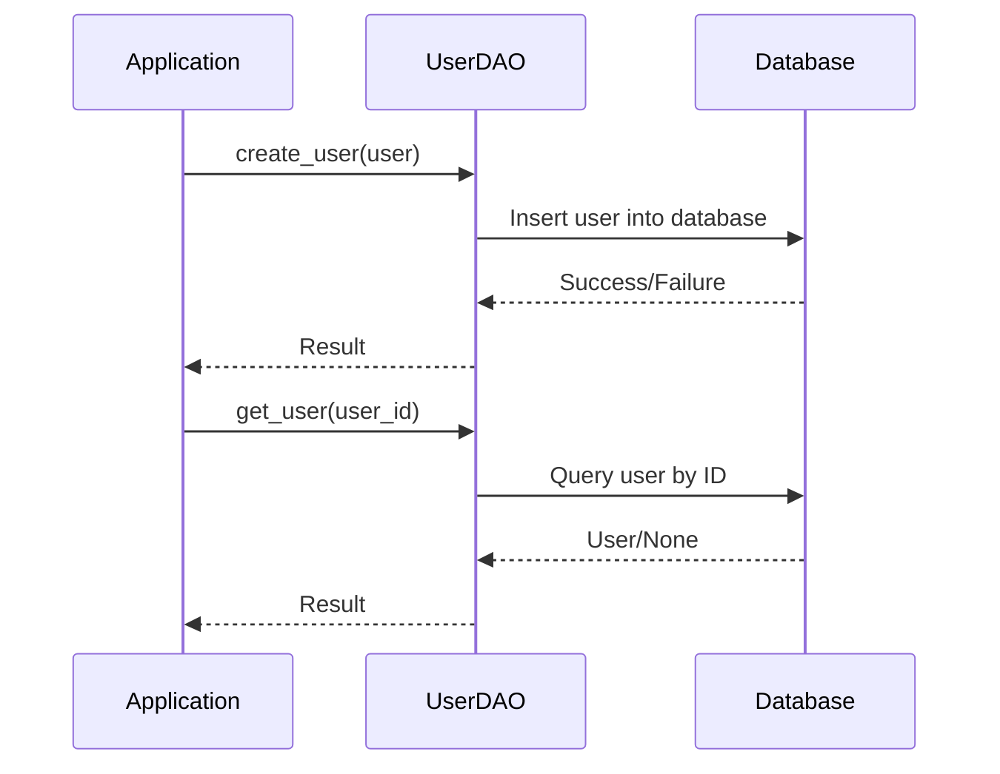

## 7.14. The Data Access Object (DAO) Pattern

The Data Access Object (DAO) pattern is a structural design pattern that provides an abstract interface to some type of database or other persistence mechanism. By mapping application calls to the persistence layer, the DAO pattern provides a way to decouple the application's business logic from data access logic. This separation promotes maintainability, testability, and flexibility in the application architecture.

### Intent of the DAO Pattern

The primary intent of the DAO pattern is to abstract and encapsulate all access to the data source. The DAO pattern achieves this by defining a set of operations that can be performed on the data source, allowing the rest of the application to interact with the data source through this interface. This abstraction layer provides several benefits:

- **Decoupling**: Separates the data access logic from the business logic, allowing each to evolve independently.
- **Maintainability**: Changes to the data source or data access logic do not affect the rest of the application.
- **Testability**: Facilitates testing by allowing the use of mock data sources.
- **Flexibility**: Makes it easier to swap out data sources or change data access strategies.

### Implementing DAOs in Rust

In Rust, the DAO pattern can be implemented using traits to define the interface for data access operations. Traits in Rust provide a way to define shared behavior across different types, making them ideal for defining the operations that a DAO should support.

#### Defining a DAO Trait

Let's start by defining a trait for a simple DAO that manages `User` entities. This trait will define the basic operations for interacting with the data source, such as creating, reading, updating, and deleting users.

```rust
// Define a User struct to represent the data entity.
#[derive(Debug, Clone)]
struct User {
    id: u32,
    name: String,
    email: String,
}

// Define a trait for the UserDAO.
trait UserDAO {
    fn create_user(&self, user: User) -> Result<(), String>;
    fn get_user(&self, user_id: u32) -> Result<Option<User>, String>;
    fn update_user(&self, user: User) -> Result<(), String>;
    fn delete_user(&self, user_id: u32) -> Result<(), String>;
}
```

In this example, the `UserDAO` trait defines four methods for managing `User` entities. Each method returns a `Result` type, which is a common way to handle errors in Rust. The `Result` type can either be `Ok` for successful operations or `Err` for errors, with the error type being a `String` in this case.

#### Implementing the DAO Trait

Next, let's implement the `UserDAO` trait for a specific data source. For simplicity, we'll use an in-memory data store represented by a `HashMap`.

```rust
use std::collections::HashMap;
use std::sync::{Arc, Mutex};

// Define an InMemoryUserDAO struct to implement the UserDAO trait.
struct InMemoryUserDAO {
    users: Arc<Mutex<HashMap<u32, User>>>,
}

impl InMemoryUserDAO {
    fn new() -> Self {
        InMemoryUserDAO {
            users: Arc::new(Mutex::new(HashMap::new())),
        }
    }
}

impl UserDAO for InMemoryUserDAO {
    fn create_user(&self, user: User) -> Result<(), String> {
        let mut users = self.users.lock().map_err(|_| "Lock error".to_string())?;
        if users.contains_key(&user.id) {
            return Err("User already exists".to_string());
        }
        users.insert(user.id, user);
        Ok(())
    }

    fn get_user(&self, user_id: u32) -> Result<Option<User>, String> {
        let users = self.users.lock().map_err(|_| "Lock error".to_string())?;
        Ok(users.get(&user_id).cloned())
    }

    fn update_user(&self, user: User) -> Result<(), String> {
        let mut users = self.users.lock().map_err(|_| "Lock error".to_string())?;
        if users.contains_key(&user.id) {
            users.insert(user.id, user);
            Ok(())
        } else {
            Err("User not found".to_string())
        }
    }

    fn delete_user(&self, user_id: u32) -> Result<(), String> {
        let mut users = self.users.lock().map_err(|_| "Lock error".to_string())?;
        if users.remove(&user_id).is_some() {
            Ok(())
        } else {
            Err("User not found".to_string())
        }
    }
}
```

In this implementation, the `InMemoryUserDAO` struct uses a `HashMap` to store users, and a `Mutex` to ensure thread-safe access to the data. The `Arc` (Atomic Reference Counting) is used to allow shared ownership of the `Mutex` across threads.

### Accessing Databases or External Data Sources

While the in-memory example is useful for understanding the DAO pattern, real-world applications often require interaction with databases or external data sources. Rust provides several libraries for database access, such as `diesel` and `sqlx`, which can be used to implement DAOs.

#### Example with Diesel

`Diesel` is a popular ORM (Object-Relational Mapping) library for Rust that provides a type-safe query builder. Here's how you might implement a DAO using Diesel:

```rust
// Import necessary Diesel modules.
use diesel::prelude::*;
use diesel::sqlite::SqliteConnection;

// Define a struct for the database connection.
struct Database {
    connection: SqliteConnection,
}

// Implement the UserDAO trait for the Database struct.
impl UserDAO for Database {
    fn create_user(&self, user: User) -> Result<(), String> {
        // Use Diesel's query builder to insert a new user.
        diesel::insert_into(users::table)
            .values(&user)
            .execute(&self.connection)
            .map_err(|err| err.to_string())?;
        Ok(())
    }

    fn get_user(&self, user_id: u32) -> Result<Option<User>, String> {
        // Use Diesel's query builder to select a user by ID.
        users::table
            .filter(users::id.eq(user_id))
            .first::<User>(&self.connection)
            .optional()
            .map_err(|err| err.to_string())
    }

    fn update_user(&self, user: User) -> Result<(), String> {
        // Use Diesel's query builder to update a user.
        diesel::update(users::table.filter(users::id.eq(user.id)))
            .set(&user)
            .execute(&self.connection)
            .map_err(|err| err.to_string())?;
        Ok(())
    }

    fn delete_user(&self, user_id: u32) -> Result<(), String> {
        // Use Diesel's query builder to delete a user by ID.
        diesel::delete(users::table.filter(users::id.eq(user_id)))
            .execute(&self.connection)
            .map_err(|err| err.to_string())?;
        Ok(())
    }
}
```

In this example, the `Database` struct holds a `SqliteConnection`, and Diesel's query builder is used to perform CRUD operations. The `Result` type is used for error handling, with errors being converted to strings.

### Error Handling and Mapping Database Results

Error handling is a crucial aspect of implementing DAOs. Rust's `Result` and `Option` types provide a robust way to handle errors and optional values. When accessing a database, errors can occur due to various reasons, such as connection issues or query failures. It's important to handle these errors gracefully and provide meaningful error messages.

Mapping database results to Rust types is another important aspect. Libraries like Diesel provide mechanisms to map query results to Rust structs, ensuring type safety and reducing the likelihood of runtime errors.

### Benefits of the DAO Pattern

Implementing the DAO pattern in Rust provides several benefits:

- **Easier Testing**: By abstracting data access logic, DAOs make it easier to test business logic independently of the data source. Mock implementations of DAOs can be used in tests to simulate different scenarios.
- **Swapping Data Sources**: The abstraction provided by DAOs allows for easy swapping of data sources. For example, you can switch from an in-memory data store to a database without affecting the rest of the application.
- **Code Reusability**: DAOs promote code reusability by encapsulating data access logic in a single place. This reduces duplication and makes it easier to maintain the codebase.

### Visualizing the DAO Pattern

To better understand the DAO pattern, let's visualize the interaction between the application, DAO, and data source using a sequence diagram.



This diagram illustrates how the application interacts with the DAO, which in turn interacts with the database. The DAO acts as an intermediary, abstracting the details of data access from the application.

### Try It Yourself

To deepen your understanding of the DAO pattern, try modifying the code examples provided:

- **Experiment with Different Data Sources**: Implement the `UserDAO` trait for a different data source, such as a file-based data store or a different database.
- **Enhance Error Handling**: Improve the error handling in the DAO implementations by using custom error types or logging errors.
- **Add New Operations**: Extend the `UserDAO` trait with additional operations, such as searching for users by name or email.

### Key Takeaways

- The DAO pattern provides a way to decouple data access logic from business logic, promoting maintainability and flexibility.
- In Rust, traits are used to define the interface for DAOs, allowing for different implementations.
- Error handling and result mapping are important aspects of implementing DAOs.
- The DAO pattern facilitates easier testing and swapping of data sources.

### References and Further Reading

- [Rust Book](https://doc.rust-lang.org/book/)
- [Diesel ORM Documentation](https://diesel.rs/)
- [Rust Error Handling](https://doc.rust-lang.org/book/ch09-02-recoverable-errors-with-result.html)

## Quiz Time!



### What is the primary intent of the DAO pattern?

- [x] To abstract and encapsulate all access to the data source.
- [ ] To provide a direct connection to the database.
- [ ] To enhance the performance of database queries.
- [ ] To simplify the user interface of an application.

> **Explanation:** The DAO pattern aims to abstract and encapsulate all access to the data source, providing a way to decouple data access logic from business logic.

### Which Rust feature is primarily used to define the interface for a DAO?

- [x] Traits
- [ ] Structs
- [ ] Enums
- [ ] Macros

> **Explanation:** Traits in Rust are used to define shared behavior across different types, making them ideal for defining the operations that a DAO should support.

### What is a common benefit of using the DAO pattern?

- [x] Easier testing and swapping of data sources.
- [ ] Improved user interface design.
- [ ] Faster execution of code.
- [ ] Simplified error handling.

> **Explanation:** The DAO pattern facilitates easier testing and swapping of data sources by abstracting data access logic.

### In the provided example, what is used to ensure thread-safe access to the data?

- [x] Mutex
- [ ] Arc
- [ ] HashMap
- [ ] Result

> **Explanation:** A `Mutex` is used to ensure thread-safe access to the data in the `InMemoryUserDAO` implementation.

### What library is used in the example to interact with a SQLite database?

- [x] Diesel
- [ ] Sqlx
- [ ] Serde
- [ ] Tokio

> **Explanation:** Diesel is used in the example to interact with a SQLite database, providing a type-safe query builder.

### What is the purpose of the `Result` type in Rust?

- [x] To handle errors and represent success or failure.
- [ ] To define data structures.
- [ ] To manage memory allocation.
- [ ] To create user interfaces.

> **Explanation:** The `Result` type in Rust is used to handle errors and represent success or failure in operations.

### How can DAOs facilitate testing?

- [x] By allowing the use of mock data sources.
- [ ] By providing faster execution of tests.
- [ ] By simplifying test case creation.
- [ ] By reducing the need for test data.

> **Explanation:** DAOs facilitate testing by allowing the use of mock data sources, enabling tests to simulate different scenarios.

### What is a key advantage of using traits for DAOs in Rust?

- [x] They allow for different implementations of the same interface.
- [ ] They improve the performance of data access operations.
- [ ] They simplify the syntax of data access code.
- [ ] They eliminate the need for error handling.

> **Explanation:** Traits allow for different implementations of the same interface, providing flexibility in how data access is handled.

### What does the `Arc` type provide in the `InMemoryUserDAO` example?

- [x] Shared ownership of the `Mutex` across threads.
- [ ] Faster access to the data.
- [ ] Simplified error handling.
- [ ] Improved memory allocation.

> **Explanation:** The `Arc` (Atomic Reference Counting) type provides shared ownership of the `Mutex` across threads, allowing multiple threads to access the data safely.

### True or False: The DAO pattern is only applicable to relational databases.

- [ ] True
- [x] False

> **Explanation:** The DAO pattern is not limited to relational databases; it can be applied to any data source, including NoSQL databases, file systems, and external APIs.



Remember, this is just the beginning. As you progress, you'll build more complex and interactive applications using the DAO pattern. Keep experimenting, stay curious, and enjoy the journey!
