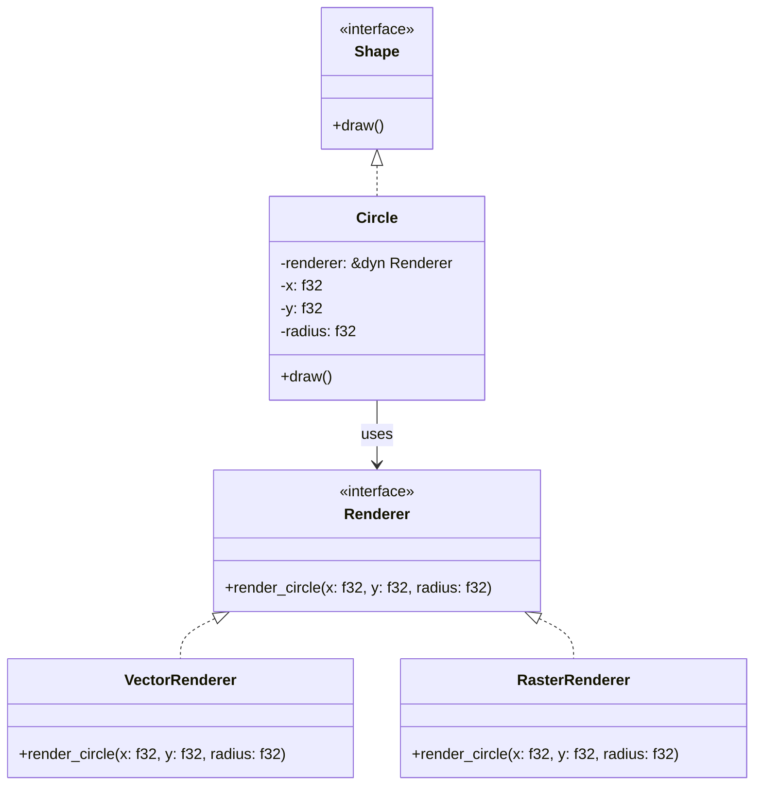

## 7.2. Bridge Pattern for Decoupling Abstractions

In the world of software design, the Bridge pattern is a structural design pattern that plays a crucial role in decoupling an abstraction from its implementation. This separation allows both the abstraction and the implementation to evolve independently, enhancing the flexibility and scalability of the codebase. In this section, we will delve into the Bridge pattern, exploring its purpose, implementation in Rust using traits, and the benefits it offers in terms of scalability and maintainability. We will also address the challenges posed by Rust's ownership model and how to overcome them.

### Understanding the Bridge Pattern

#### Definition and Purpose

The Bridge pattern is designed to separate an abstraction from its implementation so that the two can vary independently. This is achieved by defining a bridge interface that acts as an intermediary between the abstraction and the implementation. The pattern is particularly useful when both the abstraction and the implementation are expected to change frequently, as it allows for changes in one without affecting the other.

#### Key Participants

- **Abstraction**: Defines the abstraction's interface and maintains a reference to an object of type Implementor.
- **Refined Abstraction**: Extends the interface defined by Abstraction.
- **Implementor**: Defines the interface for implementation classes.
- **Concrete Implementor**: Implements the Implementor interface and defines its concrete implementation.

### Implementing the Bridge Pattern in Rust

In Rust, the Bridge pattern can be effectively implemented using traits to represent abstractions and implementations. Let's explore how to achieve this with a practical example.

#### Step 1: Define the Abstraction and Implementor Traits

First, we define the traits that represent the abstraction and the implementor.

```rust
// Define the Implementor trait
trait Renderer {
    fn render_circle(&self, x: f32, y: f32, radius: f32);
}

// Define the Abstraction trait
trait Shape {
    fn draw(&self);
}
```

#### Step 2: Implement Concrete Implementors

Next, we create concrete implementors that provide specific implementations of the `Renderer` trait.

```rust
// Concrete Implementor 1
struct VectorRenderer;

impl Renderer for VectorRenderer {
    fn render_circle(&self, x: f32, y: f32, radius: f32) {
        println!("Drawing a vector circle at ({}, {}) with radius {}", x, y, radius);
    }
}

// Concrete Implementor 2
struct RasterRenderer;

impl Renderer for RasterRenderer {
    fn render_circle(&self, x: f32, y: f32, radius: f32) {
        println!("Drawing a raster circle at ({}, {}) with radius {}", x, y, radius);
    }
}
```

#### Step 3: Implement the Refined Abstraction

Now, we implement the refined abstraction that uses the renderer to perform its operations.

```rust
// Refined Abstraction
struct Circle<'a> {
    renderer: &'a dyn Renderer,
    x: f32,
    y: f32,
    radius: f32,
}

impl<'a> Shape for Circle<'a> {
    fn draw(&self) {
        self.renderer.render_circle(self.x, self.y, self.radius);
    }
}
```

#### Step 4: Demonstrate the Bridge Pattern

Finally, we demonstrate the Bridge pattern by creating instances of `Circle` with different renderers.

```rust
fn main() {
    let vector_renderer = VectorRenderer;
    let raster_renderer = RasterRenderer;

    let circle1 = Circle {
        renderer: &vector_renderer,
        x: 10.0,
        y: 20.0,
        radius: 5.0,
    };

    let circle2 = Circle {
        renderer: &raster_renderer,
        x: 15.0,
        y: 25.0,
        radius: 10.0,
    };

    circle1.draw();
    circle2.draw();
}
```

### Benefits of Decoupling

The Bridge pattern offers several benefits in terms of scalability and maintainability:

- **Scalability**: By decoupling the abstraction from its implementation, new implementations can be added without modifying existing code. This makes it easier to scale the system by introducing new features or functionalities.
- **Maintainability**: Changes to the implementation do not affect the abstraction, and vice versa. This separation of concerns simplifies maintenance and reduces the risk of introducing bugs when making changes.

### Challenges in Rust's Ownership Model

Rust's ownership model can pose challenges when implementing the Bridge pattern, particularly in managing lifetimes and borrowing. However, these challenges can be overcome with careful design:

- **Lifetimes**: Use explicit lifetimes to ensure that references are valid for the duration of their use.
- **Borrowing**: Use references to traits (`&dyn Trait`) to allow for dynamic dispatch and avoid ownership issues.

### Visualizing the Bridge Pattern

To better understand the Bridge pattern, let's visualize the relationships between the components using a class diagram.



### Try It Yourself

Now that we've explored the Bridge pattern, let's encourage you to experiment with the code. Try modifying the `Circle` struct to include additional shapes, such as `Rectangle` or `Triangle`. Implement new renderers that provide different rendering techniques, such as `SVGRenderer` or `CanvasRenderer`. This exercise will help reinforce your understanding of the Bridge pattern and its flexibility.

### References and Further Reading

- [Rust Programming Language](https://www.rust-lang.org/)
- [Design Patterns: Elements of Reusable Object-Oriented Software](https://en.wikipedia.org/wiki/Design_Patterns)
- [Rust by Example](https://doc.rust-lang.org/rust-by-example/)

### Knowledge Check

Before we conclude, let's pose a few questions to reinforce your understanding of the Bridge pattern:

- What is the primary purpose of the Bridge pattern?
- How does the Bridge pattern enhance scalability and maintainability?
- What challenges does Rust's ownership model pose when implementing the Bridge pattern?

### Conclusion

The Bridge pattern is a powerful tool for decoupling abstractions from implementations, offering significant benefits in terms of scalability and maintainability. By leveraging Rust's traits and careful design, we can effectively implement this pattern while navigating the challenges posed by Rust's ownership model. Remember, this is just the beginning. As you progress, you'll discover more design patterns and techniques that will enhance your Rust programming skills. Keep experimenting, stay curious, and enjoy the journey!

## Quiz Time!



### What is the primary purpose of the Bridge pattern?

- [x] To decouple an abstraction from its implementation
- [ ] To couple an abstraction with its implementation
- [ ] To enhance performance
- [ ] To simplify code

> **Explanation:** The Bridge pattern is designed to decouple an abstraction from its implementation, allowing them to vary independently.

### How does the Bridge pattern enhance scalability?

- [x] By allowing new implementations to be added without modifying existing code
- [ ] By reducing the number of classes
- [ ] By simplifying the code structure
- [ ] By increasing the number of interfaces

> **Explanation:** The Bridge pattern enhances scalability by allowing new implementations to be added without modifying existing code, making it easier to introduce new features.

### What is a key benefit of decoupling in the Bridge pattern?

- [x] Simplified maintenance
- [ ] Increased complexity
- [ ] Reduced flexibility
- [ ] Enhanced coupling

> **Explanation:** Decoupling in the Bridge pattern simplifies maintenance by separating concerns, reducing the risk of introducing bugs when making changes.

### Which Rust feature is crucial for implementing the Bridge pattern?

- [x] Traits
- [ ] Macros
- [ ] Enums
- [ ] Structs

> **Explanation:** Traits are crucial for implementing the Bridge pattern in Rust, as they allow for defining interfaces for abstractions and implementations.

### What challenge does Rust's ownership model pose for the Bridge pattern?

- [x] Managing lifetimes and borrowing
- [ ] Increasing performance
- [ ] Reducing code size
- [ ] Enhancing readability

> **Explanation:** Rust's ownership model can pose challenges in managing lifetimes and borrowing when implementing the Bridge pattern.

### How can lifetimes be managed in the Bridge pattern?

- [x] By using explicit lifetimes
- [ ] By avoiding references
- [ ] By using global variables
- [ ] By ignoring borrowing rules

> **Explanation:** Explicit lifetimes can be used to ensure that references are valid for the duration of their use in the Bridge pattern.

### What is a common use case for the Bridge pattern?

- [x] When both abstraction and implementation are expected to change frequently
- [ ] When performance is the primary concern
- [ ] When code needs to be simplified
- [ ] When there is only one implementation

> **Explanation:** The Bridge pattern is commonly used when both the abstraction and implementation are expected to change frequently, allowing them to vary independently.

### What is the role of the Implementor in the Bridge pattern?

- [x] To define the interface for implementation classes
- [ ] To define the abstraction's interface
- [ ] To extend the abstraction's interface
- [ ] To simplify the code structure

> **Explanation:** The Implementor defines the interface for implementation classes in the Bridge pattern.

### How does the Bridge pattern affect code maintainability?

- [x] It simplifies maintenance by separating concerns
- [ ] It complicates maintenance by increasing coupling
- [ ] It has no effect on maintainability
- [ ] It reduces maintainability by increasing complexity

> **Explanation:** The Bridge pattern simplifies maintenance by separating concerns, making it easier to manage changes.

### True or False: The Bridge pattern is only applicable in object-oriented programming languages.

- [ ] True
- [x] False

> **Explanation:** The Bridge pattern is applicable in any programming paradigm that supports the concept of separating abstractions from implementations, including Rust.




