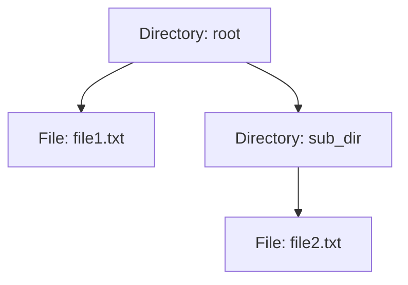

## 7.3. Composite Pattern with Recursive Data Structures

The Composite Pattern is a structural design pattern that allows you to compose objects into tree-like structures to represent part-whole hierarchies. This pattern enables clients to treat individual objects and compositions of objects uniformly. In Rust, implementing the Composite Pattern often involves using recursive data structures, which can be elegantly modeled using enums and smart pointers like `Box`.

### Understanding the Composite Pattern

#### Intent

The primary intent of the Composite Pattern is to allow clients to treat individual objects and compositions of objects uniformly. This is particularly useful when dealing with tree structures, such as file systems, UI components, or organizational hierarchies.

#### Key Participants

- **Component**: An abstract interface for all objects in the composition, both composite and leaf nodes.
- **Leaf**: Represents leaf objects in the composition. A leaf has no children.
- **Composite**: Represents a composite object (a node with children). It implements the component interface and contains child components.

#### Applicability

Use the Composite Pattern when:

- You want to represent part-whole hierarchies of objects.
- You want clients to be able to ignore the difference between compositions of objects and individual objects.

### Recursive Data Structures in Rust

In Rust, recursive data structures are often implemented using enums and smart pointers like `Box`. This allows for the creation of structures that can grow dynamically and represent complex hierarchies.

#### Modeling Composites with Enums and Box

Let's consider a simple example of a file system where files and directories are represented using the Composite Pattern.

```rust
enum FileSystemNode {
    File(String),
    Directory(String, Vec<Box<FileSystemNode>>),
}

impl FileSystemNode {
    fn new_file(name: &str) -> Self {
        FileSystemNode::File(name.to_string())
    }

    fn new_directory(name: &str) -> Self {
        FileSystemNode::Directory(name.to_string(), Vec::new())
    }

    fn add_child(&mut self, child: FileSystemNode) {
        if let FileSystemNode::Directory(_, ref mut children) = self {
            children.push(Box::new(child));
        }
    }

    fn display(&self, depth: usize) {
        match self {
            FileSystemNode::File(name) => {
                println!("{:indent$}File: {}", "", name, indent = depth * 2);
            }
            FileSystemNode::Directory(name, children) => {
                println!("{:indent$}Directory: {}", "", name, indent = depth * 2);
                for child in children {
                    child.display(depth + 1);
                }
            }
        }
    }
}

fn main() {
    let mut root = FileSystemNode::new_directory("root");
    let file1 = FileSystemNode::new_file("file1.txt");
    let mut sub_dir = FileSystemNode::new_directory("sub_dir");
    let file2 = FileSystemNode::new_file("file2.txt");

    sub_dir.add_child(file2);
    root.add_child(file1);
    root.add_child(sub_dir);

    root.display(0);
}
```

### Handling Ownership and Borrowing

Rust's ownership model ensures memory safety without a garbage collector, which is crucial when dealing with recursive data structures. Using `Box` allows us to create heap-allocated recursive types, which are necessary because Rust needs to know the size of types at compile time.

#### Ownership in Recursive Structures

In the example above, `Box` is used to store `FileSystemNode` instances on the heap, allowing the `Vec` to store pointers to these nodes. This is essential for recursive structures, as it prevents infinite size calculations at compile time.

#### Borrowing and Mutability

When adding children to a directory, we use mutable references to modify the `Vec` inside a `Directory`. Rust's borrowing rules ensure that these operations are safe and free from data races.

### Advantages of the Composite Pattern

The Composite Pattern simplifies client code by allowing uniform treatment of individual objects and compositions. This abstraction is powerful in scenarios where the structure can be arbitrarily complex, such as UI components or file systems.

#### Simplifying Client Code

By using the Composite Pattern, clients can interact with complex structures without needing to differentiate between individual and composite objects. This reduces the complexity of client code and enhances maintainability.

### Visualizing the Composite Pattern

To better understand the structure of the Composite Pattern, let's visualize the file system example using a tree diagram.



This diagram represents the hierarchical structure of the file system, where `root` is a directory containing a file and another directory, which in turn contains another file.

### Rust Unique Features

Rust's strong type system and ownership model make it uniquely suited for implementing the Composite Pattern. The use of enums and `Box` allows for flexible and safe recursive data structures, while Rust's borrowing rules ensure memory safety.

### Differences and Similarities

The Composite Pattern is similar to other structural patterns like the Decorator Pattern, but it focuses on part-whole hierarchies rather than extending functionality. Understanding these distinctions is crucial for applying the right pattern to a given problem.

### Try It Yourself

Experiment with the provided code by adding more files and directories. Try modifying the `display` method to show additional information, such as file sizes or directory permissions. This hands-on approach will deepen your understanding of the Composite Pattern in Rust.

### Knowledge Check

- What is the primary intent of the Composite Pattern?
- How does Rust's ownership model benefit recursive data structures?
- Why is `Box` used in recursive types?
- How does the Composite Pattern simplify client code?
- What are the key participants in the Composite Pattern?

### Summary

The Composite Pattern is a powerful tool for representing part-whole hierarchies in Rust. By leveraging enums and smart pointers, we can create flexible and safe recursive data structures. This pattern simplifies client code and enhances maintainability, making it an essential technique for Rust developers.

## Quiz Time!



### What is the primary intent of the Composite Pattern?

- [x] To allow clients to treat individual objects and compositions of objects uniformly.
- [ ] To extend the functionality of objects dynamically.
- [ ] To provide a way to create objects without specifying their concrete classes.
- [ ] To separate the construction of a complex object from its representation.

> **Explanation:** The Composite Pattern allows clients to treat individual objects and compositions of objects uniformly, which is its primary intent.

### How does Rust's ownership model benefit recursive data structures?

- [x] It ensures memory safety without a garbage collector.
- [ ] It allows for dynamic typing of recursive structures.
- [ ] It provides automatic memory management through garbage collection.
- [ ] It simplifies the syntax for defining recursive types.

> **Explanation:** Rust's ownership model ensures memory safety without a garbage collector, which is crucial for recursive data structures.

### Why is `Box` used in recursive types?

- [x] To allow heap allocation of recursive types, preventing infinite size calculations at compile time.
- [ ] To enable dynamic dispatch of recursive types.
- [ ] To provide automatic memory management for recursive types.
- [ ] To simplify the syntax for defining recursive types.

> **Explanation:** `Box` is used to allow heap allocation of recursive types, preventing infinite size calculations at compile time.

### How does the Composite Pattern simplify client code?

- [x] By allowing uniform treatment of individual objects and compositions.
- [ ] By providing a way to create objects without specifying their concrete classes.
- [ ] By extending the functionality of objects dynamically.
- [ ] By separating the construction of a complex object from its representation.

> **Explanation:** The Composite Pattern simplifies client code by allowing uniform treatment of individual objects and compositions.

### What are the key participants in the Composite Pattern?

- [x] Component, Leaf, Composite
- [ ] Factory, Product, Creator
- [ ] Subject, Observer, ConcreteObserver
- [ ] Context, State, ConcreteState

> **Explanation:** The key participants in the Composite Pattern are Component, Leaf, and Composite.

### What is the role of the `Component` in the Composite Pattern?

- [x] It defines the interface for all objects in the composition.
- [ ] It represents leaf objects in the composition.
- [ ] It represents a composite object with children.
- [ ] It provides a way to create objects without specifying their concrete classes.

> **Explanation:** The `Component` defines the interface for all objects in the composition, both composite and leaf nodes.

### What is the role of the `Leaf` in the Composite Pattern?

- [x] It represents leaf objects in the composition.
- [ ] It defines the interface for all objects in the composition.
- [ ] It represents a composite object with children.
- [ ] It provides a way to create objects without specifying their concrete classes.

> **Explanation:** The `Leaf` represents leaf objects in the composition, which have no children.

### What is the role of the `Composite` in the Composite Pattern?

- [x] It represents a composite object with children.
- [ ] It defines the interface for all objects in the composition.
- [ ] It represents leaf objects in the composition.
- [ ] It provides a way to create objects without specifying their concrete classes.

> **Explanation:** The `Composite` represents a composite object with children, implementing the component interface.

### How can recursive data structures be modeled in Rust?

- [x] Using enums and smart pointers like `Box`.
- [ ] Using dynamic typing and reflection.
- [ ] Using garbage collection and automatic memory management.
- [ ] Using macros and procedural generation.

> **Explanation:** Recursive data structures in Rust can be modeled using enums and smart pointers like `Box`.

### True or False: The Composite Pattern is similar to the Decorator Pattern in that both focus on part-whole hierarchies.

- [ ] True
- [x] False

> **Explanation:** The Composite Pattern focuses on part-whole hierarchies, while the Decorator Pattern focuses on extending functionality.



Remember, this is just the beginning. As you progress, you'll build more complex and interactive applications using the Composite Pattern. Keep experimenting, stay curious, and enjoy the journey!
