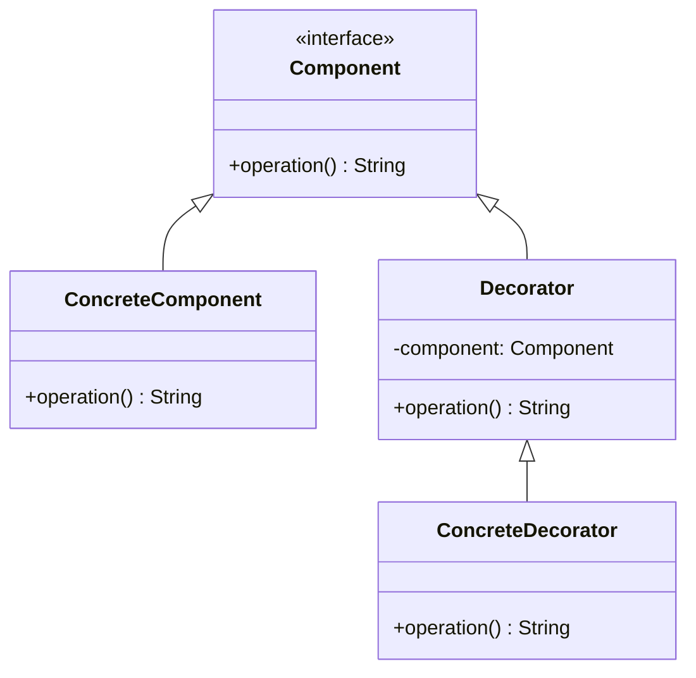

## 7.4. Decorator Pattern with Smart Pointers and `Deref`

In this section, we will delve into the Decorator Pattern, a structural design pattern that allows behavior to be added to individual objects, dynamically, without affecting the behavior of other objects from the same class. We'll explore how Rust's smart pointers and the `Deref` trait can be leveraged to implement this pattern efficiently.

### Understanding the Decorator Pattern

**Intent**: The Decorator Pattern is used to extend the functionality of objects by wrapping them with additional behavior. This pattern provides a flexible alternative to subclassing for extending functionality.

**Key Participants**:
- **Component**: Defines the interface for objects that can have responsibilities added to them dynamically.
- **ConcreteComponent**: The original object to which additional responsibilities can be attached.
- **Decorator**: Maintains a reference to a Component object and defines an interface that conforms to Component's interface.
- **ConcreteDecorator**: Adds responsibilities to the component.

### Applying the Decorator Pattern in Rust

Rust's ownership model and type system make it uniquely suited for implementing the Decorator Pattern. By using smart pointers and the `Deref` trait, we can create decorators that wrap objects and add behavior without altering the original object's interface.

#### Smart Pointers and Their Role

Smart pointers in Rust, such as `Box`, `Rc`, and `Arc`, are used to manage memory and ownership of data. They can be used to wrap objects, allowing us to add behavior dynamically.

- **`Box`**: Used for heap allocation and ownership transfer.
- **`Rc`**: A reference-counted smart pointer for shared ownership.
- **`Arc`**: An atomic reference-counted smart pointer for thread-safe shared ownership.

#### Implementing Decorators with Structs

Let's implement a simple example of the Decorator Pattern using Rust. We'll create a basic `Component` trait, a `ConcreteComponent`, and a `Decorator` that adds functionality.

```rust
// Define the Component trait
trait Component {
    fn operation(&self) -> String;
}

// ConcreteComponent implementing the Component trait
struct ConcreteComponent;

impl Component for ConcreteComponent {
    fn operation(&self) -> String {
        "ConcreteComponent".to_string()
    }
}

// Decorator struct holding a reference to a Component
struct Decorator {
    component: Box<dyn Component>,
}

impl Decorator {
    fn new(component: Box<dyn Component>) -> Self {
        Decorator { component }
    }
}

impl Component for Decorator {
    fn operation(&self) -> String {
        format!("Decorator({})", self.component.operation())
    }
}

fn main() {
    let component = Box::new(ConcreteComponent);
    let decorator = Decorator::new(component);
    println!("{}", decorator.operation());
}
```

**Explanation**:
- **Component Trait**: Defines the interface for objects that can have responsibilities added.
- **ConcreteComponent**: Implements the `Component` trait with basic functionality.
- **Decorator**: Wraps a `Component` and adds behavior by implementing the `Component` trait.

#### Using `Deref` and `DerefMut`

The `Deref` and `DerefMut` traits in Rust allow us to override the `*` operator, enabling smart pointers to behave like regular references. This is crucial for decorators, as it allows them to transparently forward method calls to the wrapped component.

```rust
use std::ops::{Deref, DerefMut};

// Define a smart pointer with Deref and DerefMut
struct SmartDecorator<T> {
    component: T,
}

impl<T> SmartDecorator<T> {
    fn new(component: T) -> Self {
        SmartDecorator { component }
    }
}

impl<T> Deref for SmartDecorator<T> {
    type Target = T;

    fn deref(&self) -> &Self::Target {
        &self.component
    }
}

impl<T> DerefMut for SmartDecorator<T> {
    fn deref_mut(&mut self) -> &mut Self::Target {
        &mut self.component
    }
}

fn main() {
    let component = ConcreteComponent;
    let mut decorator = SmartDecorator::new(component);
    println!("{}", decorator.operation());
}
```

**Explanation**:
- **SmartDecorator**: A generic struct that wraps a component and implements `Deref` and `DerefMut`.
- **Deref Implementation**: Allows `SmartDecorator` to behave like a reference to the wrapped component.

### Benefits of Using the Decorator Pattern in Rust

- **Flexible Augmentation**: Easily add or remove responsibilities from objects without altering their structure.
- **Reusability**: Decorators can be reused across different components.
- **Composability**: Multiple decorators can be combined to create complex behavior.

### Visualizing the Decorator Pattern

Below is a diagram illustrating the structure of the Decorator Pattern in Rust:



**Diagram Explanation**:
- **Component Interface**: The base interface for all components.
- **ConcreteComponent**: Implements the base functionality.
- **Decorator**: Wraps a component and adds behavior.
- **ConcreteDecorator**: A specific implementation of a decorator.

### Rust Unique Features

Rust's ownership model and type system provide unique advantages when implementing the Decorator Pattern:
- **Memory Safety**: Ensures that decorators do not introduce memory leaks or undefined behavior.
- **Concurrency**: `Arc` allows decorators to be used safely across threads.
- **Trait Objects**: Enable dynamic dispatch, allowing decorators to be composed at runtime.

### Differences and Similarities with Other Patterns

The Decorator Pattern is often confused with the Proxy Pattern. While both involve wrapping objects, the Proxy Pattern focuses on controlling access, whereas the Decorator Pattern focuses on adding behavior.

### Try It Yourself

Experiment with the code examples provided:
- **Modify the `Decorator`** to add additional behavior.
- **Create multiple decorators** and chain them together.
- **Use `Rc` or `Arc`** to share components between decorators.

### Knowledge Check

- **What is the primary purpose of the Decorator Pattern?**
- **How do smart pointers facilitate the Decorator Pattern in Rust?**
- **What role does the `Deref` trait play in decorators?**

### Summary

The Decorator Pattern in Rust, when combined with smart pointers and the `Deref` trait, provides a powerful mechanism for dynamically extending object behavior. By understanding and applying this pattern, you can create flexible and reusable code that adheres to Rust's safety guarantees.

## Quiz Time!



### What is the primary purpose of the Decorator Pattern?

- [x] To add responsibilities to objects dynamically
- [ ] To control access to objects
- [ ] To create a single instance of a class
- [ ] To define a family of algorithms

> **Explanation:** The Decorator Pattern is used to add responsibilities to objects dynamically without affecting other objects.

### Which smart pointer is used for thread-safe shared ownership in Rust?

- [ ] Box
- [ ] Rc
- [x] Arc
- [ ] RefCell

> **Explanation:** `Arc` is an atomic reference-counted smart pointer used for thread-safe shared ownership.

### What trait allows smart pointers to behave like regular references?

- [ ] Clone
- [ ] Copy
- [x] Deref
- [ ] Drop

> **Explanation:** The `Deref` trait allows smart pointers to behave like regular references by overriding the `*` operator.

### How does the Decorator Pattern differ from the Proxy Pattern?

- [x] Decorator adds behavior, Proxy controls access
- [ ] Decorator controls access, Proxy adds behavior
- [ ] Both add behavior
- [ ] Both control access

> **Explanation:** The Decorator Pattern adds behavior to objects, while the Proxy Pattern controls access to objects.

### What is the role of the `DerefMut` trait?

- [x] To allow mutable dereferencing of smart pointers
- [ ] To clone smart pointers
- [ ] To drop smart pointers
- [ ] To copy smart pointers

> **Explanation:** The `DerefMut` trait allows mutable dereferencing of smart pointers, enabling modification of the wrapped object.

### Which of the following is a benefit of using the Decorator Pattern?

- [x] Flexible augmentation of object behavior
- [ ] Reduces memory usage
- [ ] Simplifies code structure
- [ ] Increases execution speed

> **Explanation:** The Decorator Pattern allows flexible augmentation of object behavior without altering the object's structure.

### What is the advantage of using `Arc` in decorators?

- [x] Thread-safe shared ownership
- [ ] Faster execution
- [ ] Reduced memory usage
- [ ] Simplified syntax

> **Explanation:** `Arc` provides thread-safe shared ownership, allowing decorators to be used safely across threads.

### Which pattern is often confused with the Decorator Pattern?

- [ ] Singleton
- [x] Proxy
- [ ] Factory
- [ ] Observer

> **Explanation:** The Proxy Pattern is often confused with the Decorator Pattern because both involve wrapping objects.

### True or False: The Decorator Pattern can be used to remove responsibilities from objects.

- [ ] True
- [x] False

> **Explanation:** The Decorator Pattern is used to add responsibilities to objects, not remove them.

### What is a key feature of Rust that benefits the Decorator Pattern?

- [x] Memory safety
- [ ] Dynamic typing
- [ ] Garbage collection
- [ ] Reflection

> **Explanation:** Rust's memory safety ensures that decorators do not introduce memory leaks or undefined behavior.



Remember, this is just the beginning. As you progress, you'll build more complex and interactive applications using Rust's powerful features. Keep experimenting, stay curious, and enjoy the journey!
