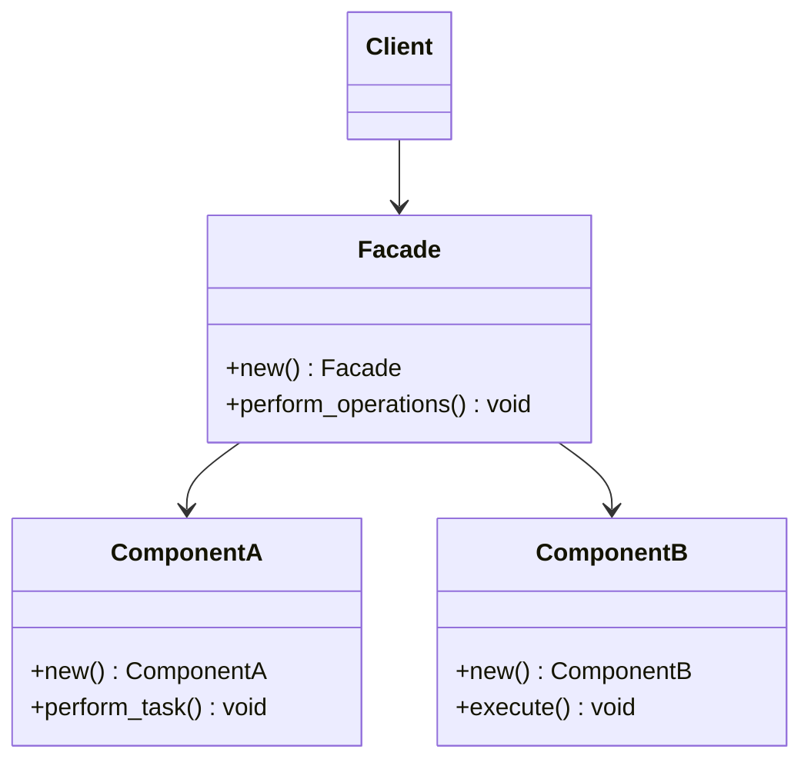

## 7.5. Facade Pattern via Modules and Public Interfaces

The Facade Pattern is a structural design pattern that provides a simplified interface to a complex subsystem. In Rust, this pattern is often implemented using modules and public interfaces, allowing developers to encapsulate complexity and expose a clean, easy-to-use API. This section will explore the Facade Pattern in Rust, demonstrating how to leverage the language's module system to create effective facades.

### Understanding the Facade Pattern

**Intent**: The primary intent of the Facade Pattern is to provide a unified interface to a set of interfaces in a subsystem. This pattern defines a higher-level interface that makes the subsystem easier to use.

**Key Participants**:
- **Facade**: The class or module that provides a simple interface to the complex subsystem.
- **Subsystem Classes**: The classes or modules that implement the subsystem's functionality. These are often complex and not directly exposed to the client.

**Applicability**: Use the Facade Pattern when:
- You want to provide a simple interface to a complex subsystem.
- There are many interdependent classes or modules in the subsystem.
- You want to reduce coupling between the client and the subsystem.

### Rust's Module System and Encapsulation

Rust's module system is a powerful tool for encapsulating complexity. By organizing code into modules, you can control the visibility of functions, structs, and other items, exposing only what is necessary through public interfaces.

**Controlling Visibility**: In Rust, you can control visibility using the `pub` keyword. By default, items in a module are private, meaning they are only accessible within the module. To make an item accessible from outside the module, you declare it as `pub`.

```rust
mod complex_subsystem {
    pub struct ComponentA;
    pub struct ComponentB;

    impl ComponentA {
        pub fn new() -> Self {
            ComponentA
        }

        pub fn perform_task(&self) {
            println!("ComponentA is performing a task.");
        }
    }

    impl ComponentB {
        pub fn new() -> Self {
            ComponentB
        }

        pub fn execute(&self) {
            println!("ComponentB is executing.");
        }
    }
}
```

### Creating a Facade in Rust

To create a facade in Rust, you define a module that encapsulates the complex subsystem and provides a simplified interface. This module will expose only the necessary functions and structs, hiding the complexity of the subsystem.

**Example**: Let's create a facade for the `complex_subsystem` module.

```rust
mod facade {
    use super::complex_subsystem::{ComponentA, ComponentB};

    pub struct Facade {
        component_a: ComponentA,
        component_b: ComponentB,
    }

    impl Facade {
        pub fn new() -> Self {
            Facade {
                component_a: ComponentA::new(),
                component_b: ComponentB::new(),
            }
        }

        pub fn perform_operations(&self) {
            self.component_a.perform_task();
            self.component_b.execute();
        }
    }
}
```

In this example, the `Facade` struct provides a simple interface to the `complex_subsystem`. The client can use the `Facade` to perform operations without needing to understand the details of `ComponentA` and `ComponentB`.

### Benefits of the Facade Pattern

The Facade Pattern offers several benefits, particularly in the context of Rust's module system:

- **Reduced Coupling**: By providing a simple interface, the facade reduces the coupling between the client and the complex subsystem. The client interacts only with the facade, not the subsystem's internal components.

- **Easier Usage**: The facade simplifies the use of the subsystem by providing a higher-level interface. Clients do not need to understand the details of the subsystem's implementation.

- **Encapsulation**: The facade encapsulates the complexity of the subsystem, exposing only what is necessary. This makes the system easier to maintain and evolve.

- **Improved Code Organization**: By organizing code into modules and using facades, you can improve the overall organization and readability of your codebase.

### Rust Unique Features

Rust's unique features, such as ownership, borrowing, and the module system, make it particularly well-suited for implementing the Facade Pattern. The language's emphasis on safety and concurrency ensures that facades can be implemented without introducing errors or race conditions.

### Differences and Similarities with Other Patterns

The Facade Pattern is often confused with other structural patterns, such as the Adapter Pattern. However, the key difference is that the facade provides a simplified interface to a complex subsystem, while the adapter converts the interface of a class into another interface that clients expect.

### Try It Yourself

To deepen your understanding of the Facade Pattern in Rust, try modifying the code examples provided. For instance, add additional components to the `complex_subsystem` and update the `Facade` to include new operations. Experiment with controlling visibility using the `pub` keyword to see how it affects the accessibility of items in the module.

### Visualizing the Facade Pattern

To better understand the Facade Pattern, let's visualize the relationship between the facade, the subsystem, and the client.



**Diagram Description**: This diagram illustrates the Facade Pattern in Rust. The `Facade` class provides a simple interface to the `ComponentA` and `ComponentB` classes, which are part of the complex subsystem. The client interacts only with the `Facade`, not the subsystem's internal components.

### Knowledge Check

- **Question**: What is the primary intent of the Facade Pattern?
- **Question**: How does Rust's module system help in implementing the Facade Pattern?
- **Question**: What are the benefits of using the Facade Pattern in Rust?

### Summary

In this section, we've explored the Facade Pattern in Rust, learning how to use modules and public interfaces to simplify complex systems. By encapsulating complexity and providing a clean API, the Facade Pattern reduces coupling, improves code organization, and makes systems easier to use and maintain. As you continue your journey with Rust, remember to leverage the language's unique features to implement effective design patterns.

## Quiz Time!



### What is the primary intent of the Facade Pattern?

- [x] To provide a simplified interface to a complex subsystem
- [ ] To convert the interface of a class into another interface
- [ ] To allow objects to communicate without being tightly coupled
- [ ] To define a family of algorithms

> **Explanation:** The Facade Pattern aims to provide a simplified interface to a complex subsystem, making it easier for clients to use.

### How does Rust's module system help in implementing the Facade Pattern?

- [x] By encapsulating complexity and controlling visibility
- [ ] By converting interfaces into other interfaces
- [ ] By allowing dynamic dispatch
- [ ] By providing inheritance

> **Explanation:** Rust's module system allows developers to encapsulate complexity and control visibility, which is essential for implementing the Facade Pattern.

### What keyword is used in Rust to make an item accessible from outside a module?

- [x] pub
- [ ] private
- [ ] extern
- [ ] mod

> **Explanation:** The `pub` keyword in Rust is used to make an item accessible from outside its module.

### Which of the following is a benefit of the Facade Pattern?

- [x] Reduced coupling
- [ ] Increased complexity
- [ ] More dependencies
- [ ] Direct access to subsystem components

> **Explanation:** The Facade Pattern reduces coupling by providing a simple interface to a complex subsystem.

### What is the difference between the Facade Pattern and the Adapter Pattern?

- [x] Facade simplifies a subsystem, Adapter converts interfaces
- [ ] Facade converts interfaces, Adapter simplifies a subsystem
- [ ] Both patterns simplify subsystems
- [ ] Both patterns convert interfaces

> **Explanation:** The Facade Pattern simplifies a subsystem, while the Adapter Pattern converts the interface of a class into another interface.

### In Rust, what is the default visibility of items in a module?

- [x] Private
- [ ] Public
- [ ] Protected
- [ ] Extern

> **Explanation:** By default, items in a Rust module are private and only accessible within the module.

### Which Rust feature ensures safety and concurrency in implementing design patterns?

- [x] Ownership and borrowing
- [ ] Inheritance
- [ ] Dynamic typing
- [ ] Garbage collection

> **Explanation:** Rust's ownership and borrowing model ensures safety and concurrency, making it suitable for implementing design patterns.

### What does the `Facade` struct in the example code do?

- [x] Provides a simple interface to perform operations
- [ ] Converts interfaces of components
- [ ] Directly exposes subsystem components
- [ ] Increases complexity of the subsystem

> **Explanation:** The `Facade` struct provides a simple interface to perform operations on the subsystem components.

### True or False: The Facade Pattern increases the coupling between the client and the subsystem.

- [ ] True
- [x] False

> **Explanation:** The Facade Pattern reduces coupling by providing a simplified interface to the subsystem.

### Which of the following is NOT a key participant in the Facade Pattern?

- [ ] Facade
- [ ] Subsystem Classes
- [x] Adapter
- [ ] Client

> **Explanation:** The Adapter is not a key participant in the Facade Pattern; it is part of the Adapter Pattern.



Remember, this is just the beginning. As you progress, you'll build more complex systems using the Facade Pattern and other design patterns. Keep experimenting, stay curious, and enjoy the journey!
