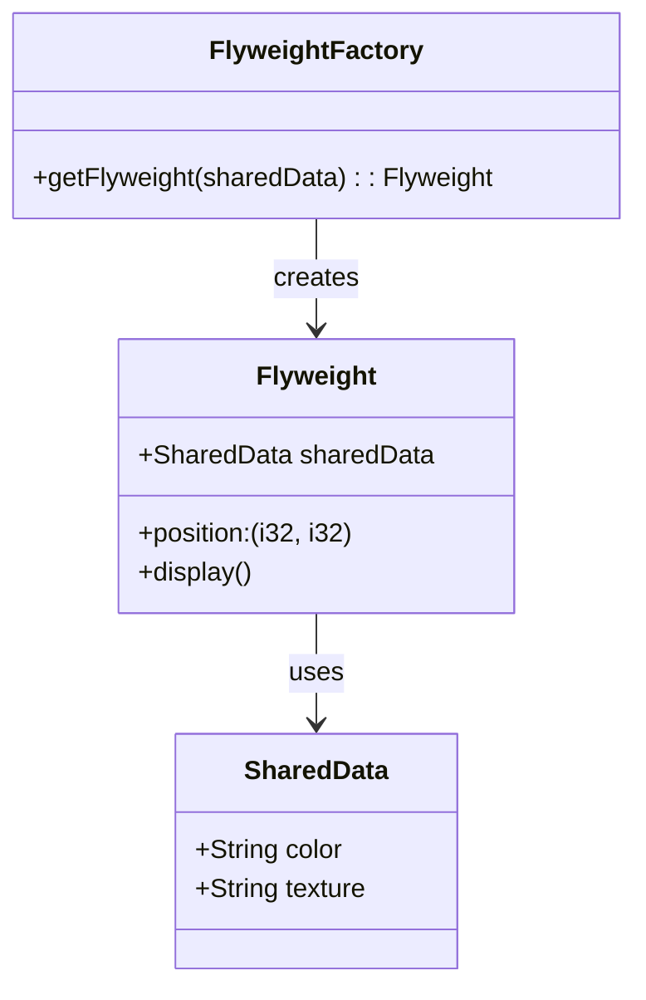

## 7.6. Flyweight Pattern Using Reference Counting

In this section, we'll delve into the Flyweight pattern, a structural design pattern that allows for efficient memory usage by sharing common data among multiple objects. We'll explore how Rust's smart pointers, such as `Rc` (Reference Counting) and `Arc` (Atomic Reference Counting), facilitate this pattern, enabling shared ownership and reducing memory overhead. 

### Understanding the Flyweight Pattern

**Definition and Purpose**: The Flyweight pattern is a design pattern aimed at minimizing memory usage by sharing as much data as possible with similar objects. This is particularly useful in applications where numerous objects are created that share common data. The pattern achieves this by storing shared data externally and referencing it from multiple objects.

**Key Participants**:
- **Flyweight**: The interface through which flyweights can act on intrinsic data.
- **Concrete Flyweight**: Implements the Flyweight interface and stores intrinsic data.
- **Flyweight Factory**: Manages flyweight objects and ensures that shared data is reused.
- **Client**: Maintains references to flyweights and computes extrinsic data.

### Reference Counting in Rust

**Reference Counting**: In Rust, reference counting is a technique used to manage shared ownership of data. The `Rc` and `Arc` smart pointers are used to enable multiple ownership of data, with `Rc` being single-threaded and `Arc` being thread-safe.

- **`Rc<T>`**: A non-thread-safe reference-counted pointer used for single-threaded scenarios. It keeps track of the number of references to a value, and when the count drops to zero, the value is deallocated.
- **`Arc<T>`**: A thread-safe version of `Rc`, suitable for concurrent programming. It uses atomic operations to manage the reference count, ensuring safe access across threads.

### Implementing the Flyweight Pattern in Rust

Let's explore how to implement the Flyweight pattern using `Rc` and `Arc` in Rust. We'll create a simple example where we have a large number of graphical objects that share common properties, such as color and texture.

#### Example: Flyweight Pattern with `Rc`

```rust
use std::rc::Rc;

// Define the shared data structure
struct SharedData {
    color: String,
    texture: String,
}

// Define the Flyweight structure
struct Flyweight {
    shared_data: Rc<SharedData>,
    position: (i32, i32),
}

impl Flyweight {
    fn new(shared_data: Rc<SharedData>, position: (i32, i32)) -> Self {
        Flyweight { shared_data, position }
    }

    fn display(&self) {
        println!(
            "Displaying object at position {:?} with color {} and texture {}",
            self.position, self.shared_data.color, self.shared_data.texture
        );
    }
}

fn main() {
    // Create shared data
    let shared_data = Rc::new(SharedData {
        color: String::from("Red"),
        texture: String::from("Smooth"),
    });

    // Create multiple flyweight objects
    let flyweight1 = Flyweight::new(Rc::clone(&shared_data), (10, 20));
    let flyweight2 = Flyweight::new(Rc::clone(&shared_data), (30, 40));

    // Display flyweight objects
    flyweight1.display();
    flyweight2.display();
}
```

**Explanation**: In this example, we define a `SharedData` structure that holds common properties. The `Flyweight` structure holds a reference to this shared data using `Rc`, along with its unique state (position). By cloning the `Rc`, we share the same data across multiple flyweight objects, reducing memory usage.

#### Example: Flyweight Pattern with `Arc`

For scenarios involving concurrency, we can use `Arc` instead of `Rc` to ensure thread safety.

```rust
use std::sync::Arc;
use std::thread;

// Define the shared data structure
struct SharedData {
    color: String,
    texture: String,
}

// Define the Flyweight structure
struct Flyweight {
    shared_data: Arc<SharedData>,
    position: (i32, i32),
}

impl Flyweight {
    fn new(shared_data: Arc<SharedData>, position: (i32, i32)) -> Self {
        Flyweight { shared_data, position }
    }

    fn display(&self) {
        println!(
            "Displaying object at position {:?} with color {} and texture {}",
            self.position, self.shared_data.color, self.shared_data.texture
        );
    }
}

fn main() {
    // Create shared data
    let shared_data = Arc::new(SharedData {
        color: String::from("Blue"),
        texture: String::from("Rough"),
    });

    // Create multiple flyweight objects in different threads
    let flyweight1 = Flyweight::new(Arc::clone(&shared_data), (50, 60));
    let flyweight2 = Flyweight::new(Arc::clone(&shared_data), (70, 80));

    let handle1 = thread::spawn(move || {
        flyweight1.display();
    });

    let handle2 = thread::spawn(move || {
        flyweight2.display();
    });

    handle1.join().unwrap();
    handle2.join().unwrap();
}
```

**Explanation**: Here, we use `Arc` to safely share the `SharedData` across threads. Each thread creates a flyweight object and displays it, demonstrating how `Arc` facilitates concurrent access to shared data.

### Advantages of the Flyweight Pattern

- **Memory Efficiency**: By sharing common data, the Flyweight pattern significantly reduces memory usage, especially in applications with numerous similar objects.
- **Performance Improvement**: Reducing memory usage can lead to performance improvements, as less memory allocation and deallocation are required.
- **Scalability**: The pattern allows for the creation of a large number of objects without a proportional increase in memory consumption.

### Thread Safety Considerations

When implementing the Flyweight pattern in a multi-threaded environment, it's crucial to ensure thread safety. `Rc` is not thread-safe and should only be used in single-threaded contexts. For concurrent scenarios, `Arc` should be used to safely share data across threads.

### Applicability of the Flyweight Pattern

The Flyweight pattern is particularly useful in the following scenarios:
- **Graphical Applications**: Where many objects share common properties like color, texture, or shape.
- **Text Processing**: For sharing character data among multiple text objects.
- **Network Applications**: Where multiple connections share common configuration or state.

### Design Considerations

- **Intrinsic vs. Extrinsic State**: Carefully distinguish between intrinsic (shared) and extrinsic (unique) state to maximize the benefits of the Flyweight pattern.
- **Reference Counting Overhead**: Be aware of the overhead associated with reference counting, especially in high-performance applications.
- **Complexity**: The Flyweight pattern can add complexity to the codebase, so it should be used judiciously.

### Rust Unique Features

Rust's ownership model and smart pointers (`Rc` and `Arc`) provide a robust foundation for implementing the Flyweight pattern. The language's emphasis on safety and concurrency aligns well with the pattern's goals of efficient memory usage and shared ownership.

### Differences and Similarities

The Flyweight pattern is often confused with other patterns like Singleton or Prototype. However, it is distinct in its focus on sharing common data among multiple objects rather than managing a single instance or cloning objects.

### Try It Yourself

Experiment with the provided code examples by modifying the shared data or adding more flyweight objects. Observe how memory usage changes with different configurations and explore the impact of using `Rc` versus `Arc`.

### Visualizing the Flyweight Pattern

Below is a diagram illustrating the Flyweight pattern with shared and unique states:



**Diagram Description**: This diagram shows the relationship between the `Flyweight`, `SharedData`, and `FlyweightFactory` classes. The `Flyweight` class uses shared data, while the `FlyweightFactory` is responsible for creating and managing flyweight objects.

### Knowledge Check

- What is the primary purpose of the Flyweight pattern?
- How does reference counting facilitate shared ownership in Rust?
- When should you use `Arc` instead of `Rc`?
- What are the advantages of using the Flyweight pattern?
- How does the Flyweight pattern differ from the Singleton pattern?

### Embrace the Journey

Remember, mastering design patterns like Flyweight is a journey. As you continue to explore Rust and its powerful features, you'll discover new ways to optimize your code and enhance performance. Keep experimenting, stay curious, and enjoy the process!

## Quiz Time!



### What is the primary purpose of the Flyweight pattern?

- [x] To minimize memory usage by sharing common data among similar objects.
- [ ] To ensure thread safety in concurrent applications.
- [ ] To provide a single instance of a class.
- [ ] To clone objects efficiently.

> **Explanation:** The Flyweight pattern is designed to minimize memory usage by sharing common data among similar objects, reducing the need for duplicate data storage.

### Which Rust smart pointer is used for single-threaded reference counting?

- [x] Rc
- [ ] Arc
- [ ] Box
- [ ] RefCell

> **Explanation:** `Rc` (Reference Counting) is used for single-threaded scenarios to manage shared ownership of data.

### In a multi-threaded environment, which smart pointer should be used for reference counting?

- [ ] Rc
- [x] Arc
- [ ] Box
- [ ] RefCell

> **Explanation:** `Arc` (Atomic Reference Counting) is thread-safe and suitable for concurrent programming, allowing shared ownership across threads.

### What is the main advantage of using the Flyweight pattern?

- [x] Memory efficiency
- [ ] Simplified code structure
- [ ] Improved security
- [ ] Faster execution time

> **Explanation:** The Flyweight pattern is primarily used for memory efficiency by sharing common data among multiple objects.

### How does the Flyweight pattern differ from the Singleton pattern?

- [x] Flyweight shares data among multiple objects, while Singleton provides a single instance.
- [ ] Flyweight provides a single instance, while Singleton shares data.
- [ ] Both patterns are used for memory optimization.
- [ ] Both patterns ensure thread safety.

> **Explanation:** The Flyweight pattern focuses on sharing data among multiple objects, whereas the Singleton pattern ensures a single instance of a class.

### What is the role of the Flyweight Factory?

- [x] To manage and create flyweight objects.
- [ ] To store unique state for each object.
- [ ] To ensure thread safety.
- [ ] To clone objects efficiently.

> **Explanation:** The Flyweight Factory is responsible for managing and creating flyweight objects, ensuring shared data is reused.

### Which of the following is an intrinsic state in the Flyweight pattern?

- [x] Shared data like color and texture
- [ ] Unique data like position
- [ ] Thread safety mechanisms
- [ ] Singleton instance

> **Explanation:** Intrinsic state refers to shared data that is common among multiple objects, such as color and texture.

### What is the main consideration when using `Rc` in Rust?

- [x] It is not thread-safe and should only be used in single-threaded contexts.
- [ ] It is thread-safe and suitable for concurrent programming.
- [ ] It automatically manages memory allocation.
- [ ] It provides a single instance of a class.

> **Explanation:** `Rc` is not thread-safe and should be used only in single-threaded contexts to manage shared ownership.

### What is a potential drawback of using reference counting?

- [x] Overhead associated with managing reference counts.
- [ ] Lack of memory efficiency.
- [ ] Inability to share data among objects.
- [ ] Complexity in code structure.

> **Explanation:** Reference counting introduces overhead due to the need to manage and update reference counts, which can impact performance.

### True or False: The Flyweight pattern is useful for reducing memory usage in applications with numerous similar objects.

- [x] True
- [ ] False

> **Explanation:** True. The Flyweight pattern is specifically designed to reduce memory usage by sharing common data among numerous similar objects.




