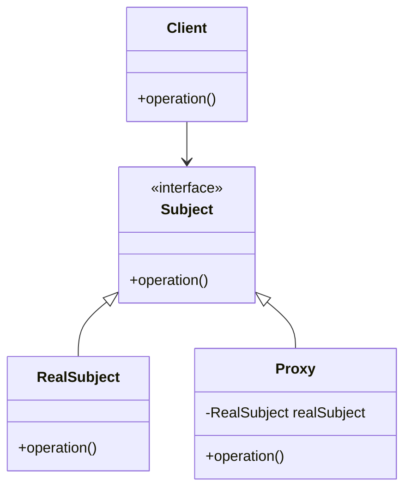

## 7.7. Proxy Pattern with Smart Pointers

The Proxy Pattern is a structural design pattern that provides a surrogate or placeholder for another object to control access to it. In Rust, smart pointers can be effectively used to implement this pattern, offering additional benefits such as lazy initialization and access control. Let's delve into the Proxy Pattern, explore its types, and see how Rust's smart pointers can be leveraged to implement it.

### Understanding the Proxy Pattern

The Proxy Pattern involves creating a proxy object that represents another object. This proxy can control access to the original object, add additional behavior, or defer the creation of the object until it's needed. There are several types of proxies:

- **Virtual Proxy**: Delays the creation and initialization of an object until it is needed.
- **Protection Proxy**: Controls access to the original object, often used for security purposes.
- **Remote Proxy**: Represents an object located in a different address space.
- **Cache Proxy**: Provides temporary storage for results of expensive operations.

### Smart Pointers as Proxies in Rust

Rust's smart pointers, such as `Box`, `Rc`, `Arc`, and `RefCell`, can be used to implement proxy behavior. Smart pointers manage ownership and borrowing, which are crucial in Rust's memory safety model. By using smart pointers, we can create proxies that manage access and lifecycle of the objects they represent.

#### Key Participants

- **Subject**: The common interface for RealSubject and Proxy.
- **RealSubject**: The actual object that the proxy represents.
- **Proxy**: The object that controls access to the RealSubject.

### Implementing Proxy Pattern with Smart Pointers

Let's explore how to implement different types of proxies using Rust's smart pointers.

#### Virtual Proxy Example

A virtual proxy can be used to delay the creation of a resource-intensive object until it is actually needed. Here's an example using `Box`:

```rust
struct ExpensiveObject {
    data: String,
}

impl ExpensiveObject {
    fn new() -> Self {
        println!("Creating ExpensiveObject...");
        ExpensiveObject {
            data: "Expensive Data".to_string(),
        }
    }

    fn process(&self) {
        println!("Processing {}", self.data);
    }
}

struct ExpensiveObjectProxy {
    object: Option<Box<ExpensiveObject>>,
}

impl ExpensiveObjectProxy {
    fn new() -> Self {
        ExpensiveObjectProxy { object: None }
    }

    fn process(&mut self) {
        if self.object.is_none() {
            self.object = Some(Box::new(ExpensiveObject::new()));
        }
        self.object.as_ref().unwrap().process();
    }
}

fn main() {
    let mut proxy = ExpensiveObjectProxy::new();
    println!("Proxy created, but ExpensiveObject is not yet created.");
    proxy.process(); // ExpensiveObject is created here
}
```

**Explanation**: In this example, `ExpensiveObjectProxy` acts as a virtual proxy. The `ExpensiveObject` is only created when `process` is called for the first time.

#### Protection Proxy Example

A protection proxy can restrict access to an object based on certain conditions. Here's an example using `RefCell` for interior mutability:

```rust
use std::cell::RefCell;

struct SecureData {
    secret: String,
}

impl SecureData {
    fn new(secret: String) -> Self {
        SecureData { secret }
    }

    fn reveal(&self) -> &str {
        &self.secret
    }
}

struct SecureDataProxy {
    data: RefCell<SecureData>,
    access_granted: bool,
}

impl SecureDataProxy {
    fn new(secret: String) -> Self {
        SecureDataProxy {
            data: RefCell::new(SecureData::new(secret)),
            access_granted: false,
        }
    }

    fn grant_access(&mut self) {
        self.access_granted = true;
    }

    fn reveal(&self) -> Option<&str> {
        if self.access_granted {
            Some(self.data.borrow().reveal())
        } else {
            None
        }
    }
}

fn main() {
    let mut proxy = SecureDataProxy::new("Top Secret".to_string());
    println!("Access to secret data: {:?}", proxy.reveal());
    proxy.grant_access();
    println!("Access to secret data: {:?}", proxy.reveal());
}
```

**Explanation**: The `SecureDataProxy` controls access to the `SecureData` object. Access is only granted when `grant_access` is called.

### Considerations Around Ownership and Borrowing

When implementing the Proxy Pattern in Rust, it's crucial to consider ownership and borrowing rules. Smart pointers like `Rc` and `Arc` allow multiple ownership, while `RefCell` provides interior mutability. These features enable flexible proxy implementations but require careful management to avoid runtime errors like borrowing violations.

#### Rust Unique Features

- **Ownership and Borrowing**: Rust's ownership model ensures memory safety without a garbage collector, making it ideal for implementing proxies that manage resource lifecycles.
- **Smart Pointers**: Rust's smart pointers provide powerful tools for managing object lifetimes and access, essential for implementing proxies.
- **Concurrency**: Using `Arc` and `Mutex`, we can create thread-safe proxies that manage concurrent access to shared resources.

### Benefits of Using Proxy Pattern in Rust

- **Lazy Initialization**: Virtual proxies can defer resource-intensive operations until necessary.
- **Access Control**: Protection proxies can enforce security policies by controlling access to sensitive data.
- **Resource Management**: Proxies can manage the lifecycle of resources, ensuring efficient use of memory and processing power.

### Visualizing the Proxy Pattern

Below is a diagram illustrating the relationship between the Proxy, RealSubject, and Client:



**Diagram Explanation**: The `Proxy` and `RealSubject` both implement the `Subject` interface. The `Client` interacts with the `Subject` interface, unaware of whether it is dealing with a `Proxy` or `RealSubject`.

### Differences and Similarities with Other Patterns

- **Decorator Pattern**: Both Proxy and Decorator patterns provide a level of indirection, but the Decorator pattern focuses on adding behavior, while the Proxy pattern focuses on controlling access.
- **Adapter Pattern**: The Adapter pattern changes the interface of an existing object, whereas the Proxy pattern maintains the same interface but controls access.

### Try It Yourself

Experiment with the provided examples by modifying the conditions under which the proxy grants access or initializes the real object. Try implementing a cache proxy that stores results of expensive computations.

### Knowledge Check

- What are the different types of proxies, and how do they differ?
- How can smart pointers be used to implement proxies in Rust?
- What are the benefits of using the Proxy Pattern in Rust?

### Conclusion

The Proxy Pattern is a versatile design pattern that can be effectively implemented in Rust using smart pointers. By understanding the nuances of ownership and borrowing, we can create proxies that manage resources efficiently, control access, and enhance functionality.

## Quiz Time!



### What is the primary purpose of the Proxy Pattern?

- [x] To control access to an object by acting as its surrogate or placeholder.
- [ ] To add new behavior to an object dynamically.
- [ ] To convert the interface of a class into another interface.
- [ ] To provide a simplified interface to a complex subsystem.

> **Explanation:** The Proxy Pattern is used to control access to an object by acting as its surrogate or placeholder.

### Which Rust feature is crucial for implementing the Proxy Pattern?

- [x] Smart Pointers
- [ ] Pattern Matching
- [ ] Macros
- [ ] Enums

> **Explanation:** Smart pointers in Rust, such as `Box`, `Rc`, and `Arc`, are crucial for implementing the Proxy Pattern as they manage ownership and borrowing.

### What type of proxy delays the creation of an object until it is needed?

- [x] Virtual Proxy
- [ ] Protection Proxy
- [ ] Remote Proxy
- [ ] Cache Proxy

> **Explanation:** A Virtual Proxy delays the creation and initialization of an object until it is needed.

### Which smart pointer allows for multiple ownership in Rust?

- [x] Rc
- [ ] Box
- [ ] RefCell
- [ ] Mutex

> **Explanation:** `Rc` (Reference Counting) allows for multiple ownership in Rust.

### What is a key benefit of using the Proxy Pattern in Rust?

- [x] Lazy Initialization
- [ ] Increased Complexity
- [ ] Reduced Flexibility
- [ ] Direct Access to Resources

> **Explanation:** Lazy Initialization is a key benefit of using the Proxy Pattern, as it allows for deferring resource-intensive operations until necessary.

### How does the Protection Proxy control access to an object?

- [x] By enforcing security policies
- [ ] By delaying object creation
- [ ] By caching results
- [ ] By converting interfaces

> **Explanation:** The Protection Proxy controls access by enforcing security policies, allowing or denying access based on conditions.

### Which smart pointer provides interior mutability in Rust?

- [x] RefCell
- [ ] Rc
- [ ] Box
- [ ] Arc

> **Explanation:** `RefCell` provides interior mutability, allowing for mutable access to data even when the `RefCell` itself is immutable.

### What is the relationship between Proxy and RealSubject in the Proxy Pattern?

- [x] Proxy acts as a surrogate for RealSubject.
- [ ] Proxy converts the interface of RealSubject.
- [ ] Proxy adds new behavior to RealSubject.
- [ ] Proxy simplifies the interface of RealSubject.

> **Explanation:** In the Proxy Pattern, the Proxy acts as a surrogate or placeholder for the RealSubject, controlling access to it.

### Which pattern is commonly confused with the Proxy Pattern due to its similar structure?

- [x] Decorator Pattern
- [ ] Adapter Pattern
- [ ] Observer Pattern
- [ ] Singleton Pattern

> **Explanation:** The Decorator Pattern is commonly confused with the Proxy Pattern due to its similar structure, but they serve different purposes.

### True or False: The Proxy Pattern can be used for remote object representation.

- [x] True
- [ ] False

> **Explanation:** True. The Proxy Pattern can be used as a Remote Proxy to represent an object located in a different address space.



Remember, this is just the beginning. As you progress, you'll build more complex and interactive systems using Rust's powerful features. Keep experimenting, stay curious, and enjoy the journey!
