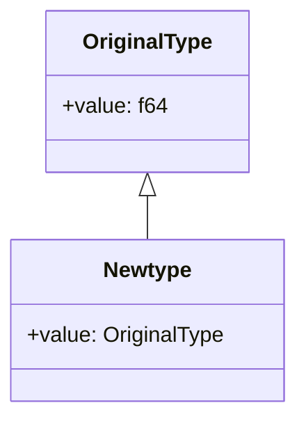

## 7.8. Newtype Pattern for Strong Typing

### Introduction

In the world of systems programming, ensuring type safety is paramount. Rust, with its strong emphasis on safety and concurrency, provides several mechanisms to achieve this. One such mechanism is the Newtype Pattern, which allows developers to create distinct types from existing ones, enhancing code safety and readability. This section delves into the Newtype Pattern, focusing on its role in providing strong typing, preventing type errors, and offering zero-cost abstractions.

### What is the Newtype Pattern?

The Newtype Pattern is a design pattern used to create a new type that is distinct from its underlying type. This is achieved by wrapping the original type in a tuple struct with a single field. This pattern is particularly useful in scenarios where you want to enforce type safety by preventing the accidental mixing of similar types.

#### Key Characteristics:

- **Strong Typing**: By creating distinct types, the Newtype Pattern prevents type errors that can occur when similar types are mixed up.
- **Zero-Cost Abstraction**: The Newtype Pattern incurs no runtime overhead, as the compiler optimizes away the wrapper.
- **Enhanced Readability**: Code becomes more readable and maintainable, as the intent of each type is clear.

### Why Use the Newtype Pattern?

#### Preventing Type Errors

Consider a scenario where you have two types, `UserId` and `ProductId`, both represented as integers. Without the Newtype Pattern, it's easy to accidentally mix these types, leading to potential bugs. By using the Newtype Pattern, you can create distinct types for `UserId` and `ProductId`, ensuring that they cannot be used interchangeably.

#### Example: Distinct Types for `UserId` and `ProductId`

```rust
struct UserId(u32);
struct ProductId(u32);

fn get_user_name(user_id: UserId) -> String {
    // Imagine this function fetches a user's name from a database
    format!("User{}", user_id.0)
}

fn get_product_name(product_id: ProductId) -> String {
    // Imagine this function fetches a product's name from a database
    format!("Product{}", product_id.0)
}

fn main() {
    let user_id = UserId(1);
    let product_id = ProductId(2);

    // This will work
    let user_name = get_user_name(user_id);
    println!("User Name: {}", user_name);

    // This will cause a compile-time error
    // let product_name = get_user_name(product_id);
}
```

In the example above, attempting to pass a `ProductId` to `get_user_name` results in a compile-time error, preventing a potential bug.

#### Zero-Cost Abstraction

One of the significant advantages of the Newtype Pattern in Rust is that it provides a zero-cost abstraction. This means that while the code gains the benefits of strong typing, there is no runtime overhead. The Rust compiler is able to optimize away the wrapper, ensuring that the performance remains unaffected.

### Implementing the Newtype Pattern

#### Basic Implementation

The simplest form of the Newtype Pattern involves creating a tuple struct with a single field. This struct acts as a wrapper around the original type.

```rust
struct Kilometers(f64);

fn main() {
    let distance = Kilometers(42.0);
    println!("Distance: {} km", distance.0);
}
```

#### Adding Methods

You can enhance the functionality of your newtype by implementing methods on it. This allows you to encapsulate behavior specific to the newtype.

```rust
struct Kilometers(f64);

impl Kilometers {
    fn to_miles(&self) -> f64 {
        self.0 * 0.621371
    }
}

fn main() {
    let distance = Kilometers(42.0);
    println!("Distance in miles: {:.2}", distance.to_miles());
}
```

#### Implementing Traits

To make your newtype more versatile, you can implement traits for it. This is particularly useful when you want your newtype to behave like its underlying type.

```rust
use std::ops::Add;

struct Kilometers(f64);

impl Add for Kilometers {
    type Output = Kilometers;

    fn add(self, other: Kilometers) -> Kilometers {
        Kilometers(self.0 + other.0)
    }
}

fn main() {
    let distance1 = Kilometers(42.0);
    let distance2 = Kilometers(58.0);
    let total_distance = distance1 + distance2;
    println!("Total Distance: {} km", total_distance.0);
}
```

### Design Considerations

#### When to Use the Newtype Pattern

- **Type Safety**: Use the Newtype Pattern when you want to enforce type safety and prevent accidental misuse of similar types.
- **Encapsulation**: When you want to encapsulate specific behavior or validation logic for a type.
- **Zero-Cost Abstraction**: When you need the benefits of abstraction without incurring runtime costs.

#### Potential Pitfalls

- **Boilerplate Code**: Implementing the Newtype Pattern can sometimes lead to additional boilerplate code, especially when implementing traits.
- **Overuse**: While the Newtype Pattern is powerful, overusing it can lead to unnecessary complexity. Use it judiciously where type safety is a concern.

### Rust Unique Features

Rust's type system and compiler optimizations make the Newtype Pattern particularly effective. The language's emphasis on zero-cost abstractions ensures that developers can use the pattern without worrying about performance penalties. Additionally, Rust's trait system allows for flexible and powerful implementations of newtypes.

### Differences and Similarities

The Newtype Pattern is often compared to type aliases. While both can be used to create new names for existing types, they serve different purposes. Type aliases do not create distinct types and therefore do not provide the same level of type safety as newtypes.

### Visualizing the Newtype Pattern

To better understand the Newtype Pattern, let's visualize how it works:



In this diagram, `OriginalType` represents the underlying type, while `Newtype` is a wrapper around it. The arrow indicates that `Newtype` is a subtype of `OriginalType`, but it is distinct and cannot be used interchangeably.

### Try It Yourself

To solidify your understanding of the Newtype Pattern, try modifying the examples provided:

1. **Create a Newtype for Temperature**: Implement a newtype for temperature in Celsius and Fahrenheit. Add methods to convert between the two.
2. **Implement Additional Traits**: For the `Kilometers` newtype, implement additional traits such as `Sub` for subtraction and `Mul` for multiplication.
3. **Experiment with Error Handling**: Create a newtype for a custom error type and implement the `std::fmt::Display` trait for it.

### Knowledge Check

Before we wrap up, let's reinforce what we've learned:

- **What is the primary purpose of the Newtype Pattern?**
- **How does the Newtype Pattern provide zero-cost abstraction?**
- **What are some potential pitfalls of using the Newtype Pattern?**

### Summary

The Newtype Pattern is a powerful tool in Rust's arsenal for ensuring type safety and enhancing code readability. By creating distinct types, developers can prevent type errors and encapsulate specific behavior. With Rust's zero-cost abstractions, the Newtype Pattern provides these benefits without sacrificing performance. As you continue your journey with Rust, consider using the Newtype Pattern to strengthen your code's safety and clarity.

## Quiz Time!



### What is the primary purpose of the Newtype Pattern in Rust?

- [x] To create distinct types for strong typing
- [ ] To reduce code size
- [ ] To improve runtime performance
- [ ] To simplify syntax

> **Explanation:** The Newtype Pattern is primarily used to create distinct types, enhancing type safety by preventing the mixing of similar types.

### How does the Newtype Pattern achieve zero-cost abstraction?

- [x] The compiler optimizes away the wrapper
- [ ] It uses less memory
- [ ] It reduces the number of function calls
- [ ] It simplifies the type system

> **Explanation:** The Rust compiler optimizes away the wrapper, ensuring that there is no runtime overhead associated with using the Newtype Pattern.

### Which of the following is a potential pitfall of using the Newtype Pattern?

- [x] Additional boilerplate code
- [ ] Increased runtime errors
- [ ] Reduced code readability
- [ ] Decreased type safety

> **Explanation:** Implementing the Newtype Pattern can lead to additional boilerplate code, especially when implementing traits.

### What is a key difference between a newtype and a type alias in Rust?

- [x] A newtype creates a distinct type, while a type alias does not
- [ ] A type alias creates a distinct type, while a newtype does not
- [ ] Both create distinct types
- [ ] Neither creates distinct types

> **Explanation:** A newtype creates a distinct type, providing strong typing, whereas a type alias does not create a new type.

### Which of the following scenarios is best suited for the Newtype Pattern?

- [x] When you need to enforce type safety
- [ ] When you want to reduce code size
- [ ] When you need to improve runtime performance
- [ ] When you want to simplify syntax

> **Explanation:** The Newtype Pattern is best suited for scenarios where enforcing type safety is important.

### What is the benefit of implementing traits for a newtype?

- [x] It allows the newtype to behave like its underlying type
- [ ] It reduces memory usage
- [ ] It simplifies the code
- [ ] It decreases compile time

> **Explanation:** Implementing traits for a newtype allows it to behave like its underlying type, enhancing its versatility.

### How can the Newtype Pattern enhance code readability?

- [x] By making the intent of each type clear
- [ ] By reducing the number of lines of code
- [ ] By simplifying syntax
- [ ] By decreasing compile time

> **Explanation:** The Newtype Pattern enhances code readability by making the intent of each type clear, preventing confusion.

### What is a common use case for the Newtype Pattern?

- [x] Preventing the accidental mixing of similar types
- [ ] Reducing memory usage
- [ ] Simplifying syntax
- [ ] Decreasing compile time

> **Explanation:** A common use case for the Newtype Pattern is preventing the accidental mixing of similar types, enhancing type safety.

### Which of the following is NOT a characteristic of the Newtype Pattern?

- [ ] Strong Typing
- [x] Runtime Overhead
- [ ] Zero-Cost Abstraction
- [ ] Enhanced Readability

> **Explanation:** The Newtype Pattern is characterized by strong typing, zero-cost abstraction, and enhanced readability, but it does not introduce runtime overhead.

### True or False: The Newtype Pattern can be used to encapsulate specific behavior for a type.

- [x] True
- [ ] False

> **Explanation:** True. The Newtype Pattern can be used to encapsulate specific behavior or validation logic for a type, enhancing its functionality.



Remember, this is just the beginning. As you progress, you'll build more complex and interactive applications using the Newtype Pattern. Keep experimenting, stay curious, and enjoy the journey!
