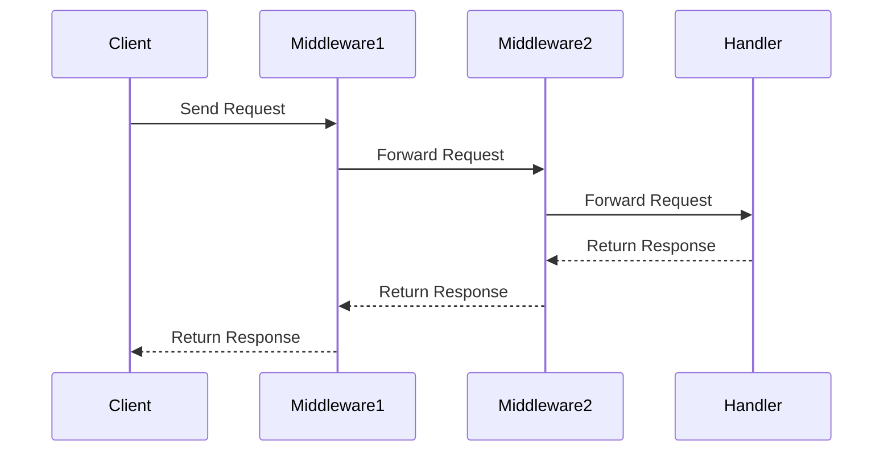

## 7.9. Implementing Wrappers and Middleware

In the world of software design, wrappers and middleware play a crucial role in extending or modifying the behavior of existing code without altering its structure. This approach is particularly valuable in Rust, where modularity and separation of concerns are paramount. In this section, we will explore how to implement wrappers and middleware in Rust using structs and function composition, with practical examples in the context of web servers and event handling.

### Understanding Wrappers and Middleware

**Wrappers** are design patterns that allow you to encapsulate an object to modify or extend its behavior. They provide a way to add additional functionality to an existing object without changing its interface. This is achieved by "wrapping" the original object with a new layer that intercepts method calls, adding new behavior before or after delegating to the original object.

**Middleware**, on the other hand, is a concept often used in web development and event-driven systems. It refers to a series of processing steps that are executed in sequence, where each step can modify the request, response, or both. Middleware layers are typically used to handle cross-cutting concerns such as logging, authentication, and error handling.

### Implementing Wrappers in Rust

In Rust, wrappers can be implemented using structs that hold the original object and provide additional methods or override existing ones. Let's start by implementing a simple wrapper pattern.

#### Example: Logging Wrapper

Consider a scenario where we have a `Database` struct, and we want to add logging functionality to its operations without modifying the original struct.

```rust
// Original Database struct
struct Database;

impl Database {
    fn query(&self, query: &str) -> String {
        // Simulate a database query
        format!("Result for query: {}", query)
    }
}

// LoggingWrapper struct
struct LoggingWrapper<T> {
    inner: T,
}

impl<T> LoggingWrapper<T> {
    fn new(inner: T) -> Self {
        LoggingWrapper { inner }
    }
}

impl LoggingWrapper<Database> {
    fn query(&self, query: &str) -> String {
        println!("Executing query: {}", query);
        let result = self.inner.query(query);
        println!("Query result: {}", result);
        result
    }
}

fn main() {
    let db = Database;
    let logging_db = LoggingWrapper::new(db);

    logging_db.query("SELECT * FROM users");
}
```

In this example, `LoggingWrapper` is a generic struct that can wrap any type. We implement a specific method for `LoggingWrapper<Database>` to add logging functionality to the `query` method. This approach allows us to extend the behavior of `Database` without modifying its original implementation.

### Implementing Middleware in Rust

Middleware is commonly used in web servers to process HTTP requests and responses. In Rust, middleware can be implemented using function composition, where each middleware function takes a request, processes it, and passes it to the next function in the chain.

#### Example: Web Server Middleware

Let's implement a simple web server with middleware for logging and authentication.

```rust
use std::collections::HashMap;

// Define a Request and Response struct
struct Request {
    headers: HashMap<String, String>,
    body: String,
}

struct Response {
    status_code: u16,
    body: String,
}

// Define a type alias for middleware functions
type Middleware = fn(Request, &dyn Fn(Request) -> Response) -> Response;

// Logging middleware
fn logging_middleware(req: Request, next: &dyn Fn(Request) -> Response) -> Response {
    println!("Request received: {:?}", req.headers);
    let response = next(req);
    println!("Response sent: {}", response.status_code);
    response
}

// Authentication middleware
fn auth_middleware(req: Request, next: &dyn Fn(Request) -> Response) -> Response {
    if req.headers.get("Authorization").is_none() {
        return Response {
            status_code: 401,
            body: "Unauthorized".to_string(),
        };
    }
    next(req)
}

// Final handler
fn final_handler(req: Request) -> Response {
    Response {
        status_code: 200,
        body: format!("Hello, {}", req.body),
    }
}

// Function to apply middleware
fn apply_middleware(req: Request, middlewares: &[Middleware]) -> Response {
    let mut handler = final_handler;

    for &middleware in middlewares.iter().rev() {
        let next = handler;
        handler = |req: Request| middleware(req, &next);
    }

    handler(req)
}

fn main() {
    let mut headers = HashMap::new();
    headers.insert("Authorization".to_string(), "Bearer token".to_string());

    let req = Request {
        headers,
        body: "World".to_string(),
    };

    let middlewares: Vec<Middleware> = vec![logging_middleware, auth_middleware];
    let response = apply_middleware(req, &middlewares);

    println!("Final response: {}", response.body);
}
```

In this example, we define a `Request` and `Response` struct to represent HTTP requests and responses. We then create two middleware functions: `logging_middleware` and `auth_middleware`. Each middleware function takes a `Request` and a reference to the next function in the chain, processes the request, and either returns a `Response` or passes the request to the next function.

The `apply_middleware` function composes the middleware functions into a single handler by iterating over the middleware in reverse order and wrapping each one around the previous handler. This allows us to build a chain of responsibility where each middleware can modify the request or response.

### Benefits of Modularity and Separation of Concerns

Implementing wrappers and middleware in Rust provides several benefits:

- **Modularity**: Wrappers and middleware allow you to encapsulate functionality in separate components, making your codebase more modular and easier to maintain.
- **Separation of Concerns**: By isolating cross-cutting concerns such as logging and authentication into middleware, you can keep your core business logic clean and focused.
- **Reusability**: Wrappers and middleware can be reused across different parts of your application, reducing code duplication and improving consistency.

### Challenges with Ownership and Lifetimes

When implementing wrappers and middleware in Rust, you may encounter challenges related to ownership and lifetimes. Rust's ownership model ensures memory safety, but it can also introduce complexity when wrapping objects or composing functions.

#### Handling Ownership

When wrapping objects, you need to decide whether to take ownership of the wrapped object or borrow it. Taking ownership allows you to modify the wrapped object, but it also means that the wrapper is responsible for managing its lifetime. Borrowing allows you to share the wrapped object with other parts of your code, but it requires careful management of lifetimes to avoid dangling references.

#### Managing Lifetimes

Lifetimes are a key concept in Rust that ensure references are valid for the duration of their use. When implementing middleware, you may need to specify lifetimes for function parameters and return types to ensure that references are valid throughout the middleware chain.

Consider the following example, where we use lifetimes to ensure that a borrowed object is valid for the duration of the wrapper:

```rust
struct Wrapper<'a, T> {
    inner: &'a T,
}

impl<'a, T> Wrapper<'a, T> {
    fn new(inner: &'a T) -> Self {
        Wrapper { inner }
    }

    fn do_something(&self) {
        // Use the borrowed object
    }
}

fn main() {
    let data = String::from("Hello, world!");
    let wrapper = Wrapper::new(&data);

    wrapper.do_something();
}
```

In this example, the `Wrapper` struct holds a reference to an object of type `T`, and we specify a lifetime `'a` to ensure that the reference is valid for the duration of the wrapper's use.

### Try It Yourself

Now that we've explored the concepts of wrappers and middleware in Rust, it's time to experiment with the code examples. Try modifying the `LoggingWrapper` to add additional functionality, such as timing the execution of the `query` method. You can also extend the web server middleware example by adding new middleware functions for caching or rate limiting.

### Visualizing Wrappers and Middleware

To better understand the flow of requests through middleware, let's visualize the process using a sequence diagram.



This diagram illustrates how a request flows through a series of middleware layers before reaching the final handler. Each middleware can modify the request or response, providing a flexible and powerful mechanism for handling cross-cutting concerns.

### References and Further Reading

- [Rust Book: Ownership](https://doc.rust-lang.org/book/ch04-00-understanding-ownership.html)
- [Rust Book: Lifetimes](https://doc.rust-lang.org/book/ch10-03-lifetime-syntax.html)
- [Rust Web Frameworks](https://www.arewewebyet.org/)
- [Middleware in Web Development](https://en.wikipedia.org/wiki/Middleware)

### Key Takeaways

- Wrappers and middleware are powerful design patterns for extending or modifying behavior without altering code structure.
- In Rust, wrappers can be implemented using structs, while middleware can be implemented using function composition.
- These patterns promote modularity, separation of concerns, and reusability.
- Ownership and lifetimes are important considerations when implementing wrappers and middleware in Rust.

## Quiz Time!



### What is the primary purpose of a wrapper in Rust?

- [x] To encapsulate an object and modify or extend its behavior
- [ ] To directly modify the original object's code
- [ ] To replace the original object entirely
- [ ] To create a new object from scratch

> **Explanation:** Wrappers are used to encapsulate an object and modify or extend its behavior without altering the original object's code.

### How can middleware be implemented in Rust?

- [x] Using function composition
- [ ] By modifying the core logic directly
- [ ] Through inheritance
- [ ] By using macros

> **Explanation:** Middleware in Rust is typically implemented using function composition, where each middleware function processes a request and passes it to the next function in the chain.

### What is a key benefit of using middleware in web servers?

- [x] Separation of concerns
- [ ] Increased complexity
- [ ] Direct access to the database
- [ ] Reduced modularity

> **Explanation:** Middleware helps in separating cross-cutting concerns such as logging and authentication from the core business logic, promoting cleaner and more maintainable code.

### What challenge might you face when implementing wrappers in Rust?

- [x] Managing ownership and lifetimes
- [ ] Lack of modularity
- [ ] Difficulty in creating new objects
- [ ] Inability to extend functionality

> **Explanation:** Managing ownership and lifetimes can be challenging when implementing wrappers, as Rust's ownership model ensures memory safety but requires careful management of references.

### In the logging middleware example, what does the middleware function do?

- [x] Logs the request and response
- [ ] Modifies the request headers
- [ ] Directly accesses the database
- [ ] Changes the response status code

> **Explanation:** The logging middleware function logs the request and response, providing insight into the processing of requests.

### What is a common use case for middleware in web development?

- [x] Handling authentication
- [ ] Directly modifying HTML content
- [ ] Creating new database tables
- [ ] Compiling Rust code

> **Explanation:** Middleware is commonly used for handling authentication, logging, and other cross-cutting concerns in web development.

### How does the `apply_middleware` function work in the web server example?

- [x] It composes middleware functions into a single handler
- [ ] It directly modifies the request object
- [ ] It bypasses all middleware functions
- [ ] It only processes the final response

> **Explanation:** The `apply_middleware` function composes middleware functions into a single handler by iterating over the middleware in reverse order and wrapping each one around the previous handler.

### What is the role of lifetimes in Rust wrappers?

- [x] To ensure references are valid for the duration of their use
- [ ] To increase the complexity of the code
- [ ] To reduce the need for ownership
- [ ] To eliminate the need for borrowing

> **Explanation:** Lifetimes in Rust ensure that references are valid for the duration of their use, preventing dangling references and ensuring memory safety.

### What is a key advantage of using wrappers in Rust?

- [x] Modularity and reusability
- [ ] Increased code duplication
- [ ] Direct access to private fields
- [ ] Reduced code readability

> **Explanation:** Wrappers promote modularity and reusability by encapsulating functionality in separate components, reducing code duplication and improving maintainability.

### True or False: Middleware can only be used in web servers.

- [ ] True
- [x] False

> **Explanation:** Middleware can be used in various contexts, including event-driven systems and other applications where processing steps are executed in sequence.



Remember, this is just the beginning. As you progress, you'll build more complex and interactive systems using wrappers and middleware. Keep experimenting, stay curious, and enjoy the journey!
