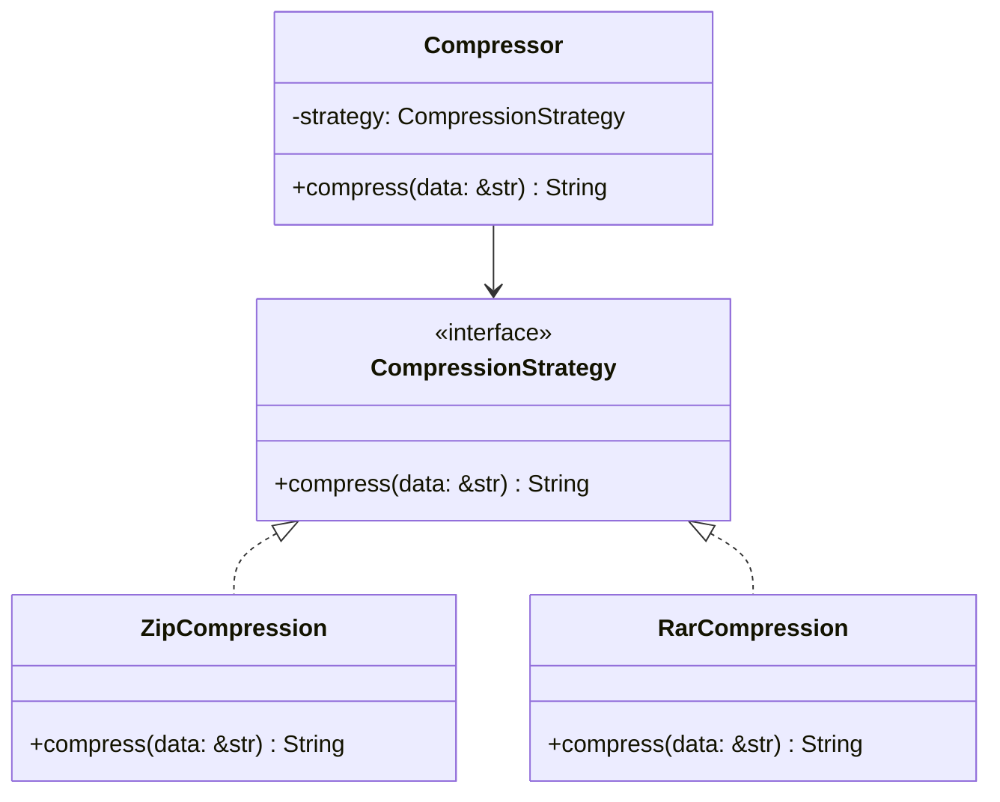

## 8.1. Strategy Pattern with Closures and Traits

The Strategy Pattern is a behavioral design pattern that enables selecting an algorithm's behavior at runtime. It defines a family of algorithms, encapsulates each one, and makes them interchangeable. This pattern allows the algorithm to vary independently from the clients that use it. In Rust, we can implement the Strategy Pattern using traits and closures, providing a powerful way to decouple algorithms from the objects that use them.

### Intent

The primary intent of the Strategy Pattern is to define a set of interchangeable algorithms and allow the client to choose which one to use at runtime. This pattern promotes flexibility and reusability by enabling the client to switch between different algorithms without altering the client code.

### Key Participants

1. **Strategy**: An interface common to all supported algorithms. In Rust, this can be represented using traits.
2. **Concrete Strategy**: A class or closure implementing the Strategy interface.
3. **Context**: Maintains a reference to a Strategy object and delegates the algorithm execution to the Strategy.

### Implementing Strategy Pattern with Traits

In Rust, traits are a powerful way to define shared behavior. We can use traits to represent the Strategy interface, allowing different algorithms to be implemented as separate types.

```rust
// Define a trait for the strategy
trait CompressionStrategy {
    fn compress(&self, data: &str) -> String;
}

// Implement a concrete strategy for ZIP compression
struct ZipCompression;

impl CompressionStrategy for ZipCompression {
    fn compress(&self, data: &str) -> String {
        format!("ZIP compressed: {}", data)
    }
}

// Implement a concrete strategy for RAR compression
struct RarCompression;

impl CompressionStrategy for RarCompression {
    fn compress(&self, data: &str) -> String {
        format!("RAR compressed: {}", data)
    }
}

// Context that uses a compression strategy
struct Compressor {
    strategy: Box<dyn CompressionStrategy>,
}

impl Compressor {
    fn new(strategy: Box<dyn CompressionStrategy>) -> Self {
        Compressor { strategy }
    }

    fn compress(&self, data: &str) -> String {
        self.strategy.compress(data)
    }
}

fn main() {
    let zip_strategy = Box::new(ZipCompression);
    let rar_strategy = Box::new(RarCompression);

    let compressor = Compressor::new(zip_strategy);
    println!("{}", compressor.compress("Hello, World!"));

    let compressor = Compressor::new(rar_strategy);
    println!("{}", compressor.compress("Hello, World!"));
}
```

In this example, we define a `CompressionStrategy` trait with a `compress` method. The `ZipCompression` and `RarCompression` structs implement this trait, providing their specific compression logic. The `Compressor` struct acts as the context, holding a reference to a `CompressionStrategy` and delegating the compression task to it.

### Implementing Strategy Pattern with Closures

Closures in Rust provide an alternative way to implement the Strategy Pattern. They allow us to define inline, anonymous functions that can capture their environment, making them a flexible choice for defining strategies.

```rust
// Define a closure for ZIP compression
let zip_compression = |data: &str| -> String {
    format!("ZIP compressed: {}", data)
};

// Define a closure for RAR compression
let rar_compression = |data: &str| -> String {
    format!("RAR compressed: {}", data)
};

// Context that uses a compression strategy
struct Compressor<F>
where
    F: Fn(&str) -> String,
{
    strategy: F,
}

impl<F> Compressor<F>
where
    F: Fn(&str) -> String,
{
    fn new(strategy: F) -> Self {
        Compressor { strategy }
    }

    fn compress(&self, data: &str) -> String {
        (self.strategy)(data)
    }
}

fn main() {
    let compressor = Compressor::new(zip_compression);
    println!("{}", compressor.compress("Hello, World!"));

    let compressor = Compressor::new(rar_compression);
    println!("{}", compressor.compress("Hello, World!"));
}
```

In this example, we define two closures, `zip_compression` and `rar_compression`, each implementing a different compression strategy. The `Compressor` struct is generic over a function type `F`, which represents the strategy. This approach provides a lightweight and flexible way to implement the Strategy Pattern without defining multiple structs.

### Static vs. Dynamic Dispatch

In Rust, we have two primary ways to dispatch method calls: static and dynamic dispatch. Understanding the trade-offs between these two approaches is crucial when implementing the Strategy Pattern.

- **Static Dispatch**: The method to be called is determined at compile time. This approach is more efficient because it avoids the runtime overhead of dynamic dispatch. However, it requires the exact type to be known at compile time, which can limit flexibility.

- **Dynamic Dispatch**: The method to be called is determined at runtime. This approach provides more flexibility, allowing different types to be used interchangeably. However, it introduces a slight runtime overhead due to the indirection involved.

In our trait-based implementation, we use dynamic dispatch with `Box<dyn CompressionStrategy>`, allowing different strategy implementations to be used interchangeably. In contrast, the closure-based implementation uses static dispatch, as the closure type is known at compile time.

### Design Considerations

When implementing the Strategy Pattern in Rust, consider the following:

- **Flexibility**: Using traits and dynamic dispatch provides flexibility, allowing different strategies to be swapped at runtime.
- **Performance**: Static dispatch with closures can offer better performance due to the lack of runtime overhead.
- **Complexity**: Traits can introduce additional complexity, especially when dealing with lifetimes and trait objects.

### Rust Unique Features

Rust's ownership model and type system provide unique advantages when implementing the Strategy Pattern:

- **Ownership and Borrowing**: Rust's ownership model ensures memory safety, preventing common issues like null pointer dereferencing and data races.
- **Traits and Generics**: Rust's trait system allows defining shared behavior across different types, enabling flexible and reusable code.

### Differences and Similarities

The Strategy Pattern is often confused with other behavioral patterns like the State Pattern. While both patterns involve changing behavior at runtime, the Strategy Pattern focuses on selecting an algorithm, whereas the State Pattern focuses on changing the object's state.

### Try It Yourself

Experiment with the code examples provided. Try implementing additional compression strategies or modifying the existing ones. Consider using different data types or adding more functionality to the `Compressor` struct.

### Visualizing the Strategy Pattern



This diagram illustrates the relationship between the `CompressionStrategy` trait, its concrete implementations (`ZipCompression` and `RarCompression`), and the `Compressor` context.

### Knowledge Check

- What is the primary purpose of the Strategy Pattern?
- How can traits be used to implement the Strategy Pattern in Rust?
- What are the trade-offs between static and dynamic dispatch?
- How do closures provide an alternative way to implement the Strategy Pattern?

### Embrace the Journey

Remember, this is just the beginning. As you progress, you'll build more complex and interactive applications using the Strategy Pattern. Keep experimenting, stay curious, and enjoy the journey!

## Quiz Time!



### What is the primary purpose of the Strategy Pattern?

- [x] To define a set of interchangeable algorithms and allow the client to choose which one to use at runtime.
- [ ] To encapsulate object creation logic.
- [ ] To provide a way to access the elements of an aggregate object sequentially.
- [ ] To define a one-to-many dependency between objects.

> **Explanation:** The Strategy Pattern allows for interchangeable algorithms, enabling the client to select one at runtime.

### How can traits be used to implement the Strategy Pattern in Rust?

- [x] By defining a trait with method definitions that represent the strategy.
- [ ] By using traits to encapsulate object creation logic.
- [ ] By using traits to define a one-to-many dependency between objects.
- [ ] By using traits to provide a way to access elements sequentially.

> **Explanation:** Traits in Rust can define shared behavior, making them suitable for representing strategies.

### What are the trade-offs between static and dynamic dispatch?

- [x] Static dispatch is more efficient but less flexible, while dynamic dispatch is more flexible but introduces runtime overhead.
- [ ] Static dispatch is less efficient but more flexible, while dynamic dispatch is more efficient but less flexible.
- [ ] Both static and dynamic dispatch offer the same efficiency and flexibility.
- [ ] Static dispatch is only used in interpreted languages, while dynamic dispatch is used in compiled languages.

> **Explanation:** Static dispatch is determined at compile time, offering efficiency, while dynamic dispatch is determined at runtime, offering flexibility.

### How do closures provide an alternative way to implement the Strategy Pattern?

- [x] Closures allow defining inline, anonymous functions that can capture their environment, making them flexible for defining strategies.
- [ ] Closures encapsulate object creation logic.
- [ ] Closures provide a way to access elements sequentially.
- [ ] Closures define a one-to-many dependency between objects.

> **Explanation:** Closures in Rust can capture their environment, providing a flexible way to define strategies.

### What is a key benefit of using the Strategy Pattern?

- [x] It promotes flexibility and reusability by enabling the client to switch between different algorithms without altering the client code.
- [ ] It simplifies object creation logic.
- [ ] It provides a way to access elements sequentially.
- [ ] It defines a one-to-many dependency between objects.

> **Explanation:** The Strategy Pattern allows for flexible and reusable code by decoupling algorithms from clients.

### Which of the following is a unique feature of Rust that benefits the Strategy Pattern?

- [x] Ownership and Borrowing
- [ ] Garbage Collection
- [ ] Dynamic Typing
- [ ] Reflection

> **Explanation:** Rust's ownership model ensures memory safety, which is beneficial when implementing design patterns like Strategy.

### What is the role of the Context in the Strategy Pattern?

- [x] It maintains a reference to a Strategy object and delegates the algorithm execution to the Strategy.
- [ ] It defines the interface for the strategies.
- [ ] It implements the concrete strategies.
- [ ] It provides a way to access elements sequentially.

> **Explanation:** The Context holds a reference to a Strategy and delegates tasks to it.

### Which dispatch method is used in the closure-based implementation of the Strategy Pattern?

- [x] Static Dispatch
- [ ] Dynamic Dispatch
- [ ] Both Static and Dynamic Dispatch
- [ ] Neither Static nor Dynamic Dispatch

> **Explanation:** The closure-based implementation uses static dispatch as the closure type is known at compile time.

### What is a common misconception about the Strategy Pattern?

- [x] It is often confused with the State Pattern, but they focus on different aspects.
- [ ] It is only applicable to object-oriented languages.
- [ ] It cannot be implemented using closures.
- [ ] It is not suitable for runtime algorithm selection.

> **Explanation:** The Strategy Pattern is often confused with the State Pattern, but they serve different purposes.

### True or False: The Strategy Pattern can only be implemented using traits in Rust.

- [ ] True
- [x] False

> **Explanation:** The Strategy Pattern can be implemented using both traits and closures in Rust.




