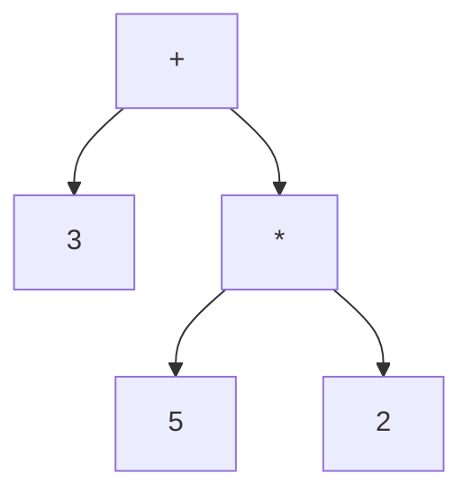

## 8.10. Interpreter Pattern using Expression Trees

The Interpreter pattern is a powerful design pattern used to evaluate sentences in a language by representing its grammar as an expression tree. In Rust, this pattern can be effectively implemented using structs and enums to model grammar rules, enabling the parsing and evaluation of expressions. This section will guide you through understanding the Interpreter pattern, its implementation in Rust, and its applications.

### Understanding the Interpreter Pattern

The Interpreter pattern is a behavioral design pattern that defines a representation for a grammar along with an interpreter that uses the representation to interpret sentences in the language. This pattern is particularly useful in scenarios where you need to evaluate expressions or execute commands defined by a language.

#### Key Concepts

- **Grammar**: A set of rules that define the structure of a language.
- **Expression Tree**: A tree representation of expressions where each node is an operation and each leaf is an operand.
- **Interpreter**: A component that traverses the expression tree to evaluate the expression.

### Use Cases of the Interpreter Pattern

The Interpreter pattern is commonly used in:

- **Simple Scripting Languages**: To parse and execute scripts written in a custom language.
- **Mathematical Expression Evaluation**: To evaluate arithmetic expressions.
- **Configuration File Parsing**: To interpret configuration files with a specific syntax.

### Representing Grammar with Structs and Enums

In Rust, we can represent grammar rules using enums to define different types of expressions and structs to encapsulate the data associated with each expression type.

#### Example: Arithmetic Expressions

Let's consider a simple arithmetic expression grammar with the following rules:

- An expression can be a number, a sum, or a product.
- A sum is an expression followed by a `+` and another expression.
- A product is an expression followed by a `*` and another expression.

We can represent this grammar in Rust as follows:

```rust
enum Expression {
    Number(i32),
    Sum(Box<Expression>, Box<Expression>),
    Product(Box<Expression>, Box<Expression>),
}
```

### Parsing and Evaluating Expressions

To evaluate expressions, we need to parse the input into an expression tree and then recursively evaluate it.

#### Parsing Expressions

Parsing involves converting a string representation of an expression into an expression tree. This can be done using recursive descent parsing or other parsing techniques.

#### Evaluating Expressions

Once we have an expression tree, we can evaluate it recursively by visiting each node and performing the corresponding operation.

```rust
impl Expression {
    fn evaluate(&self) -> i32 {
        match self {
            Expression::Number(value) => *value,
            Expression::Sum(left, right) => left.evaluate() + right.evaluate(),
            Expression::Product(left, right) => left.evaluate() * right.evaluate(),
        }
    }
}
```

### Recursive Evaluation and Pattern Matching

Rust's powerful pattern matching capabilities make it easy to implement recursive evaluation of expression trees. By matching on the enum variants, we can perform the appropriate operations for each type of expression.

### Applications of the Interpreter Pattern

The Interpreter pattern can be applied in various domains, such as:

- **Simple Scripting Languages**: Implementing a basic scripting language interpreter.
- **Math Expression Evaluators**: Creating calculators or math engines.
- **Configuration File Parsers**: Interpreting configuration files with custom syntax.

### Example: Evaluating Mathematical Expressions

Let's build a simple interpreter for evaluating mathematical expressions using the Interpreter pattern in Rust.

#### Step 1: Define the Grammar

We'll define a grammar for arithmetic expressions with addition and multiplication.

```rust
enum Expr {
    Number(i32),
    Add(Box<Expr>, Box<Expr>),
    Multiply(Box<Expr>, Box<Expr>),
}
```

#### Step 2: Implement the Interpreter

We'll implement the interpreter by recursively evaluating the expression tree.

```rust
impl Expr {
    fn eval(&self) -> i32 {
        match self {
            Expr::Number(value) => *value,
            Expr::Add(left, right) => left.eval() + right.eval(),
            Expr::Multiply(left, right) => left.eval() * right.eval(),
        }
    }
}
```

#### Step 3: Parse and Evaluate Expressions

We'll create a function to parse a string into an expression tree and evaluate it.

```rust
fn parse_expression(input: &str) -> Expr {
    // Simplified parsing logic for demonstration purposes
    // In practice, use a proper parser to handle complex expressions
    if input.contains('+') {
        let parts: Vec<&str> = input.split('+').collect();
        Expr::Add(
            Box::new(parse_expression(parts[0].trim())),
            Box::new(parse_expression(parts[1].trim())),
        )
    } else if input.contains('*') {
        let parts: Vec<&str> = input.split('*').collect();
        Expr::Multiply(
            Box::new(parse_expression(parts[0].trim())),
            Box::new(parse_expression(parts[1].trim())),
        )
    } else {
        Expr::Number(input.trim().parse().unwrap())
    }
}

fn main() {
    let expression = "3 + 5 * 2";
    let parsed_expr = parse_expression(expression);
    let result = parsed_expr.eval();
    println!("The result of '{}' is {}", expression, result);
}
```

### Visualizing Expression Trees

To better understand how expression trees work, let's visualize the expression `3 + 5 * 2` as an expression tree.



**Diagram Description**: This diagram represents the expression tree for the expression `3 + 5 * 2`. The root node is the addition operation, with the left child being the number `3` and the right child being the multiplication operation. The multiplication operation has two children: the numbers `5` and `2`.

### Try It Yourself

Experiment with the code by modifying the expression or adding new operations. For example, try adding support for subtraction or division.

### Design Considerations

When implementing the Interpreter pattern, consider the following:

- **Complexity**: The pattern can become complex for large grammars.
- **Performance**: Recursive evaluation may impact performance for deep expression trees.
- **Extensibility**: Ensure the design allows for easy addition of new operations or grammar rules.

### Rust Unique Features

Rust's strong type system and pattern matching capabilities make it well-suited for implementing the Interpreter pattern. The use of enums and pattern matching allows for clear and concise expression tree evaluation.

### Differences and Similarities

The Interpreter pattern is often confused with the Visitor pattern. While both involve traversing a structure, the Interpreter pattern focuses on evaluating expressions, whereas the Visitor pattern is used for performing operations on elements of an object structure.

## Quiz Time!



### What is the primary purpose of the Interpreter pattern?

- [x] To evaluate sentences in a language by representing grammar as an expression tree.
- [ ] To create objects without exposing the instantiation logic.
- [ ] To define a family of algorithms and make them interchangeable.
- [ ] To provide a way to access the elements of an aggregate object sequentially.

> **Explanation:** The Interpreter pattern is used to evaluate sentences in a language by representing grammar as an expression tree.

### Which Rust feature is particularly useful for implementing the Interpreter pattern?

- [x] Enums and pattern matching
- [ ] Smart pointers
- [ ] Asynchronous programming
- [ ] Macros

> **Explanation:** Enums and pattern matching in Rust allow for clear and concise expression tree evaluation, making them particularly useful for implementing the Interpreter pattern.

### In the context of the Interpreter pattern, what does an expression tree represent?

- [x] A tree representation of expressions where each node is an operation and each leaf is an operand.
- [ ] A sequence of operations to be executed in order.
- [ ] A collection of objects with a common interface.
- [ ] A set of rules for transforming data.

> **Explanation:** An expression tree is a tree representation of expressions where each node is an operation and each leaf is an operand.

### What is a common use case for the Interpreter pattern?

- [x] Evaluating mathematical expressions
- [ ] Managing object lifecycles
- [ ] Implementing user interfaces
- [ ] Handling network communication

> **Explanation:** A common use case for the Interpreter pattern is evaluating mathematical expressions.

### How can we represent grammar rules in Rust for the Interpreter pattern?

- [x] Using enums to define different types of expressions and structs to encapsulate data.
- [ ] Using traits to define behavior and structs to implement them.
- [ ] Using macros to generate code at compile time.
- [ ] Using modules to organize related functions and types.

> **Explanation:** In Rust, we can represent grammar rules using enums to define different types of expressions and structs to encapsulate the data associated with each expression type.

### What is the role of the interpreter in the Interpreter pattern?

- [x] To traverse the expression tree and evaluate the expression.
- [ ] To manage the lifecycle of objects.
- [ ] To provide a common interface for different implementations.
- [ ] To handle errors and exceptions.

> **Explanation:** The interpreter's role in the Interpreter pattern is to traverse the expression tree and evaluate the expression.

### Which of the following is a benefit of using the Interpreter pattern?

- [x] It allows for the easy addition of new operations or grammar rules.
- [ ] It improves the performance of complex algorithms.
- [ ] It simplifies the management of object lifecycles.
- [ ] It enhances the security of the application.

> **Explanation:** The Interpreter pattern allows for the easy addition of new operations or grammar rules, making it flexible and extensible.

### What is a potential drawback of the Interpreter pattern?

- [x] Recursive evaluation may impact performance for deep expression trees.
- [ ] It requires extensive use of unsafe code.
- [ ] It limits the use of concurrency.
- [ ] It makes the codebase difficult to maintain.

> **Explanation:** Recursive evaluation in the Interpreter pattern may impact performance for deep expression trees.

### True or False: The Interpreter pattern is often confused with the Visitor pattern.

- [x] True
- [ ] False

> **Explanation:** The Interpreter pattern is often confused with the Visitor pattern, but they serve different purposes. The Interpreter pattern focuses on evaluating expressions, while the Visitor pattern is used for performing operations on elements of an object structure.

### Which of the following is NOT a typical application of the Interpreter pattern?

- [ ] Simple scripting languages
- [ ] Mathematical expression evaluation
- [ ] Configuration file parsing
- [x] Real-time data streaming

> **Explanation:** Real-time data streaming is not a typical application of the Interpreter pattern, which is more suited for evaluating expressions or executing commands defined by a language.



Remember, this is just the beginning. As you progress, you'll build more complex interpreters and explore new applications of the Interpreter pattern. Keep experimenting, stay curious, and enjoy the journey!
