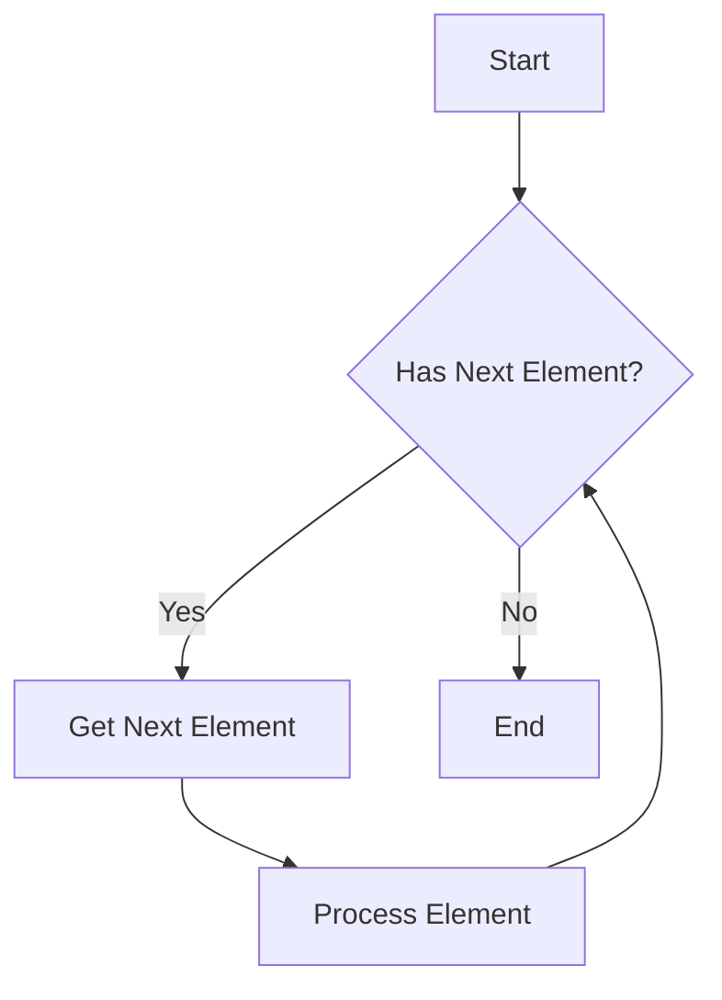

## 8.11. Iterator Pattern with the `Iterator` Trait

The Iterator Pattern is a fundamental design pattern that allows you to traverse elements in a collection without exposing its underlying representation. In Rust, this pattern is elegantly implemented using the built-in `Iterator` trait, which provides a powerful and flexible way to work with sequences of data. In this section, we will explore the significance of the `Iterator` trait, how it encapsulates traversal logic, and how you can create custom iterators for complex data structures. We will also discuss the use of iterator adapters for enhanced functionality and highlight the benefits of decoupling iteration from collection implementation.

### Reintroducing the `Iterator` Trait

The `Iterator` trait in Rust is a core component of the language's standard library, providing a way to iterate over a sequence of elements. It is defined as follows:

```rust
pub trait Iterator {
    type Item;

    fn next(&mut self) -> Option<Self::Item>;

    // Additional methods omitted for brevity
}
```

The `Iterator` trait requires the implementation of the `next` method, which returns an `Option<Self::Item>`. This method is called repeatedly to yield elements from the iterator until `None` is returned, indicating that the sequence is exhausted.

#### Significance of the `Iterator` Trait

The `Iterator` trait is significant because it abstracts the process of iterating over a collection, allowing you to focus on what you want to do with the elements rather than how to traverse them. This abstraction provides several benefits:

- **Encapsulation**: The traversal logic is encapsulated within the iterator, keeping the collection's internal structure hidden.
- **Flexibility**: Iterators can be chained and combined using various iterator adapters, enabling complex data processing pipelines.
- **Efficiency**: Iterators in Rust are designed to be zero-cost abstractions, meaning they do not incur runtime overhead compared to manual iteration.

### Encapsulating Traversal Logic

The Iterator Pattern encapsulates traversal logic by defining a clear interface for accessing elements in a sequence. This separation of concerns allows you to change the underlying data structure without affecting the code that uses the iterator.

#### Example: Basic Iterator Implementation

Let's start with a simple example of implementing an iterator for a custom data structure. Consider a `Counter` struct that generates a sequence of numbers:

```rust
struct Counter {
    count: u32,
    max: u32,
}

impl Counter {
    fn new(max: u32) -> Self {
        Counter { count: 0, max }
    }
}

impl Iterator for Counter {
    type Item = u32;

    fn next(&mut self) -> Option<Self::Item> {
        if self.count < self.max {
            self.count += 1;
            Some(self.count)
        } else {
            None
        }
    }
}

fn main() {
    let mut counter = Counter::new(5);

    while let Some(value) = counter.next() {
        println!("{}", value);
    }
}
```

In this example, the `Counter` struct implements the `Iterator` trait, allowing you to iterate over a sequence of numbers from 1 to `max`. The `next` method encapsulates the logic for generating the next number in the sequence.

### Custom Iterators for Complex Data Structures

While the standard library provides iterators for common collections like vectors and hash maps, you may need to create custom iterators for more complex data structures. Custom iterators allow you to define specific traversal logic tailored to your data structure's needs.

#### Example: Custom Iterator for a Binary Tree

Consider a binary tree data structure. We can create an iterator that traverses the tree in-order:

```rust
use std::rc::Rc;
use std::cell::RefCell;

#[derive(Debug)]
struct TreeNode {
    value: i32,
    left: Option<Rc<RefCell<TreeNode>>>,
    right: Option<Rc<RefCell<TreeNode>>>,
}

struct InOrderIterator {
    stack: Vec<Rc<RefCell<TreeNode>>>,
}

impl InOrderIterator {
    fn new(root: Option<Rc<RefCell<TreeNode>>>) -> Self {
        let mut stack = Vec::new();
        let mut current = root;

        while let Some(node) = current {
            stack.push(Rc::clone(&node));
            current = node.borrow().left.clone();
        }

        InOrderIterator { stack }
    }
}

impl Iterator for InOrderIterator {
    type Item = i32;

    fn next(&mut self) -> Option<Self::Item> {
        if let Some(node) = self.stack.pop() {
            let value = node.borrow().value;
            let mut current = node.borrow().right.clone();

            while let Some(right_node) = current {
                self.stack.push(Rc::clone(&right_node));
                current = right_node.borrow().left.clone();
            }

            Some(value)
        } else {
            None
        }
    }
}

fn main() {
    let root = Rc::new(RefCell::new(TreeNode {
        value: 1,
        left: Some(Rc::new(RefCell::new(TreeNode {
            value: 2,
            left: None,
            right: None,
        }))),
        right: Some(Rc::new(RefCell::new(TreeNode {
            value: 3,
            left: None,
            right: None,
        }))),
    }));

    let iterator = InOrderIterator::new(Some(root));

    for value in iterator {
        println!("{}", value);
    }
}
```

In this example, the `InOrderIterator` struct implements an in-order traversal of a binary tree. The iterator uses a stack to keep track of nodes, allowing it to traverse the tree without recursion.

### Iterator Adapters for Enhanced Functionality

Iterator adapters are methods provided by the `Iterator` trait that allow you to transform and manipulate iterators. These adapters enable you to build complex data processing pipelines by chaining multiple operations together.

#### Common Iterator Adapters

- **`map`**: Transforms each element of an iterator using a closure.
- **`filter`**: Filters elements based on a predicate.
- **`fold`**: Reduces an iterator to a single value by applying a closure.
- **`collect`**: Consumes an iterator and collects the elements into a collection.

#### Example: Using Iterator Adapters

Let's see how iterator adapters can be used to process data:

```rust
fn main() {
    let numbers = vec![1, 2, 3, 4, 5];

    let sum_of_squares: i32 = numbers
        .iter()
        .map(|&x| x * x)
        .filter(|&x| x > 10)
        .fold(0, |acc, x| acc + x);

    println!("Sum of squares greater than 10: {}", sum_of_squares);
}
```

In this example, we use the `map`, `filter`, and `fold` adapters to calculate the sum of squares of numbers greater than 10. The iterator adapters allow us to express this complex operation concisely and clearly.

### Benefits of Decoupling Iteration from Collection Implementation

Decoupling iteration from collection implementation provides several advantages:

- **Reusability**: Iterators can be reused across different collections, reducing code duplication.
- **Maintainability**: Changes to the collection's internal structure do not affect the iterator's interface.
- **Composability**: Iterators can be composed using adapters to create complex data processing pipelines.

### Rust Unique Features

Rust's unique features, such as ownership and borrowing, play a crucial role in the design of iterators. Iterators in Rust are designed to be safe and efficient, leveraging the language's type system to prevent common errors like null pointer dereferences and data races.

### Differences and Similarities with Other Patterns

The Iterator Pattern is often compared to other patterns like the Visitor Pattern. While both patterns involve traversing elements, the Iterator Pattern focuses on sequential access, whereas the Visitor Pattern allows you to perform operations on elements without exposing their structure.

### Try It Yourself

Experiment with the code examples provided in this section. Try modifying the `Counter` iterator to count by twos or create a new iterator for a different data structure. Use iterator adapters to transform and filter data in creative ways.

### Visualizing the Iterator Pattern

To better understand the Iterator Pattern, let's visualize the process of iterating over a collection using a flowchart:



This flowchart illustrates the basic flow of an iterator: checking for the next element, retrieving it, processing it, and repeating the process until the sequence is exhausted.

### References and Links

For further reading on the `Iterator` trait and its applications, consider the following resources:

- [Rust Documentation on Iterators](https://doc.rust-lang.org/std/iter/trait.Iterator.html)
- [The Rust Programming Language Book - Iterators](https://doc.rust-lang.org/book/ch13-02-iterators.html)
- [Rust by Example - Iterators](https://doc.rust-lang.org/rust-by-example/trait/iter.html)

### Knowledge Check

- What is the primary purpose of the `Iterator` trait in Rust?
- How does the `next` method work in the context of an iterator?
- What are some common iterator adapters, and how do they enhance functionality?
- How does the Iterator Pattern benefit from Rust's ownership and borrowing system?

### Embrace the Journey

Remember, this is just the beginning. As you progress, you'll discover more ways to leverage iterators and iterator adapters to build efficient and elegant Rust applications. Keep experimenting, stay curious, and enjoy the journey!

## Quiz Time!



### What is the primary purpose of the `Iterator` trait in Rust?

- [x] To abstract the process of iterating over a collection
- [ ] To provide a way to modify elements in a collection
- [ ] To enforce a specific order of elements in a collection
- [ ] To manage memory allocation for collections

> **Explanation:** The `Iterator` trait abstracts the process of iterating over a collection, allowing you to focus on what you want to do with the elements rather than how to traverse them.

### How does the `next` method work in the context of an iterator?

- [x] It returns the next element in the sequence or `None` if the sequence is exhausted
- [ ] It modifies the current element in the sequence
- [ ] It resets the iterator to the beginning of the sequence
- [ ] It skips the next element in the sequence

> **Explanation:** The `next` method returns the next element in the sequence or `None` if the sequence is exhausted, allowing the iterator to traverse the collection.

### Which of the following is a common iterator adapter?

- [x] `map`
- [ ] `reduce`
- [ ] `transform`
- [ ] `aggregate`

> **Explanation:** `map` is a common iterator adapter that transforms each element of an iterator using a closure.

### What is the benefit of decoupling iteration from collection implementation?

- [x] Reusability and maintainability
- [ ] Increased memory usage
- [ ] Slower execution time
- [ ] More complex code

> **Explanation:** Decoupling iteration from collection implementation provides reusability and maintainability, as iterators can be reused across different collections and changes to the collection's internal structure do not affect the iterator's interface.

### How do iterator adapters enhance functionality?

- [x] By allowing complex data processing pipelines
- [ ] By increasing the size of the collection
- [ ] By modifying the underlying data structure
- [ ] By enforcing a specific order of elements

> **Explanation:** Iterator adapters enhance functionality by allowing complex data processing pipelines, enabling you to transform and manipulate iterators in various ways.

### What is a key feature of Rust's iterators?

- [x] Zero-cost abstractions
- [ ] Automatic memory management
- [ ] Built-in sorting algorithms
- [ ] Dynamic typing

> **Explanation:** Rust's iterators are designed to be zero-cost abstractions, meaning they do not incur runtime overhead compared to manual iteration.

### What is the difference between the Iterator Pattern and the Visitor Pattern?

- [x] The Iterator Pattern focuses on sequential access, while the Visitor Pattern allows operations on elements without exposing their structure
- [ ] The Iterator Pattern modifies elements, while the Visitor Pattern sorts them
- [ ] The Iterator Pattern is used for collections, while the Visitor Pattern is used for single elements
- [ ] The Iterator Pattern is slower than the Visitor Pattern

> **Explanation:** The Iterator Pattern focuses on sequential access, whereas the Visitor Pattern allows you to perform operations on elements without exposing their structure.

### What is the role of the `collect` adapter in Rust?

- [x] To consume an iterator and collect the elements into a collection
- [ ] To transform each element of an iterator
- [ ] To filter elements based on a predicate
- [ ] To reduce an iterator to a single value

> **Explanation:** The `collect` adapter consumes an iterator and collects the elements into a collection, such as a vector or a hash map.

### How does Rust's ownership system benefit iterators?

- [x] It prevents common errors like null pointer dereferences and data races
- [ ] It increases the complexity of iterator implementation
- [ ] It requires manual memory management
- [ ] It limits the types of collections that can be iterated

> **Explanation:** Rust's ownership system benefits iterators by preventing common errors like null pointer dereferences and data races, ensuring safe and efficient iteration.

### True or False: Iterators in Rust can only be used with standard library collections.

- [ ] True
- [x] False

> **Explanation:** False. Iterators in Rust can be used with custom data structures as well, allowing you to define specific traversal logic tailored to your needs.


