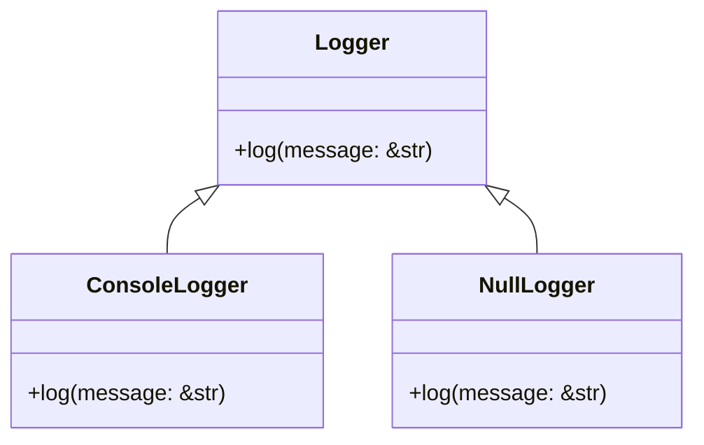

## 8.12. Null Object Pattern with `Option` and Default Implementations

In the realm of software design patterns, the Null Object Pattern stands out as a strategy to handle the absence of an object gracefully. In Rust, this pattern can be elegantly implemented using the `Option` type and default trait implementations. This approach not only enhances code safety but also improves readability and maintainability. Let's delve into the intricacies of the Null Object Pattern in Rust and explore how it can be effectively utilized.

### Understanding the Null Object Pattern

**Definition**: The Null Object Pattern is a behavioral design pattern that uses a special object to represent the absence of a value or a "do nothing" behavior. Instead of using null references, which can lead to null pointer exceptions, the Null Object Pattern provides a default behavior that avoids the need for null checks.

**Intent**: The primary intent of the Null Object Pattern is to encapsulate the absence of an object with a neutral or default behavior, thereby eliminating the need for null checks and reducing the risk of runtime errors.

### The Role of `Option` in Rust

Rust, by design, does not have null references. Instead, it uses the `Option` type to represent the presence or absence of a value. The `Option` type is an enum with two variants: `Some(T)` and `None`.

```rust
enum Option<T> {
    Some(T),
    None,
}
```

- **`Some(T)`**: Indicates the presence of a value of type `T`.
- **`None`**: Represents the absence of a value.

By using `Option`, Rust ensures that the absence of a value is handled explicitly, thus avoiding null pointer exceptions that are common in other languages.

### Implementing the Null Object Pattern with `Option`

Let's consider a scenario where we have a `Logger` trait that defines a method to log messages. We can use the Null Object Pattern to provide a default implementation that does nothing.

```rust
trait Logger {
    fn log(&self, message: &str);
}

struct ConsoleLogger;

impl Logger for ConsoleLogger {
    fn log(&self, message: &str) {
        println!("Log: {}", message);
    }
}

struct NullLogger;

impl Logger for NullLogger {
    fn log(&self, _message: &str) {
        // Do nothing
    }
}

fn main() {
    let logger: Option<Box<dyn Logger>> = Some(Box::new(ConsoleLogger));
    if let Some(logger) = logger {
        logger.log("This is a log message.");
    }

    let null_logger: Option<Box<dyn Logger>> = None;
    if let Some(logger) = null_logger {
        logger.log("This message will not be logged.");
    }
}
```

In this example, we define a `Logger` trait with a `log` method. The `ConsoleLogger` struct implements this trait to log messages to the console. The `NullLogger` struct provides a "do nothing" implementation. By using `Option<Box<dyn Logger>>`, we can represent the presence or absence of a logger.

### Default Implementations for Traits

Rust's trait system allows for default method implementations, which can be leveraged to implement the Null Object Pattern. By providing a default implementation, we can ensure that a trait has a neutral behavior even if a specific implementation is not provided.

```rust
trait Logger {
    fn log(&self, message: &str) {
        // Default implementation does nothing
    }
}

struct ConsoleLogger;

impl Logger for ConsoleLogger {
    fn log(&self, message: &str) {
        println!("Log: {}", message);
    }
}

fn main() {
    let logger: Box<dyn Logger> = Box::new(ConsoleLogger);
    logger.log("This is a log message.");

    let null_logger: Box<dyn Logger> = Box::new(NullLogger);
    null_logger.log("This message will not be logged.");
}
```

In this example, the `Logger` trait provides a default implementation for the `log` method that does nothing. The `ConsoleLogger` struct overrides this method to provide specific behavior. The `NullLogger` struct can be used without implementing the `log` method, relying on the default behavior.

### Advantages of Using the Null Object Pattern

1. **Code Safety**: By avoiding null references, the Null Object Pattern eliminates the risk of null pointer exceptions, enhancing the safety of the code.

2. **Simplified Error Handling**: The pattern provides a default behavior, reducing the need for explicit error handling and null checks.

3. **Improved Readability**: Code that uses the Null Object Pattern is often more readable, as it clearly defines the behavior for the absence of an object.

4. **Encapsulation of Default Behavior**: The pattern encapsulates default behavior within a specific object, promoting separation of concerns and adherence to the Single Responsibility Principle.

### Impact on Code Safety and Readability

The use of `Option` and default trait implementations in Rust aligns with the language's emphasis on safety and explicitness. By representing the absence of a value with `Option`, Rust forces developers to handle such cases explicitly, reducing the likelihood of runtime errors. Default trait implementations further enhance code readability by providing clear and consistent behavior for missing implementations.

### Visualizing the Null Object Pattern

To better understand the Null Object Pattern, let's visualize the relationship between the `Logger` trait, `ConsoleLogger`, and `NullLogger`.



In this diagram, `ConsoleLogger` and `NullLogger` both implement the `Logger` trait. The `ConsoleLogger` provides a concrete implementation, while the `NullLogger` provides a default, "do nothing" implementation.

### Try It Yourself

To deepen your understanding of the Null Object Pattern in Rust, try modifying the code examples provided. Here are a few suggestions:

- Implement a `FileLogger` that logs messages to a file.
- Use `Option` to toggle between different logger implementations at runtime.
- Experiment with default trait implementations for other use cases, such as a `Notifier` trait.

### Knowledge Check

Before we conclude, let's reinforce our understanding with a few questions:

1. What is the primary intent of the Null Object Pattern?
2. How does Rust's `Option` type help in implementing the Null Object Pattern?
3. What are the advantages of using default trait implementations in Rust?

### Summary

The Null Object Pattern is a powerful tool in Rust's design pattern arsenal, allowing developers to handle the absence of objects gracefully. By leveraging `Option` and default trait implementations, Rust provides a safe and readable way to implement this pattern, aligning with its core principles of safety and explicitness.

Remember, this is just the beginning. As you progress, you'll discover more ways to apply the Null Object Pattern and other design patterns in Rust. Keep experimenting, stay curious, and enjoy the journey!

## Quiz Time!



### What is the primary intent of the Null Object Pattern?

- [x] To provide a default behavior for the absence of an object
- [ ] To handle exceptions in a program
- [ ] To optimize memory usage
- [ ] To improve performance

> **Explanation:** The Null Object Pattern aims to provide a default behavior for the absence of an object, eliminating the need for null checks.

### How does Rust's `Option` type help in implementing the Null Object Pattern?

- [x] By representing the absence of a value explicitly
- [ ] By providing automatic error handling
- [ ] By optimizing memory allocation
- [ ] By improving performance

> **Explanation:** Rust's `Option` type represents the absence of a value explicitly, which aligns with the Null Object Pattern's goal of handling null cases safely.

### What are the advantages of using default trait implementations in Rust?

- [x] They provide a consistent default behavior
- [ ] They improve performance
- [ ] They reduce memory usage
- [ ] They automatically handle exceptions

> **Explanation:** Default trait implementations provide a consistent default behavior, which is useful in implementing the Null Object Pattern.

### Which Rust feature eliminates the risk of null pointer exceptions?

- [x] Option type
- [ ] Smart pointers
- [ ] Unsafe code
- [ ] Macros

> **Explanation:** The `Option` type in Rust eliminates the risk of null pointer exceptions by representing the absence of a value explicitly.

### What is a key benefit of the Null Object Pattern in terms of code readability?

- [x] It clearly defines behavior for the absence of an object
- [ ] It reduces the number of lines of code
- [ ] It improves performance
- [ ] It optimizes memory usage

> **Explanation:** The Null Object Pattern improves code readability by clearly defining behavior for the absence of an object.

### How can default trait implementations enhance code safety?

- [x] By providing a neutral behavior for missing implementations
- [ ] By optimizing memory allocation
- [ ] By improving performance
- [ ] By reducing code complexity

> **Explanation:** Default trait implementations enhance code safety by providing a neutral behavior for missing implementations, reducing the risk of runtime errors.

### What is a common use case for the Null Object Pattern?

- [x] Logging systems
- [ ] Memory management
- [ ] Performance optimization
- [ ] Data serialization

> **Explanation:** Logging systems often use the Null Object Pattern to handle cases where a logger is not available.

### In Rust, what does the `None` variant of `Option` represent?

- [x] The absence of a value
- [ ] A default value
- [ ] An error state
- [ ] A null reference

> **Explanation:** The `None` variant of `Option` represents the absence of a value in Rust.

### Which of the following is a benefit of using the Null Object Pattern?

- [x] Simplified error handling
- [ ] Improved memory usage
- [ ] Enhanced performance
- [ ] Reduced code size

> **Explanation:** The Null Object Pattern simplifies error handling by providing a default behavior for the absence of an object.

### True or False: Rust allows null references.

- [ ] True
- [x] False

> **Explanation:** Rust does not allow null references; instead, it uses the `Option` type to represent the absence of a value.




