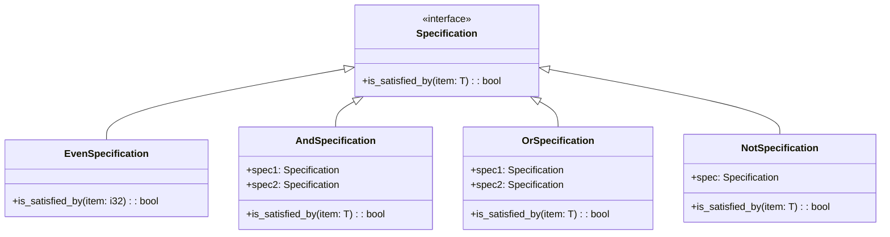

## 8.13. Specification Pattern for Complex Criteria

The Specification Pattern is a powerful tool in software design that allows developers to encapsulate business rules and criteria in a reusable and combinable manner. In Rust, this pattern can be particularly effective due to the language's strong type system and trait-based polymorphism. By leveraging these features, we can create flexible and maintainable code that can adapt to changing business requirements.

### Understanding the Specification Pattern

**Definition**: The Specification Pattern is a behavioral design pattern that allows you to encapsulate business rules, criteria, or conditions in a separate object, called a specification. This pattern enables you to combine specifications using logical operators, such as AND, OR, and NOT, to create complex criteria.

**Purpose**: The primary purpose of the Specification Pattern is to promote code reuse and flexibility. By encapsulating business rules in specifications, you can easily modify, extend, or combine them without altering the core logic of your application.

### Representing Specifications in Rust

In Rust, we can represent specifications using structs and traits. A trait defines the behavior of a specification, while structs implement this trait to represent specific criteria.

#### Defining the Specification Trait

Let's start by defining a `Specification` trait that represents a generic specification:

```rust
trait Specification<T> {
    fn is_satisfied_by(&self, item: &T) -> bool;
}
```

This trait defines a single method, `is_satisfied_by`, which takes a reference to an item of type `T` and returns a boolean indicating whether the item satisfies the specification.

#### Implementing Specifications with Structs

Next, we can implement specific specifications using structs. For example, let's create a specification that checks if a number is even:

```rust
struct EvenSpecification;

impl Specification<i32> for EvenSpecification {
    fn is_satisfied_by(&self, item: &i32) -> bool {
        item % 2 == 0
    }
}
```

Here, the `EvenSpecification` struct implements the `Specification` trait for the `i32` type, checking if a number is even.

### Combining Specifications with Logical Operators

One of the key benefits of the Specification Pattern is the ability to combine specifications using logical operators. In Rust, we can achieve this by creating composite specifications.

#### Logical AND Specification

Let's create a composite specification that represents the logical AND of two specifications:

```rust
struct AndSpecification<T, S1, S2>
where
    S1: Specification<T>,
    S2: Specification<T>,
{
    spec1: S1,
    spec2: S2,
}

impl<T, S1, S2> Specification<T> for AndSpecification<T, S1, S2>
where
    S1: Specification<T>,
    S2: Specification<T>,
{
    fn is_satisfied_by(&self, item: &T) -> bool {
        self.spec1.is_satisfied_by(item) && self.spec2.is_satisfied_by(item)
    }
}
```

This `AndSpecification` struct takes two specifications and checks if both are satisfied by a given item.

#### Logical OR Specification

Similarly, we can create a composite specification for the logical OR operation:

```rust
struct OrSpecification<T, S1, S2>
where
    S1: Specification<T>,
    S2: Specification<T>,
{
    spec1: S1,
    spec2: S2,
}

impl<T, S1, S2> Specification<T> for OrSpecification<T, S1, S2>
where
    S1: Specification<T>,
    S2: Specification<T>,
{
    fn is_satisfied_by(&self, item: &T) -> bool {
        self.spec1.is_satisfied_by(item) || self.spec2.is_satisfied_by(item)
    }
}
```

The `OrSpecification` struct checks if at least one of the two specifications is satisfied.

#### Logical NOT Specification

Finally, let's implement a specification for the logical NOT operation:

```rust
struct NotSpecification<T, S>
where
    S: Specification<T>,
{
    spec: S,
}

impl<T, S> Specification<T> for NotSpecification<T, S>
where
    S: Specification<T>,
{
    fn is_satisfied_by(&self, item: &T) -> bool {
        !self.spec.is_satisfied_by(item)
    }
}
```

The `NotSpecification` struct negates the result of a given specification.

### Using Closures and Predicate Functions

In addition to using structs and traits, we can also implement specifications using closures or predicate functions. This approach can be more concise and flexible, especially for simple criteria.

#### Example with Closures

Here's an example of using closures to define a specification:

```rust
fn is_even(item: &i32) -> bool {
    item % 2 == 0
}

fn is_positive(item: &i32) -> bool {
    *item > 0
}

fn main() {
    let numbers = vec![1, 2, 3, 4, 5, 6];
    let even_numbers: Vec<i32> = numbers.iter().filter(|&n| is_even(n)).cloned().collect();
    let positive_numbers: Vec<i32> = numbers.iter().filter(|&n| is_positive(n)).cloned().collect();

    println!("Even numbers: {:?}", even_numbers);
    println!("Positive numbers: {:?}", positive_numbers);
}
```

In this example, we define two predicate functions, `is_even` and `is_positive`, and use them to filter a list of numbers.

### Benefits of the Specification Pattern

The Specification Pattern offers several benefits, including:

- **Flexibility**: Specifications can be easily modified, extended, or combined to meet changing business requirements.
- **Code Reuse**: By encapsulating business rules in specifications, you can reuse them across different parts of your application.
- **Separation of Concerns**: Specifications separate business rules from the core logic of your application, making the code more maintainable and easier to understand.

### Visualizing the Specification Pattern

To better understand how the Specification Pattern works, let's visualize the relationships between specifications using a class diagram.



**Diagram Description**: This class diagram illustrates the Specification Pattern, showing how different specifications implement the `Specification` interface and how composite specifications combine other specifications.

### Design Considerations

When implementing the Specification Pattern in Rust, consider the following:

- **Type Safety**: Rust's strong type system ensures that specifications are type-safe, reducing the risk of runtime errors.
- **Performance**: While the Specification Pattern promotes flexibility, it may introduce additional overhead due to the use of traits and dynamic dispatch. Consider the performance implications when using this pattern in performance-critical applications.
- **Complexity**: For simple criteria, using closures or predicate functions may be more straightforward than implementing full-fledged specifications.

### Rust Unique Features

Rust offers several unique features that enhance the implementation of the Specification Pattern:

- **Traits**: Rust's trait system allows for flexible and reusable specifications, enabling polymorphism without the need for inheritance.
- **Closures**: Rust's support for closures provides a concise way to define simple specifications.
- **Ownership and Borrowing**: Rust's ownership model ensures memory safety, even when combining multiple specifications.

### Differences and Similarities

The Specification Pattern is often compared to other patterns, such as the Strategy Pattern. While both patterns encapsulate behavior, the Specification Pattern focuses on encapsulating business rules and criteria, whereas the Strategy Pattern encapsulates algorithms or strategies.

### Try It Yourself

To deepen your understanding of the Specification Pattern, try modifying the code examples to implement additional specifications, such as checking if a number is odd or if it falls within a certain range. Experiment with combining these specifications using logical operators to create more complex criteria.

### Knowledge Check

- What is the primary purpose of the Specification Pattern?
- How can you represent specifications in Rust?
- What are the benefits of using the Specification Pattern?
- How can you combine specifications using logical operators?
- What are some potential implementations of specifications using closures?

### Embrace the Journey

Remember, mastering design patterns is a journey. As you continue to explore the Specification Pattern and other design patterns in Rust, you'll gain valuable insights into creating flexible, maintainable, and efficient software. Keep experimenting, stay curious, and enjoy the journey!

## Quiz Time!



### What is the primary purpose of the Specification Pattern?

- [x] To encapsulate business rules and criteria in a reusable and combinable manner.
- [ ] To provide a way to implement algorithms.
- [ ] To manage object creation.
- [ ] To handle object destruction.

> **Explanation:** The Specification Pattern is designed to encapsulate business rules and criteria, allowing for reusable and combinable conditions.

### How can specifications be represented in Rust?

- [x] Using structs and traits.
- [ ] Using only enums.
- [ ] Using macros.
- [ ] Using global variables.

> **Explanation:** In Rust, specifications can be represented using structs and traits, allowing for flexible and reusable implementations.

### What is a benefit of using the Specification Pattern?

- [x] Flexibility and code reuse.
- [ ] Increased memory usage.
- [ ] Reduced code readability.
- [ ] Simplified error handling.

> **Explanation:** The Specification Pattern promotes flexibility and code reuse by encapsulating business rules in specifications.

### How can specifications be combined using logical operators?

- [x] By creating composite specifications like AND, OR, and NOT.
- [ ] By using global variables.
- [ ] By implementing inheritance.
- [ ] By using macros.

> **Explanation:** Specifications can be combined using composite specifications such as AND, OR, and NOT to create complex criteria.

### What is a potential implementation of specifications using closures?

- [x] Defining predicate functions for simple criteria.
- [ ] Using global variables.
- [ ] Implementing inheritance.
- [ ] Using macros.

> **Explanation:** Closures or predicate functions can be used to define simple specifications in a concise manner.

### What is a unique feature of Rust that enhances the Specification Pattern?

- [x] Traits for flexible and reusable specifications.
- [ ] Global variables for state management.
- [ ] Inheritance for polymorphism.
- [ ] Macros for code generation.

> **Explanation:** Rust's trait system allows for flexible and reusable specifications, enhancing the implementation of the Specification Pattern.

### What is a potential downside of the Specification Pattern?

- [x] Performance overhead due to dynamic dispatch.
- [ ] Increased memory usage.
- [ ] Reduced code readability.
- [ ] Simplified error handling.

> **Explanation:** The Specification Pattern may introduce performance overhead due to the use of traits and dynamic dispatch.

### How does Rust ensure memory safety when using the Specification Pattern?

- [x] Through its ownership and borrowing model.
- [ ] By using global variables.
- [ ] By implementing inheritance.
- [ ] By using macros.

> **Explanation:** Rust's ownership and borrowing model ensures memory safety, even when combining multiple specifications.

### What is a common comparison to the Specification Pattern?

- [x] The Strategy Pattern.
- [ ] The Singleton Pattern.
- [ ] The Factory Pattern.
- [ ] The Observer Pattern.

> **Explanation:** The Specification Pattern is often compared to the Strategy Pattern, as both encapsulate behavior, but they focus on different aspects.

### True or False: The Specification Pattern is only useful for filtering data.

- [ ] True
- [x] False

> **Explanation:** While the Specification Pattern is useful for filtering data, it can also be used to encapsulate various business rules and criteria.


