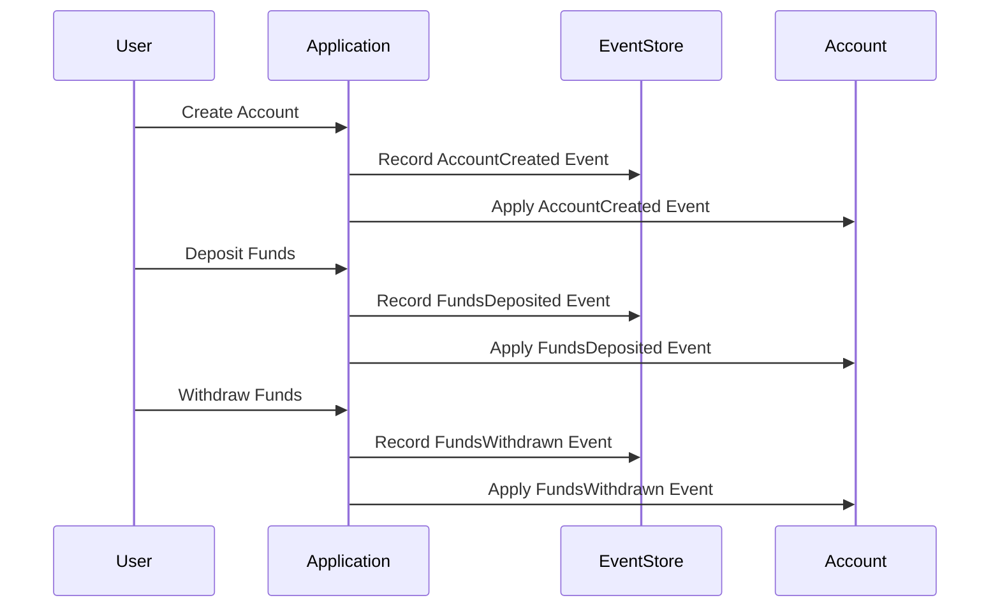

## 8.14. Event Sourcing Pattern in Rust

In the world of software design, capturing the state of an application in a way that is both traceable and reconstructable is a significant challenge. The Event Sourcing pattern offers a solution by recording all changes to an application's state as a sequence of events. This pattern is particularly useful in systems where auditability, traceability, and the ability to reconstruct past states are crucial. In this section, we will explore how to implement the Event Sourcing pattern in Rust, leveraging its unique features to build robust and scalable applications.

### Understanding Event Sourcing

**Event Sourcing** is a design pattern that captures all changes to an application's state as a sequence of events. Instead of storing the current state of an object, Event Sourcing records a log of state-changing events. This approach allows developers to reconstruct any past state by replaying the events from the log.

#### Key Concepts

- **Event**: A record of a state change. Events are immutable and represent facts about what has happened in the system.
- **Event Store**: A database or storage system that persists events. It acts as the source of truth for the application's state.
- **Event Handler**: A component that processes events to update the state of the system or trigger side effects.
- **Projection**: A read model that is derived from the event log, often used to present the current state of the system.

### Modeling Events in Rust

In Rust, we can model events using enums to represent different types of state changes. Each variant of the enum can hold data relevant to the event it represents.

```rust
// Define an enum to represent different types of events
enum AccountEvent {
    AccountCreated { account_id: u32, owner: String },
    FundsDeposited { account_id: u32, amount: f64 },
    FundsWithdrawn { account_id: u32, amount: f64 },
}
```

In this example, `AccountEvent` is an enum with variants for creating an account, depositing funds, and withdrawing funds. Each variant holds the data necessary to describe the event.

### Implementing Event Handlers

Event handlers are responsible for processing events and updating the state of the system. In Rust, we can implement event handlers as functions that take an event and a mutable reference to the state.

```rust
// Define a struct to represent the state of an account
struct Account {
    account_id: u32,
    owner: String,
    balance: f64,
}

// Implement event handlers for the Account struct
impl Account {
    fn apply_event(&mut self, event: &AccountEvent) {
        match event {
            AccountEvent::AccountCreated { account_id, owner } => {
                self.account_id = *account_id;
                self.owner = owner.clone();
                self.balance = 0.0;
            }
            AccountEvent::FundsDeposited { amount, .. } => {
                self.balance += amount;
            }
            AccountEvent::FundsWithdrawn { amount, .. } => {
                self.balance -= amount;
            }
        }
    }
}
```

In this code, the `apply_event` method updates the account's state based on the event. This method is called whenever an event is replayed from the event store.

### Recording and Replaying Events

To implement Event Sourcing, we need to record events in an event store and replay them to reconstruct the state. In Rust, we can use a vector to simulate an event store for simplicity.

```rust
// Define a struct to represent the event store
struct EventStore {
    events: Vec<AccountEvent>,
}

impl EventStore {
    fn new() -> Self {
        EventStore { events: Vec::new() }
    }

    fn record_event(&mut self, event: AccountEvent) {
        self.events.push(event);
    }

    fn replay_events(&self, account: &mut Account) {
        for event in &self.events {
            account.apply_event(event);
        }
    }
}
```

The `EventStore` struct holds a vector of events and provides methods to record and replay events. The `replay_events` method applies each event to the account to reconstruct its state.

### Persistence and Performance Considerations

When implementing Event Sourcing in a real-world application, persistence and performance are critical considerations. Here are some strategies to address these challenges:

- **Persistent Storage**: Use a database or file system to persist events. This ensures that events are not lost and can be replayed even after a system restart.
- **Batch Processing**: Process events in batches to improve performance. This reduces the overhead of frequent writes to the event store.
- **Snapshotting**: Periodically save snapshots of the current state to reduce the number of events that need to be replayed. This can significantly improve performance when reconstructing the state.

### Benefits of Event Sourcing

Event Sourcing offers several benefits that make it an attractive pattern for certain applications:

- **Auditability**: Every change to the system is recorded as an event, providing a complete audit trail.
- **Traceability**: Events can be replayed to trace the history of changes and understand how the current state was reached.
- **Scalability**: Event Sourcing can be scaled horizontally by partitioning the event log and processing events in parallel.
- **Flexibility**: New projections can be created from the event log without modifying the original events.

### Rust-Specific Features

Rust's unique features, such as its strong type system and ownership model, make it well-suited for implementing Event Sourcing:

- **Type Safety**: Rust's type system ensures that events are well-defined and prevents invalid state changes.
- **Concurrency**: Rust's ownership model and concurrency primitives enable safe concurrent processing of events.
- **Performance**: Rust's low-level control over memory and performance optimizations make it ideal for high-performance event processing.

### Differences and Similarities with Other Patterns

Event Sourcing is often compared to the Command Query Responsibility Segregation (CQRS) pattern. While both patterns can be used together, they serve different purposes:

- **Event Sourcing** focuses on capturing state changes as events.
- **CQRS** separates the read and write models to optimize performance and scalability.

### Try It Yourself

To get hands-on experience with Event Sourcing in Rust, try modifying the code examples to add new event types or implement additional projections. Experiment with different storage mechanisms and performance optimizations to see how they affect the system's behavior.

### Visualizing Event Sourcing

To better understand the flow of events in an Event Sourcing system, let's visualize the process using a sequence diagram.



This diagram illustrates the interaction between the user, application, event store, and account during the event sourcing process.

### Knowledge Check

Before we wrap up, let's reinforce our understanding with some questions and exercises:

- What are the key components of the Event Sourcing pattern?
- How does Rust's type system benefit the implementation of Event Sourcing?
- Try adding a new event type to the code examples and implement the corresponding event handler.

### Embrace the Journey

Remember, mastering Event Sourcing is just one step in your journey as a Rust developer. As you continue to explore design patterns and advanced techniques, you'll gain the skills needed to build robust and scalable applications. Keep experimenting, stay curious, and enjoy the journey!

## Quiz Time!



### What is the primary purpose of the Event Sourcing pattern?

- [x] To capture all changes to an application's state as a sequence of events
- [ ] To separate read and write models for performance optimization
- [ ] To provide a single source of truth for configuration management
- [ ] To enable real-time data processing

> **Explanation:** Event Sourcing captures all changes to an application's state as a sequence of events, allowing for traceability and system reconstruction.

### Which Rust feature is particularly beneficial for implementing Event Sourcing?

- [x] Strong type system
- [ ] Garbage collection
- [ ] Dynamic typing
- [ ] Automatic memory management

> **Explanation:** Rust's strong type system ensures that events are well-defined and prevents invalid state changes, making it beneficial for Event Sourcing.

### What is a common strategy to improve performance in Event Sourcing?

- [x] Snapshotting
- [ ] Using global variables
- [ ] Ignoring concurrency
- [ ] Avoiding type safety

> **Explanation:** Snapshotting involves periodically saving snapshots of the current state to reduce the number of events that need to be replayed, improving performance.

### How can Rust's concurrency model benefit Event Sourcing?

- [x] Enables safe concurrent processing of events
- [ ] Allows for dynamic typing
- [ ] Provides automatic garbage collection
- [ ] Eliminates the need for type annotations

> **Explanation:** Rust's concurrency model and ownership system enable safe concurrent processing of events, which is beneficial for Event Sourcing.

### What is the role of an Event Handler in Event Sourcing?

- [x] To process events and update the system state
- [ ] To store events in a database
- [ ] To generate new events based on user input
- [ ] To manage user authentication

> **Explanation:** An Event Handler processes events and updates the system state based on the events.

### Which of the following is a benefit of Event Sourcing?

- [x] Auditability
- [ ] Increased memory usage
- [ ] Reduced code complexity
- [ ] Elimination of all bugs

> **Explanation:** Event Sourcing provides auditability by recording every change to the system as an event.

### What is a Projection in the context of Event Sourcing?

- [x] A read model derived from the event log
- [ ] A method for storing events
- [ ] A type of event handler
- [ ] A concurrency primitive

> **Explanation:** A Projection is a read model that is derived from the event log, often used to present the current state of the system.

### How does Event Sourcing differ from CQRS?

- [x] Event Sourcing captures state changes as events, while CQRS separates read and write models
- [ ] Event Sourcing and CQRS are the same pattern
- [ ] Event Sourcing focuses on user authentication, while CQRS focuses on data storage
- [ ] Event Sourcing is used for real-time processing, while CQRS is not

> **Explanation:** Event Sourcing captures state changes as events, while CQRS separates the read and write models to optimize performance and scalability.

### What is the purpose of an Event Store?

- [x] To persist events as the source of truth for the application's state
- [ ] To handle user authentication
- [ ] To manage application configuration
- [ ] To provide real-time data analytics

> **Explanation:** An Event Store persists events and acts as the source of truth for the application's state.

### True or False: Event Sourcing can be scaled horizontally by partitioning the event log.

- [x] True
- [ ] False

> **Explanation:** Event Sourcing can be scaled horizontally by partitioning the event log and processing events in parallel.


