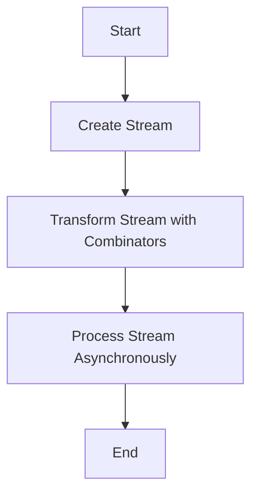

## 8.15. Implementing Reactive Programming Concepts

Reactive programming is a paradigm that focuses on asynchronous data streams and the propagation of change. In Rust, this approach is particularly powerful due to the language's emphasis on safety and concurrency. By leveraging reactive programming, developers can create applications that are responsive, efficient, and capable of handling complex asynchronous workflows.

### Principles of Reactive Programming

Reactive programming revolves around the concept of data streams and the propagation of changes. It allows developers to express dynamic behavior directly in the code, making it easier to manage asynchronous operations and state changes. The key principles include:

- **Data Streams**: Treating data as a continuous flow rather than discrete events.
- **Propagation of Change**: Automatically updating dependent computations when the underlying data changes.
- **Asynchronous Execution**: Handling operations that may not complete immediately, such as network requests or file I/O.

### Libraries and Tools in Rust

Rust provides several libraries and tools to facilitate reactive programming, including:

- **Futures**: A core library for asynchronous programming, providing the building blocks for handling asynchronous computations.
- **Async/Await**: Language features that simplify writing asynchronous code, making it more readable and maintainable.
- **Streams**: Abstractions for handling sequences of asynchronous events, similar to iterators but for asynchronous data.

### Handling Data Streams

In Rust, handling data streams involves working with the `Stream` trait, which represents a sequence of asynchronous values. Streams can be combined, transformed, and consumed using combinators, similar to how iterators work in Rust.

#### Example: Basic Stream Handling

Let's start with a simple example of handling a stream of integers:

```rust
use futures::stream::{self, StreamExt};

#[tokio::main]
async fn main() {
    // Create a stream of integers
    let number_stream = stream::iter(1..=5);

    // Process each item in the stream
    number_stream.for_each(|number| async move {
        println!("Received number: {}", number);
    }).await;
}
```

In this example, we create a stream of integers from 1 to 5 and use the `for_each` combinator to process each item asynchronously.

### Reactive Event Handling

Reactive programming also involves handling events reactively, allowing applications to respond to changes in data or user input efficiently.

#### Example: Reactive Event Handling with Channels

Rust's `tokio` library provides channels for message passing, which can be used to implement reactive event handling:

```rust
use tokio::sync::mpsc;
use tokio::time::{self, Duration};

#[tokio::main]
async fn main() {
    let (tx, mut rx) = mpsc::channel(32);

    tokio::spawn(async move {
        for i in 1..=5 {
            tx.send(i).await.unwrap();
            time::sleep(Duration::from_secs(1)).await;
        }
    });

    while let Some(message) = rx.recv().await {
        println!("Received message: {}", message);
    }
}
```

In this example, we create a channel for sending and receiving messages. A separate task sends messages at regular intervals, and the main task receives and processes them.

### Combinators and Asynchronous Execution

Combinators are a powerful feature in Rust's asynchronous programming model, allowing developers to compose and transform streams and futures.

#### Example: Using Combinators with Streams

```rust
use futures::stream::{self, StreamExt};

#[tokio::main]
async fn main() {
    let number_stream = stream::iter(1..=5);

    let doubled_stream = number_stream.map(|number| number * 2);

    doubled_stream.for_each(|number| async move {
        println!("Doubled number: {}", number);
    }).await;
}
```

In this example, we use the `map` combinator to transform each item in the stream by doubling it. The transformed stream is then processed using `for_each`.

### Benefits of Reactive Programming

Reactive programming offers several benefits, particularly in the context of Rust:

- **Responsive Applications**: By handling asynchronous data streams efficiently, applications can remain responsive even under heavy load.
- **Efficient Resource Use**: Reactive programming allows for non-blocking operations, making better use of system resources.
- **Simplified Asynchronous Code**: With features like `async/await` and combinators, writing and maintaining asynchronous code becomes more straightforward.

### Visualizing Reactive Programming in Rust

To better understand how reactive programming works in Rust, let's visualize the flow of data and events using a Mermaid.js diagram:



This diagram illustrates the typical flow of a reactive program in Rust, from creating a stream to processing it asynchronously.

### Try It Yourself

To get hands-on experience with reactive programming in Rust, try modifying the examples provided:

- Change the range of numbers in the stream and observe the output.
- Experiment with different combinators, such as `filter` or `fold`.
- Implement a reactive event handler that responds to user input or external events.

### References and Further Reading

For more information on reactive programming in Rust, consider exploring the following resources:

- [Rust Futures Documentation](https://docs.rs/futures/latest/futures/)
- [Tokio Asynchronous Runtime](https://tokio.rs/)
- [Async/Await in Rust](https://rust-lang.github.io/async-book/)

### Knowledge Check

Before moving on, let's summarize the key takeaways from this section:

- Reactive programming in Rust focuses on handling asynchronous data streams and propagating changes.
- The `futures`, `async/await`, and `streams` libraries provide powerful tools for implementing reactive programming.
- Combinators allow for flexible composition and transformation of streams and futures.
- Reactive programming enables responsive applications and efficient resource use.

Remember, this is just the beginning. As you progress, you'll build more complex and interactive applications. Keep experimenting, stay curious, and enjoy the journey!

## Quiz Time!



### What is the primary focus of reactive programming?

- [x] Handling asynchronous data streams and propagating changes
- [ ] Synchronous data processing
- [ ] Static data analysis
- [ ] Compiling code at runtime

> **Explanation:** Reactive programming is primarily focused on handling asynchronous data streams and propagating changes efficiently.

### Which Rust feature simplifies writing asynchronous code?

- [x] Async/Await
- [ ] Macros
- [ ] Pattern Matching
- [ ] Generics

> **Explanation:** The `async/await` feature in Rust simplifies writing and managing asynchronous code, making it more readable and maintainable.

### What is a combinator in the context of Rust's asynchronous programming?

- [x] A function that transforms or combines streams and futures
- [ ] A type of iterator
- [ ] A concurrency primitive
- [ ] A memory management tool

> **Explanation:** In Rust's asynchronous programming, a combinator is a function that transforms or combines streams and futures, allowing for flexible composition.

### Which library provides the building blocks for asynchronous programming in Rust?

- [x] Futures
- [ ] Serde
- [ ] Rayon
- [ ] Diesel

> **Explanation:** The `futures` library provides the core building blocks for asynchronous programming in Rust.

### What is the purpose of the `Stream` trait in Rust?

- [x] To represent a sequence of asynchronous values
- [ ] To manage memory allocation
- [ ] To handle synchronous data processing
- [ ] To define custom data types

> **Explanation:** The `Stream` trait in Rust represents a sequence of asynchronous values, similar to iterators but for asynchronous data.

### Which combinator would you use to transform each item in a stream?

- [x] Map
- [ ] Filter
- [ ] Fold
- [ ] ForEach

> **Explanation:** The `map` combinator is used to transform each item in a stream.

### What is the benefit of using reactive programming in Rust?

- [x] Responsive applications and efficient resource use
- [ ] Increased memory usage
- [ ] Slower execution times
- [ ] More complex code

> **Explanation:** Reactive programming in Rust enables responsive applications and efficient resource use through non-blocking operations.

### How can you visualize the flow of a reactive program in Rust?

- [x] Using a Mermaid.js diagram
- [ ] By writing pseudocode
- [ ] By drawing a UML diagram
- [ ] By creating a flowchart in Excel

> **Explanation:** A Mermaid.js diagram can be used to visualize the flow of a reactive program in Rust.

### What is the role of channels in reactive event handling?

- [x] To facilitate message passing between tasks
- [ ] To manage memory allocation
- [ ] To handle synchronous data processing
- [ ] To define custom data types

> **Explanation:** Channels facilitate message passing between tasks, making them useful for reactive event handling.

### True or False: Reactive programming in Rust is only useful for web applications.

- [ ] True
- [x] False

> **Explanation:** Reactive programming in Rust is not limited to web applications; it can be applied to various domains requiring asynchronous data handling.


