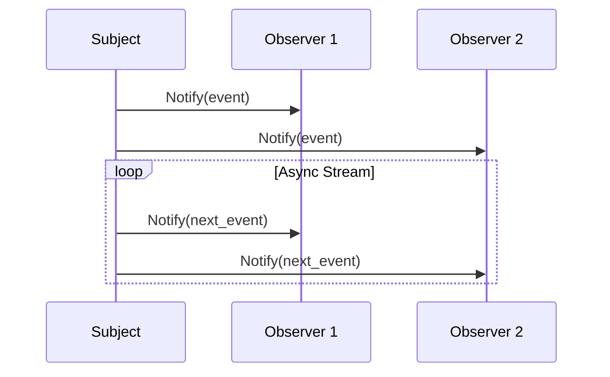

## 8.16. The Observer Pattern with Async Streams

In this section, we delve into the Observer pattern, a fundamental design pattern in software engineering, and explore how it can be implemented in Rust using async streams. This approach allows observers to react to events in a non-blocking manner, making it particularly suitable for concurrent and networked applications.

### Introduction to the Observer Pattern

The Observer pattern is a behavioral design pattern that defines a one-to-many dependency between objects. When one object (the subject) changes state, all its dependents (observers) are notified and updated automatically. This pattern is commonly used in scenarios where an object needs to notify other objects about changes in its state without being tightly coupled to them.

#### Key Participants

- **Subject**: The object that holds the state and notifies observers of changes.
- **Observer**: The object that wants to be informed about changes in the subject.
- **ConcreteSubject**: A specific implementation of the subject.
- **ConcreteObserver**: A specific implementation of the observer.

### Async Streams in Rust

Rust's async streams provide a powerful mechanism for handling asynchronous sequences of values. They are similar to iterators but are designed to work with asynchronous data sources. Async streams can be used to emit events to observers in a non-blocking manner, making them ideal for implementing the Observer pattern in an asynchronous context.

#### The `futures` Crate

The [`futures` crate](https://crates.io/crates/futures) is a foundational library for asynchronous programming in Rust. It provides essential traits and utilities for working with futures, streams, and async/await syntax.

### Implementing the Observer Pattern with Async Streams

Let's explore how to implement the Observer pattern using async streams in Rust. We'll use the `futures` crate to create an asynchronous stream that emits events to observers.

#### Step 1: Define the Subject and Observer Traits

First, we define the traits for the subject and observer. The subject will have methods to register and unregister observers, as well as to notify them of changes.

```rust
use futures::stream::Stream;
use std::pin::Pin;
use std::task::{Context, Poll};

// Define the Observer trait
trait Observer {
    fn update(&self, event: &str);
}

// Define the Subject trait
trait Subject {
    fn register_observer(&mut self, observer: Box<dyn Observer>);
    fn unregister_observer(&mut self, observer: Box<dyn Observer>);
    fn notify_observers(&self, event: &str);
}
```

#### Step 2: Implement the Concrete Subject

Next, we implement a concrete subject that holds a list of observers and notifies them of events.

```rust
struct EventStream {
    observers: Vec<Box<dyn Observer>>,
}

impl EventStream {
    fn new() -> Self {
        EventStream {
            observers: Vec::new(),
        }
    }
}

impl Subject for EventStream {
    fn register_observer(&mut self, observer: Box<dyn Observer>) {
        self.observers.push(observer);
    }

    fn unregister_observer(&mut self, observer: Box<dyn Observer>) {
        // Logic to remove observer
    }

    fn notify_observers(&self, event: &str) {
        for observer in &self.observers {
            observer.update(event);
        }
    }
}
```

#### Step 3: Create an Async Stream for Events

We create an async stream that generates events and notifies the observers.

```rust
use futures::stream::{self, StreamExt};

async fn event_generator(subject: &EventStream) {
    let events = vec!["event1", "event2", "event3"];
    let mut event_stream = stream::iter(events);

    while let Some(event) = event_stream.next().await {
        subject.notify_observers(event);
    }
}
```

#### Step 4: Implement the Concrete Observer

Finally, we implement a concrete observer that reacts to events.

```rust
struct ConcreteObserver;

impl Observer for ConcreteObserver {
    fn update(&self, event: &str) {
        println!("Observer received: {}", event);
    }
}
```

### Handling Backpressure and Buffering

In asynchronous systems, backpressure is a critical concept that ensures the system can handle varying loads without overwhelming resources. Rust's async streams provide mechanisms to handle backpressure by allowing consumers to control the rate at which they consume events.

#### Buffering Events

To handle backpressure, you can buffer events in the stream. The `futures` crate provides utilities like `buffer_unordered` to manage buffering.

```rust
use futures::stream::StreamExt;

async fn buffered_event_generator(subject: &EventStream) {
    let events = vec!["event1", "event2", "event3"];
    let mut event_stream = stream::iter(events).buffer_unordered(2);

    while let Some(event) = event_stream.next().await {
        subject.notify_observers(event);
    }
}
```

### Advantages in Concurrent and Networked Applications

Implementing the Observer pattern with async streams offers several advantages in concurrent and networked applications:

- **Non-blocking Execution**: Async streams allow observers to react to events without blocking the main thread, improving responsiveness.
- **Scalability**: The pattern can handle a large number of observers efficiently, making it suitable for distributed systems.
- **Flexibility**: Observers can be added or removed dynamically, allowing for flexible system architectures.

### Visualizing the Observer Pattern with Async Streams

Below is a diagram illustrating the flow of events from the subject to the observers using async streams.



**Diagram Description**: The diagram shows the subject notifying two observers of events using an async stream. The loop represents the continuous emission of events.

### Try It Yourself

To experiment with the Observer pattern using async streams, try modifying the code examples:

- Add more observers and see how they react to events.
- Implement custom logic in the `update` method of the observers.
- Experiment with different buffering strategies to handle backpressure.

### References and Further Reading

- [Rust Async Book](https://rust-lang.github.io/async-book/)
- [futures crate documentation](https://docs.rs/futures/latest/futures/)
- [Rust Programming Language](https://www.rust-lang.org/)

### Knowledge Check

- What are the key participants in the Observer pattern?
- How do async streams improve the Observer pattern in Rust?
- What is backpressure, and why is it important in asynchronous systems?

### Embrace the Journey

Remember, this is just the beginning. As you progress, you'll build more complex and interactive systems using Rust's powerful async capabilities. Keep experimenting, stay curious, and enjoy the journey!

## Quiz Time!



### What is the primary role of the Observer pattern?

- [x] To define a one-to-many dependency between objects
- [ ] To encapsulate a request as an object
- [ ] To provide a way to access the elements of an aggregate object sequentially
- [ ] To define an interface for creating an object

> **Explanation:** The Observer pattern defines a one-to-many dependency between objects so that when one object changes state, all its dependents are notified and updated automatically.

### How do async streams benefit the Observer pattern in Rust?

- [x] They allow non-blocking event handling
- [ ] They simplify synchronous programming
- [ ] They eliminate the need for observers
- [ ] They provide a graphical user interface

> **Explanation:** Async streams allow observers to react to events in a non-blocking manner, which is beneficial for concurrent and networked applications.

### Which crate is commonly used for async programming in Rust?

- [x] futures
- [ ] tokio
- [ ] serde
- [ ] hyper

> **Explanation:** The `futures` crate is a foundational library for asynchronous programming in Rust, providing essential traits and utilities for working with futures, streams, and async/await syntax.

### What is backpressure in the context of async streams?

- [x] A mechanism to control the rate of data consumption
- [ ] A method to increase data throughput
- [ ] A technique to enhance data security
- [ ] A way to compress data

> **Explanation:** Backpressure is a mechanism to control the rate at which data is consumed, ensuring that the system can handle varying loads without overwhelming resources.

### What is the purpose of buffering in async streams?

- [x] To manage the flow of data and handle backpressure
- [ ] To increase the speed of data transmission
- [ ] To encrypt data for security
- [ ] To reduce memory usage

> **Explanation:** Buffering in async streams helps manage the flow of data and handle backpressure, allowing consumers to control the rate at which they consume events.

### Which method is used to notify observers in the Observer pattern?

- [x] notify_observers
- [ ] update
- [ ] register_observer
- [ ] unregister_observer

> **Explanation:** The `notify_observers` method is used to notify all registered observers of changes in the subject.

### What is the role of the Subject in the Observer pattern?

- [x] To hold the state and notify observers of changes
- [ ] To react to changes in the state
- [ ] To manage the lifecycle of observers
- [ ] To provide a user interface

> **Explanation:** The Subject holds the state and notifies observers of changes, allowing them to react accordingly.

### How can you handle backpressure in async streams?

- [x] By using buffering strategies
- [ ] By increasing the number of observers
- [ ] By reducing the number of events
- [ ] By using synchronous programming

> **Explanation:** Backpressure can be handled by using buffering strategies, which allow consumers to control the rate at which they consume events.

### What is the advantage of using async streams in networked applications?

- [x] They improve scalability and responsiveness
- [ ] They simplify the user interface
- [ ] They eliminate the need for error handling
- [ ] They increase the complexity of the code

> **Explanation:** Async streams improve scalability and responsiveness in networked applications by allowing non-blocking event handling and efficient management of a large number of observers.

### True or False: The Observer pattern can only be used in synchronous programming.

- [ ] True
- [x] False

> **Explanation:** False. The Observer pattern can be implemented in both synchronous and asynchronous programming contexts, with async streams providing a non-blocking approach in Rust.


