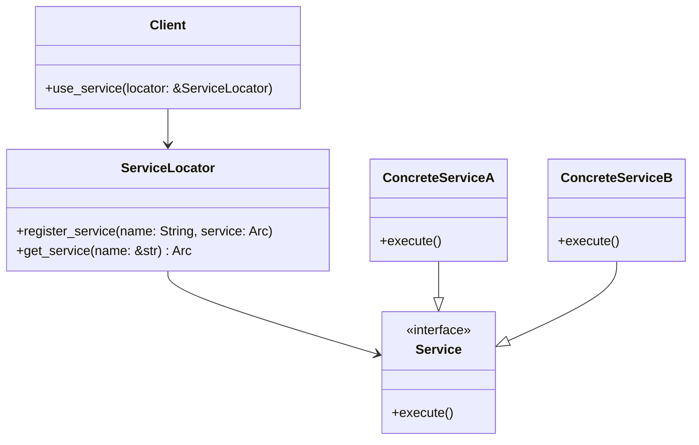

## 8.17. The Service Locator Pattern

### Introduction

The Service Locator pattern is a design pattern used to provide a centralized registry where services can be requested. This pattern promotes decoupling between service consumers and providers, allowing for more flexible and maintainable code. In Rust, implementing the Service Locator pattern involves careful consideration of ownership, borrowing, and concurrency to ensure thread safety and efficient resource management.

### Intent

The primary intent of the Service Locator pattern is to decouple the service consumers from the service providers by providing a centralized mechanism to locate and retrieve services. This pattern is particularly useful in large applications where services are numerous and complex, and where direct dependency injection might lead to cumbersome and tightly coupled code.

### Key Participants

- **Service Locator**: The central registry that holds references to various services.
- **Service**: The actual functionality or resource that is being provided.
- **Client**: The consumer of the service that retrieves it from the Service Locator.

### Applicability

Use the Service Locator pattern when:

- You need to manage a large number of services and want to avoid tight coupling between service consumers and providers.
- You want to centralize the configuration and management of services.
- You need to provide a flexible mechanism for retrieving services, potentially allowing for dynamic service replacement or configuration.

### Implementing the Service Locator Pattern in Rust

To implement the Service Locator pattern in Rust, we need to consider the following steps:

1. **Define a Service Trait**: Define a trait that represents the service interface.
2. **Implement the Service**: Create concrete implementations of the service trait.
3. **Create the Service Locator**: Implement a central registry that can store and retrieve services.
4. **Ensure Thread Safety**: Use synchronization primitives to ensure that the service locator is thread-safe.
5. **Register and Retrieve Services**: Provide mechanisms for registering and retrieving services from the locator.

#### Step 1: Define a Service Trait

First, we define a trait that represents the service interface. This trait will be implemented by all services that can be registered with the Service Locator.

```rust
trait Service {
    fn execute(&self);
}
```

#### Step 2: Implement the Service

Next, we create concrete implementations of the `Service` trait. These implementations provide the actual functionality that will be used by clients.

```rust
struct ConcreteServiceA;

impl Service for ConcreteServiceA {
    fn execute(&self) {
        println!("Executing ConcreteServiceA");
    }
}

struct ConcreteServiceB;

impl Service for ConcreteServiceB {
    fn execute(&self) {
        println!("Executing ConcreteServiceB");
    }
}
```

#### Step 3: Create the Service Locator

The Service Locator is a central registry that holds references to services. In Rust, we can use a `HashMap` to store services, with the service name as the key and a `Box<dyn Service>` as the value.

```rust
use std::collections::HashMap;
use std::sync::{Arc, Mutex};

struct ServiceLocator {
    services: HashMap<String, Arc<dyn Service + Send + Sync>>,
}

impl ServiceLocator {
    fn new() -> Self {
        ServiceLocator {
            services: HashMap::new(),
        }
    }

    fn register_service(&mut self, name: String, service: Arc<dyn Service + Send + Sync>) {
        self.services.insert(name, service);
    }

    fn get_service(&self, name: &str) -> Option<Arc<dyn Service + Send + Sync>> {
        self.services.get(name).cloned()
    }
}
```

#### Step 4: Ensure Thread Safety

To ensure thread safety, we use `Arc` and `Mutex` to manage shared access to the services. This allows multiple threads to safely access the Service Locator.

```rust
let service_locator = Arc::new(Mutex::new(ServiceLocator::new()));
```

#### Step 5: Register and Retrieve Services

Finally, we provide mechanisms for registering and retrieving services from the Service Locator.

```rust
fn main() {
    let service_locator = Arc::new(Mutex::new(ServiceLocator::new()));

    // Register services
    {
        let mut locator = service_locator.lock().unwrap();
        locator.register_service("ServiceA".to_string(), Arc::new(ConcreteServiceA));
        locator.register_service("ServiceB".to_string(), Arc::new(ConcreteServiceB));
    }

    // Retrieve and use services
    {
        let locator = service_locator.lock().unwrap();
        if let Some(service) = locator.get_service("ServiceA") {
            service.execute();
        }
        if let Some(service) = locator.get_service("ServiceB") {
            service.execute();
        }
    }
}
```

### Considerations

#### Global State and Thread Safety

The Service Locator pattern often involves global state, which can lead to issues with thread safety and testability. In Rust, we mitigate these issues by using synchronization primitives like `Arc` and `Mutex` to ensure safe concurrent access to the Service Locator.

#### Potential Drawbacks

- **Hidden Dependencies**: The Service Locator pattern can lead to hidden dependencies, making it harder to understand the relationships between components.
- **Global State**: The use of global state can make testing and debugging more difficult.
- **Overhead**: The indirection introduced by the Service Locator can add overhead, especially in performance-critical applications.

#### Alternative Patterns

- **Dependency Injection**: Consider using dependency injection to explicitly pass dependencies to components, improving testability and reducing global state.
- **Factory Pattern**: Use the Factory pattern to create instances of services, providing more control over their lifecycle and configuration.

### Rust Unique Features

Rust's ownership and borrowing model, along with its powerful type system, provide unique advantages when implementing the Service Locator pattern. By leveraging traits and generics, we can create flexible and type-safe service interfaces. Additionally, Rust's concurrency model allows us to safely manage shared state across threads.

### Differences and Similarities

The Service Locator pattern is often compared to the Dependency Injection pattern. While both patterns aim to decouple service consumers from providers, the Service Locator pattern centralizes service management, whereas Dependency Injection distributes it. Understanding the trade-offs between these patterns is crucial for choosing the right approach for your application.

### Visualizing the Service Locator Pattern

Below is a diagram that illustrates the relationships between the key participants in the Service Locator pattern.



### Try It Yourself

Experiment with the Service Locator pattern by modifying the code examples:

- Add more services and register them with the Service Locator.
- Implement additional methods in the `Service` trait and update the concrete service implementations.
- Explore the impact of using different synchronization primitives, such as `RwLock`, for managing access to the Service Locator.

### Conclusion

The Service Locator pattern provides a centralized mechanism for managing services, promoting decoupling and flexibility in large applications. While it offers several advantages, it also introduces potential drawbacks, such as hidden dependencies and global state. By understanding these trade-offs and leveraging Rust's unique features, you can effectively implement the Service Locator pattern in your applications.

## Quiz Time!



### What is the primary intent of the Service Locator pattern?

- [x] To decouple service consumers from service providers by providing a centralized mechanism to locate and retrieve services.
- [ ] To tightly couple service consumers and providers for better performance.
- [ ] To eliminate the need for service interfaces.
- [ ] To replace all other design patterns.

> **Explanation:** The Service Locator pattern aims to decouple service consumers from providers by centralizing service management.

### Which Rust feature is crucial for ensuring thread safety in the Service Locator pattern?

- [x] Arc and Mutex
- [ ] Rc and RefCell
- [ ] Box and Vec
- [ ] String and HashMap

> **Explanation:** Arc and Mutex are used to ensure thread safety when accessing shared resources in Rust.

### What is a potential drawback of the Service Locator pattern?

- [x] Hidden dependencies
- [ ] Improved performance
- [ ] Simplified code
- [ ] Enhanced readability

> **Explanation:** The Service Locator pattern can lead to hidden dependencies, making it harder to understand component relationships.

### Which alternative pattern can be used instead of the Service Locator pattern?

- [x] Dependency Injection
- [ ] Singleton Pattern
- [ ] Observer Pattern
- [ ] Strategy Pattern

> **Explanation:** Dependency Injection is an alternative pattern that explicitly passes dependencies to components.

### What is the role of the Service Locator in the pattern?

- [x] To act as a central registry that holds references to various services.
- [ ] To execute services directly.
- [ ] To replace service interfaces.
- [ ] To manage client requests.

> **Explanation:** The Service Locator acts as a central registry for managing service references.

### How can you ensure thread safety when implementing the Service Locator pattern in Rust?

- [x] Use Arc and Mutex to manage shared access to services.
- [ ] Use Rc and RefCell for all services.
- [ ] Avoid using any synchronization primitives.
- [ ] Use global variables for service storage.

> **Explanation:** Arc and Mutex are used to safely manage shared access to services in a concurrent environment.

### What is a common use case for the Service Locator pattern?

- [x] Managing a large number of services in a decoupled manner.
- [ ] Directly coupling services to clients.
- [ ] Eliminating the need for service interfaces.
- [ ] Simplifying small applications.

> **Explanation:** The Service Locator pattern is useful for managing numerous services in a decoupled manner.

### Which synchronization primitive can be used as an alternative to Mutex for read-heavy workloads?

- [x] RwLock
- [ ] RefCell
- [ ] Rc
- [ ] Box

> **Explanation:** RwLock allows multiple readers or a single writer, making it suitable for read-heavy workloads.

### True or False: The Service Locator pattern is always the best choice for managing dependencies in Rust applications.

- [ ] True
- [x] False

> **Explanation:** The Service Locator pattern has its drawbacks and may not always be the best choice; alternatives like Dependency Injection should be considered.

### What is the main advantage of using traits in the Service Locator pattern?

- [x] They provide a flexible and type-safe service interface.
- [ ] They eliminate the need for service implementations.
- [ ] They increase code complexity.
- [ ] They reduce code readability.

> **Explanation:** Traits provide a flexible and type-safe interface for services, allowing for polymorphic behavior.



Remember, this is just the beginning. As you progress, you'll build more complex and interactive applications. Keep experimenting, stay curious, and enjoy the journey!
