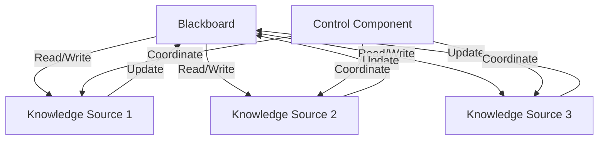

## 8.18. The Blackboard Pattern

The Blackboard Pattern is a powerful behavioral design pattern that facilitates collaborative problem-solving by allowing multiple components to contribute to and read from a shared knowledge base. This pattern is particularly useful in domains such as artificial intelligence (AI), complex system simulations, and any scenario where diverse components need to work together to solve a problem.

### Intent

The intent of the Blackboard Pattern is to provide a flexible architecture where different components, often called "knowledge sources," can independently contribute to and read from a central repository of information, known as the "blackboard." This allows for dynamic and emergent problem-solving strategies, as components can react to changes in the shared knowledge base and contribute their expertise to the evolving solution.

### Key Participants

1. **Blackboard**: The central shared data structure that holds the current state of the problem and potential solutions.
2. **Knowledge Sources**: Independent components that contribute to the blackboard by adding, modifying, or interpreting information.
3. **Control Component**: Manages the flow of information and coordination between knowledge sources, often deciding which knowledge source should act next based on the current state of the blackboard.

### Applicability

The Blackboard Pattern is applicable in scenarios where:
- The problem domain is complex and requires diverse expertise.
- Solutions are emergent and cannot be predetermined.
- Components need to operate independently but collaboratively.
- The system benefits from a flexible and dynamic problem-solving approach.

### Modeling the Blackboard in Rust

In Rust, the blackboard can be modeled using shared data structures that allow for concurrent access and modification. Rust's ownership model and concurrency primitives, such as `Mutex`, `RwLock`, and channels, provide a robust foundation for implementing the Blackboard Pattern.

#### Example: Implementing a Simple Blackboard System

Let's consider a simple example where multiple components contribute to solving a complex mathematical problem by updating a shared blackboard.

```rust
use std::sync::{Arc, Mutex};
use std::thread;
use std::collections::HashMap;

// Define the Blackboard as a shared data structure
type Blackboard = Arc<Mutex<HashMap<String, f64>>>;

// A function representing a knowledge source
fn knowledge_source_1(blackboard: Blackboard) {
    let mut board = blackboard.lock().unwrap();
    board.insert("result".to_string(), 42.0);
    println!("Knowledge Source 1 updated the blackboard.");
}

// Another knowledge source
fn knowledge_source_2(blackboard: Blackboard) {
    let mut board = blackboard.lock().unwrap();
    if let Some(value) = board.get_mut("result") {
        *value *= 2.0;
        println!("Knowledge Source 2 updated the blackboard.");
    }
}

fn main() {
    // Initialize the blackboard
    let blackboard: Blackboard = Arc::new(Mutex::new(HashMap::new()));

    // Spawn threads for each knowledge source
    let blackboard_clone1 = Arc::clone(&blackboard);
    let handle1 = thread::spawn(move || {
        knowledge_source_1(blackboard_clone1);
    });

    let blackboard_clone2 = Arc::clone(&blackboard);
    let handle2 = thread::spawn(move || {
        knowledge_source_2(blackboard_clone2);
    });

    // Wait for threads to finish
    handle1.join().unwrap();
    handle2.join().unwrap();

    // Display the final state of the blackboard
    let board = blackboard.lock().unwrap();
    println!("Final Blackboard State: {:?}", *board);
}
```

In this example, we use an `Arc<Mutex<HashMap<String, f64>>>` to represent the blackboard. Each knowledge source runs in its own thread and updates the shared blackboard. The use of `Mutex` ensures that only one thread can modify the blackboard at a time, preventing data races.

### Synchronization and Concurrency Control

Synchronization and concurrency control are critical in the Blackboard Pattern to ensure that updates to the blackboard are consistent and free from race conditions. Rust provides several mechanisms to achieve this:

- **Mutex**: Ensures mutual exclusion, allowing only one thread to access the blackboard at a time.
- **RwLock**: Allows multiple readers or one writer, providing more flexibility when read-heavy operations are needed.
- **Channels**: Facilitate communication between threads, allowing knowledge sources to notify each other of changes.

#### Example: Using RwLock for Read-Heavy Operations

```rust
use std::sync::{Arc, RwLock};
use std::thread;
use std::collections::HashMap;

type Blackboard = Arc<RwLock<HashMap<String, f64>>>;

fn knowledge_source_3(blackboard: Blackboard) {
    let mut board = blackboard.write().unwrap();
    board.insert("value".to_string(), 100.0);
    println!("Knowledge Source 3 updated the blackboard.");
}

fn knowledge_source_4(blackboard: Blackboard) {
    let board = blackboard.read().unwrap();
    if let Some(value) = board.get("value") {
        println!("Knowledge Source 4 read the value: {}", value);
    }
}

fn main() {
    let blackboard: Blackboard = Arc::new(RwLock::new(HashMap::new()));

    let blackboard_clone3 = Arc::clone(&blackboard);
    let handle3 = thread::spawn(move || {
        knowledge_source_3(blackboard_clone3);
    });

    let blackboard_clone4 = Arc::clone(&blackboard);
    let handle4 = thread::spawn(move || {
        knowledge_source_4(blackboard_clone4);
    });

    handle3.join().unwrap();
    handle4.join().unwrap();
}
```

In this example, we use `RwLock` to allow multiple readers or a single writer, optimizing for scenarios where reading from the blackboard is more frequent than writing.

### Benefits in AI and Complex System Simulation

The Blackboard Pattern is particularly beneficial in AI and complex system simulations due to its flexibility and ability to integrate diverse knowledge sources. In AI, it can be used for tasks such as natural language processing, where different components analyze syntax, semantics, and context to derive meaning. In complex system simulations, it allows for the integration of various models and simulations to achieve a comprehensive understanding of the system.

### Design Considerations

When implementing the Blackboard Pattern, consider the following:

- **Concurrency Control**: Choose appropriate synchronization primitives based on the read/write patterns of your application.
- **Scalability**: Ensure that the blackboard can handle the expected load and number of knowledge sources.
- **Coordination**: Implement a control component to manage the flow of information and prioritize knowledge sources.

### Rust Unique Features

Rust's ownership model and concurrency primitives make it uniquely suited for implementing the Blackboard Pattern. The language's emphasis on safety and performance ensures that the blackboard can be accessed and modified concurrently without sacrificing correctness or efficiency.

### Differences and Similarities

The Blackboard Pattern is often compared to the Observer Pattern, as both involve components reacting to changes in shared data. However, the Blackboard Pattern is more collaborative, with multiple components contributing to a shared solution, whereas the Observer Pattern typically involves components reacting to changes in a single subject.

### Try It Yourself

Experiment with the provided code examples by adding additional knowledge sources or modifying the logic within existing ones. Consider using channels to notify knowledge sources of changes to the blackboard, or explore using `async`/`await` for asynchronous updates.

### Visualizing the Blackboard Pattern

Below is a Mermaid.js diagram illustrating the flow of information in a Blackboard Pattern implementation:



This diagram shows the central blackboard being accessed by multiple knowledge sources, each contributing to and reading from the shared knowledge base. The control component coordinates the actions of the knowledge sources.

### References and Links

For further reading on the Blackboard Pattern and its applications, consider the following resources:

- [Design Patterns: Elements of Reusable Object-Oriented Software](https://en.wikipedia.org/wiki/Design_Patterns) by Erich Gamma et al.
- [Rust Programming Language Documentation](https://doc.rust-lang.org/)
- [Concurrency in Rust](https://doc.rust-lang.org/book/ch16-00-concurrency.html)

### Knowledge Check

- What are the key components of the Blackboard Pattern?
- How does Rust's ownership model benefit the implementation of the Blackboard Pattern?
- What synchronization primitives can be used to implement the Blackboard Pattern in Rust?

### Embrace the Journey

Remember, this is just the beginning. As you progress, you'll discover more complex and interactive ways to implement the Blackboard Pattern in Rust. Keep experimenting, stay curious, and enjoy the journey!

## Quiz Time!



### What is the primary purpose of the Blackboard Pattern?

- [x] To enable collaborative problem-solving by allowing multiple components to contribute to and read from a shared knowledge base.
- [ ] To provide a strict sequence of operations for components to follow.
- [ ] To isolate components from each other to prevent interference.
- [ ] To enforce a single-threaded execution model.

> **Explanation:** The Blackboard Pattern is designed to facilitate collaborative problem-solving by allowing multiple components to interact with a shared knowledge base.

### Which Rust concurrency primitive is best suited for read-heavy operations in the Blackboard Pattern?

- [ ] Mutex
- [x] RwLock
- [ ] Channel
- [ ] Atomic

> **Explanation:** `RwLock` allows multiple readers or a single writer, making it ideal for scenarios where reading is more frequent than writing.

### What is a key benefit of using the Blackboard Pattern in AI applications?

- [x] It allows diverse components to contribute their expertise to a shared solution.
- [ ] It enforces a strict hierarchy of operations.
- [ ] It simplifies the implementation of single-threaded algorithms.
- [ ] It eliminates the need for synchronization.

> **Explanation:** The Blackboard Pattern's flexibility allows diverse components to collaborate and contribute their expertise, which is particularly beneficial in AI applications.

### How does Rust's ownership model benefit the Blackboard Pattern?

- [x] It ensures safe concurrent access to shared data structures.
- [ ] It eliminates the need for synchronization primitives.
- [ ] It enforces a single-threaded execution model.
- [ ] It simplifies the implementation of complex algorithms.

> **Explanation:** Rust's ownership model, combined with its concurrency primitives, ensures safe concurrent access to shared data structures, which is crucial for the Blackboard Pattern.

### What role does the control component play in the Blackboard Pattern?

- [x] It manages the flow of information and coordination between knowledge sources.
- [ ] It acts as a central repository for all data.
- [ ] It enforces a strict sequence of operations.
- [ ] It isolates components from each other.

> **Explanation:** The control component manages the flow of information and coordination between knowledge sources, ensuring efficient collaboration.

### Which of the following is NOT a typical application of the Blackboard Pattern?

- [ ] AI and machine learning
- [ ] Complex system simulations
- [x] Single-threaded data processing
- [ ] Collaborative problem-solving

> **Explanation:** The Blackboard Pattern is not typically used for single-threaded data processing, as it is designed for collaborative and concurrent problem-solving.

### How can channels be used in the Blackboard Pattern?

- [x] To facilitate communication between knowledge sources.
- [ ] To enforce a single-threaded execution model.
- [ ] To eliminate the need for a control component.
- [ ] To simplify the implementation of complex algorithms.

> **Explanation:** Channels can be used to facilitate communication between knowledge sources, allowing them to notify each other of changes to the blackboard.

### What is a potential drawback of using the Blackboard Pattern?

- [x] It can become complex to manage as the number of knowledge sources increases.
- [ ] It enforces a strict sequence of operations.
- [ ] It eliminates the need for synchronization.
- [ ] It simplifies the implementation of single-threaded algorithms.

> **Explanation:** As the number of knowledge sources increases, managing the flow of information and coordination can become complex.

### True or False: The Blackboard Pattern is similar to the Observer Pattern in that both involve components reacting to changes in shared data.

- [x] True
- [ ] False

> **Explanation:** Both patterns involve components reacting to changes in shared data, but the Blackboard Pattern is more collaborative, with multiple components contributing to a shared solution.

### Which synchronization primitive would you use to prevent data races in a write-heavy Blackboard Pattern?

- [x] Mutex
- [ ] RwLock
- [ ] Channel
- [ ] Atomic

> **Explanation:** `Mutex` ensures mutual exclusion, allowing only one thread to access the blackboard at a time, which is ideal for write-heavy scenarios.


