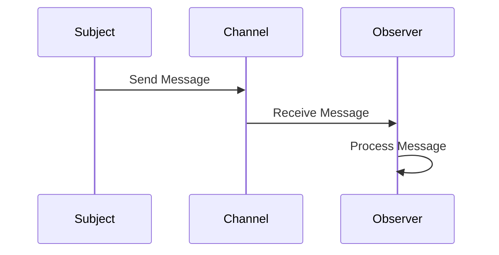

## 8.2. Observer Pattern Using Channels and Events

The Observer pattern is a fundamental design pattern in software development, commonly used to implement a publish-subscribe mechanism. In Rust, this pattern can be effectively implemented using channels, which provide a robust way to handle communication between objects. This section will guide you through understanding the Observer pattern, its implementation in Rust using channels, and the advantages it offers in terms of decoupled communication and scalability.

### Understanding the Observer Pattern

**Definition**: The Observer pattern defines a one-to-many dependency between objects so that when one object changes state, all its dependents are notified and updated automatically. This pattern is particularly useful in scenarios where an object (known as the subject) needs to notify other objects (observers) about changes in its state.

**Common Use Cases**:
- **Event Handling Systems**: GUI frameworks often use the Observer pattern to handle events like button clicks.
- **Data Binding**: In applications where UI components need to reflect changes in data models.
- **Real-time Systems**: Systems that require real-time updates, such as stock trading platforms or live sports scores.

### Implementing the Observer Pattern in Rust

Rust's `std::sync::mpsc` module provides multi-producer, single-consumer channels that can be used to implement the Observer pattern. These channels facilitate communication between threads, making them ideal for observer implementations.

#### Key Components

1. **Subject**: The entity that holds the state and notifies observers of changes.
2. **Observer**: The entity that receives updates from the subject.
3. **Channel**: The medium through which the subject communicates with observers.

#### Using `std::sync::mpsc` Channels

Rust's channels are a powerful tool for implementing the Observer pattern. They allow for safe communication between threads, ensuring that data is transferred without the need for explicit locks.

```rust
use std::sync::mpsc;
use std::thread;
use std::time::Duration;

// Define a simple subject that can notify observers
struct Subject {
    sender: mpsc::Sender<String>,
}

impl Subject {
    fn new(sender: mpsc::Sender<String>) -> Self {
        Subject { sender }
    }

    fn notify(&self, message: &str) {
        self.sender.send(message.to_string()).unwrap();
    }
}

// Define an observer that listens for updates
fn observer(receiver: mpsc::Receiver<String>) {
    thread::spawn(move || {
        for received in receiver {
            println!("Observer received: {}", received);
        }
    });
}

fn main() {
    let (tx, rx) = mpsc::channel();

    let subject = Subject::new(tx);
    observer(rx);

    subject.notify("Event 1");
    subject.notify("Event 2");

    // Allow some time for the observer to process messages
    thread::sleep(Duration::from_secs(1));
}
```

**Explanation**:
- We create a `Subject` struct that holds a sender channel.
- The `notify` method sends messages to the channel.
- The `observer` function spawns a new thread that listens for messages on the receiver channel.
- The main function demonstrates sending notifications from the subject to the observer.

### Thread Safety and Synchronization

Rust's channels are inherently thread-safe, which simplifies synchronization between the subject and observers. The use of channels eliminates the need for explicit locking mechanisms, reducing the risk of deadlocks and race conditions.

#### Considerations:
- **Single Consumer**: Rust's `mpsc` channels are designed for single consumers. If multiple observers are needed, consider using `Arc<Mutex<Receiver<T>>>` to share the receiver among threads.
- **Blocking Operations**: Ensure that observers process messages quickly to avoid blocking the channel.

### Advantages of Using Channels for the Observer Pattern

1. **Decoupled Communication**: Channels provide a clean separation between the subject and observers, allowing them to operate independently.
2. **Scalability**: Channels can handle a large number of messages efficiently, making them suitable for scalable systems.
3. **Thread Safety**: Built-in thread safety ensures reliable communication without the need for complex synchronization logic.

### Visualizing the Observer Pattern with Channels

To better understand the flow of communication in the Observer pattern using channels, let's visualize the process:



**Diagram Explanation**:
- The `Subject` sends a message to the `Channel`.
- The `Channel` delivers the message to the `Observer`.
- The `Observer` processes the message independently.

### Try It Yourself

Experiment with the provided code by modifying the message content or adding additional observers. Consider implementing a scenario where multiple subjects notify a single observer, or vice versa.

### References and Further Reading

- [Rust Documentation on Channels](https://doc.rust-lang.org/std/sync/mpsc/index.html)
- [Observer Pattern on Wikipedia](https://en.wikipedia.org/wiki/Observer_pattern)
- [Concurrency in Rust](https://doc.rust-lang.org/book/ch16-00-concurrency.html)

### Knowledge Check

- How does the Observer pattern facilitate decoupled communication?
- What are the benefits of using Rust's channels for implementing the Observer pattern?
- How can you ensure thread safety when using channels in Rust?

### Summary

The Observer pattern, when implemented using Rust's channels, provides a powerful mechanism for event-driven communication. By leveraging channels, we achieve decoupled, scalable, and thread-safe systems. As you continue to explore Rust's capabilities, remember that mastering these patterns will enhance your ability to build robust and efficient applications.

## Quiz Time!



### What is the primary purpose of the Observer pattern?

- [x] To define a one-to-many dependency between objects
- [ ] To encapsulate a request as an object
- [ ] To provide a way to access elements of an aggregate object sequentially
- [ ] To define a family of algorithms

> **Explanation:** The Observer pattern is used to define a one-to-many dependency between objects so that when one object changes state, all its dependents are notified and updated automatically.

### How do Rust's channels facilitate the implementation of the Observer pattern?

- [x] By providing a thread-safe way to communicate between objects
- [ ] By allowing direct access to shared memory
- [ ] By enforcing compile-time checks for observer registration
- [ ] By automatically managing observer lifetimes

> **Explanation:** Rust's channels provide a thread-safe way to communicate between objects, making them ideal for implementing the Observer pattern.

### What is a key advantage of using channels for observer implementations in Rust?

- [x] Decoupled communication between subjects and observers
- [ ] Automatic memory management for observers
- [ ] Built-in support for multiple consumers
- [ ] Simplified error handling

> **Explanation:** Channels allow for decoupled communication between subjects and observers, enabling them to operate independently.

### Which Rust module provides channels for communication?

- [x] `std::sync::mpsc`
- [ ] `std::thread`
- [ ] `std::sync::Arc`
- [ ] `std::collections`

> **Explanation:** The `std::sync::mpsc` module provides channels for communication in Rust.

### How can you handle multiple observers in Rust using channels?

- [x] Use `Arc<Mutex<Receiver<T>>>` to share the receiver among threads
- [ ] Use multiple sender channels
- [ ] Use a single global variable for communication
- [ ] Use a separate thread for each observer

> **Explanation:** To handle multiple observers, you can use `Arc<Mutex<Receiver<T>>>` to share the receiver among threads.

### What is a potential issue when observers process messages slowly?

- [x] Blocking the channel
- [ ] Losing messages
- [ ] Increasing memory usage
- [ ] Decreasing CPU utilization

> **Explanation:** If observers process messages slowly, it can block the channel, preventing new messages from being sent.

### What is the role of the subject in the Observer pattern?

- [x] To hold the state and notify observers of changes
- [ ] To receive updates from other subjects
- [ ] To manage the lifecycle of observers
- [ ] To process messages from channels

> **Explanation:** The subject holds the state and notifies observers of changes in the Observer pattern.

### What is a common use case for the Observer pattern?

- [x] Event handling systems
- [ ] Memory management
- [ ] Data serialization
- [ ] File I/O operations

> **Explanation:** The Observer pattern is commonly used in event handling systems to notify observers of events.

### True or False: Rust's channels require explicit locks for synchronization.

- [ ] True
- [x] False

> **Explanation:** Rust's channels are inherently thread-safe and do not require explicit locks for synchronization.

### What is the benefit of using the Observer pattern in real-time systems?

- [x] It allows for real-time updates to observers
- [ ] It simplifies memory management
- [ ] It reduces code complexity
- [ ] It improves error handling

> **Explanation:** The Observer pattern allows for real-time updates to observers, making it suitable for real-time systems.



Remember, this is just the beginning. As you progress, you'll build more complex and interactive systems using Rust's powerful concurrency features. Keep experimenting, stay curious, and enjoy the journey!
