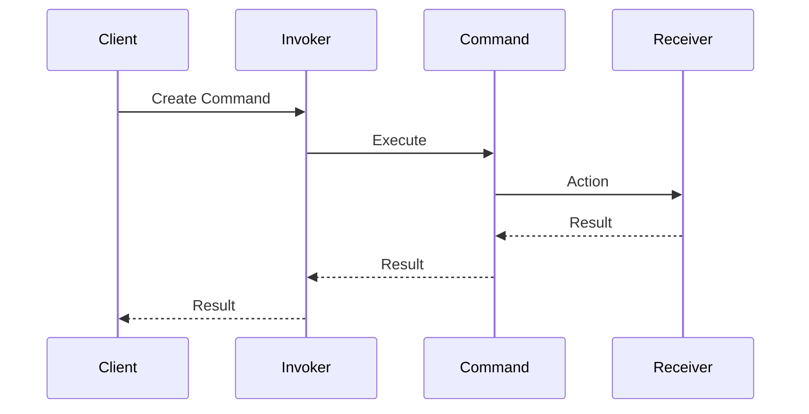

## 8.3. Command Pattern via Enums and Dispatchers

### Introduction

The Command Pattern is a behavioral design pattern that turns a request into a stand-alone object containing all information about the request. This transformation allows for parameterization of clients with queues, requests, and operations, as well as support for undoable operations. In Rust, we can leverage enums and dispatchers to implement the Command Pattern effectively, offering a robust solution for encapsulating requests and enhancing code flexibility.

### Intent of the Command Pattern

The primary intent of the Command Pattern is to encapsulate a request as an object, thereby allowing for parameterization of clients with different requests, queuing of requests, and logging of the requests. It also provides support for undoable operations, which is a significant advantage in applications requiring reversible actions.

### Key Participants

1. **Command**: Declares an interface for executing an operation.
2. **ConcreteCommand**: Defines a binding between a Receiver object and an action. Implements the Execute method by invoking the corresponding operations on Receiver.
3. **Client**: Creates a ConcreteCommand object and sets its receiver.
4. **Invoker**: Asks the command to carry out the request.
5. **Receiver**: Knows how to perform the operations associated with carrying out a request.

### Representing Commands Using Enums

In Rust, enums are a powerful way to represent a set of related commands. Each variant of the enum can encapsulate different data and behavior, making it an excellent choice for implementing the Command Pattern.

```rust
enum Command {
    Add(i32),
    Subtract(i32),
    Multiply(i32),
    Divide(i32),
}
```

In this example, each variant of the `Command` enum represents a different operation, encapsulating the necessary data to perform that operation.

### Command Execution Through Match Statements

Once we have defined our commands using an enum, we can execute them using Rust's powerful pattern matching capabilities. This approach allows us to dispatch commands to the appropriate handler based on the variant.

```rust
fn execute_command(command: Command, current_value: i32) -> i32 {
    match command {
        Command::Add(value) => current_value + value,
        Command::Subtract(value) => current_value - value,
        Command::Multiply(value) => current_value * value,
        Command::Divide(value) => {
            if value != 0 {
                current_value / value
            } else {
                println!("Cannot divide by zero");
                current_value
            }
        }
    }
}
```

### Implementing a Dispatcher

A dispatcher can be used to manage and execute commands. It acts as an invoker in the Command Pattern, maintaining a history of executed commands for potential undo/redo functionality.

```rust
struct CommandDispatcher {
    history: Vec<Command>,
}

impl CommandDispatcher {
    fn new() -> Self {
        CommandDispatcher { history: Vec::new() }
    }

    fn execute(&mut self, command: Command, current_value: &mut i32) {
        *current_value = execute_command(command.clone(), *current_value);
        self.history.push(command);
    }

    fn undo(&mut self, current_value: &mut i32) {
        if let Some(command) = self.history.pop() {
            *current_value = match command {
                Command::Add(value) => *current_value - value,
                Command::Subtract(value) => *current_value + value,
                Command::Multiply(value) => *current_value / value,
                Command::Divide(value) => *current_value * value,
            };
        }
    }
}
```

### Benefits of Using the Command Pattern

- **Extensibility**: New commands can be added without changing existing code, adhering to the open/closed principle.
- **Undo/Redo Functionality**: By maintaining a history of commands, we can easily implement undo and redo operations.
- **Parameterization**: Clients can be parameterized with different requests, allowing for flexible and dynamic behavior.

### Rust Unique Features

Rust's ownership model and pattern matching provide unique advantages when implementing the Command Pattern. The use of enums allows for a type-safe way to represent commands, while pattern matching offers a concise and expressive way to dispatch commands.

### Differences and Similarities with Other Patterns

The Command Pattern is often compared to the Strategy Pattern. While both encapsulate behavior, the Command Pattern focuses on encapsulating requests as objects, whereas the Strategy Pattern is about selecting an algorithm at runtime.

### Visualizing the Command Pattern

To better understand the flow of the Command Pattern, let's visualize it using a sequence diagram:



### Try It Yourself

Experiment with the provided code by adding new command variants, such as `Power` or `Modulo`, and implement their execution logic. Try extending the dispatcher to support redo functionality.

### Knowledge Check

- What are the key participants in the Command Pattern?
- How does Rust's pattern matching facilitate command execution?
- What are the benefits of using enums to represent commands?

### Summary

The Command Pattern in Rust, implemented via enums and dispatchers, offers a powerful way to encapsulate requests as objects. This approach enhances code flexibility, supports undo/redo functionality, and adheres to the open/closed principle. By leveraging Rust's unique features, developers can create robust and maintainable applications.

## Quiz Time!



### What is the primary intent of the Command Pattern?

- [x] To encapsulate a request as an object
- [ ] To provide a way to access elements of an aggregate object sequentially
- [ ] To define a family of algorithms
- [ ] To separate the construction of a complex object from its representation

> **Explanation:** The Command Pattern encapsulates a request as an object, allowing for parameterization and queuing of requests.

### How can commands be represented in Rust?

- [x] Using enums with associated data
- [ ] Using structs with methods
- [ ] Using traits with default implementations
- [ ] Using modules with functions

> **Explanation:** Enums with associated data are a powerful way to represent commands in Rust, allowing for different data and behavior encapsulation.

### What is the role of a dispatcher in the Command Pattern?

- [x] To manage and execute commands
- [ ] To create commands
- [ ] To define the interface for executing an operation
- [ ] To perform the operations associated with carrying out a request

> **Explanation:** A dispatcher manages and executes commands, often maintaining a history for undo/redo functionality.

### Which Rust feature is particularly useful for dispatching commands?

- [x] Pattern matching
- [ ] Ownership
- [ ] Lifetimes
- [ ] Traits

> **Explanation:** Pattern matching in Rust provides a concise and expressive way to dispatch commands based on their variants.

### What is a benefit of using the Command Pattern?

- [x] Extensibility
- [ ] Simplicity
- [ ] Performance
- [ ] Memory efficiency

> **Explanation:** The Command Pattern allows for extensibility by enabling new commands to be added without changing existing code.

### How can undo functionality be implemented in the Command Pattern?

- [x] By maintaining a history of executed commands
- [ ] By using a loop to reverse actions
- [ ] By storing the initial state
- [ ] By using a stack data structure

> **Explanation:** Maintaining a history of executed commands allows for undo functionality by reversing the effects of the last command.

### What is a common use case for the Command Pattern?

- [x] Implementing undo/redo functionality
- [ ] Sorting a list of items
- [ ] Managing database connections
- [ ] Rendering graphics

> **Explanation:** The Command Pattern is commonly used to implement undo/redo functionality by encapsulating actions as objects.

### How does the Command Pattern support parameterization?

- [x] By allowing clients to be parameterized with different requests
- [ ] By using generics to define command types
- [ ] By defining command interfaces
- [ ] By using closures to capture state

> **Explanation:** The Command Pattern supports parameterization by allowing clients to be parameterized with different requests, enabling flexible behavior.

### What is a key difference between the Command and Strategy Patterns?

- [x] Command encapsulates requests, Strategy encapsulates algorithms
- [ ] Command is used for concurrency, Strategy is used for sorting
- [ ] Command is a structural pattern, Strategy is a behavioral pattern
- [ ] Command uses enums, Strategy uses structs

> **Explanation:** The Command Pattern encapsulates requests as objects, while the Strategy Pattern encapsulates algorithms for runtime selection.

### True or False: The Command Pattern can only be implemented using enums in Rust.

- [ ] True
- [x] False

> **Explanation:** While enums are a powerful way to implement the Command Pattern in Rust, other approaches such as using structs and traits are also possible.



Remember, this is just the beginning. As you progress, you'll build more complex and interactive applications. Keep experimenting, stay curious, and enjoy the journey!
