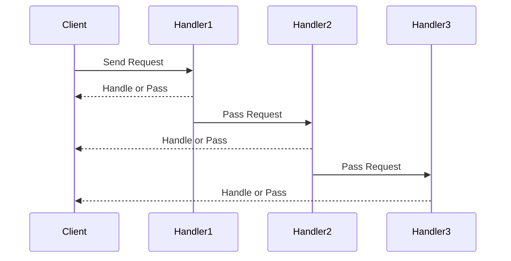

## 8.4. Chain of Responsibility with Iterator Chains

The Chain of Responsibility is a behavioral design pattern that allows an object to send a command without knowing which object will handle it. This pattern is particularly useful in scenarios where multiple objects can handle a request, but the handler is determined at runtime. In Rust, we can leverage iterator chains to implement this pattern efficiently, providing a flexible and dynamic way to process requests.

### Understanding the Chain of Responsibility Pattern

**Intent**: The Chain of Responsibility pattern decouples the sender of a request from its receiver by allowing multiple objects to handle the request. The request is passed along a chain of potential handlers until one of them handles it.

**Key Participants**:
- **Handler**: Defines an interface for handling requests.
- **ConcreteHandler**: Handles requests it is responsible for and forwards requests to the next handler.
- **Client**: Initiates the request to a handler in the chain.

### Modeling Chain of Responsibility with Iterator Chains

In Rust, iterator chains provide a powerful mechanism to model the Chain of Responsibility pattern. By chaining iterators, we can create a sequence of handlers that process a request until it is handled. This approach is both efficient and idiomatic in Rust, leveraging the language's strengths in functional programming and concurrency.

#### Using Closures and Functions as Handlers

Let's start by implementing a simple Chain of Responsibility using closures as handlers. Consider a scenario where we have a series of handlers that process a string request:

```rust
fn main() {
    let handlers: Vec<Box<dyn Fn(&str) -> Option<String>>> = vec![
        Box::new(|req| {
            if req.contains("error") {
                Some("Handled by Error Handler".to_string())
            } else {
                None
            }
        }),
        Box::new(|req| {
            if req.contains("log") {
                Some("Handled by Log Handler".to_string())
            } else {
                None
            }
        }),
    ];

    let request = "This is a log message";
    for handler in handlers.iter() {
        if let Some(response) = handler(request) {
            println!("{}", response);
            break;
        }
    }
}
```

In this example, we define a vector of closures, each acting as a handler. The request is passed through each handler until one of them returns a response.

#### Dynamic Addition and Removal of Handlers

One of the strengths of using iterator chains is the ability to dynamically add or remove handlers. This flexibility is crucial in scenarios like middleware stacks in web servers or event processing systems.

```rust
fn main() {
    let mut handlers: Vec<Box<dyn Fn(&str) -> Option<String>>> = vec![];

    // Add handlers dynamically
    handlers.push(Box::new(|req| {
        if req.contains("auth") {
            Some("Handled by Auth Handler".to_string())
        } else {
            None
        }
    }));

    handlers.push(Box::new(|req| {
        if req.contains("data") {
            Some("Handled by Data Handler".to_string())
        } else {
            None
        }
    }));

    let request = "This is a data request";
    for handler in handlers.iter() {
        if let Some(response) = handler(request) {
            println!("{}", response);
            break;
        }
    }
}
```

In this example, we dynamically add handlers to the chain. This approach allows us to modify the chain at runtime, making it highly adaptable to changing requirements.

### Use Cases for Chain of Responsibility with Iterator Chains

#### Event Processing

In event-driven systems, events are processed by a series of handlers. The Chain of Responsibility pattern is ideal for such scenarios, where each handler can decide whether to process the event or pass it to the next handler.

```rust
fn main() {
    let event_handlers: Vec<Box<dyn Fn(&str) -> Option<String>>> = vec![
        Box::new(|event| {
            if event == "click" {
                Some("Click event processed".to_string())
            } else {
                None
            }
        }),
        Box::new(|event| {
            if event == "hover" {
                Some("Hover event processed".to_string())
            } else {
                None
            }
        }),
    ];

    let event = "click";
    for handler in event_handlers.iter() {
        if let Some(response) = handler(event) {
            println!("{}", response);
            break;
        }
    }
}
```

#### Middleware in Web Servers

Middleware components in web servers often form a chain of responsibility. Each middleware can process a request, modify it, or pass it to the next middleware.

```rust
fn main() {
    let middleware_chain: Vec<Box<dyn Fn(&str) -> Option<String>>> = vec![
        Box::new(|req| {
            if req.starts_with("GET") {
                Some("GET request processed".to_string())
            } else {
                None
            }
        }),
        Box::new(|req| {
            if req.starts_with("POST") {
                Some("POST request processed".to_string())
            } else {
                None
            }
        }),
    ];

    let request = "GET /index.html";
    for middleware in middleware_chain.iter() {
        if let Some(response) = middleware(request) {
            println!("{}", response);
            break;
        }
    }
}
```

### Design Considerations

When implementing the Chain of Responsibility pattern with iterator chains in Rust, consider the following:

- **Performance**: Iterator chains are efficient, but ensure that the chain is not too long, as it may impact performance.
- **Error Handling**: Decide how errors should be handled within the chain. Should they stop the chain, or should the request continue to the next handler?
- **State Management**: If handlers need to maintain state, consider using structs with closures or functions.

### Rust's Unique Features

Rust's ownership model and type system provide unique advantages when implementing the Chain of Responsibility pattern:

- **Safety**: Rust's borrow checker ensures that handlers do not cause data races or memory leaks.
- **Concurrency**: Rust's concurrency model allows handlers to be executed in parallel, improving performance in multi-threaded environments.

### Differences and Similarities with Other Patterns

The Chain of Responsibility pattern is often compared to the Decorator pattern. While both involve a sequence of operations, the Chain of Responsibility pattern focuses on passing a request along a chain, whereas the Decorator pattern adds behavior to an object.

### Visualizing the Chain of Responsibility

To better understand the flow of requests through a chain of handlers, let's visualize the process using a sequence diagram:



In this diagram, the client sends a request to the first handler. Each handler decides whether to handle the request or pass it to the next handler.

### Try It Yourself

Experiment with the code examples provided. Try adding new handlers, modifying existing ones, or changing the conditions under which handlers process requests. This hands-on approach will deepen your understanding of the Chain of Responsibility pattern in Rust.

### Knowledge Check

- What is the primary purpose of the Chain of Responsibility pattern?
- How can iterator chains be used to implement this pattern in Rust?
- What are some common use cases for this pattern?
- How does Rust's ownership model benefit the implementation of this pattern?

### Embrace the Journey

Remember, mastering design patterns is a journey. As you explore the Chain of Responsibility pattern in Rust, you'll gain insights into how to build flexible and efficient systems. Keep experimenting, stay curious, and enjoy the process!

## Quiz Time!



### What is the primary purpose of the Chain of Responsibility pattern?

- [x] To decouple the sender of a request from its receiver by allowing multiple objects to handle the request.
- [ ] To ensure that a request is handled by a single object.
- [ ] To provide a way to add new functionality to an object dynamically.
- [ ] To manage the lifecycle of objects in a system.

> **Explanation:** The Chain of Responsibility pattern allows multiple objects to handle a request, decoupling the sender from the receiver.

### How can iterator chains be used to implement the Chain of Responsibility pattern in Rust?

- [x] By creating a sequence of handlers that process a request until it is handled.
- [ ] By ensuring that each handler in the chain processes the request independently.
- [ ] By using iterators to manage the lifecycle of handlers.
- [ ] By creating a single handler that processes all requests.

> **Explanation:** Iterator chains allow for a sequence of handlers to process a request, passing it along the chain until it is handled.

### What are some common use cases for the Chain of Responsibility pattern?

- [x] Event processing and middleware in web servers.
- [ ] Managing object lifecycles.
- [ ] Adding new functionality to objects.
- [ ] Ensuring that requests are handled by a single object.

> **Explanation:** Common use cases include event processing and middleware, where requests are passed through a chain of handlers.

### How does Rust's ownership model benefit the implementation of the Chain of Responsibility pattern?

- [x] It ensures that handlers do not cause data races or memory leaks.
- [ ] It allows handlers to be executed in parallel without any additional considerations.
- [ ] It simplifies the implementation of the pattern by removing the need for error handling.
- [ ] It provides a way to dynamically add and remove handlers.

> **Explanation:** Rust's ownership model ensures memory safety, preventing data races and memory leaks.

### What is a key difference between the Chain of Responsibility and Decorator patterns?

- [x] The Chain of Responsibility pattern focuses on passing a request along a chain, while the Decorator pattern adds behavior to an object.
- [ ] The Decorator pattern focuses on passing a request along a chain, while the Chain of Responsibility pattern adds behavior to an object.
- [ ] Both patterns are used to manage object lifecycles.
- [ ] Both patterns are used to ensure that requests are handled by a single object.

> **Explanation:** The Chain of Responsibility pattern passes requests along a chain, while the Decorator pattern adds behavior to objects.

### In the provided code examples, how are handlers represented?

- [x] As closures stored in a vector.
- [ ] As structs implementing a trait.
- [ ] As functions with a specific signature.
- [ ] As enums with different variants.

> **Explanation:** Handlers are represented as closures stored in a vector, allowing for dynamic addition and removal.

### What is a potential performance consideration when using iterator chains for the Chain of Responsibility pattern?

- [x] The chain should not be too long, as it may impact performance.
- [ ] The chain should be executed in parallel to improve performance.
- [ ] The chain should be executed in a single thread to avoid performance issues.
- [ ] The chain should be dynamically modified to optimize performance.

> **Explanation:** A long chain may impact performance, so it's important to consider the length of the chain.

### How can errors be handled within a chain of responsibility?

- [x] Decide whether errors should stop the chain or allow the request to continue to the next handler.
- [ ] Ensure that each handler handles errors independently.
- [ ] Use a global error handler to manage errors in the chain.
- [ ] Avoid error handling to simplify the implementation.

> **Explanation:** It's important to decide how errors should be handled within the chain, whether they stop the chain or allow the request to continue.

### What is a benefit of using iterator chains for the Chain of Responsibility pattern in Rust?

- [x] They provide a flexible and dynamic way to process requests.
- [ ] They simplify the implementation by removing the need for error handling.
- [ ] They ensure that requests are handled by a single object.
- [ ] They provide a way to manage the lifecycle of handlers.

> **Explanation:** Iterator chains provide a flexible and dynamic way to process requests, making them ideal for the Chain of Responsibility pattern.

### True or False: The Chain of Responsibility pattern is only applicable in event-driven systems.

- [ ] True
- [x] False

> **Explanation:** The Chain of Responsibility pattern is applicable in various scenarios, not just event-driven systems.


