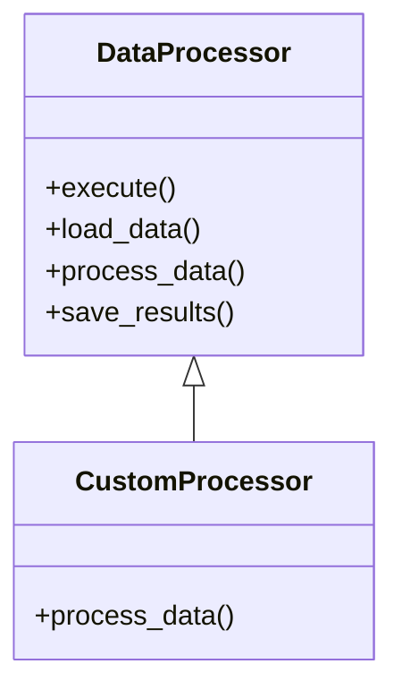

## 8.5. Template Method Pattern using Trait Default Methods

In this section, we delve into the Template Method Pattern, a behavioral design pattern that defines the skeleton of an algorithm in a method, deferring some steps to subclasses. This pattern allows subclasses to redefine certain steps of an algorithm without changing its structure. In Rust, we can effectively implement this pattern using traits with default method implementations.

### Intent of the Template Method Pattern

The Template Method Pattern aims to:

- **Define the skeleton of an algorithm** in a base class or trait.
- **Allow subclasses or implementors** to override specific steps of the algorithm without altering its overall structure.
- **Promote code reuse** by encapsulating common behavior in a single place.
- **Enforce a sequence of method calls**, ensuring that the algorithm follows a defined order.

### Modeling the Template Method Pattern with Traits

In Rust, traits provide a powerful mechanism for defining shared behavior. By using default method implementations in traits, we can create a template method pattern where the trait defines the algorithm's structure, and implementors can override specific steps.

#### Key Components

- **Trait with Default Methods**: The trait defines the algorithm's structure and provides default implementations for some or all of the steps.
- **Concrete Implementations**: Types that implement the trait can override the default methods to provide specific behavior.

### Example: A Simple Workflow

Let's consider a simple example where we define a workflow for processing data. The workflow consists of three steps: loading data, processing data, and saving results. We will use a trait to define this workflow and allow concrete types to customize the processing step.

```rust
// Define a trait with default method implementations
trait DataProcessor {
    // Template method defining the workflow
    fn execute(&self) {
        self.load_data();
        self.process_data();
        self.save_results();
    }

    // Default implementation for loading data
    fn load_data(&self) {
        println!("Loading data...");
    }

    // Default implementation for processing data
    // This method can be overridden by implementors
    fn process_data(&self) {
        println!("Processing data...");
    }

    // Default implementation for saving results
    fn save_results(&self) {
        println!("Saving results...");
    }
}

// Concrete implementation that overrides the process_data method
struct CustomProcessor;

impl DataProcessor for CustomProcessor {
    fn process_data(&self) {
        println!("Custom processing of data...");
    }
}

fn main() {
    let processor = CustomProcessor;
    processor.execute();
}
```

In this example, the `DataProcessor` trait defines the `execute` method, which outlines the workflow. The `process_data` method is overridden by `CustomProcessor` to provide custom behavior.

### Generics and Associated Types

Rust's powerful type system allows us to use generics and associated types to create more flexible and reusable template methods. Let's extend our example to demonstrate this.

```rust
// Define a trait with an associated type
trait DataProcessor<T> {
    fn execute(&self, data: T) {
        self.load_data(&data);
        self.process_data(&data);
        self.save_results(&data);
    }

    fn load_data(&self, data: &T) {
        println!("Loading data: {:?}", data);
    }

    fn process_data(&self, data: &T) {
        println!("Processing data: {:?}", data);
    }

    fn save_results(&self, data: &T) {
        println!("Saving results for data: {:?}", data);
    }
}

// Concrete implementation that overrides the process_data method
struct CustomProcessor;

impl DataProcessor<String> for CustomProcessor {
    fn process_data(&self, data: &String) {
        println!("Custom processing of data: {}", data);
    }
}

fn main() {
    let processor = CustomProcessor;
    processor.execute("Sample data".to_string());
}
```

Here, the `DataProcessor` trait uses a generic type `T`, allowing it to work with any data type. The `CustomProcessor` provides a specific implementation for `String` data.

### Benefits of Using the Template Method Pattern

- **Code Reuse**: Common behavior is encapsulated in the trait, reducing code duplication.
- **Flexibility**: Implementors can customize specific steps without altering the overall algorithm.
- **Maintainability**: Changes to the algorithm's structure are centralized in the trait, simplifying maintenance.
- **Enforced Method Sequences**: The template method ensures that the algorithm follows a defined sequence of steps.

### Design Considerations

When implementing the Template Method Pattern in Rust, consider the following:

- **Use Default Methods Judiciously**: Only provide default implementations for methods that are likely to be shared across multiple implementors.
- **Balance Flexibility and Complexity**: While generics and associated types add flexibility, they can also increase complexity. Use them when necessary.
- **Document Method Sequences**: Clearly document the sequence of method calls in the template method to aid understanding and maintenance.

### Rust Unique Features

Rust's trait system, with its support for default methods, provides a natural way to implement the Template Method Pattern. The language's emphasis on safety and concurrency makes it well-suited for defining robust and reliable algorithms.

### Differences and Similarities with Other Patterns

The Template Method Pattern is often compared to the Strategy Pattern. While both patterns involve defining a family of algorithms, the Template Method Pattern focuses on defining the skeleton of an algorithm, whereas the Strategy Pattern involves selecting an algorithm at runtime.

### Try It Yourself

Experiment with the code examples provided. Try modifying the `CustomProcessor` to override additional methods, or create new implementations that use different data types. This hands-on approach will deepen your understanding of the Template Method Pattern in Rust.

### Visualizing the Template Method Pattern

To better understand the Template Method Pattern, let's visualize the relationship between the trait and its implementors using a class diagram.



In this diagram, `DataProcessor` is the trait defining the template method and default implementations. `CustomProcessor` is a concrete type that overrides the `process_data` method.

### Knowledge Check

- What is the primary intent of the Template Method Pattern?
- How do traits with default methods facilitate the implementation of this pattern in Rust?
- What are the benefits of using the Template Method Pattern?
- How can generics and associated types enhance the flexibility of template methods?
- What are some design considerations when implementing this pattern?

### Embrace the Journey

Remember, mastering design patterns is a journey. As you explore the Template Method Pattern and other patterns in Rust, you'll gain valuable insights into structuring your code effectively. Keep experimenting, stay curious, and enjoy the process!

## Quiz Time!



### What is the primary intent of the Template Method Pattern?

- [x] To define the skeleton of an algorithm and allow subclasses to redefine certain steps.
- [ ] To encapsulate a family of algorithms and make them interchangeable.
- [ ] To provide a way to access elements of an aggregate object sequentially.
- [ ] To define a one-to-many dependency between objects.

> **Explanation:** The Template Method Pattern defines the skeleton of an algorithm, allowing subclasses to redefine certain steps without changing the algorithm's structure.

### How do traits with default methods facilitate the Template Method Pattern in Rust?

- [x] By providing a way to define shared behavior and allow implementors to override specific methods.
- [ ] By enabling the creation of multiple instances of a class.
- [ ] By allowing the dynamic selection of algorithms at runtime.
- [ ] By providing a mechanism for object serialization.

> **Explanation:** Traits with default methods allow the definition of shared behavior, enabling implementors to override specific methods to customize behavior.

### What is a benefit of using the Template Method Pattern?

- [x] Code reuse by encapsulating common behavior in a single place.
- [ ] Increased complexity due to multiple inheritance.
- [ ] Reduced flexibility in algorithm implementation.
- [ ] Difficulty in maintaining the algorithm's structure.

> **Explanation:** The Template Method Pattern promotes code reuse by encapsulating common behavior, reducing code duplication.

### How can generics and associated types enhance the flexibility of template methods?

- [x] By allowing the template method to work with any data type.
- [ ] By restricting the template method to a specific data type.
- [ ] By eliminating the need for method overriding.
- [ ] By enforcing a strict sequence of method calls.

> **Explanation:** Generics and associated types allow the template method to work with any data type, enhancing flexibility.

### What is a design consideration when implementing the Template Method Pattern?

- [x] Use default methods judiciously to balance flexibility and complexity.
- [ ] Avoid using generics and associated types.
- [ ] Provide default implementations for all methods.
- [ ] Ensure that all methods are overridden by implementors.

> **Explanation:** It's important to use default methods judiciously to balance flexibility and complexity, ensuring maintainability.

### Which pattern is often compared to the Template Method Pattern?

- [x] Strategy Pattern
- [ ] Observer Pattern
- [ ] Singleton Pattern
- [ ] Factory Pattern

> **Explanation:** The Template Method Pattern is often compared to the Strategy Pattern, as both involve defining a family of algorithms.

### What is a key difference between the Template Method and Strategy Patterns?

- [x] The Template Method Pattern defines the skeleton of an algorithm, while the Strategy Pattern selects an algorithm at runtime.
- [ ] The Template Method Pattern selects an algorithm at runtime, while the Strategy Pattern defines the skeleton of an algorithm.
- [ ] Both patterns involve defining a one-to-many dependency between objects.
- [ ] Both patterns are used for object serialization.

> **Explanation:** The Template Method Pattern defines the skeleton of an algorithm, while the Strategy Pattern involves selecting an algorithm at runtime.

### What is a unique feature of Rust that aids in implementing the Template Method Pattern?

- [x] Traits with default method implementations.
- [ ] Multiple inheritance.
- [ ] Dynamic typing.
- [ ] Automatic memory management.

> **Explanation:** Rust's traits with default method implementations provide a natural way to implement the Template Method Pattern.

### How does the Template Method Pattern enforce method sequences?

- [x] By defining the sequence of method calls in the template method.
- [ ] By allowing implementors to define their own method sequences.
- [ ] By dynamically selecting methods at runtime.
- [ ] By using multiple inheritance to enforce sequences.

> **Explanation:** The Template Method Pattern enforces method sequences by defining the sequence of method calls in the template method.

### True or False: The Template Method Pattern allows subclasses to redefine the entire algorithm.

- [ ] True
- [x] False

> **Explanation:** False. The Template Method Pattern allows subclasses to redefine certain steps of the algorithm, not the entire algorithm.


