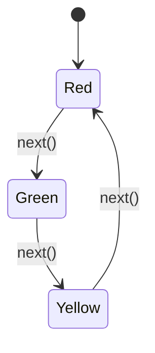

## 8.6. State Pattern with Enums and State Machines

In this section, we delve into the State Pattern, a behavioral design pattern that allows an object to change its behavior when its internal state changes. This pattern is particularly useful in Rust, where enums and state machines can be leveraged to manage state transitions effectively. Let's explore how to implement the State Pattern using Rust's unique features, such as ownership and borrowing, to create clean and maintainable code.

### Understanding the State Pattern

The State Pattern is a design pattern that encapsulates varying behavior for the same object based on its internal state. This pattern is beneficial when an object must change its behavior at runtime depending on its state, allowing for state-specific logic to be separated and managed independently.

#### Intent

The primary intent of the State Pattern is to allow an object to alter its behavior when its internal state changes. This pattern promotes cleaner code by organizing state-specific behavior into separate state objects or representations.

#### Key Participants

1. **Context**: The object whose behavior varies based on its state.
2. **State**: An interface or abstract class defining the behavior associated with a particular state of the Context.
3. **Concrete States**: Classes or structs that implement the State interface, encapsulating the behavior associated with a specific state.

### Implementing the State Pattern in Rust

Rust's enums and pattern matching provide a powerful way to implement the State Pattern. By using enums to represent different states and pattern matching to handle state transitions, we can create a robust state machine.

#### Representing States with Enums

In Rust, enums are a natural fit for representing different states. Each variant of the enum can represent a distinct state, and associated data can be stored within each variant if needed.

```rust
enum TrafficLight {
    Red,
    Yellow,
    Green,
}
```

In this example, `TrafficLight` is an enum with three states: `Red`, `Yellow`, and `Green`. Each state can have its own behavior and transitions.

#### State Transitions and Behavior

To implement state-specific behavior, we can define methods on the enum or use a separate struct to encapsulate the state machine logic. Let's look at an example where we define a method to transition between states.

```rust
impl TrafficLight {
    fn next(&self) -> TrafficLight {
        match self {
            TrafficLight::Red => TrafficLight::Green,
            TrafficLight::Yellow => TrafficLight::Red,
            TrafficLight::Green => TrafficLight::Yellow,
        }
    }

    fn display(&self) {
        match self {
            TrafficLight::Red => println!("Stop!"),
            TrafficLight::Yellow => println!("Caution!"),
            TrafficLight::Green => println!("Go!"),
        }
    }
}
```

In this example, the `next` method transitions the traffic light to the next state, while the `display` method outputs the appropriate message for each state.

#### Handling Ownership and Borrowing

Rust's ownership and borrowing model ensures memory safety and prevents data races. When implementing the State Pattern, it's essential to manage ownership and borrowing correctly to avoid common pitfalls.

Consider the following example, where we use borrowing to transition states without transferring ownership:

```rust
struct TrafficSystem {
    light: TrafficLight,
}

impl TrafficSystem {
    fn new() -> Self {
        TrafficSystem {
            light: TrafficLight::Red,
        }
    }

    fn change_light(&mut self) {
        self.light = self.light.next();
    }

    fn show_light(&self) {
        self.light.display();
    }
}

fn main() {
    let mut system = TrafficSystem::new();
    system.show_light(); // Output: Stop!
    system.change_light();
    system.show_light(); // Output: Go!
}
```

In this example, the `TrafficSystem` struct owns the `TrafficLight` enum. The `change_light` method mutably borrows `self` to update the state, while `show_light` immutably borrows `self` to display the current state.

### Benefits of Using the State Pattern

Implementing the State Pattern in Rust offers several benefits:

- **Cleaner Code**: By encapsulating state-specific behavior, the code becomes more organized and easier to maintain.
- **Separation of Concerns**: Each state handles its behavior, reducing the complexity of the Context class.
- **Scalability**: Adding new states or modifying existing ones becomes straightforward, as changes are localized to specific state implementations.

### Visualizing State Transitions

To better understand state transitions, let's visualize the state machine using a diagram. This diagram represents the transitions between different states of the `TrafficLight`.



In this state diagram, we see the transitions between the `Red`, `Green`, and `Yellow` states, with the `next()` method facilitating the transitions.

### Rust's Unique Features

Rust's unique features, such as pattern matching and enums, make implementing the State Pattern intuitive and efficient. The language's emphasis on safety and concurrency ensures that state transitions are handled correctly without introducing memory safety issues.

### Differences and Similarities with Other Patterns

The State Pattern is often confused with the Strategy Pattern. While both patterns involve encapsulating behavior, the State Pattern focuses on changing behavior based on an object's state, whereas the Strategy Pattern involves selecting an algorithm at runtime.

### Try It Yourself

To deepen your understanding, try modifying the `TrafficLight` example to include additional states, such as `FlashingYellow`, and implement the corresponding transitions and behaviors. Experiment with different state machines and see how Rust's features can be leveraged to manage state transitions effectively.

### Knowledge Check

- What is the primary intent of the State Pattern?
- How can enums be used to represent states in Rust?
- What are the benefits of using the State Pattern?
- How does Rust's ownership model affect state transitions?
- What is the difference between the State Pattern and the Strategy Pattern?

### Summary

The State Pattern is a powerful tool for managing state-specific behavior in Rust. By leveraging enums and pattern matching, we can create efficient and maintainable state machines. Rust's unique features, such as ownership and borrowing, ensure that state transitions are handled safely and effectively. As you continue to explore Rust's capabilities, remember that the State Pattern is just one of many tools available to create robust and scalable applications.

## Quiz Time!



### What is the primary intent of the State Pattern?

- [x] To allow an object to alter its behavior when its internal state changes.
- [ ] To encapsulate algorithms in separate classes.
- [ ] To provide a way to access the elements of an aggregate object sequentially.
- [ ] To define a family of algorithms, encapsulate each one, and make them interchangeable.

> **Explanation:** The State Pattern's primary intent is to allow an object to change its behavior when its internal state changes.

### How can enums be used to represent states in Rust?

- [x] By defining each state as a variant of the enum.
- [ ] By using enums to encapsulate algorithms.
- [ ] By creating a separate enum for each state.
- [ ] By using enums to manage memory allocation.

> **Explanation:** Enums in Rust can represent different states by defining each state as a variant of the enum.

### What are the benefits of using the State Pattern?

- [x] Cleaner code and separation of state-specific logic.
- [x] Scalability and ease of adding new states.
- [ ] Improved performance through parallel execution.
- [ ] Reduced memory usage.

> **Explanation:** The State Pattern offers cleaner code, separation of concerns, and scalability.

### How does Rust's ownership model affect state transitions?

- [x] It ensures memory safety and prevents data races during state transitions.
- [ ] It allows for parallel execution of state transitions.
- [ ] It requires manual memory management for state transitions.
- [ ] It simplifies the implementation of state transitions.

> **Explanation:** Rust's ownership model ensures memory safety and prevents data races during state transitions.

### What is the difference between the State Pattern and the Strategy Pattern?

- [x] The State Pattern changes behavior based on an object's state, while the Strategy Pattern selects an algorithm at runtime.
- [ ] The State Pattern is used for encapsulating algorithms, while the Strategy Pattern is used for state transitions.
- [ ] The State Pattern is a structural pattern, while the Strategy Pattern is a behavioral pattern.
- [ ] The State Pattern is used for managing memory, while the Strategy Pattern is used for managing concurrency.

> **Explanation:** The State Pattern changes behavior based on an object's state, while the Strategy Pattern selects an algorithm at runtime.

### Which Rust feature is particularly useful for implementing the State Pattern?

- [x] Enums and pattern matching.
- [ ] Traits and generics.
- [ ] Smart pointers.
- [ ] Macros.

> **Explanation:** Enums and pattern matching are particularly useful for implementing the State Pattern in Rust.

### What is a key benefit of using enums for state representation?

- [x] They provide a clear and concise way to represent different states.
- [ ] They allow for dynamic memory allocation.
- [ ] They enable parallel execution of state transitions.
- [ ] They simplify error handling.

> **Explanation:** Enums provide a clear and concise way to represent different states in Rust.

### How does the State Pattern promote separation of concerns?

- [x] By encapsulating state-specific behavior in separate state objects or representations.
- [ ] By allowing multiple objects to share the same state.
- [ ] By using inheritance to manage state transitions.
- [ ] By providing a global state manager.

> **Explanation:** The State Pattern promotes separation of concerns by encapsulating state-specific behavior in separate state objects or representations.

### What is a common pitfall when implementing the State Pattern in Rust?

- [x] Mismanaging ownership and borrowing during state transitions.
- [ ] Overusing enums for state representation.
- [ ] Using too many state objects.
- [ ] Ignoring pattern matching.

> **Explanation:** Mismanaging ownership and borrowing during state transitions can be a common pitfall when implementing the State Pattern in Rust.

### True or False: The State Pattern and the Strategy Pattern are interchangeable.

- [ ] True
- [x] False

> **Explanation:** The State Pattern and the Strategy Pattern are not interchangeable; they serve different purposes.



Remember, this is just the beginning. As you progress, you'll build more complex and interactive applications using the State Pattern and other design patterns. Keep experimenting, stay curious, and enjoy the journey!
