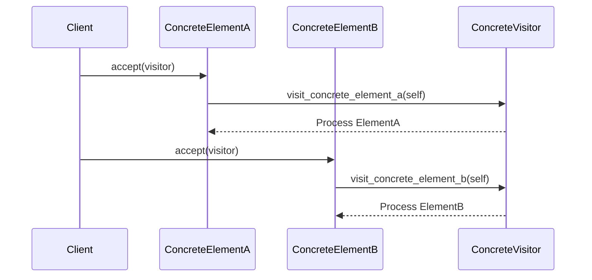

## 8.7. Visitor Pattern via Double Dispatch

In this section, we delve into the Visitor Pattern, a behavioral design pattern that allows you to separate algorithms from the objects on which they operate. We'll explore how to implement this pattern in Rust using double dispatch, a technique that enables a function to be dispatched based on the runtime types of two objects. This approach is particularly useful in scenarios where you need to perform operations across a set of diverse objects without altering their classes.

### Understanding the Visitor Pattern

#### Intent

The Visitor Pattern aims to define a new operation without changing the classes of the elements on which it operates. It is particularly useful when you have a structure of objects and you want to perform operations on these objects without modifying their classes. This pattern is a way of separating an algorithm from an object structure on which it operates.

#### Key Participants

- **Visitor**: Declares a visit operation for each type of concrete element in the object structure.
- **ConcreteVisitor**: Implements each operation declared by the Visitor.
- **Element**: Defines an accept operation that takes a visitor as an argument.
- **ConcreteElement**: Implements the accept operation to call the visitor's operation corresponding to its class.
- **ObjectStructure**: Can enumerate its elements and provide a high-level interface to allow the visitor to visit its elements.

### Challenges of Implementing Double Dispatch in Rust

Rust, unlike some object-oriented languages, does not natively support double dispatch due to its single dispatch mechanism. Single dispatch means that method calls are resolved based on the type of the object on which they are called. Double dispatch, however, requires the method to be resolved based on the runtime types of two objects.

To implement double dispatch in Rust, we need to leverage its powerful trait system and use a combination of traits and method overloading to simulate this behavior.

### Implementing the Visitor Pattern in Rust

#### Using Trait Hierarchies

In Rust, we can use traits to define the operations that visitors can perform on elements. Each element will implement an `accept` method that takes a visitor as an argument and calls the appropriate method on the visitor.

```rust
// Define the Visitor trait with methods for each concrete element type.
trait Visitor {
    fn visit_concrete_element_a(&mut self, element: &ConcreteElementA);
    fn visit_concrete_element_b(&mut self, element: &ConcreteElementB);
}

// Define the Element trait with an accept method.
trait Element {
    fn accept(&self, visitor: &mut dyn Visitor);
}

// ConcreteElementA implementing the Element trait.
struct ConcreteElementA {
    pub value: i32,
}

impl Element for ConcreteElementA {
    fn accept(&self, visitor: &mut dyn Visitor) {
        visitor.visit_concrete_element_a(self);
    }
}

// ConcreteElementB implementing the Element trait.
struct ConcreteElementB {
    pub value: String,
}

impl Element for ConcreteElementB {
    fn accept(&self, visitor: &mut dyn Visitor) {
        visitor.visit_concrete_element_b(self);
    }
}

// ConcreteVisitor implementing the Visitor trait.
struct ConcreteVisitor;

impl Visitor for ConcreteVisitor {
    fn visit_concrete_element_a(&mut self, element: &ConcreteElementA) {
        println!("Visiting ConcreteElementA with value: {}", element.value);
    }

    fn visit_concrete_element_b(&mut self, element: &ConcreteElementB) {
        println!("Visiting ConcreteElementB with value: {}", element.value);
    }
}

fn main() {
    let element_a = ConcreteElementA { value: 42 };
    let element_b = ConcreteElementB { value: String::from("Hello") };

    let mut visitor = ConcreteVisitor;

    element_a.accept(&mut visitor);
    element_b.accept(&mut visitor);
}
```

In this example, we define a `Visitor` trait with methods for each type of element. Each element implements the `Element` trait, which includes an `accept` method that takes a visitor and calls the appropriate method on it.

#### Method Overloading and Workarounds

Rust does not support method overloading in the traditional sense, but we can achieve similar behavior using traits. By defining a trait for each type of element, we can simulate method overloading.

```rust
// Define a trait for each element type.
trait VisitConcreteElementA {
    fn visit(&mut self, element: &ConcreteElementA);
}

trait VisitConcreteElementB {
    fn visit(&mut self, element: &ConcreteElementB);
}

// Implement the traits for ConcreteVisitor.
impl VisitConcreteElementA for ConcreteVisitor {
    fn visit(&mut self, element: &ConcreteElementA) {
        println!("Visiting ConcreteElementA with value: {}", element.value);
    }
}

impl VisitConcreteElementB for ConcreteVisitor {
    fn visit(&mut self, element: &ConcreteElementB) {
        println!("Visiting ConcreteElementB with value: {}", element.value);
    }
}

// Update the Element trait to use the specific visit method.
impl Element for ConcreteElementA {
    fn accept(&self, visitor: &mut dyn Visitor) {
        if let Some(visitor) = visitor.downcast_mut::<ConcreteVisitor>() {
            visitor.visit(self);
        }
    }
}

impl Element for ConcreteElementB {
    fn accept(&self, visitor: &mut dyn Visitor) {
        if let Some(visitor) = visitor.downcast_mut::<ConcreteVisitor>() {
            visitor.visit(self);
        }
    }
}
```

In this approach, we define a separate trait for each element type and implement these traits for the visitor. The `accept` method uses downcasting to call the appropriate visit method.

### Visualizing the Visitor Pattern

To better understand the flow of the Visitor Pattern, let's visualize the interaction between the components using a sequence diagram.



This diagram illustrates how the client interacts with elements and how the visitor processes each element type.

### Use Cases for the Visitor Pattern

The Visitor Pattern is particularly useful in the following scenarios:

- **Complex Object Structures**: When you have a complex object structure and you want to perform operations across different types of objects without modifying their classes.
- **Extending Functionality**: When you need to add new operations to existing object structures without changing their classes.
- **Cross-Cutting Concerns**: When you need to implement cross-cutting concerns such as logging or validation across different types of objects.

### Rust Unique Features

Rust's powerful trait system and strict type safety make it well-suited for implementing the Visitor Pattern. The use of traits allows for flexible and extensible designs, while Rust's ownership model ensures memory safety without a garbage collector.

### Differences and Similarities

The Visitor Pattern is often compared to the Strategy Pattern. While both patterns involve defining a family of algorithms, the Visitor Pattern is more focused on separating algorithms from the objects they operate on, whereas the Strategy Pattern is about selecting an algorithm at runtime.

### Try It Yourself

To deepen your understanding of the Visitor Pattern, try modifying the code examples to include additional element types and visitor operations. Experiment with different ways of implementing double dispatch in Rust.

### Knowledge Check

- How does the Visitor Pattern help separate algorithms from objects?
- What are the challenges of implementing double dispatch in Rust?
- How can you use traits to simulate method overloading in Rust?

### Summary

The Visitor Pattern is a powerful tool for separating algorithms from the objects they operate on. By leveraging Rust's trait system and method overloading, we can implement this pattern effectively, even in a language that does not natively support double dispatch. Remember, this is just the beginning. As you progress, you'll build more complex and interactive applications. Keep experimenting, stay curious, and enjoy the journey!

## Quiz Time!



### What is the primary intent of the Visitor Pattern?

- [x] To define a new operation without changing the classes of the elements on which it operates.
- [ ] To encapsulate a family of algorithms and make them interchangeable.
- [ ] To provide a way to access the elements of an aggregate object sequentially.
- [ ] To define an interface for creating an object, but let subclasses alter the type of objects that will be created.

> **Explanation:** The Visitor Pattern allows you to define new operations without changing the classes of the elements on which they operate, making it easy to add new functionality.

### What is a key challenge of implementing double dispatch in Rust?

- [x] Rust's single dispatch mechanism.
- [ ] Rust's lack of support for inheritance.
- [ ] Rust's garbage collection model.
- [ ] Rust's lack of dynamic typing.

> **Explanation:** Rust uses single dispatch, which means method calls are resolved based on the type of the object on which they are called. Double dispatch requires resolving based on two objects' runtime types.

### How can you simulate method overloading in Rust?

- [x] By using traits.
- [ ] By using macros.
- [ ] By using enums.
- [ ] By using generics.

> **Explanation:** In Rust, you can simulate method overloading by defining a trait for each method signature and implementing these traits for the types you want to overload.

### What is the role of the `accept` method in the Visitor Pattern?

- [x] It allows a visitor to perform an operation on an element.
- [ ] It creates a new instance of a visitor.
- [ ] It modifies the state of the element.
- [ ] It registers a visitor with an element.

> **Explanation:** The `accept` method is used to allow a visitor to perform an operation on an element by calling the appropriate method on the visitor.

### Which of the following is a use case for the Visitor Pattern?

- [x] Implementing cross-cutting concerns such as logging or validation.
- [ ] Managing object creation.
- [ ] Providing a way to access elements of an aggregate object.
- [ ] Encapsulating a family of algorithms.

> **Explanation:** The Visitor Pattern is useful for implementing cross-cutting concerns like logging or validation across different types of objects.

### What is a similarity between the Visitor Pattern and the Strategy Pattern?

- [x] Both involve defining a family of algorithms.
- [ ] Both are used for object creation.
- [ ] Both are used for accessing elements of an aggregate object.
- [ ] Both are used for managing object lifetimes.

> **Explanation:** Both the Visitor and Strategy Patterns involve defining a family of algorithms, but they are used in different contexts.

### How does Rust's trait system benefit the implementation of the Visitor Pattern?

- [x] It allows for flexible and extensible designs.
- [ ] It simplifies memory management.
- [ ] It provides automatic garbage collection.
- [ ] It enables dynamic typing.

> **Explanation:** Rust's trait system allows for flexible and extensible designs, making it easier to implement patterns like the Visitor Pattern.

### What is the purpose of using downcasting in the Visitor Pattern implementation?

- [x] To call the appropriate visit method for a specific element type.
- [ ] To convert a trait object to a concrete type.
- [ ] To simplify memory management.
- [ ] To enable dynamic typing.

> **Explanation:** Downcasting is used to call the appropriate visit method for a specific element type by converting a trait object to a concrete type.

### Which pattern is often compared to the Visitor Pattern?

- [x] Strategy Pattern
- [ ] Singleton Pattern
- [ ] Factory Pattern
- [ ] Observer Pattern

> **Explanation:** The Visitor Pattern is often compared to the Strategy Pattern, as both involve defining a family of algorithms.

### True or False: The Visitor Pattern is useful for adding new operations to existing object structures without changing their classes.

- [x] True
- [ ] False

> **Explanation:** True. The Visitor Pattern allows you to add new operations to existing object structures without changing their classes, making it easy to extend functionality.


