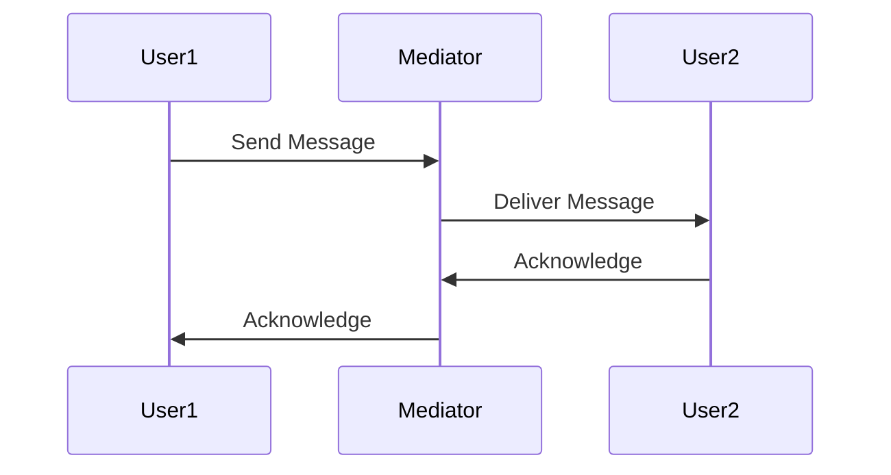

## 8.8. Mediator Pattern with Message Passing

In the realm of software design patterns, the Mediator Pattern stands out as a powerful tool for managing complex interactions between objects. By centralizing communication through a mediator, this pattern reduces dependencies and enhances the scalability of your applications. In Rust, the use of message passing and channels further facilitates this mediation, ensuring thread safety and synchronization. Let's delve into the intricacies of the Mediator Pattern in Rust and explore how it can be effectively implemented.

### Understanding the Mediator Pattern

**Definition**: The Mediator Pattern is a behavioral design pattern that centralizes communication between objects by introducing a mediator object. This mediator handles the interactions between different components, reducing the direct dependencies between them.

**Role**: The primary role of the Mediator Pattern is to simplify communication in complex systems. By decoupling objects, it allows for more flexible and maintainable code. In Rust, this pattern is particularly useful in concurrent programming, where message passing can be leveraged to manage interactions.

### Key Participants

1. **Mediator**: The central component that facilitates communication between different objects.
2. **Colleagues**: The objects that interact with each other through the mediator.
3. **Messages**: The data or commands exchanged between colleagues via the mediator.

### Applicability

- **Complex Systems**: When interactions between objects become complex and difficult to manage.
- **Decoupling**: When you need to reduce the dependencies between objects.
- **Concurrency**: When managing communication in a multi-threaded environment.

### Implementing the Mediator Pattern in Rust

Rust's concurrency model, with its emphasis on safety and performance, makes it an ideal language for implementing the Mediator Pattern. By using channels for message passing, we can ensure that communication between objects is both safe and efficient.

#### Sample Code Snippet

Let's consider a simple example where we have a chat application with multiple users. Each user can send messages to others through a central chat mediator.

```rust
use std::sync::mpsc;
use std::thread;

// Define a message structure
struct Message {
    sender: String,
    content: String,
}

// Define the mediator
struct ChatMediator {
    sender: mpsc::Sender<Message>,
}

impl ChatMediator {
    fn new() -> (Self, mpsc::Receiver<Message>) {
        let (tx, rx) = mpsc::channel();
        (Self { sender: tx }, rx)
    }

    fn send_message(&self, message: Message) {
        self.sender.send(message).unwrap();
    }
}

// Define a user (colleague)
struct User {
    name: String,
    mediator: ChatMediator,
}

impl User {
    fn new(name: &str, mediator: ChatMediator) -> Self {
        Self {
            name: name.to_string(),
            mediator,
        }
    }

    fn send(&self, content: &str) {
        let message = Message {
            sender: self.name.clone(),
            content: content.to_string(),
        };
        self.mediator.send_message(message);
    }
}

fn main() {
    let (mediator, receiver) = ChatMediator::new();

    let user1 = User::new("Alice", mediator.clone());
    let user2 = User::new("Bob", mediator.clone());

    let handle = thread::spawn(move || {
        for received in receiver {
            println!("{}: {}", received.sender, received.content);
        }
    });

    user1.send("Hello, Bob!");
    user2.send("Hi, Alice!");

    handle.join().unwrap();
}
```

**Explanation**: In this example, we define a `ChatMediator` that uses a Rust channel to facilitate message passing between users. Each `User` can send messages through the mediator, which are then received and printed by a separate thread.

### Synchronization and Thread Safety

When implementing the Mediator Pattern in Rust, synchronization and thread safety are crucial considerations. Rust's ownership model and type system help ensure that data races and other concurrency issues are avoided. By using channels, we can safely pass messages between threads without the need for explicit locks.

#### Considerations

- **Channel Types**: Rust provides both synchronous (`mpsc::channel`) and asynchronous (`mpsc::sync_channel`) channels. Choose the appropriate type based on your application's requirements.
- **Error Handling**: Always handle potential errors when sending and receiving messages, such as when a channel is closed.
- **Thread Management**: Consider the number of threads and their workloads to avoid bottlenecks.

### Advantages of the Mediator Pattern

1. **Reduced Coupling**: By centralizing communication, the Mediator Pattern reduces the dependencies between objects, making the system more modular and easier to maintain.
2. **Improved Scalability**: As new components are added, they can easily communicate through the mediator without affecting existing interactions.
3. **Enhanced Flexibility**: Changes to the communication logic can be made in the mediator without impacting the individual components.

### Rust Unique Features

Rust's unique features, such as its ownership model and concurrency primitives, make it particularly well-suited for implementing the Mediator Pattern. The language's emphasis on safety and performance ensures that communication between objects is both efficient and reliable.

### Differences and Similarities

The Mediator Pattern is often compared to the Observer Pattern, as both involve communication between objects. However, the Mediator Pattern centralizes communication through a single component, while the Observer Pattern involves direct notifications between objects.

### Try It Yourself

To deepen your understanding of the Mediator Pattern, try modifying the example code:

- **Add More Users**: Introduce additional users and observe how the mediator handles increased communication.
- **Implement Private Messages**: Modify the mediator to support private messages between specific users.
- **Experiment with Channel Types**: Use synchronous channels and observe the differences in behavior.

### Visualizing the Mediator Pattern

To better understand the flow of communication in the Mediator Pattern, let's visualize it using a sequence diagram.



**Diagram Explanation**: This sequence diagram illustrates how User1 sends a message to User2 through the Mediator. The Mediator handles the delivery and acknowledgment of the message, centralizing the communication process.

### Knowledge Check

Before we wrap up, let's reinforce what we've learned:

- **What is the primary role of the Mediator Pattern?**
- **How does Rust's concurrency model facilitate the implementation of the Mediator Pattern?**
- **What are the advantages of using channels for message passing in Rust?**

### Embrace the Journey

Remember, mastering design patterns like the Mediator Pattern is a journey. As you continue to explore Rust's capabilities, you'll discover new ways to apply these patterns to create efficient and scalable applications. Keep experimenting, stay curious, and enjoy the process!

## Quiz Time!



### What is the primary role of the Mediator Pattern?

- [x] To centralize communication between objects
- [ ] To increase coupling between components
- [ ] To replace all direct interactions with indirect ones
- [ ] To eliminate the need for message passing

> **Explanation:** The Mediator Pattern centralizes communication between objects, reducing dependencies and simplifying interactions.

### How does Rust's concurrency model facilitate the implementation of the Mediator Pattern?

- [x] By providing safe message passing through channels
- [ ] By allowing unrestricted access to shared data
- [ ] By using global variables for communication
- [ ] By eliminating the need for synchronization

> **Explanation:** Rust's concurrency model uses channels for safe message passing, ensuring thread safety and synchronization.

### What are the advantages of using channels for message passing in Rust?

- [x] Reduced coupling and improved scalability
- [ ] Increased complexity and dependencies
- [ ] Direct access to shared data
- [ ] Elimination of thread safety concerns

> **Explanation:** Channels reduce coupling and improve scalability by centralizing communication and ensuring thread safety.

### Which Rust feature helps avoid data races in concurrent programming?

- [x] Ownership model
- [ ] Global variables
- [ ] Unchecked access
- [ ] Manual synchronization

> **Explanation:** Rust's ownership model ensures that data races are avoided by enforcing strict rules on data access and modification.

### What is a key difference between the Mediator and Observer Patterns?

- [x] Mediator centralizes communication; Observer involves direct notifications
- [ ] Observer centralizes communication; Mediator involves direct notifications
- [ ] Both patterns eliminate the need for message passing
- [ ] Both patterns increase coupling between objects

> **Explanation:** The Mediator Pattern centralizes communication through a single component, while the Observer Pattern involves direct notifications between objects.

### What should you consider when choosing a channel type in Rust?

- [x] Application requirements for synchronization
- [ ] The number of global variables
- [ ] The use of manual locks
- [ ] The elimination of error handling

> **Explanation:** Choose the appropriate channel type based on your application's synchronization and communication needs.

### How can you enhance the flexibility of a system using the Mediator Pattern?

- [x] By centralizing communication logic in the mediator
- [ ] By increasing direct dependencies between objects
- [ ] By eliminating the mediator component
- [ ] By using global variables for communication

> **Explanation:** Centralizing communication logic in the mediator allows for flexible changes without impacting individual components.

### What is a potential pitfall when implementing the Mediator Pattern?

- [x] Overloading the mediator with too much logic
- [ ] Increasing direct dependencies between objects
- [ ] Eliminating the need for message passing
- [ ] Using global variables for communication

> **Explanation:** Overloading the mediator with too much logic can lead to complexity and reduced maintainability.

### Which Rust feature ensures thread safety in message passing?

- [x] Channels
- [ ] Global variables
- [ ] Manual locks
- [ ] Unchecked access

> **Explanation:** Channels ensure thread safety by providing a safe mechanism for message passing between threads.

### True or False: The Mediator Pattern eliminates the need for synchronization in concurrent programming.

- [ ] True
- [x] False

> **Explanation:** While the Mediator Pattern centralizes communication, synchronization is still necessary to ensure thread safety and data consistency.



By understanding and implementing the Mediator Pattern with message passing in Rust, you can create more modular, scalable, and maintainable applications. Keep exploring and applying these concepts to enhance your Rust programming skills!
