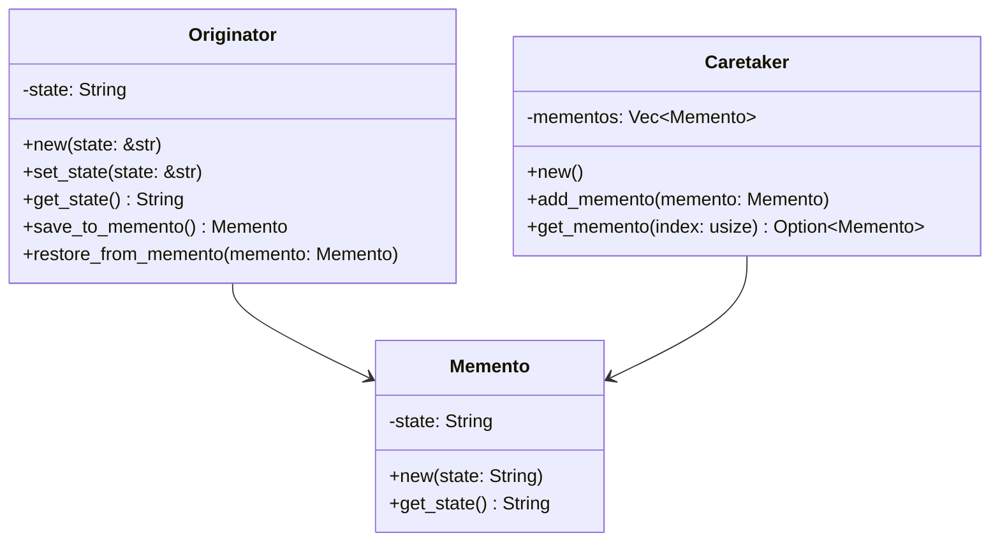

## 8.9. Memento Pattern for State Preservation

In this section, we delve into the Memento Pattern, a behavioral design pattern that allows us to capture and externalize an object's internal state so that it can be restored later without violating encapsulation. This pattern is particularly useful in scenarios where you need to implement undo functionality or maintain a history of states.

### What is the Memento Pattern?

The Memento Pattern is a design pattern used to capture an object's state and store it in a way that allows the object to be restored to this state later. The key aspect of this pattern is that it preserves encapsulation boundaries, meaning the internal state of the object is not exposed to the outside world.

#### Intent

The intent of the Memento Pattern is to:

- Capture and externalize an object's internal state.
- Allow the object to be restored to this state later.
- Preserve encapsulation by not exposing the internal state to other objects.

#### Key Participants

1. **Originator**: The object whose state needs to be saved and restored.
2. **Memento**: The object that stores the state of the Originator.
3. **Caretaker**: The object responsible for storing and restoring the Memento.

### Implementing the Memento Pattern in Rust

Let's explore how to implement the Memento Pattern in Rust, taking into account Rust's unique features such as ownership and borrowing.

#### Step 1: Define the Originator

The Originator is the object whose state we want to capture. We'll define a simple struct to represent this.

```rust
#[derive(Debug, Clone)]
struct Originator {
    state: String,
}

impl Originator {
    fn new(state: &str) -> Self {
        Originator {
            state: state.to_string(),
        }
    }

    fn set_state(&mut self, state: &str) {
        self.state = state.to_string();
    }

    fn get_state(&self) -> &str {
        &self.state
    }

    fn save_to_memento(&self) -> Memento {
        Memento::new(self.state.clone())
    }

    fn restore_from_memento(&mut self, memento: Memento) {
        self.state = memento.get_state();
    }
}
```

#### Step 2: Define the Memento

The Memento stores the state of the Originator. In Rust, we can use a struct to encapsulate this state.

```rust
#[derive(Debug, Clone)]
struct Memento {
    state: String,
}

impl Memento {
    fn new(state: String) -> Self {
        Memento { state }
    }

    fn get_state(&self) -> String {
        self.state.clone()
    }
}
```

#### Step 3: Define the Caretaker

The Caretaker is responsible for managing the Mementos. It does not modify or inspect the contents of the Memento.

```rust
struct Caretaker {
    mementos: Vec<Memento>,
}

impl Caretaker {
    fn new() -> Self {
        Caretaker { mementos: Vec::new() }
    }

    fn add_memento(&mut self, memento: Memento) {
        self.mementos.push(memento);
    }

    fn get_memento(&self, index: usize) -> Option<Memento> {
        if index < self.mementos.len() {
            Some(self.mementos[index].clone())
        } else {
            None
        }
    }
}
```

### Saving and Restoring Object States

Now that we have defined the components of the Memento Pattern, let's see how we can use them to save and restore the state of an object.

```rust
fn main() {
    let mut originator = Originator::new("State1");
    let mut caretaker = Caretaker::new();

    // Save the current state
    caretaker.add_memento(originator.save_to_memento());

    // Change state
    originator.set_state("State2");
    caretaker.add_memento(originator.save_to_memento());

    // Change state again
    originator.set_state("State3");

    // Restore to previous state
    if let Some(memento) = caretaker.get_memento(1) {
        originator.restore_from_memento(memento);
    }

    println!("Restored State: {}", originator.get_state());
}
```

### Ownership and Cloning Considerations

In Rust, managing ownership and borrowing is crucial. The Memento Pattern involves cloning the state to preserve it, which can have performance implications if the state is large. Consider the following:

- **Cloning**: Ensure that the state being cloned is not excessively large, or use more efficient data structures if necessary.
- **Ownership**: The Memento should own its state to ensure that it remains valid even if the Originator's state changes.

### Use Cases for the Memento Pattern

The Memento Pattern is particularly useful in scenarios where you need to:

- Implement undo functionality in applications.
- Maintain a history of states for objects.
- Temporarily save and restore states during complex operations.

### Rust Unique Features

Rust's ownership model and type system provide unique advantages when implementing the Memento Pattern:

- **Safety**: Rust's borrow checker ensures that the state is not modified while being saved or restored.
- **Concurrency**: The pattern can be extended to work in concurrent environments, leveraging Rust's concurrency primitives.

### Differences and Similarities with Other Patterns

The Memento Pattern is often confused with the Command Pattern. While both can be used to implement undo functionality, the Memento Pattern focuses on capturing and restoring state, whereas the Command Pattern encapsulates operations.

### Visualizing the Memento Pattern

To better understand the Memento Pattern, let's visualize the interaction between the Originator, Memento, and Caretaker.



### Try It Yourself

Experiment with the code examples provided. Try modifying the state of the Originator and see how the Memento Pattern allows you to restore previous states. Consider implementing additional features such as limiting the number of stored states or adding timestamps to Mementos.

### Knowledge Check

- What are the key components of the Memento Pattern?
- How does the Memento Pattern preserve encapsulation?
- What are some use cases for the Memento Pattern?
- How does Rust's ownership model affect the implementation of the Memento Pattern?

### Summary

The Memento Pattern is a powerful tool for capturing and restoring object states without violating encapsulation. By leveraging Rust's unique features, we can implement this pattern safely and efficiently. Remember, this is just the beginning. As you progress, you'll find more ways to apply the Memento Pattern in your Rust applications. Keep experimenting, stay curious, and enjoy the journey!

## Quiz Time!



### What is the primary purpose of the Memento Pattern?

- [x] To capture and restore an object's state without violating encapsulation.
- [ ] To encapsulate operations as objects.
- [ ] To define a family of algorithms.
- [ ] To provide a way to access elements of an aggregate object sequentially.

> **Explanation:** The Memento Pattern is designed to capture and restore an object's state without exposing its internal structure.

### Which component of the Memento Pattern is responsible for storing the state?

- [ ] Originator
- [x] Memento
- [ ] Caretaker
- [ ] Observer

> **Explanation:** The Memento is the component that stores the state of the Originator.

### How does the Memento Pattern preserve encapsulation?

- [x] By storing the state in a separate object without exposing it.
- [ ] By using public fields in the Originator.
- [ ] By allowing direct access to the Originator's state.
- [ ] By using global variables.

> **Explanation:** The Memento Pattern preserves encapsulation by storing the state in a separate object, the Memento, without exposing the internal state of the Originator.

### What is a common use case for the Memento Pattern?

- [x] Implementing undo functionality.
- [ ] Sorting a list of items.
- [ ] Managing database connections.
- [ ] Rendering graphics.

> **Explanation:** A common use case for the Memento Pattern is implementing undo functionality by capturing and restoring previous states.

### In Rust, what is a consideration when implementing the Memento Pattern?

- [x] Managing ownership and cloning of state.
- [ ] Using global variables for state storage.
- [ ] Ignoring the borrow checker.
- [ ] Avoiding the use of structs.

> **Explanation:** In Rust, managing ownership and cloning of state is crucial when implementing the Memento Pattern to ensure safety and efficiency.

### Which Rust feature helps ensure safety when implementing the Memento Pattern?

- [x] Borrow checker
- [ ] Global variables
- [ ] Dynamic typing
- [ ] Manual memory management

> **Explanation:** Rust's borrow checker helps ensure safety by preventing data races and ensuring proper ownership and borrowing.

### What is the role of the Caretaker in the Memento Pattern?

- [x] To manage the Mementos and restore states.
- [ ] To modify the Originator's state.
- [ ] To encapsulate operations as objects.
- [ ] To define a family of algorithms.

> **Explanation:** The Caretaker manages the Mementos and is responsible for storing and restoring states.

### How can the Memento Pattern be extended in Rust for concurrency?

- [x] By leveraging Rust's concurrency primitives.
- [ ] By using global variables.
- [ ] By ignoring the borrow checker.
- [ ] By using dynamic typing.

> **Explanation:** The Memento Pattern can be extended for concurrency in Rust by leveraging Rust's concurrency primitives, such as threads and channels.

### True or False: The Memento Pattern exposes the internal state of the Originator.

- [ ] True
- [x] False

> **Explanation:** False. The Memento Pattern does not expose the internal state of the Originator, preserving encapsulation.

### Which pattern is often confused with the Memento Pattern?

- [x] Command Pattern
- [ ] Singleton Pattern
- [ ] Factory Pattern
- [ ] Observer Pattern

> **Explanation:** The Command Pattern is often confused with the Memento Pattern, but they serve different purposes.


