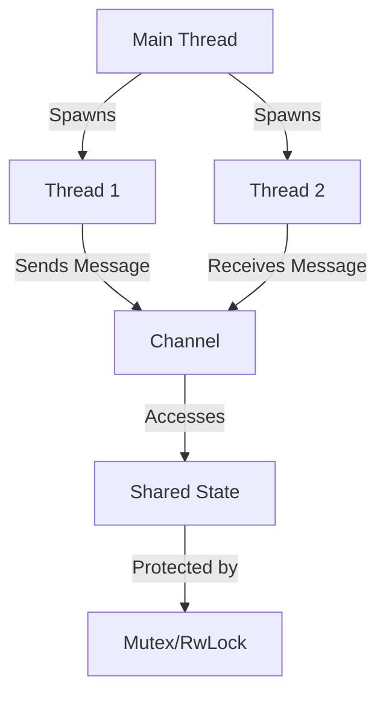

## 9.1. Introduction to Concurrent Programming in Rust

In today's fast-paced digital world, the demand for software that can efficiently handle multiple tasks simultaneously is ever-increasing. This is where concurrent programming comes into play. Concurrency allows programs to perform multiple operations at the same time, improving performance and responsiveness. However, concurrent programming is fraught with challenges, such as data races and deadlocks, which can lead to unpredictable behavior and difficult-to-debug errors.

Rust, with its unique ownership model and type system, offers a compelling solution to these challenges. By enforcing strict rules around ownership and borrowing, Rust ensures that concurrent programs are both safe and efficient. In this section, we'll explore the fundamentals of concurrent programming in Rust, setting the stage for a deeper dive into the topic in subsequent sections.

### Understanding Concurrency

Concurrency is the ability of a program to execute multiple tasks simultaneously. This can be achieved through various means, such as multi-threading, asynchronous programming, or distributed computing. Concurrency is crucial for modern software applications, as it allows them to handle multiple tasks, such as processing user input, performing calculations, and accessing network resources, all at the same time.

#### Importance of Concurrency

Concurrency is essential for several reasons:

- **Performance**: By executing tasks concurrently, programs can make better use of available resources, such as CPU cores, leading to improved performance.
- **Responsiveness**: Concurrent programs can remain responsive to user input even while performing long-running tasks.
- **Scalability**: Concurrency allows programs to scale more effectively, handling increased workloads without a significant drop in performance.

### Common Challenges in Concurrent Programming

While concurrency offers numerous benefits, it also introduces several challenges:

- **Data Races**: Occur when two or more threads access shared data simultaneously, and at least one of the accesses is a write. This can lead to inconsistent or unexpected results.
- **Deadlocks**: Happen when two or more threads are waiting for each other to release resources, resulting in a standstill.
- **Race Conditions**: Occur when the behavior of a program depends on the relative timing of events, leading to unpredictable outcomes.

### Rust's Approach to Safe Concurrency

Rust's ownership model and type system provide a robust framework for safe concurrency. By enforcing strict rules around ownership and borrowing, Rust prevents data races and other concurrency-related issues at compile time.

#### Ownership and Borrowing

Rust's ownership model is based on three key principles:

1. **Each value in Rust has a single owner**.
2. **When the owner goes out of scope, the value is dropped**.
3. **Values can be borrowed, but only one mutable borrow is allowed at a time**.

These principles ensure that data is accessed safely, even in concurrent contexts. By preventing multiple mutable references to the same data, Rust eliminates the possibility of data races.

#### Lifetimes

Lifetimes in Rust are a way of expressing the scope of references. They ensure that references do not outlive the data they point to, preventing dangling references and other memory safety issues.

### Concurrency Primitives in Rust

Rust provides several concurrency primitives to facilitate concurrent programming:

- **Threads**: Rust's standard library provides a `thread` module for creating and managing threads. Threads allow programs to execute multiple tasks concurrently.
- **Channels**: Rust's `std::sync::mpsc` module provides channels for message passing between threads. Channels enable safe communication between threads without shared state.
- **Mutexes and RwLocks**: Rust's `std::sync` module provides `Mutex` and `RwLock` types for managing shared state. These primitives ensure that only one thread can access shared data at a time, preventing data races.
- **Atomics**: Rust's `std::sync::atomic` module provides atomic types for lock-free concurrent programming. Atomics allow for safe manipulation of shared data without the need for locks.

### Code Example: Basic Threading in Rust

Let's look at a simple example of creating and managing threads in Rust:

```rust
use std::thread;

fn main() {
    // Create a vector to hold the thread handles
    let mut handles = vec![];

    for i in 0..5 {
        // Spawn a new thread
        let handle = thread::spawn(move || {
            println!("Hello from thread {}", i);
        });

        // Store the thread handle
        handles.push(handle);
    }

    // Wait for all threads to finish
    for handle in handles {
        handle.join().unwrap();
    }
}
```

In this example, we create five threads, each printing a message to the console. We use the `thread::spawn` function to create a new thread and the `join` method to wait for each thread to finish.

### Visualizing Rust's Concurrency Model

To better understand Rust's concurrency model, let's visualize the relationship between threads, channels, and shared state using a Mermaid.js diagram:



**Diagram Description**: This diagram illustrates how the main thread spawns two additional threads, which communicate via a channel. The shared state is accessed by the threads and protected by a mutex or RwLock to ensure safe concurrent access.

### Setting the Stage for Deeper Exploration

This introduction provides a high-level overview of concurrent programming in Rust. In the following sections, we'll delve deeper into each of these topics, exploring advanced concurrency patterns, best practices, and real-world examples. We'll also examine how Rust's unique features, such as ownership and borrowing, enable safe and efficient concurrency.

### Encouragement to Experiment

Remember, this is just the beginning. As you progress through this guide, you'll gain a deeper understanding of Rust's concurrency model and learn how to apply it to build robust, high-performance applications. Keep experimenting, stay curious, and enjoy the journey!

## Quiz Time!



### What is concurrency?

- [x] The ability of a program to execute multiple tasks simultaneously.
- [ ] The ability of a program to execute tasks sequentially.
- [ ] The ability of a program to execute tasks in a single thread.
- [ ] The ability of a program to execute tasks without any synchronization.

> **Explanation:** Concurrency refers to the ability of a program to execute multiple tasks simultaneously, improving performance and responsiveness.

### What is a data race?

- [x] When two or more threads access shared data simultaneously, and at least one of the accesses is a write.
- [ ] When two or more threads access shared data simultaneously, and all accesses are reads.
- [ ] When a single thread accesses shared data multiple times.
- [ ] When a thread accesses data without synchronization.

> **Explanation:** A data race occurs when two or more threads access shared data simultaneously, and at least one of the accesses is a write, leading to inconsistent results.

### What is a deadlock?

- [x] When two or more threads are waiting for each other to release resources, resulting in a standstill.
- [ ] When a single thread is waiting for a resource to be released.
- [ ] When two or more threads are executing tasks simultaneously.
- [ ] When a thread is executing a task without synchronization.

> **Explanation:** A deadlock occurs when two or more threads are waiting for each other to release resources, resulting in a standstill.

### How does Rust prevent data races?

- [x] By enforcing strict rules around ownership and borrowing.
- [ ] By using garbage collection.
- [ ] By using a global lock for all data accesses.
- [ ] By allowing multiple mutable references to the same data.

> **Explanation:** Rust prevents data races by enforcing strict rules around ownership and borrowing, ensuring that only one mutable reference to data exists at a time.

### What is the purpose of a Mutex in Rust?

- [x] To ensure that only one thread can access shared data at a time.
- [ ] To allow multiple threads to access shared data simultaneously.
- [ ] To prevent threads from accessing shared data.
- [ ] To allow threads to access shared data without synchronization.

> **Explanation:** A Mutex in Rust ensures that only one thread can access shared data at a time, preventing data races.

### What is the role of channels in Rust?

- [x] To enable safe communication between threads without shared state.
- [ ] To allow threads to access shared data simultaneously.
- [ ] To prevent threads from communicating with each other.
- [ ] To allow threads to communicate without synchronization.

> **Explanation:** Channels in Rust enable safe communication between threads without shared state, facilitating message passing.

### What is the significance of lifetimes in Rust?

- [x] To ensure that references do not outlive the data they point to.
- [ ] To allow references to outlive the data they point to.
- [ ] To prevent references from being used in concurrent programming.
- [ ] To allow references to be used without synchronization.

> **Explanation:** Lifetimes in Rust ensure that references do not outlive the data they point to, preventing dangling references and memory safety issues.

### What is the purpose of atomics in Rust?

- [x] To allow for lock-free concurrent programming.
- [ ] To prevent threads from accessing shared data.
- [ ] To allow threads to access shared data simultaneously.
- [ ] To ensure that only one thread can access shared data at a time.

> **Explanation:** Atomics in Rust allow for lock-free concurrent programming, enabling safe manipulation of shared data without locks.

### What is the main advantage of Rust's ownership model in concurrent programming?

- [x] It prevents data races and other concurrency-related issues at compile time.
- [ ] It allows multiple mutable references to the same data.
- [ ] It uses garbage collection to manage memory.
- [ ] It allows threads to access shared data without synchronization.

> **Explanation:** Rust's ownership model prevents data races and other concurrency-related issues at compile time, ensuring safe concurrent programming.

### True or False: Rust's concurrency model relies on garbage collection.

- [ ] True
- [x] False

> **Explanation:** False. Rust's concurrency model does not rely on garbage collection. Instead, it uses ownership and borrowing rules to ensure memory safety and prevent data races.




