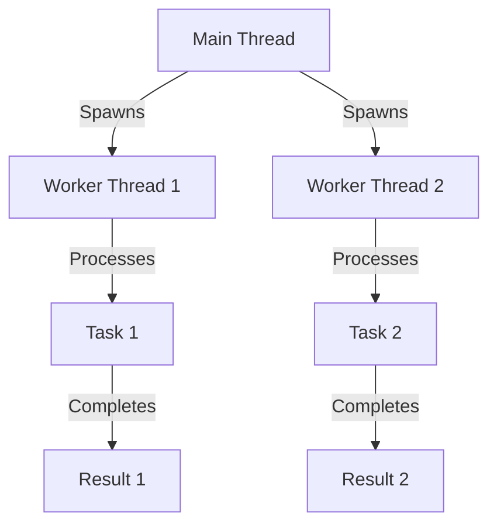

## 9.10. Designing for Performance and Scalability

In the world of systems programming, performance and scalability are paramount. Rust, with its unique ownership model and zero-cost abstractions, provides a powerful platform for building high-performance applications. In this section, we will explore strategies for designing systems that are both performant and scalable, focusing on Rust's concurrency model, efficient data structures, and tools for profiling and benchmarking.

### Designing Systems with Scalability in Mind

Scalability refers to a system's ability to handle increased load without compromising performance. When designing scalable systems in Rust, consider the following principles:

1. **Decouple Components**: Use modular design to separate concerns and allow independent scaling of components. Rust's module system and traits facilitate this decoupling.

2. **Leverage Concurrency**: Rust's ownership model ensures safe concurrency. Use threads, async/await, and channels to parallelize tasks and improve throughput.

3. **Optimize Data Flow**: Design data pipelines that minimize data movement and copying. Use iterators and lazy evaluation to process data efficiently.

4. **Load Balancing**: Distribute work evenly across threads or processes to avoid bottlenecks. Consider using task and thread pools for dynamic load balancing.

5. **Horizontal Scaling**: Design systems that can scale out by adding more nodes. Use message passing and distributed systems patterns to facilitate communication between nodes.

### Measuring and Optimizing Performance

To optimize performance, you must first measure it. Rust provides several tools and techniques for profiling and benchmarking:

1. **Profiling Tools**: Use tools like `perf`, `Flamegraph`, and `cargo-profiler` to identify performance bottlenecks in your code.

2. **Benchmarking**: Use `criterion` to create benchmarks that measure the performance of specific code paths. This helps in comparing different implementations and identifying the most efficient one.

3. **Code Analysis**: Use `clippy` for static code analysis and `cargo-fuzz` for fuzz testing to identify potential performance issues and bugs.

4. **Memory Profiling**: Use tools like `valgrind` and `heaptrack` to analyze memory usage and identify leaks or excessive allocations.

### Efficient Data Structures and Algorithms

Choosing the right data structures and algorithms is crucial for performance. Rust's standard library provides several efficient options:

1. **Vectors and Slices**: Use `Vec` for dynamic arrays and slices for views into arrays. They provide efficient indexing and iteration.

2. **HashMaps and BTreeMaps**: Use `HashMap` for fast key-value lookups and `BTreeMap` for ordered maps. Choose based on access patterns and performance requirements.

3. **Smart Pointers**: Use `Rc`, `Arc`, and `Box` for managing heap-allocated data. `Arc` is particularly useful for shared ownership in concurrent contexts.

4. **Iterators**: Use Rust's iterator trait to process collections lazily and efficiently. Combine iterators with methods like `map`, `filter`, and `fold` for powerful data transformations.

5. **Algorithm Selection**: Choose algorithms that match your data size and access patterns. For example, use quicksort for large, unsorted data and binary search for sorted data.

### Avoiding Bottlenecks and Contention Points

Bottlenecks and contention points can severely impact performance. Here are strategies to avoid them:

1. **Minimize Lock Contention**: Use `Mutex` and `RwLock` judiciously to protect shared data. Prefer `RwLock` for read-heavy workloads to allow multiple readers.

2. **Reduce Synchronization Overhead**: Use lock-free data structures and atomic operations to minimize synchronization overhead.

3. **Optimize Critical Sections**: Keep critical sections short and efficient to reduce the time threads spend waiting for locks.

4. **Use Asynchronous I/O**: Use async/await for non-blocking I/O operations, allowing other tasks to proceed while waiting for I/O.

5. **Profile and Refactor**: Continuously profile your application to identify bottlenecks and refactor code to eliminate them.

### Profiling Tools and Benchmarking Techniques

Profiling and benchmarking are essential for performance optimization. Here are some tools and techniques to consider:

1. **Flamegraph**: Use Flamegraph to visualize CPU usage and identify hot spots in your code. This tool provides a graphical representation of function call stacks.

2. **Criterion**: Use Criterion for benchmarking. It provides statistical analysis of benchmark results, helping you compare different implementations.

3. **Perf**: Use `perf` for low-level performance analysis. It provides detailed information about CPU usage, cache misses, and more.

4. **Heaptrack**: Use Heaptrack for memory profiling. It tracks memory allocations and deallocations, helping you identify leaks and excessive usage.

5. **Cargo Profiler**: Use `cargo-profiler` to integrate profiling into your Rust workflow. It simplifies the process of running and analyzing profiles.

### Code Example: Efficient Data Processing with Iterators

Let's look at a code example that demonstrates efficient data processing using Rust's iterators:

```rust
fn process_data(data: Vec<i32>) -> i32 {
    // Use iterators to process data efficiently
    data.iter()
        .filter(|&&x| x % 2 == 0) // Filter even numbers
        .map(|&x| x * 2)          // Double each number
        .sum()                    // Sum the results
}

fn main() {
    let data = vec![1, 2, 3, 4, 5, 6, 7, 8, 9, 10];
    let result = process_data(data);
    println!("The result is: {}", result);
}
```

In this example, we use iterators to filter, map, and sum a vector of integers. This approach is efficient because it processes data lazily, minimizing unnecessary computations.

### Try It Yourself

Experiment with the code example by modifying the filter and map conditions. Try processing different types of data and observe how the performance changes.

### Visualizing Rust's Concurrency Model

To better understand Rust's concurrency model, let's visualize it using a Mermaid.js diagram:



This diagram illustrates how a main thread can spawn multiple worker threads to process tasks concurrently. Each worker thread processes a task and returns a result, demonstrating Rust's ability to handle concurrent workloads efficiently.

### References and Links

- [Rust Performance Book](https://nnethercote.github.io/perf-book/)
- [Criterion Benchmarking Library](https://github.com/bheisler/criterion.rs)
- [Flamegraph](https://github.com/brendangregg/Flamegraph)
- [Rust Profiling Tools](https://github.com/Kobzol/cargo-profiler)

### Knowledge Check

- What are some strategies for designing scalable systems in Rust?
- How can you measure and optimize performance in Rust applications?
- What are some efficient data structures provided by Rust's standard library?
- How can you avoid bottlenecks and contention points in concurrent Rust applications?
- What tools and techniques can you use for profiling and benchmarking Rust code?

### Embrace the Journey

Remember, designing for performance and scalability is an ongoing process. As you gain experience, you'll develop an intuition for identifying bottlenecks and optimizing code. Keep experimenting, stay curious, and enjoy the journey!

## Quiz Time!



### What is a key principle for designing scalable systems in Rust?

- [x] Decouple components
- [ ] Use monolithic architecture
- [ ] Avoid concurrency
- [ ] Minimize modular design

> **Explanation:** Decoupling components allows for independent scaling and better maintainability.

### Which tool is used for benchmarking in Rust?

- [ ] Flamegraph
- [x] Criterion
- [ ] Perf
- [ ] Heaptrack

> **Explanation:** Criterion is a benchmarking library that provides statistical analysis of benchmark results.

### What is the purpose of using iterators in Rust?

- [x] To process collections lazily and efficiently
- [ ] To increase memory usage
- [ ] To complicate code
- [ ] To avoid using loops

> **Explanation:** Iterators allow for lazy and efficient processing of collections, reducing unnecessary computations.

### How can you minimize lock contention in Rust?

- [x] Use RwLock for read-heavy workloads
- [ ] Use Mutex for all workloads
- [ ] Avoid using locks
- [ ] Use single-threaded execution

> **Explanation:** RwLock allows multiple readers, reducing contention in read-heavy scenarios.

### Which tool provides a graphical representation of function call stacks?

- [x] Flamegraph
- [ ] Criterion
- [ ] Perf
- [ ] Cargo Profiler

> **Explanation:** Flamegraph visualizes CPU usage and function call stacks, helping identify hot spots.

### What is a benefit of using async/await in Rust?

- [x] Non-blocking I/O operations
- [ ] Increased synchronization overhead
- [ ] Blocking operations
- [ ] Reduced concurrency

> **Explanation:** Async/await allows for non-blocking I/O, enabling other tasks to proceed while waiting.

### Which data structure is suitable for fast key-value lookups in Rust?

- [x] HashMap
- [ ] Vec
- [ ] Rc
- [ ] BTreeMap

> **Explanation:** HashMap provides fast key-value lookups, making it suitable for such use cases.

### What is the role of smart pointers like Arc in Rust?

- [x] Shared ownership in concurrent contexts
- [ ] Exclusive ownership
- [ ] Increasing memory usage
- [ ] Reducing performance

> **Explanation:** Arc provides shared ownership, allowing multiple threads to access the same data safely.

### How can you identify performance bottlenecks in Rust code?

- [x] Use profiling tools like Perf and Flamegraph
- [ ] Avoid using tools
- [ ] Use random testing
- [ ] Ignore performance issues

> **Explanation:** Profiling tools help identify bottlenecks by analyzing CPU usage and function call stacks.

### True or False: Rust's ownership model ensures safe concurrency.

- [x] True
- [ ] False

> **Explanation:** Rust's ownership model prevents data races and ensures safe concurrency by enforcing strict rules on data access.


