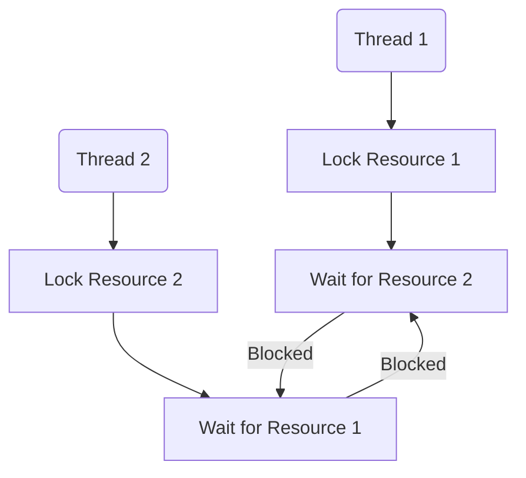
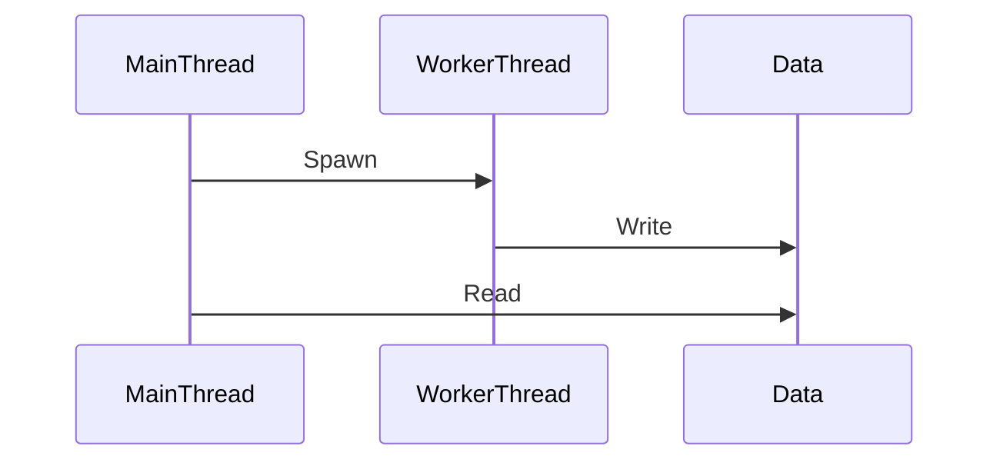

## 9.11. Avoiding Deadlocks and Data Races

Concurrency and parallelism are powerful tools in modern programming, allowing us to perform multiple operations simultaneously and make efficient use of system resources. However, with these capabilities come challenges, particularly in the form of deadlocks and data races. In this section, we will explore these concurrency issues, understand how Rust's unique features help mitigate them, and learn strategies to avoid them in our programs.

### Understanding Deadlocks and Data Races

#### What is a Deadlock?

A deadlock occurs when two or more threads are blocked forever, each waiting for the other to release a resource. This situation can arise in concurrent programming when multiple threads need access to shared resources and lock them in a way that creates a circular dependency.

**Example of a Deadlock:**

```rust
use std::sync::{Arc, Mutex};
use std::thread;

fn main() {
    let resource1 = Arc::new(Mutex::new(0));
    let resource2 = Arc::new(Mutex::new(0));

    let r1 = Arc::clone(&resource1);
    let r2 = Arc::clone(&resource2);

    let handle1 = thread::spawn(move || {
        let _lock1 = r1.lock().unwrap();
        thread::sleep(std::time::Duration::from_millis(50));
        let _lock2 = r2.lock().unwrap();
    });

    let handle2 = thread::spawn(move || {
        let _lock2 = r2.lock().unwrap();
        thread::sleep(std::time::Duration::from_millis(50));
        let _lock1 = r1.lock().unwrap();
    });

    handle1.join().unwrap();
    handle2.join().unwrap();
}
```

In this example, `handle1` locks `resource1` and waits for `resource2`, while `handle2` locks `resource2` and waits for `resource1`. This creates a circular wait condition, resulting in a deadlock.

#### What is a Data Race?

A data race occurs when two or more threads access the same memory location concurrently, and at least one of the accesses is a write. This can lead to unpredictable behavior and bugs that are difficult to reproduce and fix.

**Example of a Data Race:**

```rust
use std::thread;

fn main() {
    let mut data = vec![1, 2, 3, 4, 5];

    let handle = thread::spawn(move || {
        data[0] = 42; // Write access
    });

    println!("{}", data[0]); // Read access

    handle.join().unwrap();
}
```

In this example, the main thread reads from `data` while the spawned thread writes to it, leading to a data race.

### Rust's Ownership Model and Data Race Prevention

Rust's ownership model is designed to prevent data races at compile time. By enforcing strict rules about how data can be accessed and modified, Rust ensures that data races cannot occur.

#### Key Features of Rust's Ownership Model:

1. **Ownership**: Each value in Rust has a single owner, and the value is dropped when the owner goes out of scope.
2. **Borrowing**: Rust allows references to a value, but only one mutable reference or multiple immutable references at a time.
3. **Lifetimes**: Rust uses lifetimes to ensure that references are valid for as long as they are used.

These features work together to prevent data races by ensuring that only one thread can modify a piece of data at a time, and that data cannot be accessed after it has been deallocated.

**Example of Safe Concurrency with Ownership:**

```rust
use std::sync::{Arc, Mutex};
use std::thread;

fn main() {
    let data = Arc::new(Mutex::new(vec![1, 2, 3, 4, 5]));

    let handles: Vec<_> = (0..5).map(|i| {
        let data = Arc::clone(&data);
        thread::spawn(move || {
            let mut data = data.lock().unwrap();
            data[i] += 1;
        })
    }).collect();

    for handle in handles {
        handle.join().unwrap();
    }

    println!("{:?}", *data.lock().unwrap());
}
```

In this example, the `Mutex` ensures that only one thread can modify the data at a time, preventing data races.

### Common Causes of Deadlocks

Deadlocks can occur due to several reasons, including:

1. **Circular Wait**: Threads wait on each other in a circular chain.
2. **Hold and Wait**: A thread holds resources while waiting for others.
3. **No Preemption**: Resources cannot be forcibly taken from threads.
4. **Mutual Exclusion**: Resources are non-shareable.

### Strategies for Deadlock Avoidance

1. **Resource Ordering**: Always acquire locks in a predefined order to prevent circular wait conditions.

2. **Timeouts**: Use timeouts when acquiring locks to avoid indefinite waiting.

3. **Deadlock Detection**: Implement deadlock detection mechanisms to identify and resolve deadlocks.

4. **Lock Hierarchies**: Design a hierarchy for locks and ensure that threads acquire locks in a consistent order.

5. **Avoid Nested Locks**: Minimize the use of nested locks to reduce the complexity of lock management.

**Example of Resource Ordering:**

```rust
use std::sync::{Arc, Mutex};
use std::thread;

fn main() {
    let resource1 = Arc::new(Mutex::new(0));
    let resource2 = Arc::new(Mutex::new(0));

    let r1 = Arc::clone(&resource1);
    let r2 = Arc::clone(&resource2);

    let handle1 = thread::spawn(move || {
        let _lock1 = r1.lock().unwrap();
        let _lock2 = r2.lock().unwrap();
    });

    let handle2 = thread::spawn(move || {
        let _lock1 = r1.lock().unwrap();
        let _lock2 = r2.lock().unwrap();
    });

    handle1.join().unwrap();
    handle2.join().unwrap();
}
```

In this example, both threads acquire locks in the same order, preventing a deadlock.

### Tools for Detecting Concurrency Issues

Rust provides several tools and libraries to help detect and debug concurrency issues:

1. **Clippy**: A collection of lints to catch common mistakes and improve Rust code.

2. **Miri**: An interpreter for Rust's mid-level intermediate representation (MIR) that can detect undefined behavior, including data races.

3. **Sanitizers**: Tools like ThreadSanitizer can be used to detect data races and other concurrency issues.

4. **Cargo Check**: Use `cargo check` to quickly identify potential issues in your code.

### Visualizing Deadlocks and Data Races

To better understand deadlocks and data races, let's visualize these concepts using Mermaid.js diagrams.

#### Deadlock Example



**Caption**: This diagram illustrates a deadlock scenario where Thread 1 and Thread 2 are waiting on each other, creating a circular dependency.

#### Data Race Example



**Caption**: This sequence diagram shows a data race where the main thread reads data while the worker thread writes to it concurrently.

### Knowledge Check

- **Question**: What is a deadlock, and how can it be avoided?
- **Question**: How does Rust's ownership model prevent data races?
- **Question**: What are some common causes of deadlocks?

### Summary

In this section, we've explored the concepts of deadlocks and data races, two common issues in concurrent programming. We've seen how Rust's ownership model helps prevent data races and discussed strategies for avoiding deadlocks. By understanding these concepts and using the tools available in Rust, we can write safe and efficient concurrent programs.

Remember, concurrency is a powerful tool, but it requires careful management to avoid pitfalls like deadlocks and data races. Keep experimenting, stay curious, and enjoy the journey!

## Quiz Time!



### What is a deadlock?

- [x] A situation where two or more threads are blocked forever, each waiting for the other to release a resource.
- [ ] A condition where a thread is terminated unexpectedly.
- [ ] A scenario where a program runs out of memory.
- [ ] A situation where a thread is waiting for user input.

> **Explanation:** A deadlock occurs when threads are blocked forever, each waiting for the other to release a resource.

### How does Rust's ownership model help prevent data races?

- [x] By enforcing strict rules about data access and modification.
- [ ] By allowing multiple threads to modify data simultaneously.
- [ ] By using garbage collection to manage memory.
- [ ] By providing a built-in debugger.

> **Explanation:** Rust's ownership model enforces strict rules about data access and modification, preventing data races.

### What is a common cause of deadlocks?

- [x] Circular wait conditions.
- [ ] Excessive memory usage.
- [ ] High CPU load.
- [ ] Network latency.

> **Explanation:** Circular wait conditions are a common cause of deadlocks.

### Which tool can be used to detect data races in Rust?

- [x] ThreadSanitizer
- [ ] Cargo Build
- [ ] Rustfmt
- [ ] Cargo Doc

> **Explanation:** ThreadSanitizer is a tool that can detect data races and other concurrency issues.

### What is a data race?

- [x] A condition where two or more threads access the same memory location concurrently, and at least one access is a write.
- [ ] A situation where a program runs out of memory.
- [ ] A scenario where a thread is terminated unexpectedly.
- [ ] A condition where a thread is waiting for user input.

> **Explanation:** A data race occurs when threads access the same memory location concurrently, with at least one write access.

### Which strategy can help avoid deadlocks?

- [x] Resource ordering
- [ ] Ignoring thread priorities
- [ ] Increasing memory allocation
- [ ] Using more threads

> **Explanation:** Resource ordering can help avoid deadlocks by preventing circular wait conditions.

### What is the role of Mutex in Rust concurrency?

- [x] To ensure that only one thread can access a resource at a time.
- [ ] To allow multiple threads to modify data simultaneously.
- [ ] To provide a built-in debugger.
- [ ] To manage memory automatically.

> **Explanation:** Mutex ensures that only one thread can access a resource at a time, preventing data races.

### What is a circular wait?

- [x] A condition where threads wait on each other in a circular chain.
- [ ] A situation where a program runs out of memory.
- [ ] A scenario where a thread is terminated unexpectedly.
- [ ] A condition where a thread is waiting for user input.

> **Explanation:** Circular wait is a condition where threads wait on each other in a circular chain, leading to deadlocks.

### How can timeouts help in avoiding deadlocks?

- [x] By preventing threads from waiting indefinitely for a resource.
- [ ] By increasing memory allocation.
- [ ] By allowing multiple threads to modify data simultaneously.
- [ ] By using more threads.

> **Explanation:** Timeouts prevent threads from waiting indefinitely for a resource, helping to avoid deadlocks.

### Rust's ownership model allows multiple mutable references to a value at the same time.

- [ ] True
- [x] False

> **Explanation:** Rust's ownership model allows only one mutable reference or multiple immutable references at a time to prevent data races.


