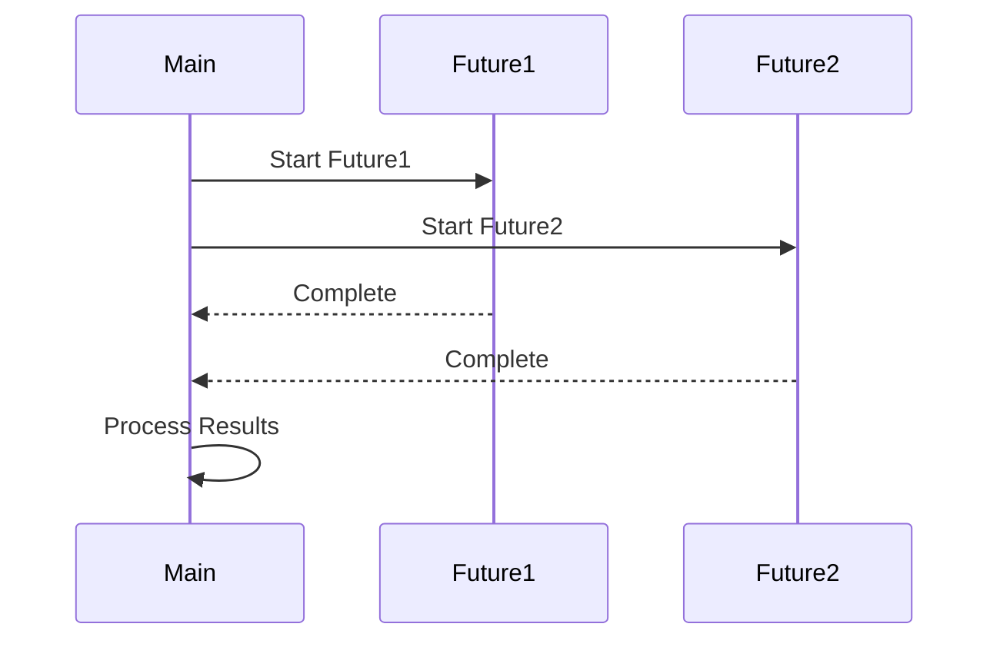

## 9.12. Patterns in Asynchronous Programming

Asynchronous programming in Rust is a powerful paradigm that allows developers to write non-blocking code, enabling efficient use of system resources. This section explores common patterns and best practices in asynchronous Rust code, focusing on enhancing readability and maintainability. We will discuss async functions, combinators, concurrency controls, and provide examples of stream processing and async I/O. Additionally, we will delve into error handling in async contexts, highlight libraries and frameworks that support async patterns, and discuss performance implications and optimization techniques.

### Understanding Asynchronous Programming in Rust

Asynchronous programming allows multiple tasks to run concurrently, improving the efficiency and responsiveness of applications. In Rust, asynchronous programming is achieved using the `async` and `await` keywords, which enable non-blocking operations. This approach is particularly useful for I/O-bound tasks, such as network requests or file operations, where waiting for external resources can lead to idle CPU time.

#### Key Concepts

- **Async Functions**: Functions defined with the `async` keyword that return a `Future`. These functions can be awaited, allowing the program to continue executing other tasks while waiting for the async operation to complete.
- **Futures**: A core concept in Rust's async programming model, representing a value that may not be available yet. Futures are polled until they are ready.
- **Await**: The `await` keyword is used to pause the execution of an async function until the awaited future is complete.

### Async Functions and Await

Async functions are the building blocks of asynchronous programming in Rust. They allow you to write code that looks synchronous but runs asynchronously. Here's a simple example of an async function:

```rust
async fn fetch_data(url: &str) -> Result<String, reqwest::Error> {
    let response = reqwest::get(url).await?;
    let body = response.text().await?;
    Ok(body)
}
```

In this example, `fetch_data` is an async function that fetches data from a URL. The `await` keyword is used to wait for the HTTP request and response to complete.

### Combinators and Concurrency Controls

Combinators are functions that operate on futures, allowing you to compose and transform them. They are useful for handling multiple asynchronous operations concurrently. Some common combinators include `join`, `select`, and `race`.

#### Example: Using `join` to Run Multiple Futures Concurrently

```rust
use futures::future::join;

async fn fetch_multiple() -> (Result<String, reqwest::Error>, Result<String, reqwest::Error>) {
    let future1 = fetch_data("https://example.com/data1");
    let future2 = fetch_data("https://example.com/data2");

    join(future1, future2).await
}
```

In this example, `join` is used to run two futures concurrently, waiting for both to complete before returning their results.

### Stream Processing and Async I/O

Streams are similar to futures but represent a series of values over time. They are useful for processing sequences of asynchronous events, such as reading lines from a file or receiving messages from a network socket.

#### Example: Processing a Stream of Data

```rust
use futures::stream::{self, StreamExt};

async fn process_stream() {
    let data_stream = stream::iter(vec![1, 2, 3, 4, 5]);

    data_stream.for_each(|data| async move {
        println!("Processing data: {}", data);
    }).await;
}
```

In this example, `for_each` is used to process each item in the stream asynchronously.

### Error Handling in Async Contexts

Error handling in asynchronous Rust code is similar to synchronous code, but with some additional considerations. The `?` operator can be used within async functions to propagate errors, and combinators like `try_join` can be used to handle errors in concurrent operations.

#### Example: Error Handling with `try_join`

```rust
use futures::future::try_join;

async fn fetch_with_error_handling() -> Result<(String, String), reqwest::Error> {
    let future1 = fetch_data("https://example.com/data1");
    let future2 = fetch_data("https://example.com/data2");

    try_join(future1, future2).await
}
```

In this example, `try_join` is used to run two futures concurrently, propagating any errors that occur.

### Libraries and Frameworks Supporting Async Patterns

Rust's async ecosystem is rich with libraries and frameworks that simplify asynchronous programming. Some notable ones include:

- **Tokio**: A runtime for writing reliable, asynchronous, and scalable applications.
- **async-std**: A port of the Rust standard library's API to asynchronous programming.
- **reqwest**: An easy-to-use HTTP client for making asynchronous requests.

### Performance Implications and Optimization Techniques

Asynchronous programming can lead to significant performance improvements, especially in I/O-bound applications. However, it's important to consider the overhead of context switching and ensure that tasks are appropriately sized to avoid excessive task creation.

#### Optimization Techniques

- **Batching**: Grouping multiple operations into a single task to reduce overhead.
- **Task Scheduling**: Using efficient task schedulers to minimize context switching.
- **Resource Management**: Ensuring that resources such as network connections and file handles are managed efficiently.

### Visualizing Asynchronous Programming Patterns

To better understand the flow of asynchronous operations, let's visualize a simple async workflow using a Mermaid.js sequence diagram.



This diagram illustrates the concurrent execution of two futures and the subsequent processing of their results.

### Try It Yourself

To deepen your understanding of asynchronous programming in Rust, try modifying the code examples provided. For instance, experiment with different combinators, such as `select` or `race`, and observe how they affect the behavior of your async functions.

### Knowledge Check

- What is the purpose of the `await` keyword in Rust's async programming model?
- How do combinators like `join` and `try_join` enhance concurrency in Rust?
- What are some common libraries used for asynchronous programming in Rust?

### Embrace the Journey

Asynchronous programming in Rust offers a powerful way to write efficient and responsive applications. Remember, this is just the beginning. As you progress, you'll build more complex and interactive systems. Keep experimenting, stay curious, and enjoy the journey!

### Summary

In this section, we've explored the key patterns and best practices in asynchronous programming with Rust. From async functions and combinators to stream processing and error handling, these techniques will help you write more efficient and maintainable code. By leveraging Rust's rich async ecosystem, you can build powerful applications that make the most of system resources.

## Quiz Time!



### What is the primary purpose of async functions in Rust?

- [x] To allow non-blocking operations
- [ ] To improve error handling
- [ ] To simplify syntax
- [ ] To enhance security

> **Explanation:** Async functions in Rust are used to perform non-blocking operations, allowing other tasks to run concurrently.

### Which combinator is used to run multiple futures concurrently?

- [ ] select
- [x] join
- [ ] race
- [ ] map

> **Explanation:** The `join` combinator is used to run multiple futures concurrently, waiting for all of them to complete.

### What is a common use case for streams in Rust?

- [ ] Error handling
- [x] Processing sequences of asynchronous events
- [ ] Memory management
- [ ] Security checks

> **Explanation:** Streams are used to process sequences of asynchronous events, such as reading lines from a file or receiving messages from a network socket.

### How can errors be propagated in async functions?

- [ ] Using the `await` keyword
- [x] Using the `?` operator
- [ ] Using the `join` combinator
- [ ] Using the `select` combinator

> **Explanation:** The `?` operator can be used in async functions to propagate errors, similar to synchronous code.

### Which library is commonly used for writing asynchronous applications in Rust?

- [ ] serde
- [x] Tokio
- [ ] clap
- [ ] regex

> **Explanation:** Tokio is a popular runtime for writing reliable, asynchronous, and scalable applications in Rust.

### What is the role of the `await` keyword in Rust?

- [x] To pause execution until a future is complete
- [ ] To start a new async task
- [ ] To handle errors
- [ ] To manage memory

> **Explanation:** The `await` keyword is used to pause the execution of an async function until the awaited future is complete.

### Which combinator propagates errors in concurrent operations?

- [ ] join
- [x] try_join
- [ ] select
- [ ] map

> **Explanation:** The `try_join` combinator is used to run multiple futures concurrently, propagating any errors that occur.

### What is a key benefit of asynchronous programming?

- [ ] Improved syntax
- [ ] Enhanced security
- [x] Efficient use of system resources
- [ ] Simplified error handling

> **Explanation:** Asynchronous programming allows for efficient use of system resources by enabling non-blocking operations.

### Which keyword is used to define an async function in Rust?

- [x] async
- [ ] await
- [ ] future
- [ ] stream

> **Explanation:** The `async` keyword is used to define an async function in Rust.

### True or False: Async programming in Rust is only useful for I/O-bound tasks.

- [x] True
- [ ] False

> **Explanation:** Async programming is particularly useful for I/O-bound tasks, where waiting for external resources can lead to idle CPU time.


